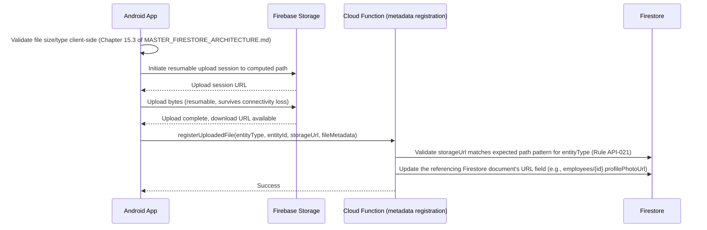

# MASTER_API_CONTRACT.md
## Log Sheet Muster (LSM) — API Contract Reference

**Document Classification:** Official API Contract Reference
**Governed By:** `MASTER_PROJECT_RULES.md` (Chapters 4, 5), `MASTER_SECURITY_FRAMEWORK.md` (Chapters 1-2)
**Purpose:** LSM has no traditional REST/GraphQL backend — its "API" is the combination of (a) direct Firestore/Storage SDK access governed by Security Rules, and (b) Firebase Cloud Functions (callable and HTTPS-triggered) for trusted server-side operations. This document is the authoritative contract for category (b) — every Cloud Function's request/response shape, error codes, and operational contract — plus the conventions governing category (a)'s SDK usage patterns where they warrant a contract-level specification.

---

# TABLE OF CONTENTS

1. API Standards
2. Request Format
3. Response Format *(upcoming)*
4. Authentication *(upcoming)*
5. Error Codes *(upcoming)*
6. Pagination *(upcoming)*
7. Retry Strategy *(upcoming)*
8. Upload *(upcoming)*
9. Download *(upcoming)*
10. Webhooks *(upcoming)*

---

# CHAPTER 1: API STANDARDS

## 1.1 Purpose

Before specifying request/response shapes, this chapter establishes what "the API" even means in a Firebase-native architecture, and which of LSM's two access categories governs any given operation — a foundational disambiguation every subsequent chapter depends on.

## 1.2 The Two API Categories

| Category | Mechanism | Used For | Governing Document |
|---|---|---|---|
| **Category A: Direct Data Access** | Firestore/Storage SDK calls from the Android client, authorized by Security Rules | Standard CRUD on business entities where no trusted-server-only logic is required (e.g., reading the Employee Directory, creating a Leave application in `DRAFT` state) | `MASTER_FIRESTORE_ARCHITECTURE.md` Chapter 16 (Security Rules) |
| **Category B: Cloud Functions (Callable)** | `functions.https.onCall()` invoked via the Firebase Functions SDK from the Android client | Any operation requiring trusted server-side logic: custom claims assignment, payroll generation, invoice numbering, transactional multi-document operations, AI-service-mediated calls | This document, Chapters 2-10 |

**Rule API-001:** An operation belongs to Category B if and only if it appears in one of the following lists already established across prior documents: `MASTER_FIRESTORE_ARCHITECTURE.md` §13.2's Transaction Catalog where the transaction logic is genuinely too complex/sensitive for a client-side Firestore transaction, `MASTER_BUSINESS_LOGIC.md`'s explicitly-Cloud-Function-mediated rules (e.g., Rule PAYROLL-001, Rule COMPANY-001's onboarding), or `MASTER_SECURITY_FRAMEWORK.md`'s custom-claims-assignment functions. Every other operation defaults to Category A. This chapter's role is to make that categorization explicit and centrally indexed (§1.4) rather than leaving it implicit and scattered.

## 1.3 API Versioning

**Rule API-002:** Cloud Functions are versioned via their deployment naming convention (`onCreateEmployee_v1`, and if a breaking contract change is ever required, `onCreateEmployee_v2` deployed alongside the still-functioning `v1` for a deprecation window) rather than a URL-path version prefix (since callable functions aren't URL-addressed the way REST endpoints are) — the Android client's Cloud Functions SDK invocation references the function name directly, and a version bump requires a corresponding app-version-gated client update, tracked via the same Semantic Versioning discipline established in `MASTER_PROJECT_RULES.md` §2.5.

**Rule API-003:** A breaking contract change (removing a required request field, changing a response field's type) is always a MAJOR version bump per `MASTER_PROJECT_RULES.md` §2.5, and the old function version remains deployed and functional for at least one MINOR-version deprecation window, ensuring users on a slightly older app build (who haven't yet updated) don't experience a hard break.

## 1.4 Complete Cloud Function Index

| Function Name | Category | Cross-Reference |
|---|---|---|
| `onUserProvision` | Auth/Identity | `MASTER_SECURITY_FRAMEWORK.md` §1.4 |
| `onUserRoleChange` | Auth/Identity | `MASTER_SECURITY_FRAMEWORK.md` §1.4 |
| `revokeSession` | Auth/Identity | `MASTER_SECURITY_FRAMEWORK.md` §4.4 |
| `revokeMFAEnrollment` | Auth/Identity | `MASTER_SECURITY_FRAMEWORK.md` §3.4 |
| `onboardCompany` | Company | `MASTER_BUSINESS_LOGIC.md` §1.5 |
| `activateEmployee` | Employees | `MASTER_BUSINESS_LOGIC.md` §3.5 |
| `markAttendance` (with fallback to direct Firestore write for the simple in-geofence path, per Rule API-001's complexity threshold — the Cloud Function variant handles the geofence-override-review sub-flow specifically) | Attendance | `MASTER_BUSINESS_LOGIC.md` §4.5 |
| `approveLeave` | Leave | `MASTER_BUSINESS_LOGIC.md` §5 |
| `approveShiftSwap` | Shift | `MASTER_BUSINESS_LOGIC.md` §6.4 |
| `createDeployment` | Deployment | `MASTER_BUSINESS_LOGIC.md` §7.5 |
| `generatePayroll` | Payroll | `MASTER_BUSINESS_LOGIC.md` §8.5 |
| `finalizePayroll` | Payroll | `MASTER_BUSINESS_LOGIC.md` §8.5 |
| `requestPayrollReversal` / `approvePayrollReversal` | Payroll | `MASTER_BUSINESS_LOGIC.md` §8.4 |
| `issueInventory` / `returnInventory` / `writeOffInventory` | Inventory | `MASTER_BUSINESS_LOGIC.md` §9.5 |
| `assignAsset` / `decommissionAsset` | Assets | `MASTER_BUSINESS_LOGIC.md` §10.5 |
| `generateInvoice` | Billing | `MASTER_BUSINESS_LOGIC.md` §11.5 |
| `activateClient` | Client | `MASTER_BUSINESS_LOGIC.md` §12.5 |
| `approvePurchaseOrder` / `recordGoodsReceipt` | Vendor | `MASTER_BUSINESS_LOGIC.md` §13.5 |
| `submitGrievance` (Cloud-Function-mediated specifically for the anonymity-handling logic) | ESS | `MASTER_BUSINESS_LOGIC.md` §14 |
| `dispatchNotification` (internal, not directly client-callable — invoked by other functions) | Notifications | `MASTER_BUSINESS_LOGIC.md` §15.5 |
| `generateReport` | Reports | `MASTER_BUSINESS_LOGIC.md` §17.5 |
| `transitionWorkflow` | Workflow Engine | `MASTER_BUSINESS_LOGIC.md` §18.5 |
| `extractDocumentData` / `analyzeAttendanceAnomaly` / `queryAnalyticsNL` | AI | `MASTER_BUSINESS_LOGIC.md` §20.5 |
| Scheduled functions (auto-absent marking, license expiry scan, accrual processing, etc.) | Various | Not client-callable — triggered on a schedule, no request/response contract with the Android client |

## 1.5 API Design Principles

1. **Every Category B function is idempotent-safe** where its underlying operation is retryable (per `MASTER_PROJECT_RULES.md` §10.7), using the same idempotency-key pattern established throughout `MASTER_BUSINESS_LOGIC.md`.
2. **Every Category B function validates the caller's permission server-side**, never trusting that the client only shows the invoking UI to authorized users (per `MASTER_PROJECT_RULES.md` §11.2's "never trust the client").
3. **No Category B function performs a "fire and forget" write** — every function returns an explicit success/failure response the client can act on, per `MASTER_PROJECT_RULES.md` §2.2's no-silent-failure principle.

---

# CHAPTER 2: REQUEST FORMAT

## 2.1 Purpose

This chapter specifies the standard shape every Category B Cloud Function request takes, ensuring consistency across the 20+ functions cataloged in Chapter 1.4.

## 2.2 Standard Request Envelope

```typescript
interface LsmFunctionRequest<T> {
  data: T;                    // Function-specific payload, typed per function
  clientRequestId: string;    // UUID, client-generated, used for idempotency (§7) and request tracing
  clientAppVersion: string;   // Semver, e.g., "2.4.1" — used for version-gated behavior if needed
}
```

**Rule API-004:** `clientRequestId` is mandatory on every single Category B function call, not optional — even for functions without an obvious idempotency concern (e.g., a read-only `queryAnalyticsNL` call), since consistent presence of this field simplifies request-tracing/debugging across the entire function catalog without needing to remember which specific functions "need" it.

## 2.3 Authentication Context (Implicit, Not in Payload)

Per Firebase Callable Functions' standard behavior, the caller's `context.auth` (containing `uid` and custom claims) is automatically attached by the Firebase SDK based on the client's current ID token — **never included as an explicit payload field**, since doing so would create a spoofable client-asserted-identity vector directly contradicting `MASTER_SECURITY_FRAMEWORK.md`'s entire custom-claims trust model (Chapter 1.4 of that document). Every function's server-side implementation reads identity exclusively from `context.auth`, never from `data.userId` or any similar payload field, even where a payload might redundantly include such a field for logging/display convenience — if it does, the server-side code ignores it entirely for authorization purposes.

## 2.4 Example Request (generatePayroll)

```json
{
  "data": {
    "periodStartDate": "2026-07-01",
    "periodEndDate": "2026-07-31"
  },
  "clientRequestId": "550e8400-e29b-41d4-a716-446655440000",
  "clientAppVersion": "2.4.1"
}
```

## 2.5 Field Naming Convention

**Rule API-005:** Every request/response payload field uses `camelCase`, matching the Kotlin/Firestore field naming convention already established in `MASTER_PROJECT_RULES.md` §14.3 — no `snake_case` or mixed convention anywhere in the API layer, ensuring a request payload field name and its corresponding Firestore document field name (where they represent the same data) are usually identical strings, minimizing the mental-mapping overhead between API contract and data dictionary (`MASTER_DATABASE_DICTIONARY.md`).

## 2.6 Request Size Limits

**Rule API-006:** Every Category B function payload is capped at 1MB (Firebase Callable Functions' own practical limit is higher, but LSM self-imposes this stricter cap) — any operation that would naturally require a larger payload (e.g., bulk employee import) is instead modeled as an upload-then-process pattern (Chapter 8) where the bulk data is uploaded to Storage first and the Cloud Function receives only a Storage reference, not the raw bulk data inline.

---

---

# CHAPTER 3: RESPONSE FORMAT

## 3.1 Purpose

This chapter specifies the standard response envelope every Category B function returns, ensuring the Android client's `LsmResult<T>` domain type (`MASTER_PROJECT_RULES.md` §4.7) can be constructed identically regardless of which of the 20+ functions in Chapter 1.4 was called.

## 3.2 Standard Response Envelope (Success)

```typescript
interface LsmFunctionResponse<T> {
  success: true;
  data: T;                     // Function-specific response payload
  serverTimestamp: string;     // ISO 8601, the server's authoritative time of processing
}
```

## 3.3 Standard Response Envelope (Failure)

```typescript
interface LsmFunctionErrorResponse {
  success: false;
  errorCode: string;            // Machine-readable, catalog in Chapter 5
  errorMessage: string;         // Human-readable, safe to display directly (never a raw stack trace)
  fieldErrors?: { field: string; code: string; message: string }[]; // Populated for validation-category failures
}
```

**Rule API-007:** This mirrors the `MASTER_PROJECT_RULES.md` §12.5 Validation Error Reporting Standard's `FieldError` structure exactly — the same machine-readable-code-plus-human-message pattern used for Domain-layer validation errors is reused verbatim at the API-contract level, ensuring the client's error-display logic (Chapter 8.6 of `MASTER_PROJECT_RULES.md`) works identically whether the error originated from a local Domain-layer check or a server-side Cloud Function rejection — directly implementing that document's stated design intent ("the client's error-handling/display logic is identical regardless of which layer caught the violation").

## 3.4 Example Response (generatePayroll Success)

```json
{
  "success": true,
  "data": {
    "payrollRunId": "payrollrun_2026_07",
    "status": "UNDER_REVIEW",
    "totalGrossPay": 4582000.00,
    "employeeCount": 247
  },
  "serverTimestamp": "2026-08-01T09:15:32Z"
}
```

## 3.5 Example Response (generatePayroll Failure — Validation)

```json
{
  "success": false,
  "errorCode": "PAYROLL_PERIOD_OVERLAP",
  "errorMessage": "A payroll run already exists for this period. Please select a different date range or edit the existing run.",
  "fieldErrors": [
    { "field": "periodStartDate", "code": "OVERLAPPING_PERIOD", "message": "Overlaps with payroll run payrollrun_2026_07" }
  ]
}
```

## 3.6 Response Field Immutability Note

**Rule API-008:** `serverTimestamp` is always the Cloud Function's own server-side clock reading at the moment of response construction, never derived from or influenced by any client-provided timestamp — this is the authoritative "when did the server actually process this" value used for any client-side reconciliation logic (e.g., confirming a payroll run's `generatedAt` Firestore field matches the response's `serverTimestamp` within an expected tolerance, a sanity-check pattern used in the integration test suite per `MASTER_PROJECT_RULES.md` §13.2).

## 3.7 Partial Success Handling

**Rule API-009:** No Category B function returns a "partial success" response shape — per `MASTER_PROJECT_RULES.md` §6.4's transaction/batch-write discipline, every function's underlying operation is designed to be atomic (fully succeeds or fully fails), so the response contract itself only ever needs to represent a clean binary `success: true`/`success: false`, never an ambiguous "some parts succeeded" response that would push complex partial-failure-interpretation logic onto the client. Where a function's real-world operation could plausibly partially fail (e.g., `generatePayroll` processing 247 employees, one of whom has a data issue), the function's internal implementation resolves this before responding — either the problematic employee is excluded with a documented reason surfaced in `fieldErrors` and the run proceeds for the rest (a designed, intentional exclusion, still `success: true` overall since the *payroll run creation itself* succeeded), or the entire operation is rejected pending correction (`success: false`) — but never a response shape implying "247 succeeded, 1 failed silently."

---

---

# CHAPTER 4: AUTHENTICATION

## 4.1 Purpose

This chapter specifies how authentication attaches to every API call across both Category A (Firestore/Storage) and Category B (Cloud Functions) — largely a contract-level restatement of `MASTER_SECURITY_FRAMEWORK.md`'s Chapter 1, focused specifically on what the API layer guarantees to callers and requires of them.

## 4.2 Category A Authentication (Firestore/Storage Direct Access)

Every Firestore/Storage SDK call automatically attaches the current Firebase Auth ID token; no explicit "Authorization header" concept exists at the application-code level (the Firebase SDK handles this transport-level detail internally). Security Rules (`MASTER_FIRESTORE_ARCHITECTURE.md` Chapter 16) are the sole authorization gate — there is no separate "API key" or "access token" the application code manages directly.

## 4.3 Category B Authentication (Callable Cloud Functions)

Identical underlying mechanism — the Firebase Functions client SDK automatically attaches the caller's current ID token, verified server-side by the Functions runtime before the function body executes, populating `context.auth`. **Rule API-010:** Every Category B function's first line of implementation logic checks `context.auth != null` (rejecting entirely unauthenticated calls with a standard `UNAUTHENTICATED` error code, Chapter 5) before any business logic executes — this is a mandatory boilerplate pattern enforced via a shared function-wrapper utility (`withAuthCheck()`) rather than repeated ad hoc in each of the 20+ functions, ensuring no function can be accidentally deployed without this baseline check.

## 4.4 App Check Requirement

Per `MASTER_PROJECT_RULES.md` §5.7, every Category A and Category B call additionally requires a valid App Check token — this is enforced at the Firebase project configuration level (Enforce mode), not something individual function implementations need to separately check, but is noted here as part of the complete authentication contract picture: a request lacking valid App Check attestation never reaches the function body or Security Rule evaluation at all, failing earlier in the request pipeline.

## 4.5 Permission Verification Pattern (Category B)

Beyond the baseline `context.auth != null` check (§4.3), every Category B function additionally verifies the caller holds the specific permission string required for that operation (per `MASTER_SECURITY_FRAMEWORK.md` §2.3's catalog), using a shared `requirePermission(context.auth.uid, permissionString)` utility:

```typescript
exports.generatePayroll = functions.https.onCall(withAuthCheck(async (data, context) => {
  await requirePermission(context.auth, 'payroll.generate');
  // ... function logic only reached if permission check passes
}));
```

**Rule API-011:** This two-layer check (`withAuthCheck` for "is this any authenticated user" + `requirePermission` for "is this specifically an authorized user for this operation") is mandatory boilerplate on every single Category B function without exception — a function missing the `requirePermission` call is treated as a critical security defect in code review, equivalent in severity to a missing Security Rule on a Category A collection.

## 4.6 Multi-Tenancy Enforcement at the API Layer

**Rule API-012:** Every Category B function that operates on company-scoped data additionally validates `data.companyId` (where present in the request payload) against `context.auth.token.companyId`, rejecting any mismatch — this is the Cloud-Function-layer instantiation of the defense-in-depth principle (`MASTER_PROJECT_RULES.md` §2.4) already applied at the Security Rules layer, ensuring a function cannot be tricked into operating on a different company's data even via a maliciously-crafted request payload specifying a different `companyId` than the caller's own claim.

---

---

# CHAPTER 5: ERROR CODES

## 5.1 Purpose

This chapter is the authoritative catalog of every `errorCode` value a Category B function may return, ensuring the Android client's error-handling logic (`MASTER_PROJECT_RULES.md` §4.7's `LsmResult` sealed types) can map every possible server response to the correct UI treatment (§8.6 of that document).

## 5.2 Error Code Categories

| Category Prefix | Meaning | Client Handling |
|---|---|---|
| `AUTH_*` | Authentication/authorization failure | Redirect to login, or show permission-denied message |
| `VALIDATION_*` | Request data failed server-side validation | Show field-specific errors inline (via `fieldErrors`) |
| `STATE_*` | Business-state consistency violation (e.g., workflow dead-end) | Show specific business-rule message, often with a suggested corrective action |
| `CONFLICT_*` | Concurrent-modification or uniqueness conflict | Show "this was changed by someone else, please retry" pattern |
| `LIMIT_*` | A quota/threshold was exceeded | Show upgrade-prompt or threshold-specific message |
| `SYSTEM_*` | Unexpected server-side error | Generic "something went wrong, please retry" + silent Crashlytics log |

## 5.3 Complete Error Code Catalog

| Code | Category | Meaning | Example Source |
|---|---|---|---|
| `AUTH_UNAUTHENTICATED` | AUTH | No valid auth context | Any function, §4.3 baseline check |
| `AUTH_PERMISSION_DENIED` | AUTH | Caller lacks required permission | Any function, §4.5 |
| `AUTH_COMPANY_MISMATCH` | AUTH | Payload `companyId` doesn't match caller's claim | Any function, §4.6 |
| `AUTH_SUBSCRIPTION_INACTIVE` | AUTH | Company subscription suspended/expired | Any write function, `MASTER_BUSINESS_LOGIC.md` Rule COMPANY-003 |
| `VALIDATION_REQUIRED_FIELD` | VALIDATION | A required field is missing | `activateEmployee`, Rule EMPLOYEE-002 |
| `VALIDATION_FORMAT_INVALID` | VALIDATION | A field's format doesn't match expected pattern | Any function with regex-validated fields |
| `VALIDATION_RANGE_INVALID` | VALIDATION | A numeric/date field is out of acceptable bounds | `applyLeave` overlap/date checks |
| `STATE_INVALID_TRANSITION` | STATE | Requested workflow transition not defined | `transitionWorkflow`, Rule WORKFLOW-001 |
| `STATE_ALREADY_ACTIONED` | STATE | Approval item already actioned by another approver | `transitionWorkflow`, Rule APPROVALS-002 |
| `STATE_PAYROLL_LOCKED` | STATE | Attempted edit on a payroll-locked attendance record | `markAttendance` correction path, Rule ATTENDANCE-006 |
| `STATE_DEPENDENT_RECORD_INVALID` | STATE | A referenced record is missing/in unexpected state | e.g., finalizing payroll with an inconsistent Deployment |
| `CONFLICT_DUPLICATE_KEY` | CONFLICT | Uniqueness constraint violated (e.g., duplicate employeeCode) | `createEmployee` |
| `CONFLICT_CONCURRENT_MODIFICATION` | CONFLICT | Transaction retry exhausted due to contention | Any transactional function |
| `CONFLICT_PERIOD_OVERLAP` | CONFLICT | Overlapping payroll run / leave request / deployment | `generatePayroll`, `applyLeave`, `createDeployment` |
| `LIMIT_EMPLOYEE_COUNT_EXCEEDED` | LIMIT | Company's `maxEmployeeLimit` reached | `activateEmployee`, Rule COMPANY-004 |
| `LIMIT_INSUFFICIENT_STOCK` | LIMIT | Inventory issuance exceeds available stock | `issueInventory`, Rule INVENTORY-001 |
| `LIMIT_INSUFFICIENT_BALANCE` | LIMIT | Leave balance insufficient | `applyLeave`, Rule LEAVE-001 |
| `SYSTEM_INTERNAL_ERROR` | SYSTEM | Unclassified server-side failure | Any function, caught exception fallback |
| `SYSTEM_EXTERNAL_SERVICE_FAILURE` | SYSTEM | AI/third-party service call failed | `extractDocumentData` and other AI functions |

## 5.4 Error Code Governance

**Rule API-013:** Every new Category B function introduced must exclusively return error codes from this catalog — a function returning an undocumented, ad hoc error string is treated as an incomplete implementation per `MASTER_PROJECT_RULES.md` §2.2's zero-tolerance standard, and any genuinely new error scenario requires first adding the code to this chapter's catalog (with its category, meaning, and expected client handling) before the function implementation is considered complete, directly extending the "documentation before/concurrent with implementation" principle from `MASTER_PROJECT_RULES.md` §2.6.

## 5.5 HTTP Status Code Mapping (For Non-Callable HTTPS Functions)

While the majority of Category B functions are callable (`onCall`), any HTTPS-triggered function (e.g., a webhook receiver, Chapter 10) maps these same error codes to conventional HTTP status codes for compatibility with external systems expecting standard REST semantics:

| Error Category | HTTP Status |
|---|---|
| `AUTH_*` | 401 (Unauthenticated) or 403 (Permission Denied) |
| `VALIDATION_*` | 400 (Bad Request) |
| `STATE_*` | 409 (Conflict) or 422 (Unprocessable Entity) |
| `CONFLICT_*` | 409 (Conflict) |
| `LIMIT_*` | 429 (Too Many Requests) or 403 depending on specific limit type |
| `SYSTEM_*` | 500 (Internal Server Error) or 502/503 for external service failures |

---

---

# CHAPTER 6: PAGINATION

## 6.1 Purpose

This chapter specifies the pagination contract for both Category A (Firestore direct queries) and Category B (Cloud-Function-returned lists, e.g., a search/query-processing function) — ensuring every list-returning access path in the platform follows one consistent pagination pattern, directly implementing `MASTER_PROJECT_RULES.md` §6.3's "pagination mandatory" rule at the contract level.

## 6.2 Category A Pagination (Firestore Cursor-Based)

Standard Firestore cursor pagination, per `MASTER_PROJECT_RULES.md` §6.3:

```kotlin
val firstPage = firestore.collection("employees")
    .whereEqualTo("companyId", companyId)
    .whereEqualTo("employmentStatus", "ACTIVE")
    .orderBy("fullName")
    .limit(25)
    .get()

val nextPage = firestore.collection("employees")
    .whereEqualTo("companyId", companyId)
    .whereEqualTo("employmentStatus", "ACTIVE")
    .orderBy("fullName")
    .startAfter(lastVisibleDocumentSnapshot)
    .limit(25)
    .get()
```

**Rule API-014:** Default page size is 25 (per `MASTER_PROJECT_RULES.md` §6.3), configurable via Remote Config per screen for performance tuning (§9.5 of that document) — no Category A query in the platform omits `.limit()`, enforced by the same `detekt` custom rule already established there.

## 6.3 Category B Pagination (Function-Returned Lists)

For Cloud Functions that return a list (e.g., a hypothetical future `searchEmployeesAdvanced` function combining multiple filter dimensions beyond what a single Firestore composite index supports), the request/response contract uses an explicit cursor field:

```typescript
interface PaginatedRequest<T> {
  data: T;
  pageSize?: number;      // Default 25 if omitted, max 100
  pageCursor?: string;    // Opaque cursor from previous response, omit for first page
}

interface PaginatedResponse<T> {
  success: true;
  items: T[];
  nextPageCursor: string | null;  // null indicates no further pages
  totalCount?: number;             // Omitted where an exact count would be expensive to compute
}
```

**Rule API-015:** `pageCursor` is an opaque, server-generated string (typically a base64-encoded Firestore document reference or a composite sort-key value) — client code never attempts to construct, parse, or infer meaning from this value, treating it strictly as an opaque token to pass back verbatim on the next request, preventing any client-side coupling to the cursor's internal implementation that would break if the server-side pagination mechanism were later changed.

## 6.4 Maximum Page Size Enforcement

**Rule API-016:** Both Category A (`.limit()`) and Category B (`pageSize`) pagination mechanisms enforce a hard maximum of 100 items per page server-side (Security Rules for Category A can partially express this via query constraints where feasible; Category B functions explicitly clamp any requested `pageSize > 100` down to 100 rather than rejecting the request outright) — preventing a misbehaving or compromised client from requesting an excessively large page that would degrade performance or increase cost disproportionately, per `MASTER_PROJECT_RULES.md` §9's performance discipline.

## 6.5 Total Count Semantics

**Rule API-017:** `totalCount` is included in a paginated response only where the underlying query's total count is cheap to compute (e.g., already available from a maintained counter field, per the badge-counter pattern established in `MASTER_FIRESTORE_ARCHITECTURE.md` §9.7) — for queries where computing an exact total would require a separate, potentially expensive aggregation query, `totalCount` is omitted entirely (not populated with an approximate or stale value) and the UI is designed to not require it (e.g., showing "Showing 25 of many" style copy, or simply omitting a total-count display, rather than fetching an expensive count just to satisfy a UI convention).

---

---

# CHAPTER 7: RETRY STRATEGY

## 7.1 Purpose

This chapter specifies the client-side retry contract for both API categories, directly implementing `MASTER_PROJECT_RULES.md` §4.6's WorkManager retry policy and §6.6's offline-sync retry behavior at the API-contract level — the precise rules an engineer implementing a new function-calling ViewModel must follow.

## 7.2 Retry Eligibility Classification

| Error Code Category | Retry Eligible? | Strategy |
|---|---|---|
| `AUTH_*` | No (except `AUTH_SUBSCRIPTION_INACTIVE` after remediation) | Requires user action (re-login, upgrade) before retry makes sense |
| `VALIDATION_*` | No | Requires corrected input before retry makes sense |
| `STATE_*` | No | Requires the underlying state conflict to be resolved (often requires re-fetching current state and re-deciding, not a blind retry) |
| `CONFLICT_CONCURRENT_MODIFICATION` | Yes | Transient contention — safe to retry with backoff |
| `CONFLICT_DUPLICATE_KEY` | No | Requires different input (e.g., different employeeCode) |
| `CONFLICT_PERIOD_OVERLAP` | No | Requires different input (different date range) |
| `LIMIT_*` | No | Requires the limiting condition to change (upgrade plan, restock, etc.) |
| `SYSTEM_*` | Yes | Transient infrastructure failure — safe to retry with backoff |
| Network-level failure (no response received at all) | Yes | Classic connectivity-loss scenario, per Chapter 6.6 offline sync |

**Rule API-018:** This table is the authoritative classification the shared `ApiCallRetryPolicy` domain service consults — no ViewModel/Use Case implements its own ad hoc "should I retry this" logic; every Category B function call is wrapped through this shared policy, ensuring consistent retry behavior across the entire app rather than each feature module reinventing the classification.

## 7.3 Retry Backoff Parameters

| Parameter | Value |
|---|---|
| Initial retry delay | 1 second |
| Backoff multiplier | 2x (exponential) |
| Maximum retry delay | 30 seconds |
| Maximum retry attempts (foreground, user-waiting) | 3 attempts, then surface failure to user with manual "Retry" button |
| Maximum retry attempts (background, WorkManager-queued) | 10 attempts over an extended window (per `MASTER_PROJECT_RULES.md` §4.6), then `FAILED_PERMANENT` per `MASTER_BUSINESS_LOGIC.md` Rule OFFLINESYNC-002 |

## 7.4 Idempotency Requirement for Retries

**Rule API-019:** Every retry-eligible Category B function call reuses the identical `clientRequestId` (Chapter 2.2) across all retry attempts for the same logical operation — never generating a new `clientRequestId` per retry, since the server-side idempotency check (where applicable, per `MASTER_PROJECT_RULES.md` §10.7) relies on this consistency to correctly recognize a retry as "the same operation being reattempted" rather than a distinct new operation.

## 7.5 Client-Side Timeout Configuration

| Function Category | Client Timeout |
|---|---|
| Simple, single-document operations | 10 seconds |
| Complex aggregation operations (`generatePayroll`, `generateInvoice`, `generateReport`) | 60 seconds (these are expected to be genuinely slower given their server-side aggregation scope, per `MASTER_FIRESTORE_ARCHITECTURE.md` §13's transaction catalog) |
| AI-mediated operations (`extractDocumentData`, `queryAnalyticsNL`) | 30 seconds (external service dependency adds latency variance) |

**Rule API-020:** A client-side timeout is treated identically to a `SYSTEM_*` network-level failure for retry-eligibility purposes (§7.2) — the client cannot distinguish "the server is still processing but slow" from "the request was lost," so both are handled via the same retry-with-backoff policy, relying on the idempotency guarantee (§7.4) to make a retry safe even if the original request's processing eventually does complete server-side.

---

---

# CHAPTER 8: UPLOAD

## 8.1 Purpose

This chapter specifies the file-upload contract, directly implementing `MASTER_PROJECT_RULES.md` §5.5's resumable-upload architecture and §15's Storage folder structure at the API-contract level — the precise client-server interaction pattern for every upload across the platform's 22 modules.

## 8.2 Upload Flow (Standard Pattern)



**Rule API-021:** The `registerUploadedFile` Cloud Function validates that the provided `storageUrl` matches the expected path pattern for the claimed `entityType` (per `MASTER_FIRESTORE_ARCHITECTURE.md` §15.2's catalog) before writing any Firestore reference to it — this prevents a compromised or buggy client from registering an arbitrary Storage path (potentially belonging to another company, if somehow uploaded there via a Security Rules gap) as if it were a legitimate file for the claimed entity, adding a server-side verification layer beyond the Storage Security Rules themselves.

## 8.3 Upload Request Contract (registerUploadedFile)

```typescript
interface RegisterUploadRequest {
  entityType: string;      // e.g., "EMPLOYEE_PROFILE_PHOTO", "EMPLOYEE_DOCUMENT", "GRIEVANCE_ATTACHMENT"
  entityId: string;        // e.g., employeeId, grievanceId
  storageUrl: string;
  fileSizeBytes: number;
  mimeType: string;
  originalFileName?: string;  // For display purposes only, never used to derive the actual Storage path (Rule per MASTER_PROJECT_RULES.md §5.5's "never trust client-original filenames")
}
```

## 8.4 Resumability Contract

**Rule API-022:** Every upload uses Firebase Storage's native resumable upload session API (`UploadTask` in the Android SDK), never a single-shot upload — per `MASTER_PROJECT_RULES.md` §5.5, this is mandatory for every upload regardless of file size, ensuring a connectivity interruption mid-upload (common for field employees uploading a document photo) resumes rather than restarts, with upload progress persisted locally (Room) so even an app-process-kill during upload can resume on next app launch rather than losing all progress.

## 8.5 Upload Progress Reporting Contract

The Android client exposes upload progress via a `Flow<UploadState>` where `UploadState` is a sealed class: `Queued`, `InProgress(percentComplete: Int)`, `Completed(downloadUrl: String)`, `Failed(errorCode: String, isResumable: Boolean)` — directly consumed by the UI's upload-progress indicator (per `MASTER_PROJECT_RULES.md` §7.10's performance/perceived-latency standards) and by the WorkManager retry worker (which resumes `Failed(isResumable=true)` uploads automatically per Chapter 7's retry policy, while `isResumable=false` failures, e.g., a file-type-rejected-by-Security-Rules failure, surface directly to the user without a retry attempt since retrying an inherently-invalid upload would never succeed).

## 8.6 Multi-File Upload (Batch)

For screens uploading multiple files in one user action (e.g., Employee onboarding's document upload step accepting several ID documents at once), each file is uploaded as an independent resumable session (§8.4) — never bundled into a single archive/multipart upload — allowing individual files to succeed/fail/resume independently, with the UI showing per-file progress rather than a single aggregate progress bar that would obscure which specific file (if any) failed.

---

---

# CHAPTER 9: DOWNLOAD

## 9.1 Purpose

This chapter specifies the file-download contract — how the Android client retrieves previously-uploaded files (ID documents, payslips, invoices, reports) and how that interacts with the offline-caching strategy established in `MASTER_PROJECT_RULES.md` §6.7.

## 9.2 Download Authorization Pattern

**Rule API-023:** Every file download uses Firebase Storage's authenticated download URL mechanism (`getDownloadUrl()`), which itself re-evaluates Storage Security Rules at request time — a previously-obtained download URL is not a permanent, unauthenticated bearer token; if the requesting user's permissions change (e.g., a permission revocation) between when the URL was first obtained and when it's actually fetched, the Security Rules evaluation at fetch-time reflects the current, not the historical, permission state, consistent with the "never trust the client" principle extended to file access specifically.

## 9.3 Report/Export Download Contract

For the async-job-generated files (`MASTER_BUSINESS_LOGIC.md` Module 17's Reports pattern), the download contract is:

```typescript
interface DownloadReportRequest {
  jobId: string;
}

interface DownloadReportResponse {
  success: true;
  data: {
    status: "COMPLETED" | "PROCESSING" | "FAILED";
    downloadUrl?: string;   // Present only if status == COMPLETED
    errorMessage?: string;  // Present only if status == FAILED
  };
}
```

**Rule API-024:** This function is polled by the client (with a reasonable interval, e.g., every 3 seconds while a job shows `PROCESSING`) rather than using a persistent Firestore listener for job-status updates — a deliberate choice given report generation jobs are typically short-lived (seconds to low minutes) and infrequent per user, making a lightweight poll simpler and sufficient compared to maintaining a live listener for what is usually a one-time status check per job, consistent with the listener-budget discipline established in `MASTER_FIRESTORE_ARCHITECTURE.md` §14.3 (though this specific case uses polling rather than either a listener or a one-time fetch, since neither pure alternative fits the "check repeatedly for a bounded, short duration" access pattern as well).

## 9.4 Payslip/Invoice PDF Download

For pre-generated, stable documents (payslips, invoices — generated once at finalization/approval time and never regenerated), the download is a direct `getDownloadUrl()` call against the Firestore-stored `payslipPdfUrl`/`invoicePdfUrl` field (`MASTER_DATABASE_DICTIONARY.md` §8.3/11.2) — no polling or job-status contract needed, since these URLs are immediately valid once the referencing Firestore document shows the field populated.

## 9.5 Offline Download Caching

**Rule API-025:** Once a file is successfully downloaded and displayed/opened by the user, the Android client caches the file bytes locally (in app-private storage, not Room which is reserved for structured data per `MASTER_PROJECT_RULES.md` §6.7) for a configurable retention period, allowing the user to re-view a previously-downloaded payslip/document offline without re-fetching — this is distinct from and complementary to the Firestore metadata caching (Room) that tracks *which* files exist and their URLs; this rule addresses caching the actual *file bytes* themselves.

## 9.6 Large File Download Handling

**Rule API-026:** Downloads exceeding a size threshold (e.g., a full-year Statutory Register export, potentially several MB) respect the same metered-network preference established for uploads (`MASTER_PROJECT_RULES.md` §9.5's "Sync large files on Wi-Fi only" toggle) — the download is queued rather than initiated immediately if the user has this preference enabled and is currently on a metered connection, with a clear in-app indicator ("Download queued — will complete when on Wi-Fi") rather than either silently failing or silently consuming the user's mobile data allowance against their stated preference.

---

---

# CHAPTER 10: WEBHOOKS

## 10.1 Purpose

This final chapter specifies LSM's webhook contract — both outbound (LSM notifying external systems of events) and inbound (external systems notifying LSM) — a capability distinct from the FCM-based in-app Notifications module (`MASTER_BUSINESS_LOGIC.md` Module 15), which targets LSM's own app users, not external third-party systems.

## 10.2 Outbound Webhooks (Enterprise-Tier Feature)

**Rule API-027:** Outbound webhooks are available only to companies on the `ENTERPRISE` subscription tier (`MASTER_BUSINESS_LOGIC.md` Rule COMPANY's subscription model) — a client-facing integration capability (e.g., a large corporate client wanting their own facilities-management system to receive real-time deployment/attendance updates from LSM) rather than a platform-wide default, reflecting the genuine enterprise-integration nature of this feature versus the core product's field-workforce focus.

## 10.3 Outbound Webhook Event Catalog

| Event Type | Triggered When | Payload Summary |
|---|---|---|
| `deployment.status_changed` | A Deployment's `status` transitions | `{deploymentId, siteId, employeeId, previousStatus, newStatus, timestamp}` |
| `invoice.approved` | An Invoice transitions to `APPROVED` | `{invoiceId, invoiceNumber, totalAmount, timestamp}` |
| `attendance.daily_summary` | Once daily, per configured site | `{siteId, date, presentCount, absentCount, lateCount}` |

**Rule API-028:** Outbound webhook payloads are deliberately minimal and non-sensitive — they never include employee PII (names are included only where the receiving client already has a legitimate need established by the underlying business relationship, e.g., `deployment.status_changed` including `employeeId` but not bank details or ID numbers) — consistent with the data-minimization principle (`MASTER_PROJECT_RULES.md` §11.8) extended to third-party-system data sharing specifically.

## 10.4 Outbound Webhook Delivery Contract

```typescript
interface WebhookPayload<T> {
  eventType: string;
  eventId: string;         // Unique per delivery attempt, for the receiver's own idempotency handling
  companyId: string;
  data: T;
  timestamp: string;       // ISO 8601
  signature: string;       // HMAC-SHA256 signature of the payload, using a per-company webhook secret
}
```

**Rule API-029:** Every outbound webhook delivery is HMAC-signed using a company-specific secret (generated at webhook-configuration time, rotatable by the Company Admin) — the receiving system verifies this signature before trusting the payload, directly analogous to standard webhook security practice used across the industry (e.g., Stripe's webhook signature verification pattern), preventing a spoofed request from impersonating an LSM webhook delivery.

## 10.5 Outbound Webhook Retry Policy

Delivery failures (receiving endpoint returns non-2xx or times out) retry per Chapter 7's exponential backoff pattern, up to 5 attempts over 24 hours, after which the failed delivery is logged (visible to the Company Admin in a Webhook Delivery Log screen) and requires manual resend if still needed — LSM does not retry indefinitely for a persistently-failing external endpoint, since an indefinitely-retrying webhook against a permanently-broken receiver would be both wasteful and potentially indicative of a misconfiguration the Company Admin needs to be alerted to and fix, rather than something the platform silently keeps attempting forever.

## 10.6 Inbound Webhooks

**Rule API-030:** LSM currently has exactly one inbound webhook receiver: an SMS-delivery-status callback from the Phone OTP provider (relevant for diagnosing OTP delivery issues raised in Employee support inquiries, cross-referenced `MASTER_SECURITY_FRAMEWORK.md` §1.3) — implemented as an HTTPS-triggered Cloud Function (distinct from the callable functions cataloged in Chapter 1.4, since this is invoked by an external system, not the LSM Android client) that verifies the calling provider's own signature scheme before processing, and writes delivery-status updates to a diagnostic log rather than any business-critical collection, ensuring a failure or spoofing attempt against this endpoint has no path to affecting authoritative platform data.

## 10.7 Webhook Configuration UI

Per `MASTER_PROJECT_RULES.md` Chapter 7's UI standards, the Company Admin's Webhook Configuration screen (Enterprise tier only, §10.2) follows the standard form patterns (Chapter 9 of `MASTER_UI_UX_DESIGN_SYSTEM.md`) for entering the target URL, selecting subscribed event types (§10.3), and viewing/regenerating the HMAC secret (§10.4) — no special-case UI pattern is introduced for this feature beyond the platform's existing, established component library.

---

# END OF DOCUMENT — MASTER_API_CONTRACT.md

This document is now **complete** across all 10 chapters:

1. API Standards
2. Request Format
3. Response Format
4. Authentication
5. Error Codes
6. Pagination
7. Retry Strategy
8. Upload
9. Download
10. Webhooks

**Document Version:** 1.0 — Final
**Governed By:** `MASTER_PROJECT_RULES.md` (Chapters 4, 5, 9), `MASTER_SECURITY_FRAMEWORK.md` (Chapters 1-2)
**Status:** Ready to serve as the authoritative API contract reference for all Cloud Functions implementation and Android client Repository-layer network code.

----------------------------------------
DOCUMENT:
MASTER_API_CONTRACT.md

STATUS:
✅ DOCUMENT COMPLETE — ALL 10 CHAPTERS FINISHED

NEXT STEP:
Type "NEXT DOCUMENT" to begin MASTER_TESTING_CHECKLIST.md
----------------------------------------
