# MASTER_BUSINESS_LOGIC.md
## Log Sheet Muster (LSM) — Complete Business Logic Reference

**Document Classification:** Official Business Logic & Workflow Reference
**Governed By:** `MASTER_PROJECT_RULES.md` (this document must comply with all standards defined there — see especially Chapter 10, Business Logic Standards)
**Rule ID Convention:** `RULE-<MODULE>-<NUMBER>` per `MASTER_PROJECT_RULES.md` §10.3

---

# TABLE OF CONTENTS

1. Company
2. Authentication
3. Employees *(upcoming)*
4. Attendance *(upcoming)*
5. Leave *(upcoming)*
6. Shift *(upcoming)*
7. Deployment *(upcoming)*
8. Payroll *(upcoming)*
9. Inventory *(upcoming)*
10. Assets *(upcoming)*
11. Billing *(upcoming)*
12. Client *(upcoming)*
13. Vendor *(upcoming)*
14. ESS *(upcoming)*
15. Notifications *(upcoming)*
16. Analytics *(upcoming)*
17. Reports *(upcoming)*
18. Workflow Engine *(upcoming)*
19. Approvals *(upcoming)*
20. AI *(upcoming)*
21. Compliance *(upcoming)*
22. Offline Sync *(upcoming)*

---

# MODULE 1: COMPANY

## 1.1 Why This Module Exists

LSM is multi-tenant. The Company entity is the tenancy boundary itself — every other module's data ultimately traces back to a `companyId`. Getting Company logic right is the foundation on which the "cross-company data access must never be allowed" non-negotiable rule (Chapter 2.4 of `MASTER_PROJECT_RULES.md`) is built. This module is also the primary interface through which the Super Admin persona (Chapter 1.3) operates.

## 1.2 Who Uses This Module

| Role | Interaction |
|---|---|
| Super Admin | Creates, suspends, reactivates, and configures subscription tiers for companies |
| Company Admin | Configures their own company's profile, branding, policies (leave, shift defaults) |
| All other roles | Implicitly scoped by `companyId`; do not directly manage the Company entity |

## 1.3 Firestore Collections

```
/companies/{companyId}
  ├── name, legalName, gstNumber, panNumber, registeredAddress
  ├── industryType: enum { SECURITY, FACILITY_MANAGEMENT, HOUSEKEEPING, INDUSTRIAL,
  │                        MANUFACTURING, CONSTRUCTION, LOGISTICS, HOSPITAL, EDUCATION, CORPORATE }
  ├── subscriptionTier: enum { TRIAL, STANDARD, PROFESSIONAL, ENTERPRISE }
  ├── subscriptionStatus: enum { ACTIVE, SUSPENDED, EXPIRED, CANCELLED }
  ├── subscriptionExpiryDate
  ├── maxEmployeeLimit (per subscription tier)
  ├── defaultLeavePolicy (map — see Leave module)
  ├── defaultShiftTypes (map — see Shift module)
  ├── logoUrl, primaryColor (branding customization)
  ├── isActive: boolean
  ├── createdAt, createdBySuperAdminId
  ├── /sites/{siteId}                      — subcollection, Pattern B (§6.2.1 of Project Rules)
  ├── /roles/{roleId}                      — custom role definitions (permission bundles)
  ├── /shiftTypes/{shiftTypeId}
  ├── /leavePolicyTypes/{leaveTypeId}
  └── /auditLog/{logId}                    — company-scoped audit trail (Super Admin read-only across companies)
```

## 1.4 Business Rules

**RULE-COMPANY-001: Company Creation Is Super-Admin-Exclusive**
- **Statement:** A Company document may only be created via the Super Admin Console, never through any Company Admin or lower-role self-service flow.
- **Rationale:** Prevents uncontrolled tenant proliferation and ensures every company is properly vetted, billed, and configured with a valid subscription before use.
- **Trigger:** Super Admin submits "Onboard New Company" wizard (Chapter 8.7 of Project Rules).
- **Validation:** Company legal name required; GST number format validated (if provided); at least one initial Company Admin email/phone required to bootstrap the account.
- **Failure Behavior:** Wizard blocks submission with inline validation errors; no partial company record is ever created (all-or-nothing via a Cloud Function that creates the Company document, the initial Admin user, and default configuration atomically).
- **Edge Cases:** Duplicate GST number across companies is flagged as a warning (not a hard block, since group companies may share a GST registration in some structures) but requires Super Admin explicit acknowledgment to proceed.

**RULE-COMPANY-002: Company Isolation Is Immutable Post-Creation**
- **Statement:** Once created, a company's `companyId` (used as the document ID and referenced across all Pattern A collections) can never change.
- **Rationale:** `companyId` is embedded in Storage paths, custom claims, and denormalized fields across the entire platform; changing it would require a full data migration with unacceptable risk.
- **Validation:** Firestore Security Rules reject any write attempting to alter the document ID equivalent (not applicable to field updates, since ID is immutable by Firestore's nature — but the same immutability principle is enforced for the human-readable `name`-derived slug used in Storage paths, which is fixed at creation).

**RULE-COMPANY-003: Subscription Enforcement**
- **Statement:** A company whose `subscriptionStatus` is `SUSPENDED` or `EXPIRED` retains read access to historical data (for continuity/audit/legal purposes) but is blocked from all write operations (marking attendance, creating employees, processing payroll) until the subscription is reactivated by Super Admin.
- **Rationale:** Protects Anthropic's... [n/a — protects LSM's] business model while never destroying a client's historical compliance data, which may be needed for labor audits regardless of subscription status.
- **Trigger:** Checked at the start of every write-path Use Case via a `CompanySubscriptionGuard` domain service, and enforced server-side in Cloud Functions/Security Rules (`resource.data.subscriptionStatus == 'ACTIVE'` check on write rules for all Pattern A collections, joined via a `get()` call to the company document).
- **Failure Behavior:** UI shows a persistent, non-dismissible (except by Admin action) banner: "Your subscription has expired. Contact support to restore full access." with a "Contact Support" action. This is never a silent block.
- **Edge Cases:** A grace period (configurable, default 7 days) after expiry allows continued write access with a warning banner, before hard-blocking — preventing accidental payroll-day disruption due to a billing delay.

**RULE-COMPANY-004: Employee Limit Enforcement**
- **Statement:** A company cannot have more active employees than its `maxEmployeeLimit` (determined by `subscriptionTier`).
- **Trigger:** Checked in `CreateEmployeeUseCase` before the write, and re-validated server-side in a Cloud Function trigger on employee-creation writes (since a client bypass attempt must still be blocked).
- **Failure Behavior:** Creation blocked with message: "Employee limit reached for your current plan (X/Y). Upgrade your subscription or deactivate an existing employee." — links to an upgrade-request flow (routed to Super Admin/Sales, not a self-service payment flow per Chapter 1.5 non-goals).

**RULE-COMPANY-005: Company Configuration Defaults Are Editable, Not Fixed**
- **Statement:** `defaultLeavePolicy` and `defaultShiftTypes` set during onboarding are pre-populated sensible defaults (per Chapter 8.7 of Project Rules — progressive disclosure, not an exhaustive upfront form) but are fully editable by Company Admin at any time thereafter via Company Settings.
- **Edge Cases:** Changing a default leave policy does not retroactively alter already-approved leave requests calculated under the prior policy — changes apply prospectively only, with the effective-date recorded.

## 1.5 Company Onboarding Workflow

```mermaid
sequenceDiagram
    participant SA as Super Admin
    participant CF as Cloud Function: onboardCompany
    participant FS as Firestore
    participant Auth as Firebase Auth
    participant FCM as FCM

    SA->>CF: Submit onboarding wizard (company profile, initial Admin, tier)
    CF->>FS: Validate GST/PAN format, check duplicate name
    CF->>FS: Create /companies/{companyId} document (transaction)
    CF->>Auth: createUser(initial Admin email/phone)
    CF->>Auth: setCustomUserClaims(uid, {companyId, role: 'COMPANY_ADMIN'})
    CF->>FS: Create /companies/{companyId}/roles/ default role bundles
    CF->>FS: Create default shiftTypes, leavePolicyTypes
    CF->>FS: Write audit log entry (companyCreated)
    CF->>FCM: Send welcome notification/credentials to initial Admin
    CF-->>SA: Success confirmation with companyId
</mermaid>
```

## 1.6 Multi-Company Access (Super Admin Only)

**RULE-COMPANY-006: Super Admin Cross-Company Read Is Audited**
- **Statement:** Every instance of a Super Admin viewing a specific company's data outside the aggregate Super Admin dashboard is logged to that company's `auditLog` subcollection with the Super Admin's identity and a stated reason (selected from a dropdown: Support Request, Compliance Investigation, Billing Dispute, Other + free text).
- **Rationale:** Cross-company access is a powerful, necessary capability but must never be untraceable — companies are entitled to know when and why their data was accessed by the platform owner.

## 1.7 Offline Behavior

The Company module is **not** designed for offline creation/editing — Company Settings changes require connectivity (this is an infrequent, admin-initiated, desk-based operation, not a field operation, so offline-first does not apply here per the risk-based approach in Chapter 6.7 of Project Rules). However, the *read* of company configuration (leave policy, shift types) that other modules depend on is cached locally (Room) so that dependent modules (Leave, Shift) remain functional offline using the last-synced configuration.

## 1.8 Reports

- **Company Profile Report:** Full configuration snapshot (PDF export) for compliance/audit handover purposes.
- **Subscription & Usage Report (Super Admin only):** Cross-company aggregate view of subscription tiers, employee counts vs. limits, expiry dates — used for renewal outreach.

## 1.9 What Happens If This Fails

If the `onboardCompany` Cloud Function fails partway (e.g., Company document created but Admin user creation fails), the function is designed with a compensating rollback transaction — the Company document is deleted and the Super Admin sees a clear failure message with the specific failed step, rather than a half-created, unusable tenant lingering in the system.

---

# MODULE 2: AUTHENTICATION

## 2.1 Why This Module Exists

Authentication is the entry point establishing *who* a user is and, critically for a multi-tenant system, *which company* they belong to and *what role* they hold. Every downstream authorization decision in the platform (Chapter 11 of Project Rules) depends on this module functioning correctly and being tamper-resistant.

## 2.2 Who Uses This Module

Every human user of every persona (Chapter 1.3) authenticates through this module before accessing any other feature.

## 2.3 Firestore Collections

```
/users/{uid}                                — mirrors Firebase Auth user, UI/display convenience
  ├── companyId (display only — NOT authoritative, see RULE-AUTH-002)
  ├── role (display only — NOT authoritative)
  ├── displayName, email, phoneNumber
  ├── profilePhotoUrl
  ├── isActive: boolean
  ├── lastLoginAt
  ├── /devices/{deviceId}                   — registered device fingerprints
  └── /fcmTokens/{tokenHash}                — active push notification tokens

/companies/{companyId}/roles/{roleId}       — permission bundle definitions (custom + platform default roles)

/authAuditLog/{logId}                       — platform-wide login/logout/failure events (Super Admin visibility)
```

## 2.4 Business Rules

**RULE-AUTH-001: Sign-In Method by Role**
- **Statement:** Company Admin, HR, Operations, Supervisor, and Client roles authenticate via Email/Password. Employee/ESS role authenticates via Phone OTP by default, with Email/Password as an optional alternative if the employee has a company-issued email.
- **Rationale:** Reflects the realistic identity artifacts available to each persona (Chapter 5.3.1 of Project Rules).
- **Edge Case:** An employee promoted to a Supervisor role retains their existing Phone OTP sign-in method — role changes do not force a sign-in method migration; a Supervisor may still authenticate via phone if that's how their account was originally provisioned.

**RULE-AUTH-002: Custom Claims Are the Sole Authorization Source**
- **Statement:** The `companyId` and `role` fields on the `/users/{uid}` Firestore document are for UI display convenience only (e.g., showing "HR Manager" in a profile header). They are **never** read by any Security Rule or authorization check. Only `request.auth.token.companyId` and `request.auth.token.role` (the Firebase Auth custom claims) are authoritative.
- **Rationale:** Firestore documents are more easily manipulated by a compromised or malicious client (even with Security Rules disallowing direct edits to certain fields, defense-in-depth dictates that display data and authorization data must never be the same source, per Chapter 11.2 of Project Rules).
- **Failure Behavior:** If the `/users/{uid}` document's `role` field ever drifts out of sync with the actual custom claim (e.g., due to a bug), a scheduled Cloud Function reconciliation job detects and corrects the discrepancy, logging the correction to `authAuditLog`.

**RULE-AUTH-003: Role/Company Change Requires Token Refresh**
- **Statement:** When a user's role or company assignment changes (via `onUserProvision` or a role-update Cloud Function), the client must force-refresh its ID token (`getIdToken(true)`) before the new permissions take effect locally.
- **Trigger:** A Firestore listener on the user's own `/users/{uid}` document detects a `roleChangeTimestamp` field update (set by the Cloud Function alongside the claim change) and triggers an automatic silent token refresh; if the app is backgrounded, the refresh occurs on next foreground per the standard Firebase Auth SDK token lifecycle (max 1 hour staleness, per Chapter 5.3.3).
- **Edge Case:** If a user is actively mid-session when their role is downgraded (e.g., permission revoked), any in-flight write relying on the old permission will be rejected server-side by the now-updated Security Rules regardless of client-side staleness — server-side is always authoritative, never trusting a stale client-held permission state (Chapter 11.2, "never trust the client").

**RULE-AUTH-004: Account Lockout on Repeated Failures**
- **Statement:** After 5 consecutive failed sign-in attempts within a 15-minute window, the account is temporarily locked for 30 minutes, and the Company Admin is notified.
- **Rationale:** Mitigates brute-force credential guessing, particularly relevant for the OTP-based Employee flow where OTP codes have limited entropy.
- **Trigger:** A Cloud Function monitoring Firebase Auth sign-in failure events (via Identity Platform audit logs where available, or an application-level failure counter in `authAuditLog` as a fallback) increments a per-user failure counter.
- **Failure Behavior:** User sees "Too many failed attempts. Try again in 30 minutes or contact your administrator." — never a silent, indefinite lock with no recovery path or explanation.

**RULE-AUTH-005: Device Registration on Every Successful Login**
- **Statement:** Every successful authentication registers or updates a device record under `/users/{uid}/devices/{deviceId}` capturing device model, OS version, app version, and first/last-seen timestamps.
- **Rationale:** Enables the remote session revocation capability required by Chapter 11.6 of Project Rules — critical for offboarding field employees who may retain company-configured devices after termination.

**RULE-AUTH-006: MFA Enforcement by Role**
- **Statement:** Super Admin and Company Admin accounts require MFA (TOTP-based) to be configured within 7 days of account creation; access is restricted to profile/security-settings screens only until MFA is configured, after which full access resumes.
- **Rationale:** These are the highest-privilege roles; a compromise here has platform-wide or company-wide blast radius, warranting mandatory MFA per Chapter 11.4 of Project Rules.
- **Edge Case:** A Super Admin/Company Admin who loses their MFA device follows a documented, audited recovery process (detailed in `MASTER_SECURITY_FRAMEWORK.md`) — never a silent MFA bypass toggle accessible from the app itself.

**RULE-AUTH-007: Logout Clears Sensitive Local Cache**
- **Statement:** Sign-out clears the Room-cached Employee PII, Payroll, and Bank Detail tables from local storage, but preserves non-sensitive UI preference data.
- **Rationale:** Reduces the risk surface if a device is lost or shared post-logout, per Chapter 5.3.3 of Project Rules.

## 2.5 Authentication Workflow (Sign-In Sequence)

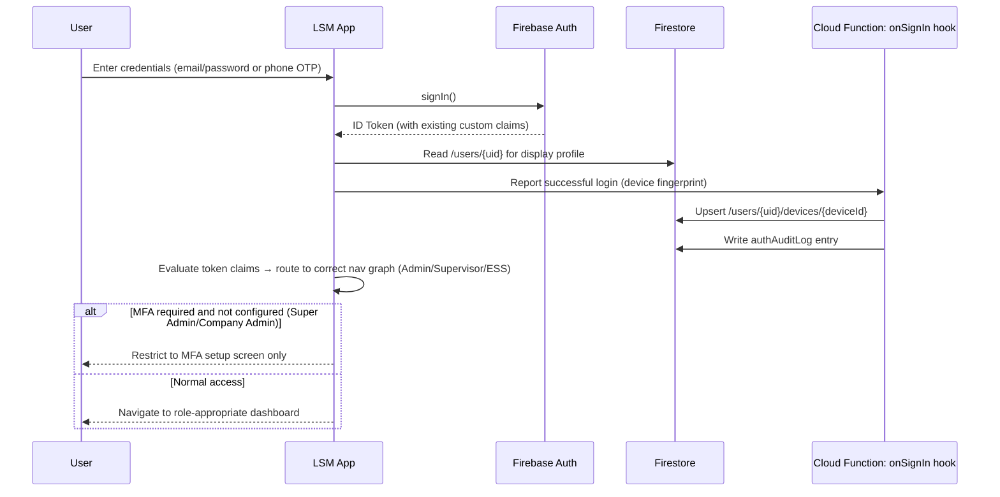
```mermaid
sequenceDiagram
    participant U as User
    participant App as LSM App
    participant Auth as Firebase Auth
    participant FS as Firestore
    participant CF as Cloud Function: onSignIn hook

    U->>App: Enter credentials (email/password or phone OTP)
    App->>Auth: signIn()
    Auth-->>App: ID Token (with existing custom claims)
    App->>FS: Read /users/{uid} for display profile
    App->>CF: Report successful login (device fingerprint)
    CF->>FS: Upsert /users/{uid}/devices/{deviceId}
    CF->>FS: Write authAuditLog entry
    App->>App: Evaluate token claims → route to correct nav graph (Admin/Supervisor/ESS)
    alt MFA required and not configured (Super Admin/Company Admin)
        App-->>U: Restrict to MFA setup screen only
    else Normal access
        App-->>U: Navigate to role-appropriate dashboard
    end
```

## 2.6 Notifications

- Failed-login-lockout notification to the affected user and their Company Admin (Rule 2.4.4 above).
- New-device-login notification (security awareness) to the user, with a "This wasn't me" action that triggers immediate session revocation and password reset flow.

## 2.7 Offline Behavior

- Initial sign-in requires connectivity (cannot authenticate against Firebase Auth offline for a first-time session).
- Once authenticated, the Firebase Auth SDK's local token cache allows the app to continue operating offline within the existing token's validity window (up to 1 hour before requiring a silent background refresh, which itself requires connectivity — handled gracefully by continuing to operate on the last-known-valid claims until reconnection, per Chapter 6.6 offline sync principles).

## 2.8 Testing Requirements

- Unit tests: `PermissionEvaluator` correctly resolves permissions from a given set of custom claims (Domain layer, no Firebase dependency).
- Emulator tests: Firestore Security Rules correctly reject any write attempting to leverage a mismatched `companyId`/`role` between the Firestore document (Rule 2.4.2's display-only field) and the actual Auth custom claim — proving the "never trust the client-writable field" rule holds even under adversarial input.
- Manual UAT: account lockout and recovery flow tested end-to-end; MFA setup and recovery flow tested end-to-end.

---

---

# MODULE 3: EMPLOYEES

## 3.1 Why This Module Exists

The Employee entity is the central subject of nearly every other module — Attendance references employees, Payroll pays employees, Deployment assigns employees to sites, Leave is taken by employees. Getting the Employee lifecycle right (onboarding, status transitions, document management, offboarding) is foundational to data integrity across the entire platform.

## 3.2 Who Uses This Module

| Role | Interaction |
|---|---|
| HR Manager | Full CRUD on employee records, document management, lifecycle transitions |
| Company Admin | Full CRUD, oversight |
| Operations Manager | Read access for deployment assignment purposes |
| Supervisor | Read access to employees assigned to their site(s) only |
| Employee (ESS) | Read/edit access to their own limited profile fields (address, emergency contact) only |

## 3.3 Firestore Collections

```
/employees/{employeeId}                    — Pattern A (top-level, companyId field)
  ├── companyId
  ├── employeeCode (human-readable, company-unique, e.g., "EMP-0001")
  ├── fullName, dateOfBirth, gender
  ├── contactNumber, alternateContactNumber, email
  ├── currentAddress, permanentAddress
  ├── emergencyContactName, emergencyContactNumber
  ├── joiningDate, employmentType: enum { PERMANENT, CONTRACT, PROBATION, APPRENTICE }
  ├── designation, department
  ├── employmentStatus: enum { ACTIVE, ON_LEAVE, SUSPENDED, TERMINATED, RESIGNED }
  ├── terminationDate, terminationReason (nullable, populated only on offboarding)
  ├── bankAccountNumber (application-level encrypted), bankIFSC, bankAccountHolderName
  ├── panNumber, aadhaarNumber (application-level encrypted, masked in UI)
  ├── pfNumber, esiNumber (nullable, populated based on compliance applicability)
  ├── profilePhotoUrl → Storage path
  ├── biometricEnrolled: boolean
  ├── assignedRoleId → references /companies/{companyId}/roles/{roleId}
  ├── reportingManagerId (nullable, self-reference to another employeeId)
  ├── createdAt, createdByUserId, updatedAt, updatedByUserId
  └── /documents/{documentId}               — subcollection: ID proofs, certificates, contracts
       ├── documentType: enum { AADHAAR, PAN, ADDRESS_PROOF, EDUCATIONAL_CERT, POLICE_VERIFICATION, CONTRACT, OTHER }
       ├── storageUrl, uploadedAt, uploadedByUserId
       ├── verificationStatus: enum { PENDING, VERIFIED, REJECTED }
       └── expiryDate (nullable — relevant for e.g. Police Verification renewal)
```

## 3.4 Business Rules

**RULE-EMPLOYEE-001: Employee Code Uniqueness**
- **Statement:** `employeeCode` must be unique within a `companyId` but may repeat across companies.
- **Trigger:** Validated at creation via a Cloud Function checking existing codes within the company scope (client-side optimistic check + server-side authoritative check per Chapter 12.3 layering).
- **Failure Behavior:** If a race condition produces a duplicate (two HR users creating employees simultaneously with auto-suggested-but-editable codes), the second write is rejected with "Employee Code already exists — please choose another" rather than silently overwriting.

**RULE-EMPLOYEE-002: Mandatory Fields Before Activation**
- **Statement:** An employee record can be saved in a `DRAFT`-equivalent incomplete state during data entry, but cannot transition to `employmentStatus = ACTIVE` (and therefore cannot be deployed, marked attendance against, or included in payroll) until: full name, contact number, joining date, and at least one government ID (PAN or Aadhaar) are present.
- **Rationale:** Prevents downstream modules from operating against incomplete records that would cause payroll/compliance failures later.
- **Validation:** Enforced in `ActivateEmployeeUseCase`, re-validated server-side before any Deployment assignment write succeeds (Cross-Document Consistency, Chapter 12.2).

**RULE-EMPLOYEE-003: Sensitive Field Access Control**
- **Statement:** `bankAccountNumber`, `aadhaarNumber`, and `panNumber` are visible in full only to roles holding the `employees.viewSensitive` permission (typically HR Manager, Company Admin); all other roles with general `employees.read` see these fields masked (e.g., `XXXX-XXXX-1234`).
- **Trigger:** Enforced both in UI (conditional rendering based on `PermissionEvaluator`) and via field-level masking at the Repository/mapper layer — the unmasked value is never even transmitted to a client lacking the permission, not just hidden by UI (defense-in-depth, Chapter 11.2).

**RULE-EMPLOYEE-004: Employment Status Transitions Are a Governed State Machine**
- **Statement:** Status transitions follow a defined state machine; arbitrary status jumps are rejected.

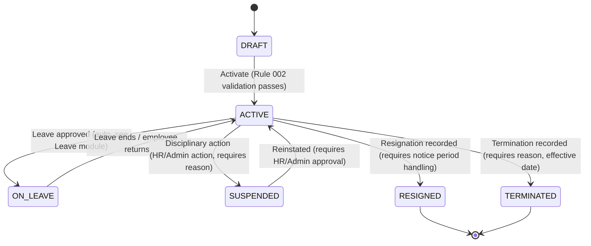
```mermaid
stateDiagram-v2
    [*] --> DRAFT
    DRAFT --> ACTIVE: Activate (Rule 002 validation passes)
    ACTIVE --> ON_LEAVE: Leave approved (auto, see Leave module)
    ON_LEAVE --> ACTIVE: Leave ends / employee returns
    ACTIVE --> SUSPENDED: Disciplinary action (HR/Admin action, requires reason)
    SUSPENDED --> ACTIVE: Reinstated (requires HR/Admin approval)
    ACTIVE --> RESIGNED: Resignation recorded (requires notice period handling)
    ACTIVE --> TERMINATED: Termination recorded (requires reason, effective date)
    RESIGNED --> [*]
    TERMINATED --> [*]
```

- **Edge Case:** An employee with a pending, unresolved Deployment assignment cannot transition directly to `TERMINATED`/`RESIGNED` without first resolving (ending) the active Deployment — the Use Case checks Cross-Document Consistency against the Deployment module and blocks with an explicit message: "This employee has an active deployment at [Site Name]. End the deployment before offboarding."

**RULE-EMPLOYEE-005: Offboarding Triggers Cascading Actions**
- **Statement:** Upon `TERMINATED`/`RESIGNED` status transition, the system automatically: (a) ends any active Deployment assignment with the termination date as end date, (b) revokes app access by disabling the linked Firebase Auth account (not deleting — preserving historical attribution on past records), (c) marks the employee's device registrations for review, and (d) flags the employee for final payroll settlement (full & final) in the Payroll module.
- **Rationale:** Prevents the common real-world failure mode of a terminated employee retaining app access or being accidentally included in the next payroll cycle.
- **Failure Behavior:** If any cascading action fails (e.g., Auth disable fails due to a transient error), the offboarding workflow surfaces a clear partial-failure state to HR ("Employee marked terminated, but device access revocation failed — retry required") rather than silently succeeding with an incomplete cascade.

**RULE-EMPLOYEE-006: Document Expiry Tracking**
- **Statement:** Documents with an `expiryDate` (e.g., Police Verification certificates common in the security industry) trigger an automated reminder notification to HR 30 days before expiry, and again at expiry if unrenewed.
- **Rationale:** Security agencies in particular face compliance risk from expired verification documents for deployed guards.
- **Trigger:** Scheduled daily Cloud Function scans `documents` subcollections across all companies for approaching/passed expiry dates.

**RULE-EMPLOYEE-007: Reporting Manager Must Not Create a Cycle**
- **Statement:** `reportingManagerId` assignments are validated to prevent circular reporting chains (A reports to B, B reports to A) and self-reference.
- **Validation:** Cross-Document Consistency check traverses the reporting chain up to a bounded depth (e.g., 10 levels) at assignment time.

## 3.5 Employee Onboarding Workflow

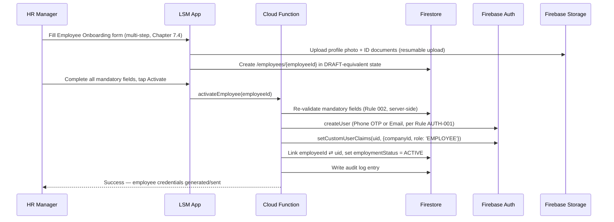
```mermaid
sequenceDiagram
    participant HR as HR Manager
    participant App as LSM App
    participant CF as Cloud Function
    participant FS as Firestore
    participant Auth as Firebase Auth
    participant Storage as Firebase Storage

    HR->>App: Fill Employee Onboarding form (multi-step, Chapter 7.4)
    App->>Storage: Upload profile photo + ID documents (resumable upload)
    App->>FS: Create /employees/{employeeId} in DRAFT-equivalent state
    HR->>App: Complete all mandatory fields, tap Activate
    App->>CF: activateEmployee(employeeId)
    CF->>FS: Re-validate mandatory fields (Rule 002, server-side)
    CF->>Auth: createUser (Phone OTP or Email, per Rule AUTH-001)
    CF->>Auth: setCustomUserClaims(uid, {companyId, role: 'EMPLOYEE'})
    CF->>FS: Link employeeId ⇄ uid, set employmentStatus = ACTIVE
    CF->>FS: Write audit log entry
    CF-->>HR: Success — employee credentials generated/sent
```

## 3.6 Reports

- **Employee Master Report:** Full roster export (Excel/PDF) with filters by status, department, site.
- **Document Compliance Report:** Employees with missing/expiring/rejected verification documents.
- **Headcount Report:** Active/On Leave/Suspended breakdown by site/department, trended over time (Chart-based, cross-referenced with Analytics module).

## 3.7 Notifications

- Document expiry reminders (Rule 006).
- Employee activation success/credential delivery (SMS/Email with Phone OTP setup instructions, or Email with password-set link).
- Status change notifications to the employee (e.g., "Your account has been reinstated") and to their reporting manager.

## 3.8 Offline Behavior

- Employee Directory (list + detail) is fully browsable offline via the Room cache (Chapter 6.7 of Project Rules) with a visible "Last synced at [time]" indicator.
- New employee creation/onboarding requires connectivity for the Auth account creation step (Cloud Function call), but the form data itself can be drafted offline and queued for submission — the "Activate" action specifically requires connectivity and is clearly labeled as such in the UI, avoiding a confusing offline-queued Auth-account-creation scenario.

## 3.9 Edge Cases

- Rehiring a previously terminated employee: the system supports creating a new Employee record rather than reactivating the old one (preserving historical attribution correctly), with an optional "Link to previous employment record" reference for HR continuity purposes, cross-referenced but not merged.
- An employee with the same Aadhaar number already existing within the same company (potential duplicate entry or genuine two-employment-records error) triggers a warning (not a hard block, since data entry errors and genuine edge cases both exist) requiring HR acknowledgment.

## 3.10 Testing Requirements

- Unit tests for every status transition in the state machine (Rule 004), including all invalid transition attempts (e.g., `DRAFT → TERMINATED` directly) confirming rejection.
- Unit tests for cascading offboarding actions (Rule 005), including simulated partial-failure scenarios.
- Security Rule tests confirming `employees.viewSensitive` permission gates the unmasked bank/ID fields correctly at the server level, not just client-side.

---

---

# MODULE 4: ATTENDANCE

## 4.1 Why This Module Exists

Attendance is the literal digital replacement for the "log sheet" in the product's name. It is the highest-frequency action in the entire platform (Chapter 9.2 of Project Rules), the direct input to Payroll wage calculation, and the direct input to Billing (client invoicing is typically tied to verified deployed hours). Its correctness has immediate financial consequences for both the employee (wage accuracy) and the company (billing accuracy, compliance exposure).

## 4.2 Who Uses This Module

| Role | Interaction |
|---|---|
| Employee | Marks own check-in/check-out (self-attendance, where company policy permits) |
| Supervisor | Marks attendance on behalf of employees at their site (proxy marking, for sites where individual employee devices aren't practical); reviews and overrides geofence exceptions |
| HR Manager | Reviews, corrects (within policy), and finalizes attendance for payroll cutoff |
| Client | Views (read-only) verified attendance/deployment hours for their sites, for billing transparency |

## 4.3 Firestore Collections

```
/attendanceRecords/{attendanceId}           — Pattern A; deterministic ID = hash(employeeId_date_shiftId) per Rule 10.7 (idempotency)
  ├── companyId, employeeId, employeeName (denormalized, Rule 6.4 propagation)
  ├── siteId, siteName (denormalized), deploymentId
  ├── shiftId, shiftDate
  ├── status: enum { PRESENT, ABSENT, HALF_DAY, LATE, ON_LEAVE, HOLIDAY, WEEKLY_OFF }
  ├── checkInTimestamp, checkInLocation (geopoint), checkInMarkedBy (employeeId or supervisorId), checkInMethod: enum { SELF, SUPERVISOR_PROXY, BIOMETRIC }
  ├── checkOutTimestamp, checkOutLocation, checkOutMarkedBy, checkOutMethod
  ├── isWithinGeofence: boolean, geofenceOverrideReason (nullable)
  ├── totalHoursWorked (computed), overtimeHours (computed)
  ├── isLate: boolean, lateByMinutes
  ├── correctionHistory: array of { correctedByUserId, correctedAt, previousValue, newValue, reason }
  ├── isPayrollLocked: boolean (set true once the payroll period containing this record is finalized, Chapter 10.9 cross-reference)
  └── syncStatus (client-local field, not persisted server-side — UI concern per Chapter 6.6.1)
```

## 4.4 Business Rules

**RULE-ATTENDANCE-001: Deterministic Document ID for Idempotency**
- **Statement:** Every attendance record's document ID is deterministically derived from `(employeeId, shiftDate, shiftId)` rather than an auto-generated ID.
- **Rationale:** Directly implements Chapter 10.7 of Project Rules — a retried offline-queued write (e.g., due to WorkManager retry after connectivity loss mid-sync) overwrites the same document rather than creating a duplicate attendance record for the same shift.

**RULE-ATTENDANCE-002: Geofence Validation**
- **Statement:** If the assigned Site has geofencing enabled (a Site-level configuration, see Deployment module), a check-in/check-out is validated against the site's registered geofence radius. Marks outside the geofence are flagged `isWithinGeofence = false` and require either (a) a Supervisor override with a stated reason, or (b) automatic acceptance if the company's policy tolerance (configurable buffer, e.g., 100m) is not exceeded.
- **Trigger:** Evaluated client-side at mark time (for immediate UX feedback per Chapter 12.3) and re-validated server-side in a Cloud Function trigger on write (since GPS coordinates are client-reported and must not be blindly trusted for compliance-relevant records — Chapter 10.4.1).
- **Failure Behavior:** Out-of-geofence mark without override is held in a `PENDING_SUPERVISOR_REVIEW` sub-state (not silently rejected, since the employee may genuinely be present with a GPS accuracy issue) — the Supervisor is notified via FCM to review and approve/reject with a reason.

**RULE-ATTENDANCE-003: Late Marking Threshold**
- **Statement:** A check-in more than the shift's configured `gracePeriodMinutes` (default 15, company-configurable) after the shift's scheduled start time is marked `isLate = true` with `lateByMinutes` computed, and the record's `status` becomes `LATE` rather than `PRESENT`.
- **Edge Case:** Cumulative late-marks within a payroll period may trigger a configurable HR policy action (e.g., a warning notification) — this is a company-configurable business rule, not a hardcoded platform behavior, and is documented per-company in Company Settings (Module 1).

**RULE-ATTENDANCE-004: Auto-Absent Marking**
- **Statement:** If no check-in is recorded by a configurable cutoff time after shift start (default: shift start + 2 hours), a scheduled Cloud Function automatically marks the record `status = ABSENT` for any employee with an active Deployment for that shift and no attendance record yet present.
- **Rationale:** Prevents attendance records from remaining perpetually "unmarked" (an ambiguous state that would corrupt payroll calculation) — every deployed shift resolves to an explicit status.
- **Edge Case:** If the employee subsequently checks in late (after auto-absent has already fired) with a valid reason, this is handled as a **Correction** (Rule 007), not a new record, since the deterministic ID (Rule 001) ensures the correction updates the same document.

**RULE-ATTENDANCE-005: Proxy Marking by Supervisor**
- **Statement:** A Supervisor may mark attendance on behalf of an employee (`checkInMethod = SUPERVISOR_PROXY`) only for employees within their assigned site(s), and only within a configurable time window around the shift (preventing bulk-marking an entire week in advance or long after the fact without HR escalation).
- **Validation:** Cross-Document Consistency check confirms the Supervisor's own active Deployment/assignment includes the target site before allowing proxy marking (Chapter 12.2).
- **Rationale:** Many sites (e.g., large industrial or construction sites) do not equip every worker with a smartphone; Supervisor proxy marking is a first-class, real-world-necessary flow, not a workaround.

**RULE-ATTENDANCE-006: Payroll Lock Prevents Further Edits**
- **Statement:** Once a payroll period is finalized (Payroll module, `Finalized` state per Chapter 10.6), every attendance record within that period has `isPayrollLocked = true` set server-side, and further edits are rejected by Security Rules (`resource.data.isPayrollLocked == false` required for update) regardless of role, including HR Manager.
- **Rationale:** Prevents post-payroll attendance tampering that would create a payroll-vs-attendance reconciliation mismatch — a core compliance/audit integrity requirement (Chapter 10.4.1, financial-risk rule, server-enforced).
- **Edge Case:** A correction needed after payroll lock requires an explicit, audited **Payroll Reversal** workflow (Payroll module) rather than a direct attendance edit — the two modules are intentionally decoupled at this boundary to preserve auditability.

**RULE-ATTENDANCE-007: Correction Workflow**
- **Statement:** Any edit to an already-marked (non-payroll-locked) attendance record is recorded in the `correctionHistory` array (previous value, new value, corrector identity, timestamp, reason) — a correction never silently overwrites without trace.
- **Validation:** Corrections beyond a configurable threshold (e.g., changing status from `ABSENT` to `PRESENT` more than 3 days after the fact) require HR-level permission (`attendance.correctBeyondWindow`), not just standard Supervisor `attendance.correct` permission — implementing a tiered approval-adjacent control without a full Approval workflow overhead for routine same-day corrections.

## 4.5 Attendance Marking Workflow (Detailed)

*(See also Chapter 8.3 of `MASTER_PROJECT_RULES.md` for the UX-level flowchart; this section provides the business-logic-level detail.)*

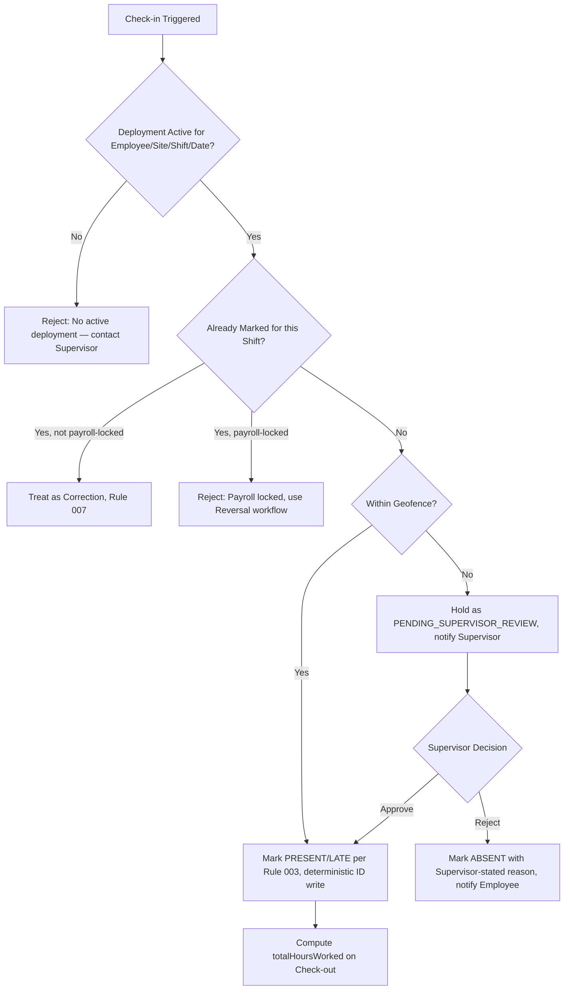
```mermaid
flowchart TD
    A[Check-in Triggered] --> B{Deployment Active for Employee/Site/Shift/Date?}
    B -->|No| C[Reject: No active deployment — contact Supervisor]
    B -->|Yes| D{Already Marked for this Shift?}
    D -->|Yes, not payroll-locked| E[Treat as Correction, Rule 007]
    D -->|Yes, payroll-locked| F[Reject: Payroll locked, use Reversal workflow]
    D -->|No| G{Within Geofence?}
    G -->|Yes| H[Mark PRESENT/LATE per Rule 003, deterministic ID write]
    G -->|No| I[Hold as PENDING_SUPERVISOR_REVIEW, notify Supervisor]
    H --> J[Compute totalHoursWorked on Check-out]
    I --> K{Supervisor Decision}
    K -->|Approve| H
    K -->|Reject| L[Mark ABSENT with Supervisor-stated reason, notify Employee]
```

## 4.6 Reports

- **Daily Attendance Register:** Site-wise, real-time present/absent/late breakdown — the direct digital descendant of the paper "muster roll."
- **Monthly Attendance Summary:** Per-employee rollup (days present, absent, late, overtime hours) feeding directly into Payroll.
- **Geofence Exception Report:** All out-of-geofence marks and their resolution (approved/rejected), for compliance audit trail.
- **Client-Facing Deployment Hours Report:** Verified attendance hours per site, scoped to the Client role's own sites only, for billing reconciliation (cross-referenced with Billing module).

## 4.7 Notifications

- Supervisor notified of pending geofence-override review (Rule 002).
- Employee notified of auto-marked absence (Rule 004) with an option to raise a dispute/correction request.
- HR notified of correction requests requiring `attendance.correctBeyondWindow` permission.

## 4.8 Offline Behavior

- Attendance marking is the platform's flagship offline-first flow (Chapter 1.4, 8.3 of Project Rules): optimistic local write with deterministic ID (Rule 001) ensures safe queuing and retry.
- Geofence validation runs client-side against locally cached site geofence configuration (synced whenever connectivity is available) so the check functions even fully offline; the server-side re-validation (Rule 002) occurs upon sync and can, in rare GPS-spoofing-suspicion cases, retroactively flag a record for Supervisor review even after initial optimistic acceptance — this reconciliation is surfaced transparently, never silently altering a record without notification.

## 4.9 Edge Cases

- Overnight shifts (crossing midnight): `shiftDate` is defined as the shift's *start* date, and `totalHoursWorked` computation correctly spans the date boundary (Cross-Field Consistency, Chapter 12.2, referencing the Shift module's `isOvernight` flag).
- Multiple shifts per employee per day (e.g., double shift): the deterministic ID's inclusion of `shiftId` (not just `employeeId_date`) ensures each shift gets its own attendance record.
- Employee on approved Leave for a date that also has a Deployment assignment: `status = ON_LEAVE` takes precedence and no auto-absent marking occurs (Cross-Module Consistency check against the Leave module, Chapter 10.8).

## 4.10 Testing Requirements

- Unit tests confirming deterministic ID generation produces identical IDs for repeated calls with the same inputs (idempotency proof, Rule 001).
- Unit tests for the auto-absent Cloud Function logic against various Deployment/Leave interaction edge cases (4.9).
- Integration tests (Firebase Emulator) confirming payroll-locked records reject Security Rule updates from every role, including HR.
- Offline simulation tests confirming optimistic check-in, sync, and correct final-state reconciliation including the geofence re-validation edge case.

---

---

# MODULE 5: LEAVE

## 5.1 Why This Module Exists

Leave management replaces paper leave applications and manual balance tracking, which are error-prone and slow. Incorrect leave balance tracking causes both employee dissatisfaction (denied leave they were entitled to) and payroll errors (unpaid leave incorrectly paid, or vice versa). This module must interoperate tightly with Attendance (Module 4) and Payroll (Module 8).

## 5.2 Who Uses This Module

| Role | Interaction |
|---|---|
| Employee | Applies for leave, views balance, views history |
| Supervisor | First-level approval for their site's employees (if company policy requires) |
| HR Manager | Final approval, balance adjustments, policy configuration |
| Company Admin | Policy configuration, oversight |

## 5.3 Firestore Collections

```
/leavePolicyTypes/{leaveTypeId}             — under /companies/{companyId}/leavePolicyTypes/
  ├── name (e.g., "Casual Leave", "Sick Leave", "Earned Leave")
  ├── isPaid: boolean
  ├── annualEntitlementDays
  ├── accrualMethod: enum { ANNUAL_LUMP_SUM, MONTHLY_ACCRUAL }
  ├── maxCarryForwardDays
  ├── requiresApproval: boolean
  ├── minAdvanceNoticeDays
  └── maxConsecutiveDays

/leaveRequests/{leaveRequestId}             — Pattern A
  ├── companyId, employeeId, employeeName (denormalized)
  ├── leaveTypeId, leaveTypeName (denormalized)
  ├── startDate, endDate, numberOfDays (computed, excluding weekly-offs/holidays per policy config)
  ├── reason
  ├── status: enum { DRAFT, PENDING_APPROVAL, APPROVED, REJECTED, WITHDRAWN, CANCELLED_POST_APPROVAL }
  ├── approvalChain: array of { approverRoleLevel, approverId, decision, decidedAt, comment }
  ├── attachmentUrl (nullable — e.g., medical certificate for Sick Leave beyond a threshold)
  ├── createdAt, updatedAt
  └── /balanceLedgerEntries (see 5.4 Rule 003)   — actually maintained under employee, see below

/employees/{employeeId}/leaveBalances/{leaveTypeId}
  ├── currentBalance
  ├── accruedThisYear, usedThisYear, carriedForwardFromPreviousYear
  └── lastAccrualDate
```

## 5.4 Business Rules

**RULE-LEAVE-001: Leave Application Validation**
- **Statement:** A leave request must pass: `endDate >= startDate` (Cross-Field), no overlap with an existing `APPROVED` or `PENDING_APPROVAL` leave request for the same employee (Cross-Document), `numberOfDays <= currentBalance` for paid leave types (Business-State, unless the company policy explicitly allows negative-balance/unpaid-leave-on-insufficient-balance, a configurable option), and advance notice ≥ `minAdvanceNoticeDays` (Range) unless flagged as emergency leave (Sick Leave typically exempted from advance notice).
- **Trigger:** `ApplyLeaveUseCase`, re-validated server-side in the approval-processing Cloud Function since balance may have changed between application and approval (Chapter 6.4, transaction-based recheck).

**RULE-LEAVE-002: Approval Chain Configuration**
- **Statement:** Companies configure whether leave approval requires 1 level (direct HR/Admin approval) or 2 levels (Supervisor first-level, then HR final approval) — company-configurable, not hardcoded.
- **Workflow:** Modeled as the standard state machine (Chapter 10.6 of Project Rules) with `approvalChain` recording each level's decision.

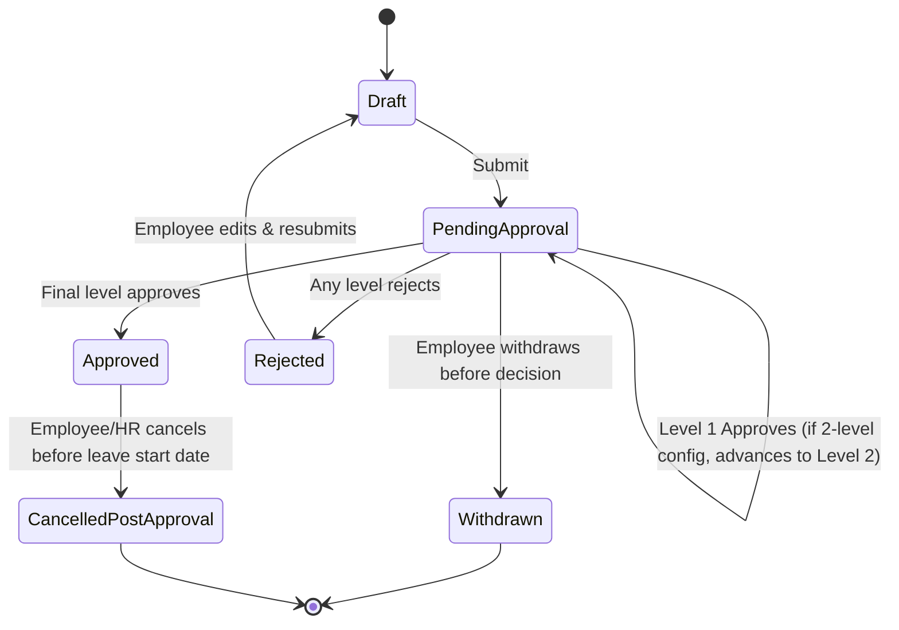
```mermaid
stateDiagram-v2
    [*] --> Draft
    Draft --> PendingApproval: Submit
    PendingApproval --> PendingApproval: Level 1 Approves (if 2-level config, advances to Level 2)
    PendingApproval --> Approved: Final level approves
    PendingApproval --> Rejected: Any level rejects
    PendingApproval --> Withdrawn: Employee withdraws before decision
    Approved --> CancelledPostApproval: Employee/HR cancels before leave start date
    Rejected --> Draft: Employee edits & resubmits
    Withdrawn --> [*]
    CancelledPostApproval --> [*]
```

**RULE-LEAVE-003: Balance Deduction Is Transactional**
- **Statement:** Leave balance deduction occurs only upon final `APPROVED` status, using a Firestore transaction that reads current balance, verifies sufficiency, and deducts atomically — never deducted at application/`PENDING_APPROVAL` time (which would incorrectly reserve balance against requests that may later be rejected, though see Rule 5.4.4 below for the soft-hold nuance).
- **Rationale:** Directly implements the Chapter 6.4 transaction decision table entry for leave balance deduction (concurrency-risk scenario).

**RULE-LEAVE-004: Soft-Hold During Pending Approval**
- **Statement:** While `PENDING_APPROVAL`, the requested days are shown as a separate "on hold" figure distinct from `currentBalance` in the UI (not deducted from the spendable balance, but visible so the employee and approver understand the pending commitment) — preventing the confusing UX of an employee applying for overlapping leave twice while a first request is still pending.
- **Validation:** The overlap check in Rule 001 considers both `APPROVED` and `PENDING_APPROVAL` requests specifically to enforce this soft-hold consistently.

**RULE-LEAVE-005: Cancellation Post-Approval Reverses Balance**
- **Statement:** An `APPROVED` leave request cancelled before its `startDate` (e.g., employee no longer needs the leave) transitions to `CANCELLED_POST_APPROVAL` and triggers a transactional balance credit-back.
- **Edge Case:** Cancellation *after* `startDate` has begun (partial cancellation of an in-progress leave) is handled as a partial-day adjustment requiring HR-level permission, recalculating `numberOfDays` and the corresponding partial balance credit-back, with the change logged similarly to Attendance's `correctionHistory` pattern (Rule ATTENDANCE-007) for auditability.

**RULE-LEAVE-006: Accrual Processing**
- **Statement:** For `leaveTypeId`s configured with `accrualMethod = MONTHLY_ACCRUAL`, a scheduled Cloud Function runs on the 1st of each month, crediting `annualEntitlementDays / 12` (rounded per company policy — floor, round, or exact fraction) to every active employee's balance for that leave type.
- **Edge Case:** An employee joining mid-month receives a pro-rated first accrual based on `joiningDate`, not a full month's accrual — computed by the same scheduled function referencing the Employee module's `joiningDate` field (Cross-Module Consistency, Chapter 10.8).

**RULE-LEAVE-007: Carry-Forward at Year End**
- **Statement:** A scheduled Cloud Function runs at each company's configured fiscal year-end, carrying forward `min(currentBalance, maxCarryForwardDays)` into the new year's `carriedForwardFromPreviousYear` field, with any excess forfeited per policy (or paid out as encashment, if the company's policy and Payroll module support leave encashment — cross-referenced with Payroll Module 8).

**RULE-LEAVE-008: Leave Status Feeds Attendance**
- **Statement:** For every date within an `APPROVED` leave request's range, a corresponding Attendance record (Module 4) is created/updated with `status = ON_LEAVE`, preventing the Attendance module's auto-absent job (Rule ATTENDANCE-004) from incorrectly marking the employee absent.
- **Trigger:** Executed as part of the same Cloud Function that processes final leave approval (Batched Write, since these are independent document creates without a read-dependency between them, per Chapter 6.4).

## 5.5 Reports

- **Leave Balance Report:** Per-employee, per-leave-type current balance, accrued, used, carried-forward.
- **Leave Utilization Report:** Company-wide/department-wide leave usage trends (feeds Analytics module).
- **Pending Approvals Report:** For HR/Supervisor dashboards, cross-referenced with the Approvals module (Module 19).

## 5.6 Notifications

- Employee: application submitted confirmation, approval/rejection decision with approver's comment (Chapter 8.4 of Project Rules — mandatory reason on rejection).
- Approver: new pending approval requiring action (persistent badge count, Chapter 8.4).
- HR: accrual/carry-forward job completion summary (informational, not action-required).

## 5.7 Offline Behavior

- Leave application can be drafted and queued offline (low time-sensitivity action, tolerant of sync delay); the Sync Status Indicator (Chapter 6.6.1) clearly shows "Pending Sync" until the request reaches the server, since the overlap/balance validation (Rule 001) fundamentally requires server-side data to be authoritative and cannot be fully resolved offline.
- Balance viewing uses the last-synced cached balance with a visible "as of [sync time]" freshness indicator (Chapter 7.6 dashboard standard).

## 5.8 Testing Requirements

- Unit tests for every state machine transition and rejection of invalid transitions.
- Transactional integrity tests simulating concurrent leave applications racing against the same balance, confirming no over-approval occurs (Rule 003).
- Unit tests for pro-rated accrual calculation edge cases (Rule 006) and carry-forward capping (Rule 007).
- Integration test confirming Leave approval correctly cascades to Attendance record creation (Rule 008), including the interaction with the Attendance auto-absent scheduled function to confirm no conflict/race condition between the two scheduled/triggered jobs.

---

---

# MODULE 6: SHIFT

## 6.1 Why This Module Exists

Shift definitions are the scheduling backbone underlying Attendance (which shift was this check-in against?), Deployment (which shift is an employee assigned to at a site?), and Payroll (overtime is computed relative to shift boundaries). Without a well-modeled Shift entity, every downstream time-based calculation becomes ambiguous.

## 6.2 Who Uses This Module

| Role | Interaction |
|---|---|
| Operations Manager | Defines shift types, builds shift rosters/schedules |
| Company Admin | Configures default shift types at company level |
| Supervisor | Views assigned shifts for their site, requests roster changes |
| Employee | Views their own assigned shift schedule |

## 6.3 Firestore Collections

```
/companies/{companyId}/shiftTypes/{shiftTypeId}
  ├── name (e.g., "Day Shift", "Night Shift", "General Shift")
  ├── startTime, endTime (time-of-day, not date)
  ├── isOvernight: boolean
  ├── gracePeriodMinutes (late-marking threshold, cross-referenced RULE-ATTENDANCE-003)
  ├── breakDurationMinutes
  ├── isActive: boolean

/companies/{companyId}/sites/{siteId}/shiftRoster/{rosterEntryId}
  ├── employeeId, shiftTypeId, date
  ├── siteId
  ├── status: enum { SCHEDULED, SWAPPED, CANCELLED }
  ├── createdByUserId, createdAt
  └── swapRequestId (nullable, references a shift-swap workflow record)

/shiftSwapRequests/{swapRequestId}          — Pattern A
  ├── companyId, requestingEmployeeId, targetEmployeeId
  ├── originalRosterEntryId, proposedRosterEntryId
  ├── status: enum { PENDING_APPROVAL, APPROVED, REJECTED, WITHDRAWN }
  └── approvedByUserId, decidedAt
```

## 6.4 Business Rules

**RULE-SHIFT-001: Shift Time Consistency**
- **Statement:** `endTime > startTime` for non-overnight shifts; for `isOvernight = true` shifts, `endTime` is interpreted as occurring on the calendar day following `startTime`'s date, and all downstream duration calculations (Attendance total hours, Payroll overtime) must correctly span this boundary.
- **Validation:** Cross-Field Consistency (Chapter 12.2), enforced at shift-type creation and referenced by every module computing shift duration.

**RULE-SHIFT-002: Roster Assignment Requires Active Deployment**
- **Statement:** A `shiftRoster` entry can only be created for an `employeeId` that has an active Deployment (Module 7) at the corresponding `siteId` covering that `date`.
- **Rationale:** Prevents scheduling an employee for a shift at a site they are not actually deployed to, which would create an inconsistent, unbillable, non-compliant record.
- **Validation:** Cross-Document Consistency check against the Deployment module (Chapter 10.8).

**RULE-SHIFT-003: No Double-Booking**
- **Statement:** An employee cannot have two overlapping `shiftRoster` entries on the same date (e.g., assigned to both Day Shift and Night Shift on an overlapping window) unless the company's policy explicitly permits double-shifts (a configurable flag), in which case the system still validates that combined shift duration does not exceed the statutory maximum working hours per day (Compliance module cross-reference, Module 21).
- **Trigger:** Validated in `CreateRosterEntryUseCase`, both client-side and Cloud-Function-side (financial/compliance risk category per Chapter 10.4.1, since it affects overtime and statutory compliance calculations).

**RULE-SHIFT-004: Shift Swap Workflow**
- **Statement:** An employee may request a shift swap with a colleague; the swap requires: (a) target employee's acceptance, and (b) Supervisor/Operations approval, modeled as the standard two-party-plus-approver state machine.

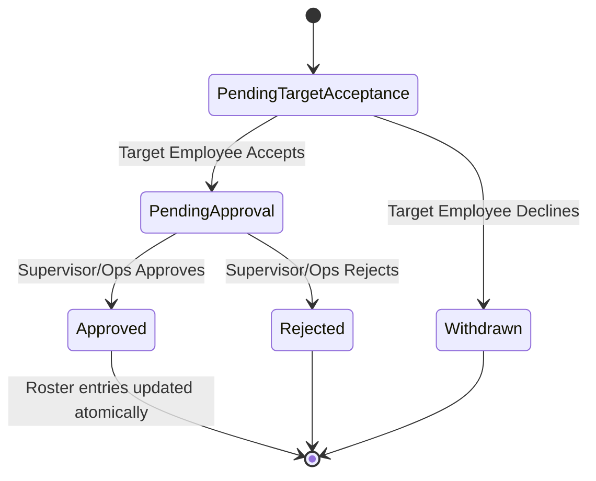
```mermaid
stateDiagram-v2
    [*] --> PendingTargetAcceptance
    PendingTargetAcceptance --> PendingApproval: Target Employee Accepts
    PendingTargetAcceptance --> Withdrawn: Target Employee Declines
    PendingApproval --> Approved: Supervisor/Ops Approves
    PendingApproval --> Rejected: Supervisor/Ops Rejects
    Approved --> [*]: Roster entries updated atomically
    Rejected --> [*]
    Withdrawn --> [*]
```

- **Failure Behavior:** Upon `Approved`, both employees' `shiftRoster` entries are updated in a single batched write (independent document updates, no read-dependency between them beyond the already-validated swap request, per Chapter 6.4) — a partial swap (one employee's roster updated but not the other's) is never left in an inconsistent state due to the atomicity of the batch.

**RULE-SHIFT-005: Shift Type Deactivation Does Not Retroactively Affect History**
- **Statement:** Deactivating a `shiftType` (`isActive = false`) prevents its future use in new roster entries but does not alter historical `shiftRoster` entries or `attendanceRecords` already referencing it — historical records retain their original shift reference for audit/payroll-history integrity.

## 6.5 Reports

- **Shift Roster Report:** Site-wise, date-range schedule view (calendar format), primary planning tool for Operations Managers.
- **Shift Coverage Gap Report:** Highlights shifts/sites with no employee assigned, a critical operational alert feeding the Deployment module's staffing dashboards.
- **Overtime Exposure Report:** Projects potential overtime cost based on currently scheduled rosters vs. standard shift hours, before payroll is even run — an early-warning report for Operations.

## 6.6 Notifications

- Shift roster published/changed notification to affected employees.
- Shift swap request notifications (to target employee, then to approver) per the state machine above.
- Shift coverage gap alert to Operations Manager (proactive staffing risk notification).

## 6.7 Offline Behavior

- Employees view their own upcoming shift schedule fully offline via cached roster data (read-heavy, infrequent-change data, ideal for Room caching per Chapter 6.7 of Project Rules).
- Roster creation/editing (an Operations-desk activity, not a field activity) is not prioritized for offline-first support, consistent with the risk-based approach applied to the Company module.

## 6.8 Testing Requirements

- Unit tests for overnight shift duration calculation correctness across the midnight boundary.
- Unit tests for double-booking prevention, including the configurable double-shift-permitted policy path with statutory max-hours enforcement.
- Integration tests confirming shift swap approval atomically updates both employees' roster entries with no partial-failure state achievable.

---

---

# MODULE 7: DEPLOYMENT

## 7.1 Why This Module Exists

Deployment is the entity that answers "which employee is working at which client site, for how long, under what billing terms" — it is the operational and commercial core connecting Employees, Sites, Clients, and Billing. For a security agency or facility management company, deployment tracking accuracy directly determines both payroll correctness and client billing correctness, and its absence is one of the primary paper-based pain points LSM replaces (Chapter 1.2 of Project Rules).

## 7.2 Who Uses This Module

| Role | Interaction |
|---|---|
| Operations Manager | Creates and manages deployment assignments, tracks staffing levels |
| Company Admin | Oversight, approves high-value/long-term deployments |
| Client | Views their own site's deployment status (read-only) |
| Billing Team | Reads deployment records to generate invoices |
| Supervisor | Views deployments at their assigned site(s) |

## 7.3 Firestore Collections

```
/deployments/{deploymentId}                 — Pattern A
  ├── companyId, employeeId, employeeName (denormalized)
  ├── siteId, siteName (denormalized), clientId, clientName (denormalized)
  ├── startDate, endDate (nullable — open-ended ongoing deployment)
  ├── status: enum { ACTIVE, COMPLETED, CANCELLED, ON_HOLD }
  ├── deploymentType: enum { PERMANENT_POSTING, TEMPORARY, RELIEF, TRAINEE }
  ├── billingRateType: enum { PER_SHIFT, MONTHLY_FIXED, HOURLY }, billingRate
  ├── assignedShiftTypeId
  ├── approvedByUserId, approvedAt
  ├── endReason (nullable — populated when status becomes COMPLETED/CANCELLED)
  ├── createdAt, updatedAt
  └── /history/{historyId}                  — audit trail of changes (rate changes, site transfers, etc.)
```

## 7.4 Business Rules

**RULE-DEPLOYMENT-001: Deployment Requires Active Employee and Site**
- **Statement:** A Deployment can only be created for an employee with `employmentStatus = ACTIVE` and a site with `isActive = true`.
- **Trigger:** Cross-Document Consistency check at creation, re-validated server-side (Chapter 12.3).

**RULE-DEPLOYMENT-002: No Overlapping Active Deployments Per Employee (Single-Site Default)**
- **Statement:** By default, an employee cannot have two `ACTIVE` deployments with overlapping date ranges at different sites, since a person cannot physically be deployed at two locations simultaneously for a single full-time role. Companies with legitimate multi-site part-time arrangements may enable a configurable `allowMultiSiteDeployment` company policy flag, in which case overlapping deployments are permitted but the combined shift commitments are still checked against Shift module's double-booking rule (RULE-SHIFT-003).
- **Rationale:** Prevents both data entry errors and billing fraud risk (double-billing a client for hours actually worked at another client's site).

**RULE-DEPLOYMENT-003: Deployment Status Workflow**

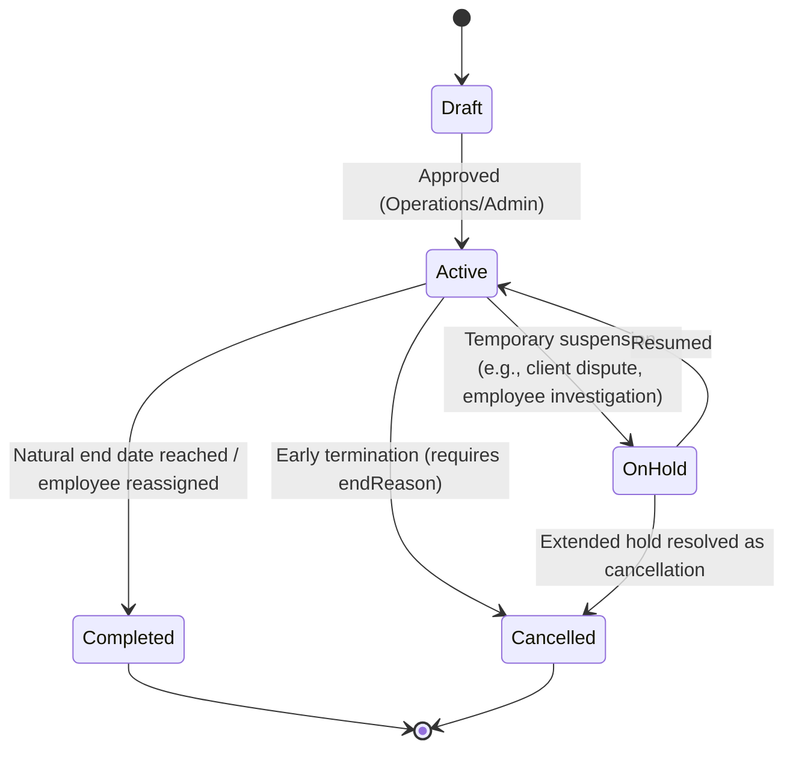
```mermaid
stateDiagram-v2
    [*] --> Draft
    Draft --> Active: Approved (Operations/Admin)
    Active --> OnHold: Temporary suspension (e.g., client dispute, employee investigation)
    OnHold --> Active: Resumed
    Active --> Completed: Natural end date reached / employee reassigned
    Active --> Cancelled: Early termination (requires endReason)
    OnHold --> Cancelled: Extended hold resolved as cancellation
    Completed --> [*]
    Cancelled --> [*]
```

- **Rule:** Transitioning to `Cancelled` or `Completed` requires an `endReason` (selected from a structured list: Client Request, Employee Resignation, Performance Issue, Site Closure, Contract End, Other) — never a bare status flip with no recorded rationale, since this data feeds both Analytics (attrition/turnover analysis) and Billing (final invoice cutoff).

**RULE-DEPLOYMENT-004: Site Transfer Preserves History, Does Not Mutate**
- **Statement:** Moving an employee from one site to another is modeled as ending the current Deployment (`status = COMPLETED`, `endReason = "Site Transfer"`) and creating a new Deployment record for the new site — never as an in-place edit of the `siteId` field on an existing Deployment.
- **Rationale:** Preserves accurate historical billing/payroll attribution per site; an in-place site change would corrupt the historical record of which site an employee actually worked at during a given period.

**RULE-DEPLOYMENT-005: Billing Rate Changes Are Effective-Dated, Not Retroactive**
- **Statement:** A change to `billingRate` on an active Deployment does not retroactively alter already-generated invoices; the change is recorded with an effective date in the `/history` subcollection and applies only to billing periods starting on or after that date.
- **Cross-Module Reference:** Directly consumed by the Billing module (Module 11) when computing invoice line items.

**RULE-DEPLOYMENT-006: Cancellation Cascades to Shift Roster**
- **Statement:** When a Deployment transitions to `Cancelled`/`Completed`, any future-dated `shiftRoster` entries (Module 6) referencing that deployment's employee/site combination beyond the deployment's end date are automatically cancelled (`status = CANCELLED`), preventing orphaned future shift assignments for a deployment that no longer exists.

**RULE-DEPLOYMENT-007: Client Visibility Is Read-Only and Site-Scoped**
- **Statement:** A Client-role user sees only Deployment records where `clientId` matches their own linked client identity, and only fields relevant to billing/staffing transparency (employee name, shift, dates, status) — never sensitive employee data (bank details, ID numbers, contact info), enforced via a dedicated Client-facing query/Security Rule path distinct from the internal Operations view (Chapter 11.3 RBAC granularity).

## 7.5 Deployment Creation Workflow

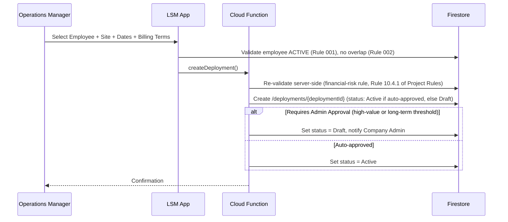
```mermaid
sequenceDiagram
    participant Ops as Operations Manager
    participant App as LSM App
    participant CF as Cloud Function
    participant FS as Firestore

    Ops->>App: Select Employee + Site + Dates + Billing Terms
    App->>FS: Validate employee ACTIVE (Rule 001), no overlap (Rule 002)
    App->>CF: createDeployment()
    CF->>FS: Re-validate server-side (financial-risk rule, Rule 10.4.1 of Project Rules)
    CF->>FS: Create /deployments/{deploymentId} (status: Active if auto-approved, else Draft)
    alt Requires Admin Approval (high-value or long-term threshold)
        CF->>FS: Set status = Draft, notify Company Admin
    else Auto-approved
        CF->>FS: Set status = Active
    end
    CF-->>Ops: Confirmation
```

## 7.6 Reports

- **Deployment Register:** Site-wise/client-wise current staffing roster — the operational heart of the "who is where" question.
- **Deployment History Report:** Per-employee deployment timeline (career history across sites within the company).
- **Client Staffing Summary:** Client-facing report showing currently deployed headcount vs. contracted headcount, highlighting understaffing/overstaffing.
- **Deployment Attrition/Turnover Report:** Analysis of `endReason` distribution over time (Analytics module cross-reference).

## 7.7 Notifications

- New deployment assignment notification to the employee.
- Deployment approval-pending notification to Company Admin (for high-value/long-term deployments requiring approval per Rule 003's Draft state).
- Deployment cancellation/hold notification to affected employee and, where policy dictates, to the Client.
- Understaffing alert (site coverage gap, cross-referenced with Shift module Rule 6.5) to Operations Manager.

## 7.8 Offline Behavior

- Deployment records are read-cached (Room) for Supervisor/Employee views of "where am I currently deployed" — a frequently-needed, low-change-frequency lookup, ideal for offline caching.
- Deployment creation/modification (an Operations-desk activity) requires connectivity, consistent with the risk-based offline approach applied to Company and Shift-roster-editing.

## 7.9 Edge Cases

- A deployment with `endDate = null` (open-ended, ongoing) is fully supported and is the default for `PERMANENT_POSTING` type; billing/payroll processing for open-ended deployments uses the payroll period's own date boundaries rather than requiring a deployment end date.
- Simultaneous site closure affecting many active deployments (e.g., a client contract ends entirely) is supported via a bulk-cancellation operation that iterates deployments for a given `clientId`/`siteId`, applying Rule 006's cascade consistently across all affected records rather than requiring one-by-one manual cancellation.

## 7.10 Testing Requirements

- Unit tests for overlap detection (Rule 002) including the configurable multi-site policy path.
- Unit tests confirming site transfer creates a new record rather than mutating the existing one (Rule 004).
- Integration tests confirming cancellation cascade correctly cancels only future-dated roster entries, leaving historical ones untouched.
- Security Rule tests confirming Client-role queries never return sensitive employee fields, only the whitelisted subset (Rule 007).

---

---

# MODULE 8: PAYROLL

## 8.1 Why This Module Exists

Payroll is the module with the highest legal and financial stakes in the entire platform. Errors here directly affect employee wages (a livelihood-critical concern for the field workforce LSM serves) and expose companies to labor law penalties (PF, ESI, Minimum Wages Act, Bonus Act, Gratuity Act violations in the Indian context). This module consumes Attendance, Leave, and Deployment data as inputs and must never compute figures the underlying source data cannot substantiate.

## 8.2 Who Uses This Module

| Role | Interaction |
|---|---|
| HR Manager | Runs payroll cycles, reviews/adjusts computed figures, finalizes |
| Company Admin | Approves payroll before disbursement, oversight |
| Accounts/Billing Team | Reconciles payroll cost against Billing revenue |
| Employee (ESS) | Views own payslip (read-only, once finalized) |

## 8.3 Firestore Collections

```
/companies/{companyId}/payrollConfig
  ├── payPeriodType: enum { MONTHLY, BI_WEEKLY }
  ├── payrollCutoffDay
  ├── overtimeMultiplier (e.g., 2.0x for statutory overtime rate)
  ├── pfApplicable: boolean, pfEmployeeRate, pfEmployerRate
  ├── esiApplicable: boolean, esiEmployeeRate, esiEmployerRate, esiWageCeiling
  ├── minimumWageByCategory: map { category: rate } (state/skill-category-specific, per Compliance module)
  ├── bonusApplicable: boolean, bonusPercentage
  └── gratuityApplicable: boolean

/payrollRuns/{payrollRunId}                 — Pattern A
  ├── companyId, periodStartDate, periodEndDate
  ├── status: enum { DRAFT, UNDER_REVIEW, APPROVED, FINALIZED, DISBURSED, REVERSED }
  ├── totalGrossPay, totalDeductions, totalNetPay, totalEmployerCost (computed aggregates)
  ├── generatedByUserId, generatedAt
  ├── approvedByUserId, approvedAt
  ├── finalizedAt
  └── /payslips/{employeeId}
       ├── employeeId, employeeName (denormalized)
       ├── daysPresent, daysAbsent, daysOnLeave, overtimeHours (sourced from Attendance)
       ├── basicWage, overtimePay, allowances (map), grossPay
       ├── pfDeduction, esiDeduction, otherDeductions (map), totalDeductions
       ├── netPay
       ├── bankAccountNumber (masked reference, actual value read from Employee record at disbursement time only)
       └── payslipPdfUrl

/payrollReversals/{reversalId}
  ├── originalPayrollRunId, employeeId (nullable — company-wide or single-employee reversal)
  ├── reason, requestedByUserId, approvedByUserId
  └── status: enum { PENDING_APPROVAL, APPROVED, REJECTED }
```

## 8.4 Business Rules

**RULE-PAYROLL-001: Payroll Generation Is a Server-Side Aggregation, Never Client-Computed**
- **Statement:** The computation of gross pay, deductions, and net pay for an entire payroll run is performed exclusively by a Cloud Function, never client-side, per Chapter 6.4's decision table entry ("payroll run finalization...Cloud Function using Transactions...client should never perform multi-hundred-document read-aggregate-write payroll math").
- **Rationale:** Payroll math involves reading potentially thousands of Attendance records per run; performing this client-side would be slow, costly (excessive Firestore reads billed to the client SDK), and — critically — trustable only if server-computed, since client-side computation could be tampered with before submission.

**RULE-PAYROLL-002: Minimum Wage Compliance Check (Server-Enforced)**
- **Statement:** Computed `basicWage` (pro-rated for `daysPresent`) is validated against `minimumWageByCategory` for the employee's designation/state; if the computed wage would fall below the statutory minimum, the system auto-adjusts upward to the minimum wage floor and flags the payslip with a compliance note, rather than silently disbursing a non-compliant wage.
- **Rationale:** Directly implements Chapter 10.4.1 of Project Rules — a compliance-risk rule that must be server-enforced, never client-side-only or skippable.

**RULE-PAYROLL-003: Overtime Calculation Sourced Strictly From Attendance**
- **Statement:** `overtimeHours` for payroll purposes is read directly from the `attendanceRecords.overtimeHours` field (computed in the Attendance module per shift boundaries, Module 4/6), never independently recalculated or estimated by the Payroll module — ensuring Payroll and Attendance can never disagree on the underlying hours worked (Cross-Module Consistency, Chapter 10.8).

**RULE-PAYROLL-004: PF/ESI Deduction Calculation**
- **Statement:** If `pfApplicable = true` for the company and the employee's wage falls within applicable thresholds, `pfDeduction = basicWage * pfEmployeeRate` is computed, with the employer contribution (`pfEmployerRate`) tracked separately for compliance reporting (Module 21) even though it is not deducted from the employee's net pay. Similarly for ESI, gated by `esiWageCeiling` (employees earning above the ceiling are not ESI-applicable for that period).
- **Edge Case:** An employee's wage crossing the ESI ceiling mid-year (e.g., due to a raise) is handled per statutory contribution-period rules (ESI applicability is typically fixed for a contribution period once determined at period start) — configured via the Compliance module's specific rule set (Module 21) rather than a simple real-time threshold check, since real Indian ESI rules have contribution-period continuity nuances.

**RULE-PAYROLL-005: Payroll Run State Machine**

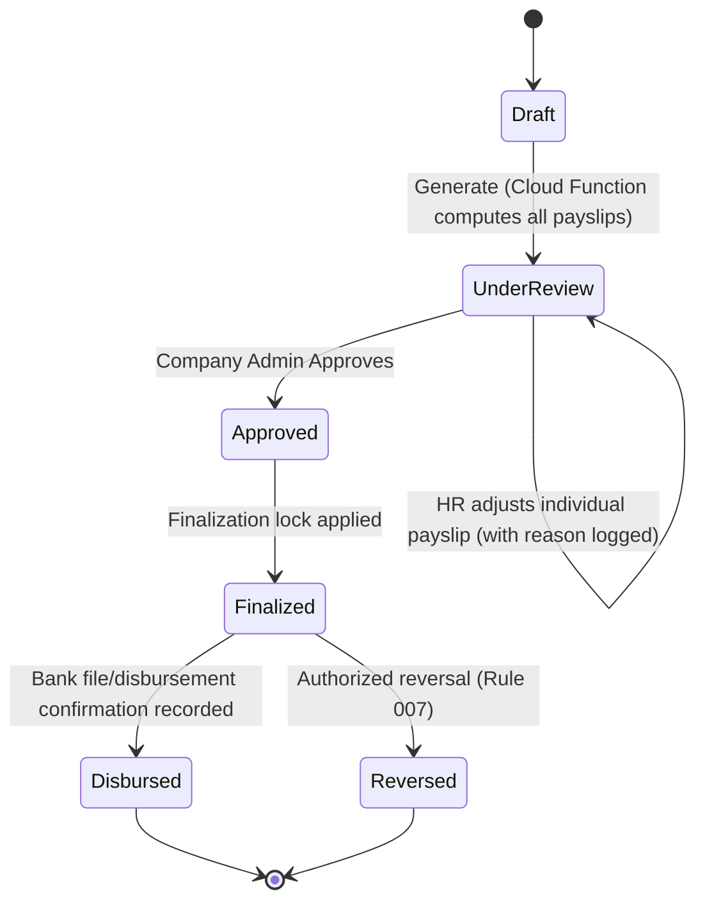
```mermaid
stateDiagram-v2
    [*] --> Draft
    Draft --> UnderReview: Generate (Cloud Function computes all payslips)
    UnderReview --> UnderReview: HR adjusts individual payslip (with reason logged)
    UnderReview --> Approved: Company Admin Approves
    Approved --> Finalized: Finalization lock applied
    Finalized --> Disbursed: Bank file/disbursement confirmation recorded
    Finalized --> Reversed: Authorized reversal (Rule 007)
    Disbursed --> [*]
    Reversed --> [*]
```

- **Rule:** Once `Finalized`, all constituent `attendanceRecords` for the period are marked `isPayrollLocked = true` (Cross-Module write, cross-referenced RULE-ATTENDANCE-006), and the payroll run itself becomes immutable except through the formal Reversal workflow.

**RULE-PAYROLL-006: Individual Payslip Adjustment During Review**
- **Statement:** While `UnderReview`, HR may adjust an individual payslip's figures (e.g., adding a one-time bonus, correcting a manually-identified discrepancy) — every adjustment is logged with before/after values and a mandatory reason, visible in an audit trail on that payslip.
- **Validation:** Adjustments beyond a configurable percentage threshold of the auto-computed gross pay require Company Admin co-sign-off before the run can proceed to `Approved`, preventing unchecked unilateral wage manipulation by a single HR user (a segregation-of-duties control, cross-referenced with Chapter 11.3 RBAC).

**RULE-PAYROLL-007: Reversal Workflow**
- **Statement:** A `Finalized`/`Disbursed` payroll run (or a single employee's payslip within it) can only be corrected via a `payrollReversals` request, requiring: a stated reason, Company Admin approval, and — upon approval — creates a compensating adjustment entry (not a deletion of history) alongside unlocking the specific affected `attendanceRecords` for correction (Cross-Module, cross-referenced RULE-ATTENDANCE-006's edge case) before a subsequent corrective payroll run processes the difference.
- **Rationale:** Preserves full audit history (never delete/overwrite a disbursed payroll record) while still allowing real-world correction of genuine errors — directly implementing the "Approved → Reversed" terminal-adjacent transition pattern from Chapter 10.6 of Project Rules.

**RULE-PAYROLL-008: Full & Final Settlement on Offboarding**
- **Statement:** When an employee's status becomes `TERMINATED`/`RESIGNED` (Employee module Rule 005), the next payroll run flags them for Full & Final settlement processing — computing pro-rated final wages, unused leave encashment (if policy allows, cross-referenced Leave module Rule 007), and gratuity (if `gratuityApplicable` and tenure threshold met, per Compliance module) as a distinct payslip category, ensuring offboarded employees are never silently dropped from a payroll cycle without proper settlement.

## 8.5 Payroll Run Workflow (End-to-End)

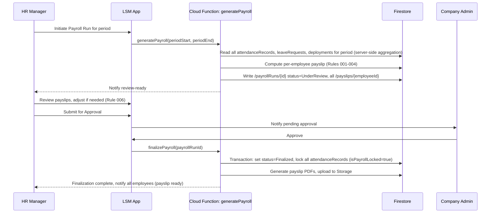
```mermaid
sequenceDiagram
    participant HR as HR Manager
    participant App as LSM App
    participant CF as Cloud Function: generatePayroll
    participant FS as Firestore
    participant Admin as Company Admin

    HR->>App: Initiate Payroll Run for period
    App->>CF: generatePayroll(periodStart, periodEnd)
    CF->>FS: Read all attendanceRecords, leaveRequests, deployments for period (server-side aggregation)
    CF->>FS: Compute per-employee payslip (Rules 001-004)
    CF->>FS: Write /payrollRuns/{id} status=UnderReview, all /payslips/{employeeId}
    CF-->>HR: Notify review-ready
    HR->>App: Review payslips, adjust if needed (Rule 006)
    HR->>App: Submit for Approval
    App->>Admin: Notify pending approval
    Admin->>App: Approve
    App->>CF: finalizePayroll(payrollRunId)
    CF->>FS: Transaction: set status=Finalized, lock all attendanceRecords (isPayrollLocked=true)
    CF->>FS: Generate payslip PDFs, upload to Storage
    CF-->>HR: Finalization complete, notify all employees (payslip ready)
```

## 8.6 Reports

- **Payroll Register:** Full company payroll summary for a period (gross, deductions, net, employer cost) — primary Finance/Accounts reference.
- **PF/ESI Statutory Report:** Formatted for regulatory filing purposes (cross-referenced Compliance module).
- **Payslip (individual):** PDF, accessible to the employee via ESS once finalized.
- **Payroll Cost vs. Billing Revenue Report:** Cross-module reconciliation feeding Analytics (Module 16) and Billing (Module 11) for margin analysis per site/client.

## 8.7 Notifications

- Payroll ready-for-review notification to HR.
- Payroll pending-approval notification to Company Admin.
- Payslip-ready notification to every employee upon finalization, with deep-link to their payslip in ESS.
- Reversal request notifications through the standard approval-notification pattern (Chapter 8.4 of Project Rules).

## 8.8 Offline Behavior

- Payroll generation/finalization requires connectivity (server-side Cloud Function operation, Rule 001) — not an offline-capable action, consistent with its designation as a desk-based, non-field operation.
- Employee payslip viewing (ESS) is cached (Room) once synced, allowing offline viewing of historical payslips.

## 8.9 What Happens If This Fails

If `generatePayroll` fails partway (e.g., a transient error during aggregation across a large employee base), the function is idempotent-safe to re-run (it does not create duplicate payslips — it overwrites the `UnderReview`-state draft payslips deterministically keyed by `employeeId`) and HR sees a clear "Generation incomplete — retry" state rather than a corrupted partial payroll run being presented as complete.

## 8.10 Testing Requirements

- Unit tests for gross/net pay computation across representative scenarios (full attendance, partial attendance with leave, overtime, minimum-wage-floor trigger).
- Unit tests for PF/ESI threshold edge cases (Rule 004).
- Integration tests confirming Finalization correctly locks all corresponding Attendance records atomically, with no record left unlocked due to a partial-failure scenario.
- Integration tests for the Reversal workflow confirming original disbursed data is never deleted, only compensated via a new adjustment entry.

---

---

# MODULE 9: INVENTORY

## 9.1 Why This Module Exists

Security agencies and facility management companies issue uniforms, equipment (batons, torches, radios), and consumables to deployed employees. Without digital tracking, stock reconciliation is manual, loss/theft goes undetected, and site handover/employee offboarding often fails to recover issued items. This module gives Vendor/Store Managers real-time stock visibility and full issuance traceability.

## 9.2 Who Uses This Module

| Role | Interaction |
|---|---|
| Vendor/Store Manager | Manages stock levels, records issuance/return, reconciles inventory |
| Operations Manager | Requests issuance for new deployments |
| HR Manager | Verifies return of items during offboarding |
| Employee | Views their own currently-issued items (ESS, read-only) |

## 9.3 Firestore Collections

```
/companies/{companyId}/inventoryItems/{itemId}
  ├── itemName, itemCode, category: enum { UNIFORM, EQUIPMENT, CONSUMABLE, STATIONERY }
  ├── unitOfMeasure, reorderThreshold
  ├── currentStock (aggregate across all warehouses/sites — maintained via transaction, Rule 001)
  └── /stockByLocation/{locationId}          — per-warehouse/site stock breakdown
       └── quantity

/inventoryTransactions/{transactionId}      — Pattern A, immutable ledger
  ├── companyId, itemId, itemName (denormalized)
  ├── transactionType: enum { STOCK_IN, ISSUANCE, RETURN, WRITE_OFF, TRANSFER }
  ├── quantity, locationId (source), destinationLocationId (nullable, for TRANSFER)
  ├── issuedToEmployeeId (nullable, populated for ISSUANCE/RETURN)
  ├── idempotencyKey (client-generated, Rule 002)
  ├── performedByUserId, performedAt
  └── notes, writeOffReason (nullable, populated for WRITE_OFF)

/employees/{employeeId}/issuedItems/{issuedItemId}   — denormalized current-holding view for quick ESS lookup
  ├── itemId, itemName, quantity, issuedAt, expectedReturnDate (nullable)
```

## 9.4 Business Rules

**RULE-INVENTORY-001: Stock Level Changes Are Always Transactional**
- **Statement:** Every `STOCK_IN`, `ISSUANCE`, `RETURN`, `WRITE_OFF`, or `TRANSFER` transaction is processed via a Firestore transaction that reads current `currentStock`/`stockByLocation.quantity`, validates sufficiency (for outbound movements), and updates atomically alongside creating the immutable `inventoryTransactions` ledger entry.
- **Rationale:** Directly implements Chapter 6.4's decision table entry for inventory stock decrement — concurrent issuance requests must never oversell stock.
- **Failure Behavior:** An issuance request exceeding available stock is rejected with "Insufficient stock: X available, Y requested" — never partially fulfilled silently.

**RULE-INVENTORY-002: Idempotent Issuance for Offline Retry Safety**
- **Statement:** Every inventory transaction includes a client-generated `idempotencyKey`; the transactional write checks for an existing transaction with the same key before applying the stock change, preventing a retried offline-queued write (WorkManager retry scenario, Chapter 9.5 of Project Rules) from double-decrementing stock.
- **Rationale:** Directly implements Chapter 10.7's idempotency standard, using the client-generated-key pattern specifically called out for inventory in that chapter.

**RULE-INVENTORY-003: Issuance Creates a Denormalized Current-Holding Record**
- **Statement:** Upon successful `ISSUANCE`, in addition to the immutable ledger entry, the `employees/{employeeId}/issuedItems/{issuedItemId}` denormalized record is created/updated (Batched Write alongside the ledger entry, since both are independent creates once the transaction has validated stock, per Chapter 6.4) — enabling fast "what does this employee currently hold" lookups without scanning the entire ledger.
- **Rule:** Upon `RETURN`, the corresponding `issuedItems` record is deleted (full return) or quantity-decremented (partial return) — the ledger retains the full RETURN transaction regardless, preserving history even though the denormalized "current holding" view is mutated.

**RULE-INVENTORY-004: Reorder Threshold Alerts**
- **Statement:** When `currentStock` falls below `reorderThreshold` for an item, a notification is triggered to the Vendor/Store Manager — evaluated as part of the same transaction that decrements stock (checked post-write, triggering the notification asynchronously rather than blocking the transaction itself).

**RULE-INVENTORY-005: Write-Off Requires Reason and Permission**
- **Statement:** A `WRITE_OFF` transaction (damaged/lost/unrecoverable item) requires a `writeOffReason` and is gated by a distinct `inventory.writeOff` permission (separate from general `inventory.issue`/`inventory.return`), since write-offs represent a financial loss requiring accountability.

**RULE-INVENTORY-006: Offboarding Return Verification**
- **Statement:** Cross-referenced with Employee module Rule 005 (offboarding cascade) — when an employee transitions to `TERMINATED`/`RESIGNED`, the system surfaces their outstanding `issuedItems` to HR as a required return-verification checklist before the offboarding process can be marked fully complete (though the employment status transition itself is not blocked by outstanding items, since HR may need to record the termination immediately for payroll purposes even while item recovery is pending — a soft checklist, not a hard gate, to avoid conflicting with Rule EMPLOYEE-004's Deployment-based hard gate).

## 9.5 Inventory Issuance Workflow

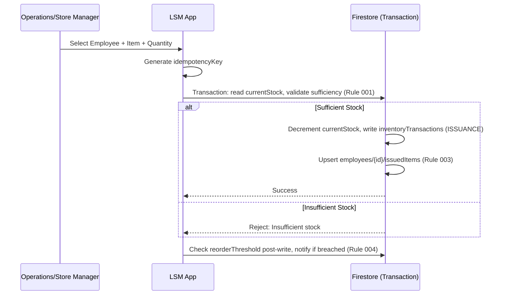
```mermaid
sequenceDiagram
    participant Ops as Operations/Store Manager
    participant App as LSM App
    participant FS as Firestore (Transaction)

    Ops->>App: Select Employee + Item + Quantity
    App->>App: Generate idempotencyKey
    App->>FS: Transaction: read currentStock, validate sufficiency (Rule 001)
    alt Sufficient Stock
        FS->>FS: Decrement currentStock, write inventoryTransactions (ISSUANCE)
        FS->>FS: Upsert employees/{id}/issuedItems (Rule 003)
        FS-->>App: Success
    else Insufficient Stock
        FS-->>App: Reject: Insufficient stock
    end
    App->>FS: Check reorderThreshold post-write, notify if breached (Rule 004)
```

## 9.6 Reports

- **Stock Ledger Report:** Full transaction history per item, per location, for audit/reconciliation.
- **Current Stock Report:** Real-time stock levels across all locations, with reorder alerts highlighted.
- **Employee Issuance Report:** Per-employee current and historical holdings — critical for offboarding reconciliation (Rule 006).
- **Write-Off Report:** All write-offs with reasons, for loss analysis and accountability review.

## 9.7 Notifications

- Reorder threshold breach alert to Store Manager (Rule 004).
- Item issued/returned confirmation to the employee (ESS visibility of their own holdings).
- Outstanding-item offboarding reminder to HR (Rule 006).

## 9.8 Offline Behavior

- Issuance/return transactions are offline-capable with the idempotency-key safeguard (Rule 002) ensuring safe retry, but the transactional stock-sufficiency check (Rule 001) is authoritative only once synced — an offline issuance is optimistically accepted client-side and reconciled server-side upon sync, with a rare over-issuance-due-to-concurrent-offline-actions edge case surfaced to the Store Manager for manual reconciliation (analogous to the Attendance module's geofence reconciliation pattern, Chapter 6.6.2).
- Current stock levels are cached (Room) for read visibility offline, with a clear "last synced at" indicator given the inherent staleness risk for a rapidly-changing figure.

## 9.9 Testing Requirements

- Concurrency tests confirming multiple simultaneous issuance requests against limited stock never oversell (transactional integrity, Rule 001).
- Idempotency tests confirming a retried transaction with the same `idempotencyKey` does not double-decrement stock (Rule 002).
- Unit tests for reorder threshold notification triggering logic.

---

---

# MODULE 10: ASSETS

## 10.1 Why This Module Exists

Assets differ from Inventory (Module 9) in a critical way: Inventory tracks *fungible, consumable, quantity-based* stock (uniforms, batteries, stationery), while Assets tracks *individually identifiable, high-value, long-lived* items — vehicles, CCTV equipment, laptops, radios, generators — each with its own serial number, maintenance history, and depreciation lifecycle. Conflating the two models would make neither work well: you don't "return 3 units of Vehicle #KA-01-AB-1234," you assign and reclaim *that specific* vehicle.

## 10.2 Who Uses This Module

| Role | Interaction |
|---|---|
| Vendor/Store Manager | Registers assets, tracks assignment/location, schedules maintenance |
| Operations Manager | Requests asset assignment for site/deployment needs |
| Company Admin | Oversight, approves high-value asset purchases/disposals |
| Employee/Supervisor | Views assets assigned to them or their site (ESS/Supervisor read access) |

## 10.3 Firestore Collections

```
/companies/{companyId}/assets/{assetId}
  ├── assetName, assetCategory: enum { VEHICLE, ELECTRONIC_EQUIPMENT, SECURITY_EQUIPMENT, FURNITURE, OTHER }
  ├── serialNumber/registrationNumber (unique within company)
  ├── purchaseDate, purchaseCost, currentBookValue (computed via depreciation, Rule 004)
  ├── depreciationMethod: enum { STRAIGHT_LINE, WRITTEN_DOWN_VALUE }, depreciationRatePercent, usefulLifeYears
  ├── condition: enum { NEW, GOOD, FAIR, POOR, DECOMMISSIONED }
  ├── currentAssignment: { assignedToType: enum { EMPLOYEE, SITE, WAREHOUSE }, assignedToId, assignedAt } (nullable if unassigned)
  ├── warrantyExpiryDate (nullable)
  ├── insurancePolicyNumber, insuranceExpiryDate (nullable — relevant for vehicles)
  ├── isActive: boolean
  └── /maintenanceLog/{logId}
       ├── maintenanceType: enum { SCHEDULED_SERVICE, REPAIR, INSPECTION }
       ├── performedAt, performedByVendorName, cost, nextDueDate
       └── notes, attachmentUrl (invoice/service report)

/assetAssignmentHistory/{historyId}         — Pattern A, immutable ledger
  ├── companyId, assetId, previousAssignment, newAssignment, changedByUserId, changedAt, reason
```

## 10.4 Business Rules

**RULE-ASSETS-001: Asset Registration Requires Unique Serial/Registration Number**
- **Statement:** `serialNumber`/`registrationNumber` must be unique within a company; duplicate registration is rejected at creation.
- **Rationale:** Prevents accidental duplicate asset records that would corrupt assignment tracking and depreciation reporting.

**RULE-ASSETS-002: Assignment Is Exclusive Per Asset**
- **Statement:** An asset can have only one `currentAssignment` at a time (unlike Inventory, which tracks quantities); reassigning an asset requires first clearing/transferring the existing assignment, recorded in `assetAssignmentHistory` for a full chain-of-custody trail.
- **Validation:** The assignment change is a single atomic write (transaction, since it reads the current assignment state before overwriting) — never allowed to silently create two simultaneous assignments for the same asset.

**RULE-ASSETS-003: Assignment to Employee Requires Active Employment Status**
- **Statement:** An asset can only be assigned to an employee with `employmentStatus = ACTIVE` (Cross-Module Consistency with the Employee module, Chapter 10.8).
- **Cascading Rule:** Cross-referenced with Employee Rule 005 (offboarding cascade) — upon an employee's `TERMINATED`/`RESIGNED` transition, any assets currently assigned to them are flagged for mandatory recovery verification before the offboarding checklist is considered complete, mirroring Inventory's Rule 006 pattern but treated as a harder gate here given assets' higher individual value (Company-configurable: some companies may require asset recovery confirmation before final settlement payroll processing, cross-referenced Payroll Rule 008).

**RULE-ASSETS-004: Depreciation Calculation**
- **Statement:** `currentBookValue` is recomputed on a scheduled (monthly) Cloud Function basis using the configured `depreciationMethod`:
  - **Straight-Line:** `currentBookValue = purchaseCost - (purchaseCost / usefulLifeYears) * yearsElapsed`
  - **Written-Down-Value:** `currentBookValue = purchaseCost * (1 - depreciationRatePercent)^yearsElapsed`
  - Both methods floor at a configurable residual value (never below zero or below a company-set minimum book value), and the computation correctly accounts for partial-year purchases (pro-rated first-year depreciation based on `purchaseDate`).
- **Rationale:** Feeds financial/accounting reporting and informs disposal/write-off decisions; while LSM is not a full accounting system, depreciation-aware asset value is a standard expectation for enterprise asset tracking in industrial/facility management contexts.

**RULE-ASSETS-005: Maintenance Scheduling and Alerts**
- **Statement:** A `maintenanceLog` entry with a `nextDueDate` triggers a scheduled reminder notification to the Store Manager 7 days before due, and an overdue escalation if unaddressed past the due date — particularly critical for vehicles (statutory inspection/insurance renewal) and security equipment (calibration requirements).

**RULE-ASSETS-006: Decommissioning Workflow**
- **Statement:** Transitioning an asset's `condition` to `DECOMMISSIONED` requires: (a) no active assignment (must be unassigned first, Rule 002), (b) a stated reason, and (c) permission gating (`assets.decommission`, distinct from general `assets.manage`) given the financial write-off implications — mirroring Inventory's write-off permission segregation (Rule INVENTORY-005).

## 10.5 Asset Assignment Workflow

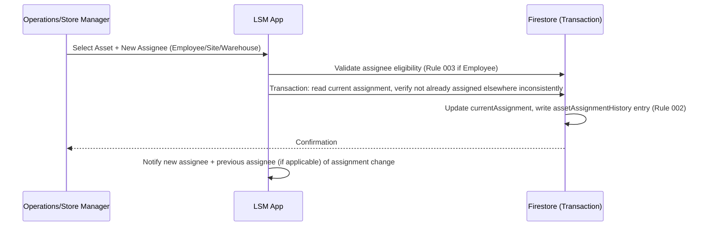
```mermaid
sequenceDiagram
    participant Ops as Operations/Store Manager
    participant App as LSM App
    participant FS as Firestore (Transaction)

    Ops->>App: Select Asset + New Assignee (Employee/Site/Warehouse)
    App->>FS: Validate assignee eligibility (Rule 003 if Employee)
    App->>FS: Transaction: read current assignment, verify not already assigned elsewhere inconsistently
    FS->>FS: Update currentAssignment, write assetAssignmentHistory entry (Rule 002)
    FS-->>Ops: Confirmation
    App->>App: Notify new assignee + previous assignee (if applicable) of assignment change
```

## 10.6 Reports

- **Asset Register:** Full company asset list with current assignment, condition, and book value.
- **Depreciation Schedule Report:** Financial-reporting-oriented view of asset value over time.
- **Maintenance Due Report:** Upcoming/overdue maintenance and statutory renewals (insurance, inspection).
- **Asset Utilization Report:** Assignment history/turnover per asset, identifying underutilized or frequently-reassigned assets.

## 10.7 Notifications

- Maintenance due/overdue alerts (Rule 005).
- Warranty/insurance expiry reminders.
- Asset assignment/reassignment notification to affected employees.
- Offboarding asset-recovery reminder to HR (Rule 003 cascade).

## 10.8 Offline Behavior

- Asset register and "what's assigned to me" views are cached (Room) for offline browsing.
- Assignment changes require connectivity (desk-based Operations activity, consistent with the risk-based approach applied to similarly infrequent, high-stakes administrative operations across the platform).

## 10.9 Edge Cases

- An asset physically lost/stolen (not simply decommissioned) is handled via a distinct `condition` transition path (`DECOMMISSIONED` with `reason = "Lost/Stolen"`) that additionally triggers an insurance-claim-relevant flag and, where the company's Compliance policy requires, generates an incident log entry cross-referenced with a future Incident Management capability (noted as a natural extension point, not currently a separate module in this specification).

## 10.10 Testing Requirements

- Unit tests for both depreciation methods across full-year and partial-first-year purchase scenarios.
- Transaction tests confirming exclusive assignment (Rule 002) — no race condition can result in an asset appearing assigned to two entities simultaneously.
- Integration tests for the offboarding-triggered asset recovery flag cascade.

---

---

# MODULE 11: BILLING

## 11.1 Why This Module Exists

Billing converts verified Deployment and Attendance data into client invoices — the revenue-generation core of the platform for its primary users (security agencies, facility management companies operating on a B2B services model). Billing errors directly cause client disputes, revenue leakage (under-billing for actual hours deployed), or client relationship damage (over-billing). Billing must never diverge from what Attendance/Deployment actually recorded — it is a derived, auditable output, not an independently-entered figure.

## 11.2 Who Uses This Module

| Role | Interaction |
|---|---|
| Billing/Accounts Team | Generates invoices, manages billing cycles, tracks receivables |
| Company Admin | Approves invoices before dispatch, oversight |
| Client | Views/approves their own invoices (read + approval action only) |
| Operations Manager | Provides deployment context for billing disputes |

## 11.3 Firestore Collections

```
/companies/{companyId}/billingConfig
  ├── invoiceNumberPrefix, invoiceNumberSequence (auto-increment, company-scoped)
  ├── defaultPaymentTermsDays
  ├── gstRatePercent
  └── invoiceTemplateId

/invoices/{invoiceId}                       — Pattern A
  ├── companyId, clientId, clientName (denormalized)
  ├── invoiceNumber (human-readable, sequential, immutable once generated)
  ├── billingPeriodStart, billingPeriodEnd
  ├── status: enum { DRAFT, PENDING_CLIENT_APPROVAL, APPROVED, DISPUTED, PAID, OVERDUE, CANCELLED }
  ├── lineItems: array of { siteId, siteName, deploymentId, employeeCount, totalShifts/Hours, rate, amount }
  ├── subtotal, gstAmount, totalAmount
  ├── dueDate
  ├── paymentReceivedAmount, paymentReceivedDate (nullable, partial payments tracked)
  ├── disputeReason (nullable), disputeRaisedAt, disputeResolvedAt
  ├── invoicePdfUrl
  └── generatedByUserId, generatedAt, approvedByUserId, approvedAt

/invoices/{invoiceId}/paymentHistory/{paymentId}
  ├── amount, paymentDate, paymentMethod, referenceNumber, recordedByUserId
```

## 11.4 Business Rules

**RULE-BILLING-001: Invoice Line Items Sourced Strictly From Deployment and Attendance**
- **Statement:** Every invoice `lineItem` is computed from actual `deployments` and their associated `attendanceRecords` (verified shifts/hours) for the billing period — never manually entered as a free-form amount for standard recurring billing, ensuring the invoice is always substantiated by underlying operational data (Cross-Module Consistency, Chapter 10.8).
- **Rationale:** This is the core anti-billing-fraud and dispute-prevention mechanism — a client challenging an invoice can be shown the exact attendance records underlying every line item.
- **Edge Case:** One-time/ad-hoc charges (e.g., a special event deployment surcharge) are supported as a distinct `lineItem` type explicitly flagged as `MANUAL_ADJUSTMENT` with a mandatory justification note, kept visually and structurally distinct from the auto-computed deployment-based line items.

**RULE-BILLING-002: Billing Rate Sourced From Deployment's Effective-Dated Rate**
- **Statement:** Each line item's `rate` is pulled from the corresponding Deployment's `billingRate` as of the specific date being billed, respecting Deployment Rule 005's effective-dating (a rate change mid-period correctly splits into two line items, one at the old rate and one at the new rate, for the respective date ranges).

**RULE-BILLING-003: Invoice Number Immutability and Sequential Integrity**
- **Statement:** `invoiceNumber` is generated via a transactional increment of `invoiceNumberSequence` at invoice creation time and is never reused, even if the invoice is later `CANCELLED` — preserving sequential integrity for statutory/audit purposes (a gap in invoice numbers due to cancellation is expected and compliant; a duplicate or reused number is not).

**RULE-BILLING-004: Invoice Approval Workflow**

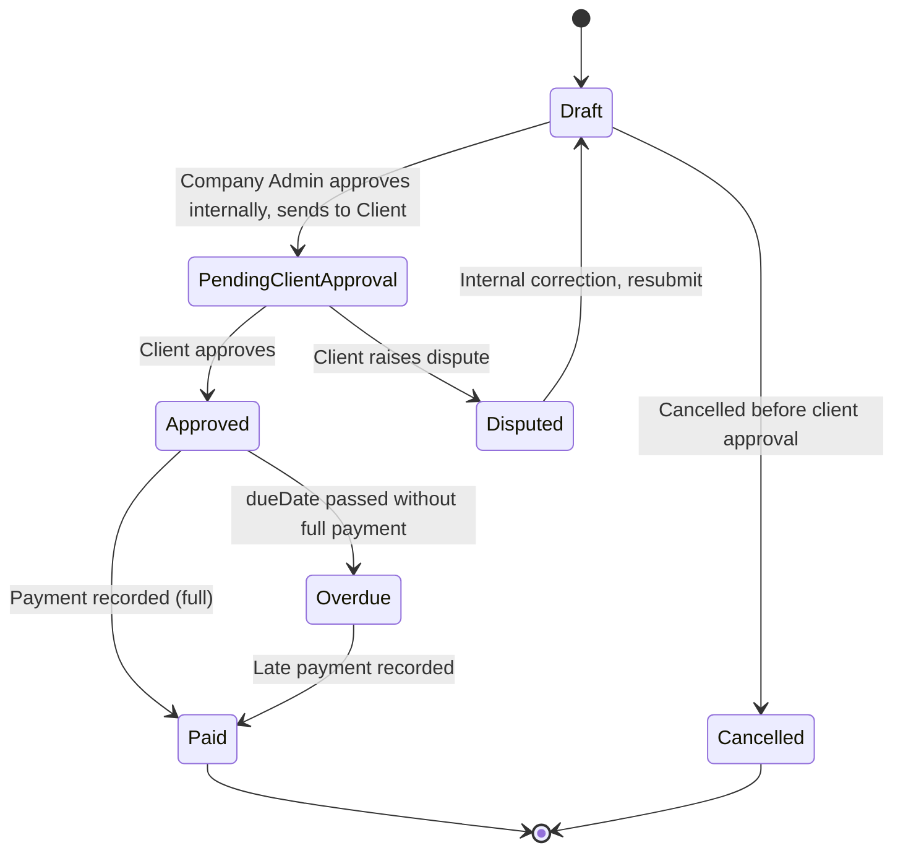
```mermaid
stateDiagram-v2
    [*] --> Draft
    Draft --> PendingClientApproval: Company Admin approves internally, sends to Client
    PendingClientApproval --> Approved: Client approves
    PendingClientApproval --> Disputed: Client raises dispute
    Disputed --> Draft: Internal correction, resubmit
    Approved --> Paid: Payment recorded (full)
    Approved --> Overdue: dueDate passed without full payment
    Overdue --> Paid: Late payment recorded
    Draft --> Cancelled: Cancelled before client approval
    Paid --> [*]
    Cancelled --> [*]
```

- **Rule:** A `Disputed` invoice requires HR/Operations input (querying the underlying Attendance/Deployment records referenced in Rule 001) to resolve before resubmission — the dispute resolution process itself references the immutable source data, never simply re-negotiating a number.

**RULE-BILLING-005: Partial Payment Tracking**
- **Statement:** `paymentHistory` entries can be added incrementally; `status` transitions to `Paid` only when cumulative `paymentReceivedAmount` across all `paymentHistory` entries meets or exceeds `totalAmount` — partial payments keep the invoice in `Approved`/`Overdue` status with a visibly tracked outstanding balance.

**RULE-BILLING-006: Client Read/Approval Scope**
- **Statement:** A Client-role user sees only invoices where `clientId` matches their linked identity, can view full line-item detail (since this is their own billing data, unlike the more restricted Deployment read-scope in Rule DEPLOYMENT-007), and can perform the `Approve`/`Dispute` action but never directly edit an invoice's figures.

**RULE-BILLING-007: Overdue Escalation**
- **Statement:** A scheduled Cloud Function transitions `Approved` invoices past their `dueDate` (with insufficient cumulative payment) to `Overdue` status and triggers escalating reminder notifications (at due date, 7 days overdue, 30 days overdue) to both the Billing Team and, per company policy configuration, directly to the Client.

## 11.5 Invoice Generation Workflow

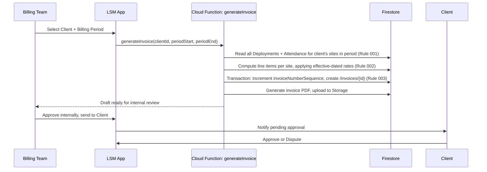
```mermaid
sequenceDiagram
    participant Bill as Billing Team
    participant App as LSM App
    participant CF as Cloud Function: generateInvoice
    participant FS as Firestore
    participant Client as Client

    Bill->>App: Select Client + Billing Period
    App->>CF: generateInvoice(clientId, periodStart, periodEnd)
    CF->>FS: Read all Deployments + Attendance for client's sites in period (Rule 001)
    CF->>FS: Compute line items per site, applying effective-dated rates (Rule 002)
    CF->>FS: Transaction: increment invoiceNumberSequence, create /invoices/{id} (Rule 003)
    CF->>FS: Generate invoice PDF, upload to Storage
    CF-->>Bill: Draft ready for internal review
    Bill->>App: Approve internally, send to Client
    App->>Client: Notify pending approval
    Client->>App: Approve or Dispute
```

## 11.6 Reports

- **Invoice Register:** All invoices with status, aging (days overdue), and outstanding balance — primary Accounts Receivable tool.
- **Client Billing History:** Per-client invoice trend, useful for renewal/pricing negotiation.
- **Dispute Log Report:** All disputed invoices with resolution timeline, feeding process-improvement analysis.
- **Revenue vs. Payroll Cost Report:** Cross-referenced with Payroll module (8.6) for per-site/per-client margin analysis.

## 11.7 Notifications

- Invoice pending-client-approval notification.
- Dispute raised notification to Billing Team/Operations.
- Overdue escalation reminders (Rule 007).
- Payment received confirmation to internal Billing Team.

## 11.8 Offline Behavior

- Invoice generation requires connectivity (server-side aggregation, analogous to Payroll's Rule 001) — a desk-based Billing Team activity.
- Invoice viewing (by internal team or Client) is cached (Room) for offline reference of previously-synced invoices.

## 11.9 Testing Requirements

- Unit tests for line-item computation correctness across effective-dated rate change scenarios (Rule 002 edge case — mid-period rate change splitting into two line items).
- Transaction tests confirming invoice number sequence never produces a duplicate under concurrent invoice-generation requests (Rule 003).
- Integration tests for the overdue-escalation scheduled function across the three escalation tiers.
- Unit tests confirming a Client-role query never surfaces another client's invoice (cross-tenant + cross-client isolation, Rule 006).

---

---

# MODULE 12: CLIENT

## 12.1 Why This Module Exists

While Modules 7 (Deployment) and 11 (Billing) reference `clientId` extensively, this module defines the Client *entity itself* — the actual business/organization that a company (e.g., a security agency) provides services to. This is distinct from the Client *user role* discussed in prior modules (a Client-role user is a person who logs in on behalf of a Client entity). Without a well-modeled Client entity, contract terms, site relationships, and billing configuration have no home.

## 12.2 Who Uses This Module

| Role | Interaction |
|---|---|
| Operations Manager | Creates/manages client profiles, links sites to clients |
| Company Admin | Approves new client onboarding, contract terms oversight |
| Billing Team | Reads client billing configuration for invoice generation |
| Client (user) | Views/edits their own organization's contact details only |

## 12.3 Firestore Collections

```
/clients/{clientId}                         — Pattern A
  ├── companyId, clientName, clientType: enum { CORPORATE, GOVERNMENT, INDUSTRIAL, RESIDENTIAL, INSTITUTIONAL }
  ├── registeredAddress, gstNumber
  ├── contractStartDate, contractEndDate (nullable — ongoing)
  ├── contractStatus: enum { ACTIVE, EXPIRED, TERMINATED, UNDER_NEGOTIATION }
  ├── defaultBillingRateType, defaultBillingRate (inherited by new Deployments unless overridden per-site)
  ├── primaryContactName, primaryContactPhone, primaryContactEmail
  ├── /contacts/{contactId}                 — additional client-side contacts (site managers, finance contacts)
  ├── /sites/{siteId}                       — reference list of sites belonging to this client (cross-referenced with Company's site subcollection)
  └── /contractDocuments/{documentId}       — uploaded contract PDFs, SLAs, amendments
```

## 12.4 Business Rules

**RULE-CLIENT-001: Client Creation and Approval**
- **Statement:** New Client creation is initiated by Operations but requires Company Admin approval before the client becomes usable for Deployment assignment — preventing unauthorized commercial commitments from being operationalized without proper sign-off.
- **Trigger:** `CreateClientUseCase` creates the record in an `UNDER_NEGOTIATION`-equivalent pending state; `contractStatus = ACTIVE` transition requires explicit Company Admin action.

**RULE-CLIENT-002: Contract Expiry Monitoring**
- **Statement:** A scheduled Cloud Function checks `contractEndDate` across all clients daily; contracts approaching expiry (default: 60/30/7 days prior, company-configurable) trigger escalating renewal-reminder notifications to Company Admin and Operations Manager.
- **Rationale:** Prevents the common real-world failure of a contract silently lapsing while deployments/billing continue as if nothing changed — directly protecting the company from unbilled or non-compliant service continuation.

**RULE-CLIENT-003: Contract Expiry Does Not Auto-Terminate Active Deployments**
- **Statement:** When `contractEndDate` passes without renewal, `contractStatus` transitions to `EXPIRED`, but existing Deployments are **not** automatically cancelled — this is a deliberate business decision requiring explicit human action (Operations Manager must review and either renew the contract or formally wind down deployments), since automatic mass-cancellation of active deployments based solely on a date field carries significant operational risk (e.g., a renewal in progress but not yet updated in the system).
- **Failure Behavior:** An `EXPIRED` client's dashboard surfaces a prominent, unmissable banner to Operations: "Contract expired — X active deployments require review" — never a silent status change buried in a settings page.

**RULE-CLIENT-004: Client-Site Linkage**
- **Statement:** A Site (Company module's `/sites/{siteId}` subcollection) references its owning `clientId`; a single Client may have multiple Sites (e.g., a corporate client with 5 office locations, each requiring separate security deployment), and all Deployment/Billing logic operates at the Site level while rolling up to the Client level for consolidated reporting/invoicing.

**RULE-CLIENT-005: Default Billing Rate Inheritance**
- **Statement:** `defaultBillingRateType`/`defaultBillingRate` set at the Client level pre-populate new Deployment creation forms for that client's sites (a progressive-disclosure/sensible-default pattern, Chapter 8.7 of Project Rules) but can be overridden per-Deployment — the Client-level default is a template, not an enforced constraint.

**RULE-CLIENT-006: Client User Account Provisioning Is Scoped and Restricted**
- **Statement:** A Client-role user account is provisioned by the Company (never self-registered) and is explicitly linked to exactly one `clientId` via custom claim extension (`clientId` claim alongside the standard `companyId`/`role` claims) — enabling the Security Rule pattern used throughout Modules 7 and 11 (`request.auth.token.clientId == resource.data.clientId`) to scope Client visibility correctly (Cross-reference Chapter 2.4 defense-in-depth model, extended with an additional claim dimension specific to the Client role).

## 12.5 Client Onboarding Workflow

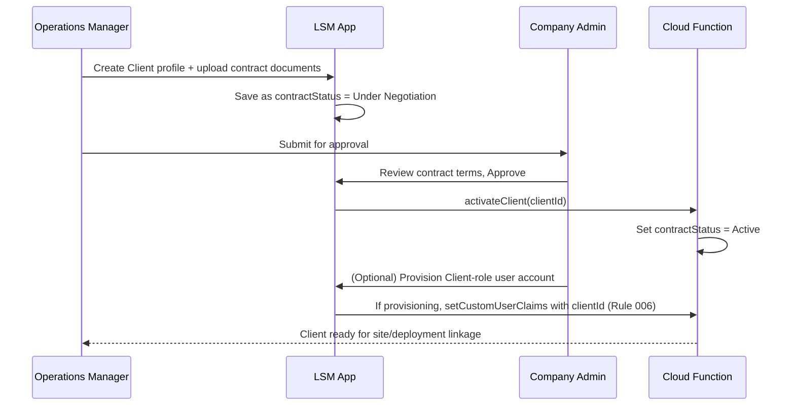
```mermaid
sequenceDiagram
    participant Ops as Operations Manager
    participant App as LSM App
    participant Admin as Company Admin
    participant CF as Cloud Function

    Ops->>App: Create Client profile + upload contract documents
    App->>App: Save as contractStatus = Under Negotiation
    Ops->>Admin: Submit for approval
    Admin->>App: Review contract terms, Approve
    App->>CF: activateClient(clientId)
    CF->>CF: Set contractStatus = Active
    Admin->>App: (Optional) Provision Client-role user account
    App->>CF: If provisioning, setCustomUserClaims with clientId (Rule 006)
    CF-->>Ops: Client ready for site/deployment linkage
```

## 12.6 Reports

- **Client Portfolio Report:** All clients with contract status, expiry timeline, total active deployments/sites, and revenue contribution.
- **Contract Expiry Forecast:** Rolling 90-day view of upcoming renewals (Rule 002 cross-reference), a proactive business-development tool.
- **Client Profitability Report:** Cross-referenced with Billing (Module 11) and Payroll (Module 8) for per-client margin analysis.

## 12.7 Notifications

- Contract expiry escalation reminders (Rule 002).
- New client approval-pending notification to Company Admin.
- Contract expired banner/alert (Rule 003).

## 12.8 Offline Behavior

- Client profile and contract detail views are cached (Room) for offline reference by Operations Managers in the field.
- Client creation/contract-approval workflow requires connectivity, consistent with its desk-based, low-frequency, high-stakes nature.

## 12.9 Testing Requirements

- Unit tests confirming Deployment creation is blocked for a client not yet `ACTIVE` (Rule 001 gate).
- Integration tests for the contract-expiry scheduled notification function across all configured escalation windows.
- Security Rule tests confirming a Client-role user's `clientId` claim correctly restricts visibility to only their own client's Deployments/Invoices, and that no cross-client leakage is possible even within the same parent company.

---

---

# MODULE 13: VENDOR

## 13.1 Why This Module Exists

Where Module 12 (Client) represents organizations LSM's user company provides services *to*, Vendor represents organizations that provide goods/services *to* the company — uniform suppliers, equipment manufacturers, maintenance contractors, background-verification agencies. This module manages the supply side of operations: purchase orders for Inventory/Asset procurement, vendor payment tracking, and vendor performance history.

## 13.2 Who Uses This Module

| Role | Interaction |
|---|---|
| Vendor/Store Manager | Manages vendor relationships, raises purchase orders, records goods receipt |
| Company Admin | Approves high-value purchase orders, vendor onboarding |
| Accounts Team | Tracks vendor payments/dues |

## 13.3 Firestore Collections

```
/vendors/{vendorId}                         — Pattern A
  ├── companyId, vendorName, vendorCategory: enum { UNIFORM_SUPPLIER, EQUIPMENT_SUPPLIER,
  │                                                  MAINTENANCE_CONTRACTOR, VERIFICATION_AGENCY, OTHER }
  ├── registeredAddress, gstNumber, panNumber
  ├── contactName, contactPhone, contactEmail
  ├── paymentTermsDays
  ├── isActive: boolean
  ├── rating (computed average from performance reviews, Rule 004)
  └── /performanceReviews/{reviewId}
       ├── reviewedByUserId, rating (1-5), comments, reviewedAt

/purchaseOrders/{poId}                      — Pattern A
  ├── companyId, vendorId, vendorName (denormalized)
  ├── poNumber (sequential, immutable, analogous to Billing's invoiceNumber pattern)
  ├── status: enum { DRAFT, PENDING_APPROVAL, APPROVED, PARTIALLY_RECEIVED, FULLY_RECEIVED, CANCELLED }
  ├── lineItems: array of { itemId/assetCategory, description, quantity, unitPrice, amount }
  ├── totalAmount
  ├── expectedDeliveryDate
  ├── raisedByUserId, approvedByUserId
  └── /goodsReceipt/{receiptId}
       ├── receivedQuantityPerLineItem (map), receivedAt, receivedByUserId, qualityCheckStatus

/vendorPayments/{paymentId}
  ├── vendorId, poId (nullable — some payments are non-PO, e.g., maintenance service invoices)
  ├── amount, paymentDate, paymentMethod, referenceNumber
  └── recordedByUserId
```

## 13.4 Business Rules

**RULE-VENDOR-001: Purchase Order Approval Threshold**
- **Statement:** Purchase orders below a company-configured amount threshold may be auto-approved upon creation by a user holding `vendor.createPO` permission; orders above the threshold require explicit Company Admin approval before transitioning from `DRAFT`/`PENDING_APPROVAL` to `APPROVED`.
- **Rationale:** Balances operational efficiency (routine low-value restocking doesn't need executive sign-off) against financial control (large procurement commitments require oversight) — a segregation-of-duties pattern analogous to Payroll Rule 006.

**RULE-VENDOR-002: Goods Receipt Triggers Inventory/Asset Update**
- **Statement:** Recording a `goodsReceipt` against a Purchase Order automatically creates a corresponding `STOCK_IN` transaction in the Inventory module (Module 9, Rule 001) for consumable line items, or a new Asset registration entry (Module 10) for individually-tracked equipment line items — the receipt is the single trigger point connecting procurement to the operational stock/asset systems, ensuring no manual double-entry and no possibility of stock being "received" on paper without a corresponding system-of-record update.
- **Validation:** `receivedQuantityPerLineItem` cannot exceed the ordered `quantity` for that line item without an explicit over-receipt override flag (requiring Store Manager acknowledgment), preventing silent over-recording.

**RULE-VENDOR-003: Partial Receipt Handling**
- **Statement:** A Purchase Order can be received in multiple partial shipments; `status` transitions to `PARTIALLY_RECEIVED` after any receipt where cumulative received quantity is less than ordered quantity across any line item, and to `FULLY_RECEIVED` only once all line items are fully received.

**RULE-VENDOR-004: Vendor Performance Rating**
- **Statement:** Following each `FULLY_RECEIVED` Purchase Order (or on a periodic basis for ongoing service contracts like maintenance), an authorized user may submit a `performanceReviews` entry; `rating` on the vendor document is a rolling computed average, informing future vendor-selection decisions.
- **Rationale:** Encodes real operational knowledge (this vendor consistently delivers late / this vendor's uniform quality is poor) into the system rather than relying on individual staff memory, directly supporting better procurement decisions over time.

**RULE-VENDOR-005: PO Number Sequential Integrity**
- **Statement:** `poNumber` follows the same transactional sequential-increment pattern as Billing's `invoiceNumber` (Rule BILLING-003) — generated atomically, never reused even upon cancellation.

**RULE-VENDOR-006: Vendor Payment Tracking Is Independent of PO Status**
- **Statement:** `vendorPayments` can be recorded against a PO regardless of its receipt status (e.g., an advance payment made before goods receipt is common in procurement) — payment tracking and goods-receipt tracking are modeled as independent, cross-referenced processes rather than a single conflated state, reflecting real-world procurement practice where payment terms and delivery terms often don't align 1:1.

## 13.5 Purchase Order Workflow

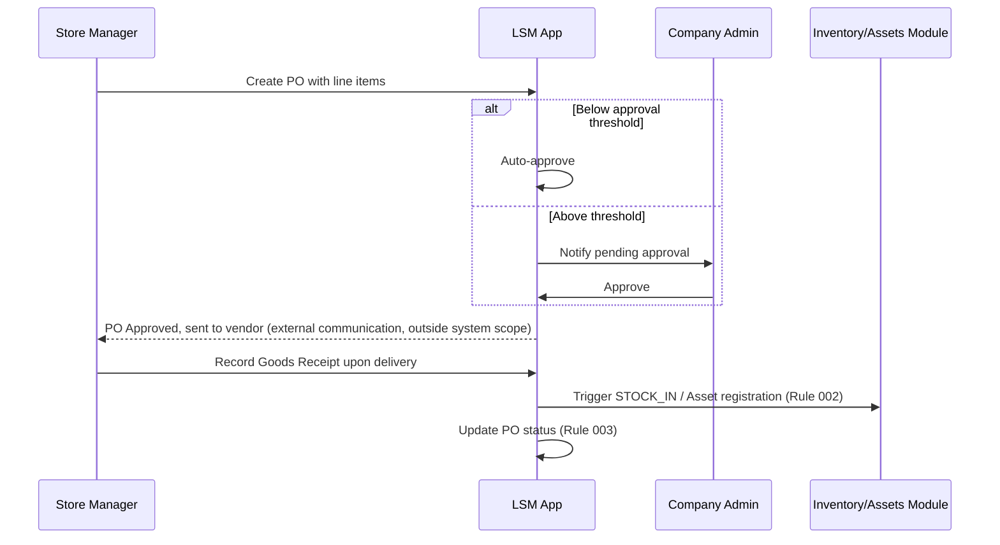
```mermaid
sequenceDiagram
    participant Store as Store Manager
    participant App as LSM App
    participant Admin as Company Admin
    participant Inv as Inventory/Assets Module

    Store->>App: Create PO with line items
    alt Below approval threshold
        App->>App: Auto-approve
    else Above threshold
        App->>Admin: Notify pending approval
        Admin->>App: Approve
    end
    App-->>Store: PO Approved, sent to vendor (external communication, outside system scope)
    Store->>App: Record Goods Receipt upon delivery
    App->>Inv: Trigger STOCK_IN / Asset registration (Rule 002)
    App->>App: Update PO status (Rule 003)
```

## 13.6 Reports

- **Purchase Order Register:** All POs with status, vendor, value, and receipt progress.
- **Vendor Performance Report:** Rating trends, on-time delivery rate, quality-check pass rate per vendor.
- **Vendor Payment Due Report:** Outstanding payables per vendor, cross-referenced with `paymentTermsDays` for aging analysis.
- **Procurement Spend Analysis:** Category-wise/vendor-wise spend trends (feeds Analytics module).

## 13.7 Notifications

- PO pending-approval notification to Company Admin (Rule 001).
- Goods receipt confirmation and any over-receipt-override alert.
- Payment due reminder to Accounts Team based on `paymentTermsDays`.

## 13.8 Offline Behavior

- Vendor and PO registers are cached (Room) for offline reference.
- Goods receipt recording at a warehouse location (which may have poor connectivity) is offline-capable with an idempotency-key safeguard analogous to Inventory Rule 002, ensuring a retried offline receipt-confirmation does not double-trigger the Inventory `STOCK_IN` cascade (Rule 002 here).

## 13.9 Testing Requirements

- Unit tests confirming goods receipt correctly triggers the appropriate downstream module (Inventory `STOCK_IN` vs. Asset registration) based on line item category.
- Unit tests for over-receipt validation and override flag behavior.
- Transaction/idempotency tests for the offline goods-receipt-to-stock-cascade path, mirroring Inventory Module 9's testing pattern.

---

---

# MODULE 14: ESS (EMPLOYEE SELF SERVICE)

## 14.1 Why This Module Exists

ESS is not a new data domain — it is the consolidated, employee-facing surface that aggregates read/write access an employee is entitled to across Attendance, Leave, Payroll, Inventory, Assets, and profile data, into a single coherent app experience. Without a dedicated ESS specification, employee-facing permission scoping would be scattered and inconsistent across modules. This module also introduces genuinely new capabilities specific to the employee experience: Grievance/Helpdesk and Announcements.

## 14.2 Who Uses This Module

| Role | Interaction |
|---|---|
| Employee | Primary and sole user of the ESS app surface |
| HR Manager | Responds to grievances raised via ESS, publishes announcements |
| Supervisor | May also access a limited ESS-style view for their own personal record (since Supervisors are also employees) |

## 14.3 Firestore Collections (New to This Module)

```
/grievances/{grievanceId}                   — Pattern A
  ├── companyId, employeeId, category: enum { PAYROLL_DISPUTE, HARASSMENT, WORKPLACE_SAFETY,
  │                                            FACILITY_ISSUE, INTERPERSONAL, OTHER }
  ├── description, attachmentUrls (array)
  ├── isAnonymous: boolean (special handling, Rule 003)
  ├── status: enum { SUBMITTED, UNDER_REVIEW, RESOLVED, ESCALATED, CLOSED }
  ├── assignedToUserId (HR handling the case)
  ├── resolutionNotes, resolvedAt
  └── /timeline/{eventId}                   — status change history with timestamps and actor (unless anonymous, Rule 003)

/companies/{companyId}/announcements/{announcementId}
  ├── title, body, attachmentUrl (nullable)
  ├── targetAudience: enum { ALL_EMPLOYEES, SPECIFIC_SITES, SPECIFIC_DEPARTMENTS }
  ├── targetSiteIds/targetDepartments (arrays, populated per targetAudience)
  ├── publishedByUserId, publishedAt, expiryDate (nullable)
  └── acknowledgementRequired: boolean

/companies/{companyId}/announcements/{announcementId}/acknowledgements/{employeeId}
  ├── acknowledgedAt
```

## 14.4 Business Rules

**RULE-ESS-001: ESS Read/Write Scope Is Strictly Self-Referential**
- **Statement:** Every ESS query is implicitly scoped to `employeeId == currentUser's linked employeeId` — enforced via Security Rules checking `request.auth.uid`'s corresponding employee link, never allowing an ESS user to query another employee's Attendance, Leave, Payslip, or Issued Items records, regardless of any client-side parameter manipulation attempt.
- **Rationale:** This is the ESS-specific instantiation of the "never trust the client" principle (Chapter 11.2 of Project Rules) — an employee's own device is the least-trusted client in the entire system, given field deployment conditions and device-sharing risk.

**RULE-ESS-002: Editable Profile Fields Are a Whitelist**
- **Statement:** An employee may edit only a specific whitelist of their own Employee record fields via ESS: `currentAddress`, `emergencyContactName`, `emergencyContactNumber`, `alternateContactNumber`, and `profilePhotoUrl`. All other fields (`employmentStatus`, `designation`, `bankAccountNumber`, `panNumber`, etc.) are read-only from ESS, requiring HR-mediated change through the Employees module (Module 3) — enforced by Security Rules explicitly listing permitted field paths for self-update, rejecting any write attempting to modify a non-whitelisted field even if bundled alongside a legitimate whitelisted-field change.
- **Rationale:** Prevents an employee from, for instance, self-editing their own bank account number without HR verification — a direct fraud-prevention control.

**RULE-ESS-003: Anonymous Grievance Handling**
- **Statement:** When `isAnonymous = true`, the `employeeId` field is still stored (for legitimate follow-up/resolution purposes and to prevent abuse of the anonymous channel) but is access-restricted to only the specifically `assignedToUserId` HR handler, never visible in general grievance list views to other HR staff or in the `/timeline` subcollection's actor attribution (which shows "Anonymous" instead of a name for all timeline entries authored by the submitting employee).
- **Rationale:** Balances genuine whistleblower/harassment-reporting protection (Chapter 1.2's real-world workforce concerns) against the practical need to follow up and prevent anonymous-channel abuse — a documented, deliberate design tension resolved via restricted-visibility rather than true anonymity or than no anonymity at all.

**RULE-ESS-004: Grievance Escalation Path**
- **Statement:** A grievance not addressed (no status change from `SUBMITTED`) within a configurable SLA window (default 3 business days) automatically escalates — `status` transitions to `ESCALATED` and a notification is sent to the Company Admin, ensuring HR cannot indefinitely ignore a submitted grievance.
- **Edge Case:** `HARASSMENT` category grievances have a shorter default SLA (24 hours) and escalate directly to Company Admin (bypassing standard HR queue visibility delay) given the elevated sensitivity and urgency, reflecting real workplace-safety priorities.

**RULE-ESS-005: Announcement Targeting and Acknowledgement**
- **Statement:** Announcements are delivered only to employees matching `targetAudience` criteria (evaluated against the employee's current site/department assignment at publish time — not retroactively updated if the employee later transfers, since the announcement was relevant to their assignment at the time it mattered). If `acknowledgementRequired = true`, the employee's ESS home screen surfaces the announcement as a non-dismissible-until-acknowledged card, and HR can view an acknowledgement-completion report (who has/hasn't acknowledged) — critical for compliance-relevant announcements (e.g., a policy change requiring documented awareness).

**RULE-ESS-006: ESS Dashboard Aggregation**
- **Statement:** The ESS home dashboard aggregates, in a single view: today's attendance status (quick check-in action if not yet marked), leave balance summary, pending grievance status, unread announcements, and latest payslip availability — all sourced via the same underlying Repository interfaces used by their respective modules (Attendance, Leave, Payroll), never via a separately-maintained duplicate ESS-specific data store, ensuring ESS always reflects the single source of truth with zero risk of divergence.

## 14.5 Grievance Workflow

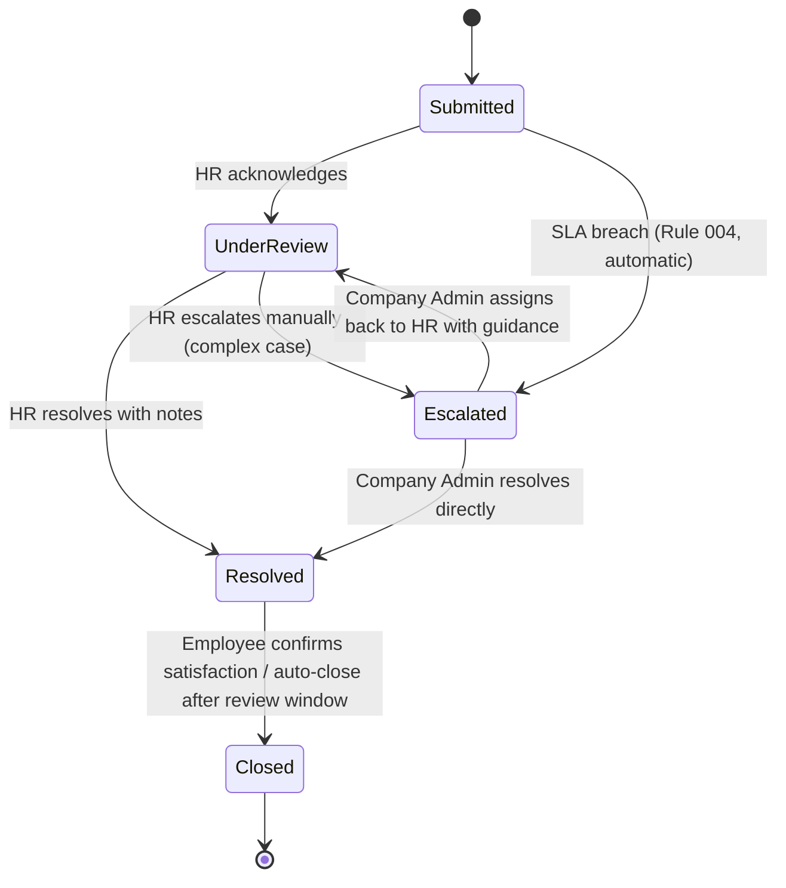
```mermaid
stateDiagram-v2
    [*] --> Submitted
    Submitted --> UnderReview: HR acknowledges
    Submitted --> Escalated: SLA breach (Rule 004, automatic)
    UnderReview --> Resolved: HR resolves with notes
    UnderReview --> Escalated: HR escalates manually (complex case)
    Escalated --> UnderReview: Company Admin assigns back to HR with guidance
    Escalated --> Resolved: Company Admin resolves directly
    Resolved --> Closed: Employee confirms satisfaction / auto-close after review window
    Closed --> [*]
```

## 14.6 Reports

- **Grievance Register (HR/Admin view only):** All grievances with status, category breakdown, resolution time analytics — anonymized appropriately per Rule 003 for any report shared beyond the assigned handler.
- **Announcement Acknowledgement Report:** Completion tracking for compliance-relevant announcements (Rule 005).
- **ESS Adoption Report:** Usage analytics (login frequency, feature utilization) helping HR identify employees who may need onboarding support with the app itself.

## 14.7 Notifications

- Grievance status change notifications to the submitting employee (respecting anonymity constraints in the notification content itself).
- Grievance SLA escalation notification to Company Admin (Rule 004).
- New announcement push notification, with acknowledgement-required announcements using a distinct, higher-priority notification channel (Chapter 8.5 of Project Rules).

## 14.8 Offline Behavior

- The ESS dashboard's aggregated view functions offline using each underlying module's own offline caching strategy (Attendance, Leave, Payroll — as documented in their respective sections) — ESS itself introduces no additional offline-sync complexity beyond what it inherits.
- Grievance submission is offline-queueable (a non-time-critical write, tolerant of sync delay, similar risk profile to Leave application) with the Sync Status Indicator pattern (Chapter 6.6.1) applied consistently.
- Announcement acknowledgement is offline-capable (a simple, idempotent, deterministic-ID write analogous to Attendance's pattern — keyed by `employeeId` under the announcement, safe to retry).

## 14.9 Testing Requirements

- Security Rule tests exhaustively confirming an ESS user cannot read or write any other employee's data across Attendance, Leave, Payroll, or Issued Items collections (Rule 001) — this is one of the highest-value test suites in the platform given ESS's broad field deployment and lower-trust device context.
- Unit tests confirming the profile-field whitelist (Rule 002) rejects any bundled write attempting to modify a non-whitelisted field.
- Unit tests for the anonymous-grievance visibility restriction (Rule 003) confirming the `employeeId` is never exposed to non-assigned HR staff via any query path.
- Integration tests for the SLA-based auto-escalation scheduled function (Rule 004), including the shortened harassment-category SLA path.

---

---

# MODULE 15: NOTIFICATIONS

## 15.1 Why This Module Exists

Every prior module has referenced notifications as an output ("notify HR", "notify the employee"). This module defines the **centralized notification engine** that all those triggers funnel through — ensuring consistent delivery, in-app history, read/unread tracking, and user-configurable preferences, rather than each module implementing its own ad hoc notification logic. This directly operationalizes Chapter 5.6 and Chapter 8.5 of `MASTER_PROJECT_RULES.md`.

## 15.2 Who Uses This Module

Every role receives notifications; every module that triggers a notification (Leave, Attendance, Payroll, Deployment, Billing, Inventory, Assets, Vendor, ESS, Client, Compliance) is a *producer* into this module's delivery pipeline, never a direct FCM caller itself.

## 15.3 Firestore Collections

```
/companies/{companyId}/notificationTemplates/{templateId}
  ├── templateCode (e.g., "LEAVE_APPROVED", "GEOFENCE_REVIEW_PENDING")
  ├── titleTemplate, bodyTemplate (with placeholder tokens, e.g., "{employeeName}'s leave was approved")
  ├── category: enum { APPROVAL_REQUIRED, STATUS_UPDATE, REMINDER, ALERT_ESCALATION, ANNOUNCEMENT }
  ├── defaultChannel: enum { PUSH, IN_APP_ONLY, PUSH_AND_SMS }
  └── isActive: boolean

/notifications/{notificationId}             — Pattern A, one document per recipient per event
  ├── companyId, recipientUserId
  ├── templateCode, renderedTitle, renderedBody (resolved from template + context at creation time — never re-resolved later, preserving historical accuracy even if the template is subsequently edited)
  ├── category, deepLinkRoute (e.g., "leave/detail/{leaveRequestId}")
  ├── isRead: boolean, readAt (nullable)
  ├── createdAt
  └── sourceModule, sourceEntityId (e.g., "LEAVE", leaveRequestId — for traceability back to the originating record)

/users/{uid}/notificationPreferences
  ├── categoryMutes: map { category: boolean }  (per-category opt-out, where policy allows — see Rule 003)
  ├── quietHoursStart, quietHoursEnd (non-urgent notifications deferred during this window)
```

## 15.4 Business Rules

**RULE-NOTIFICATIONS-001: Single Producer-Consumer Pipeline**
- **Statement:** Every module that needs to notify a user calls a single shared domain service, `NotificationDispatcher`, rather than directly invoking FCM. `NotificationDispatcher` resolves the appropriate template, renders it with context, writes the `/notifications/{id}` document (for in-app history, Chapter 5.6 of Project Rules — data-only FCM payload approach), and triggers the actual FCM send.
- **Rationale:** Directly implements Chapter 5.6 and Chapter 4's architectural layering — centralizing notification logic prevents each of the 20+ modules from independently reinventing delivery, formatting, and history-tracking logic, and ensures a single point of consistency enforcement (Chapter 3.7's "no direct Firebase SDK calls" extends naturally to "no direct FCM calls outside this module's Data-layer implementation").

**RULE-NOTIFICATIONS-002: Rendered Content Is Immutable Once Created**
- **Statement:** `renderedTitle`/`renderedBody` are resolved and stored at notification-creation time, not dynamically re-rendered from the live template on each read.
- **Rationale:** If a `notificationTemplates` document is later edited (e.g., wording improvement), historical notifications must continue displaying exactly what the recipient originally received — critical for any notification that might be referenced in a dispute or audit context (e.g., "you were notified of the leave rejection reason on this date").

**RULE-NOTIFICATIONS-003: Category Mute Restrictions**
- **Statement:** Employees may mute non-critical categories (`REMINDER`, `ANNOUNCEMENT`) via `notificationPreferences.categoryMutes`, but `APPROVAL_REQUIRED` and `ALERT_ESCALATION` categories can never be muted — enforced by `NotificationDispatcher` ignoring mute preferences for these two categories regardless of client-side settings state.
- **Rationale:** Directly implements the principle from Chapter 8.5 of Project Rules that critical, action-required notifications must never be silenceable by user preference, since a muted approval-required notification could cause a workflow to silently stall (e.g., a Supervisor muting "pending approval" alerts and simply never acting on geofence overrides).

**RULE-NOTIFICATIONS-004: Quiet Hours Apply Only to Non-Urgent Categories**
- **Statement:** `REMINDER` and `ANNOUNCEMENT` category notifications respect the recipient's configured `quietHoursStart`/`quietHoursEnd` window (deferred/batched for delivery after quiet hours end), while `APPROVAL_REQUIRED`, `STATUS_UPDATE`, and `ALERT_ESCALATION` are delivered immediately regardless of quiet hours, since these carry time-sensitive operational or safety relevance (e.g., a harassment-grievance escalation, Chapter ESS Rule 004, must never be silently deferred).

**RULE-NOTIFICATIONS-005: Notification Center Retention and Read-State**
- **Statement:** All notifications persist in `/notifications/{id}` for a configurable retention period (default 90 days, then archived — not deleted, preserving audit trail per Chapter 11.2's immutable-audit-log philosophy, though moved to a colder-access pattern beyond the retention window for the in-app "recent" view's performance). `isRead`/`readAt` update when the user opens the Notification Center or taps the specific notification's deep link.
- **Rule:** The notification badge count (Chapter 8.4/8.5 of Project Rules — "persistent, always-visible Pending Approvals badge") is computed as a real-time count of `isRead == false` documents for the current user, kept efficient via a maintained counter field on the user's own profile (incremented/decremented by the same Cloud Function/transaction that creates/reads notifications) rather than requiring a full collection count query on every dashboard load (Chapter 9.3 of Project Rules — avoiding expensive aggregate queries).

**RULE-NOTIFICATIONS-006: Deep Link Integrity**
- **Statement:** Every notification's `deepLinkRoute` must resolve to a valid, existing destination at delivery time; if the underlying `sourceEntityId` record is deleted/no longer accessible to the recipient (e.g., a permission change) by the time they tap the notification, the app displays a graceful "This item is no longer available" state rather than a crash or blank screen — directly implementing Chapter 7.8's deep-link standard ("deep links resolve to a fully-formed, data-populated destination — never a blank shell").

## 15.5 Notification Dispatch Sequence

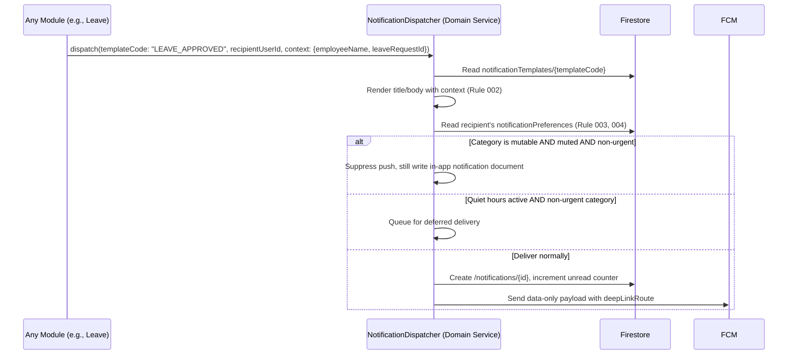
```mermaid
sequenceDiagram
    participant Mod as Any Module (e.g., Leave)
    participant ND as NotificationDispatcher (Domain Service)
    participant FS as Firestore
    participant FCM as FCM

    Mod->>ND: dispatch(templateCode: "LEAVE_APPROVED", recipientUserId, context: {employeeName, leaveRequestId})
    ND->>FS: Read notificationTemplates/{templateCode}
    ND->>ND: Render title/body with context (Rule 002)
    ND->>FS: Read recipient's notificationPreferences (Rule 003, 004)
    alt Category is mutable AND muted AND non-urgent
        ND->>ND: Suppress push, still write in-app notification document
    else Quiet hours active AND non-urgent category
        ND->>ND: Queue for deferred delivery
    else Deliver normally
        ND->>FS: Create /notifications/{id}, increment unread counter
        ND->>FCM: Send data-only payload with deepLinkRoute
    end
```

## 15.6 Reports

- **Notification Delivery Report (Admin/diagnostic):** Delivery success/failure rates per category, useful for diagnosing FCM token issues at scale.
- **Engagement Report:** Read-rate and time-to-read metrics per category, informing whether certain notification types are being effectively noticed (feeds Analytics module).

## 15.7 Notifications About Notifications (Meta)

Not applicable — this module is itself the notification system; it does not recursively notify about its own notifications, though its Delivery Report (15.6) serves as the equivalent operational visibility for administrators.

## 15.8 Offline Behavior

- Notification Center (history) is fully cached (Room) for offline browsing of previously-delivered notifications.
- Outbound dispatch (Rule 001-005) is inherently a server-side/Cloud-Function-triggered process — not a client-initiated write requiring offline queuing in the traditional sense; however, read-state updates (`isRead`/`readAt`) made while offline are queued and synced per the standard Firestore offline persistence mechanism (Chapter 6.6 of Project Rules), including deterministic conflict resolution (last-write-wins is acceptable here per Chapter 6.6.2's low-concurrency-risk classification, since only the recipient themselves ever writes their own read-state).

## 15.9 Testing Requirements

- Unit tests confirming `APPROVAL_REQUIRED`/`ALERT_ESCALATION` categories are never suppressed regardless of mute preference configuration (Rule 003) — a high-priority test given the operational-safety implications of a bypass here.
- Unit tests for template rendering correctness and immutability (Rule 002) — editing a template after a notification was sent must not alter the already-sent notification's displayed content.
- Integration tests for the unread-counter increment/decrement consistency under concurrent notification creation and read-state updates.
- UI tests confirming the "item no longer available" graceful degradation path (Rule 006) rather than a crash when a deep-linked entity is inaccessible.

---

---

# MODULE 16: ANALYTICS

## 16.1 Why This Module Exists

Every prior module produces transactional data (an attendance mark, a leave request, an invoice). Analytics exists to aggregate that transactional data into trends, comparisons, and forecasts that support decision-making — attrition trends, cost-per-site analysis, overtime exposure forecasting. Without a dedicated Analytics module, this aggregation logic would either be duplicated ad hoc across dashboards or, worse, computed expensively client-side on every dashboard load (violating Chapter 9.3's performance standards).

## 16.2 Who Uses This Module

| Role | Interaction |
|---|---|
| Company Admin | Company-wide strategic dashboards |
| Operations Manager | Deployment/staffing trend dashboards |
| HR Manager | Attrition, attendance-pattern, leave-utilization dashboards |
| Accounts/Billing Team | Revenue vs. cost margin dashboards |
| Super Admin | Cross-company platform health analytics |

## 16.3 Firestore Collections

```
/companies/{companyId}/analyticsRollups/{rollupId}   — pre-computed aggregate documents, not raw transactional data
  ├── rollupType: enum { DAILY_ATTENDANCE_SUMMARY, MONTHLY_ATTRITION, SITE_COST_MARGIN,
  │                       OVERTIME_TREND, LEAVE_UTILIZATION, VENDOR_SPEND }
  ├── periodStart, periodEnd
  ├── dimensions: map (e.g., { siteId, department } — the grouping keys for this rollup)
  ├── metrics: map (e.g., { presentCount, absentCount, avgLateMinutes })
  └── computedAt

/superAdminAnalytics/{rollupId}             — cross-company aggregates, Super-Admin-only collection
  ├── rollupType: enum { PLATFORM_ACTIVE_COMPANIES, SUBSCRIPTION_REVENUE, PLATFORM_USAGE_TRENDS }
  ├── metrics, computedAt
```

## 16.4 Business Rules

**RULE-ANALYTICS-001: Analytics Are Pre-Computed, Never Live-Aggregated Client-Side**
- **Statement:** Dashboard metrics are served from `analyticsRollups` documents computed by scheduled Cloud Functions (daily, or triggered incrementally on relevant writes for near-real-time metrics like "Present Today"), never computed by the client running an aggregation query across potentially thousands of raw Attendance/Leave/Deployment documents at dashboard-load time.
- **Rationale:** Directly implements Chapter 9.3 of Project Rules — "dashboards aggregating many metrics use Cloud Function-computed rollup documents...rather than the client running many simultaneous listeners/aggregation queries client-side."

**RULE-ANALYTICS-002: Rollup Computation Respects Company Isolation**
- **Statement:** Every `analyticsRollups` document is scoped under `/companies/{companyId}/` (Pattern B), and the computing Cloud Function processes exactly one company's data per invocation — never a cross-company batch computation that could risk accidental data leakage between companies' rollup outputs (Chapter 2.4 defense-in-depth extended to the analytics computation layer itself, not just the read-path Security Rules).

**RULE-ANALYTICS-003: Near-Real-Time vs. Batch Rollup Tiering**
- **Statement:** Metrics requiring same-day visibility (e.g., "Present Today: 342/360" on the Admin dashboard, Chapter 7.6 of Project Rules) are updated via a Cloud Function trigger on relevant document writes (incremental counter update), while metrics that are inherently period-based and don't require intraday freshness (e.g., Monthly Attrition, Site Cost Margin) are computed via a scheduled batch job (nightly), avoiding unnecessary compute cost for metrics where near-real-time freshness provides no business value.

**RULE-ANALYTICS-004: Drill-Down Traceability**
- **Statement:** Every Analytics dashboard metric remains tappable and deep-links to the underlying filtered detail view (Chapter 7.6 of Project Rules dashboard standard) — a rollup number is never a dead-end statistic; a Company Admin seeing "Overtime Cost: ₹45,000 this month" can always drill into the specific attendance records contributing to that figure.

**RULE-ANALYTICS-005: Historical Rollup Immutability**
- **Statement:** Once a period's rollup is computed and the period has closed (e.g., the month has ended and payroll for that period is finalized), the corresponding `analyticsRollups` document is not retroactively recomputed even if underlying data is later corrected via a Reversal workflow (Payroll Rule 007) — instead, a new rollup entry reflecting the correction is appended with a `correctionOf` reference, preserving the historical record of what the analytics showed at the time, consistent with the platform-wide principle of never silently rewriting history (Chapter 11.2's audit-trail philosophy applied to analytics).

**RULE-ANALYTICS-006: Cross-Company Analytics Is Super-Admin-Exclusive**
- **Statement:** `/superAdminAnalytics/` collection and its computing functions are accessible only to `superAdmin == true` claim holders, computed by a distinct, separately-scheduled Cloud Function that legitimately reads across all companies (the sole sanctioned exception to the "collection group queries never exposed to non-Super-Admin roles" rule, Chapter 2.4.3 of Project Rules, since this function itself is not client-exposed — it runs server-side and writes only pre-aggregated, already-anonymized-where-appropriate output).

## 16.5 Rollup Computation Sequence (Example: Daily Attendance Summary)

```mermaid
sequenceDiagram
    participant Trigger as Scheduled Cloud Function (Daily, 00:15 IST)
    participant FS as Firestore

    Trigger->>FS: For each active company, query yesterday's attendanceRecords
    Trigger->>Trigger: Group by siteId, department; compute presentCount/absentCount/avgLateMinutes
    Trigger->>FS: Write /companies/{companyId}/analyticsRollups/{rollupId} (Rule 002 - per company)
    Note over Trigger,FS: Near-real-time "Present Today" counter updated separately via write-triggered increment (Rule 003), not by this batch job
</mermaid>
```

## 16.6 Reports

*(Analytics module IS the reporting engine for trend/aggregate data; see also Module 17, Reports, for the operational/compliance report generation layer, which is distinct — Reports produces exportable documents for external use, while Analytics produces interactive in-app dashboards and trend visualizations.)*

- **Attrition Dashboard:** Monthly turnover rate, `endReason` breakdown (Deployment Rule 003 cross-reference), trended over 12 months.
- **Attendance Pattern Dashboard:** Late-arrival trends, absenteeism hotspots by site/department.
- **Cost Margin Dashboard:** Payroll cost vs. Billing revenue per site/client, trended (cross-referenced Payroll 8.6, Billing 11.6).
- **Platform Health Dashboard (Super Admin):** Active companies, subscription distribution, aggregate usage trends.

## 16.7 Notifications

- Anomaly alerts (e.g., a site's absenteeism rate spiking beyond a configured threshold) trigger a proactive notification to Operations Manager — analytics-driven alerting, distinct from the transactional alerts of other modules.

## 16.8 Offline Behavior

- Rollup documents (being small, pre-computed, infrequently-changing) are excellent candidates for Room caching, allowing dashboards to render fully offline using the last-computed rollup, with a clear "as of [computedAt]" freshness indicator (Chapter 7.6 of Project Rules).

## 16.9 Testing Requirements

- Unit tests for rollup computation logic across representative grouping/aggregation scenarios.
- Integration tests confirming rollup computation for one company never reads or includes another company's data (Rule 002).
- Tests confirming historical rollups are never mutated in place, only appended-to via correction entries (Rule 005).

---

---

# MODULE 17: REPORTS

## 17.1 Why This Module Exists

Where Analytics (Module 16) produces interactive in-app dashboards for trend visualization, Reports produces **exportable, formatted documents** (PDF/Excel/CSV) intended for external use — statutory filing, client submission, auditor review, or offline record-keeping. The distinction matters: a dashboard can be approximate and interactive; a report must be exact, complete, and reproducible on demand, since it may be relied upon outside the app entirely (e.g., submitted to a labor inspector).

## 17.2 Who Uses This Module

Every role that has been referenced as a report consumer across prior modules (HR, Operations, Billing, Company Admin, Client, Super Admin) — this module is the shared generation/export engine underlying all of those per-module report references.

## 17.3 Firestore Collections

```
/companies/{companyId}/reportDefinitions/{reportDefId}
  ├── reportCode (e.g., "MONTHLY_ATTENDANCE_REGISTER", "PF_ESI_STATUTORY_REPORT")
  ├── sourceModule, requiredParameters (array — e.g., ["periodStart", "periodEnd", "siteId (optional)"])
  ├── availableFormats: array of { PDF, EXCEL, CSV }
  └── requiredPermission (e.g., "reports.payroll.generate")

/reportGenerationJobs/{jobId}                — Pattern A, async job tracking
  ├── companyId, reportCode, parameters (map)
  ├── requestedByUserId, requestedAt
  ├── status: enum { QUEUED, PROCESSING, COMPLETED, FAILED }
  ├── outputFileUrl (nullable until COMPLETED), format
  └── errorMessage (nullable, populated on FAILED)
```

## 17.4 Business Rules

**RULE-REPORTS-001: Reports Are Generated Asynchronously for Large Data Volumes**
- **Statement:** Any report whose underlying query may span a large number of documents (e.g., a full-year Attendance Register for a 500-employee company) is generated via an asynchronous `reportGenerationJobs` record processed by a Cloud Function, not synchronously within the mobile app's request-response cycle.
- **Rationale:** Directly implements Chapter 9 of Project Rules' performance discipline — a synchronous multi-thousand-document aggregation would violate cold-start/responsiveness targets and risk client timeout; the async job pattern lets the user continue using the app while the report generates, with a notification (Module 15) upon completion.

**RULE-REPORTS-002: Report Content Must Be Reproducible and Traceable**
- **Statement:** Every generated report embeds a generation timestamp and the exact parameters used (period, filters) directly in the document header/footer, and the underlying data query is deterministic (no report generation may include a "random sample" or non-reproducible aggregation) — ensuring that regenerating the same report with the same parameters at a later time produces data consistent with what the source records show as of that later time (accounting for any legitimate corrections made in between, which is expected and correct, not a defect).

**RULE-REPORTS-003: Sensitive Field Redaction in Exports**
- **Statement:** Reports respect the same field-level sensitivity rules as the live app (Employee Rule 003 — bank/ID number masking) based on the requesting user's permissions — a report generated by a role lacking `employees.viewSensitive` receives a masked export, never an unmasked one simply because "it's just an export." Statutory reports requiring unmasked ID numbers (e.g., PF filing requiring full PAN) are gated by a distinct, explicitly-named permission (`reports.statutory.generate`) held only by HR/Compliance roles, making the elevated-sensitivity nature of that specific report type explicit rather than implicit.

**RULE-REPORTS-004: Report Job Failure Is Explicit, Never Silent**
- **Statement:** A failed report generation job surfaces `status = FAILED` with a specific `errorMessage`, and the requesting user receives a notification with a "Retry" action — never a job that simply never completes with no user-visible indication (Chapter 2.2's non-negotiable rule against silent failure applied to the async job pattern specifically).

**RULE-REPORTS-005: Client-Facing Reports Are Scope-Restricted at Generation Time**
- **Statement:** When a Client-role user requests a report (e.g., their own Deployment Hours Report, cross-referenced Attendance Module 4.6), the generation job itself is parameterized and validated server-side to include only that client's own data — the same defense-in-depth principle applied to live queries (Chapter 2.4) extends to the async report-generation Cloud Function, which must independently verify the requester's `clientId` claim rather than trusting a client-submitted filter parameter.

**RULE-REPORTS-006: Report Retention and Storage**
- **Statement:** Generated report files are stored in Firebase Storage under `/{companyId}/reports/{jobId}/{fileName}` (consistent with the Storage folder convention, Chapter 5.5 of Project Rules) and retained for a configurable period (default 1 year) after which they are subject to cleanup — but the `reportGenerationJobs` metadata record persists indefinitely (small document, low storage cost) so that report *generation history* remains auditable even after the actual file has been cleaned up, with a clear "Regenerate" action offered for expired file references.

## 17.5 Report Generation Workflow

```mermaid
sequenceDiagram
    participant U as User (any role)
    participant App as LSM App
    participant CF as Cloud Function: generateReport
    participant FS as Firestore
    participant Storage as Firebase Storage

    U->>App: Select report type + parameters
    App->>FS: Create /reportGenerationJobs/{jobId} (status=Queued)
    App-->>U: "Generating report — you'll be notified when ready"
    CF->>FS: Pick up Queued job, validate requester's permission/scope (Rule 003, 005)
    CF->>FS: Query source data deterministically (Rule 002)
    CF->>CF: Render PDF/Excel/CSV per requested format
    CF->>Storage: Upload output file
    CF->>FS: Update job status=Completed, outputFileUrl set
    CF->>U: Notify (Module 15) — report ready, deep-link to download
```

## 17.6 Standard Report Catalog (Representative — Full Catalog Cross-Referenced per Module)

| Report Code | Source Module | Formats |
|---|---|---|
| MONTHLY_ATTENDANCE_REGISTER | Attendance | PDF, Excel |
| PF_ESI_STATUTORY_REPORT | Payroll, Compliance | Excel (regulatory-formatted) |
| PAYROLL_REGISTER | Payroll | PDF, Excel |
| DEPLOYMENT_HOURS_CLIENT_REPORT | Deployment, Attendance | PDF |
| INVOICE_REGISTER | Billing | Excel |
| EMPLOYEE_MASTER_REPORT | Employees | Excel, CSV |
| STOCK_LEDGER_REPORT | Inventory | Excel |
| ASSET_REGISTER | Assets | Excel |
| VENDOR_PAYMENT_DUE_REPORT | Vendor | Excel |

*(This catalog is illustrative of the pattern; every module's Reports section in this document contributes entries to the full `reportDefinitions` catalog maintained operationally in the platform, not exhaustively re-listed here to avoid duplication with each module's own §X.6/X.7 Reports subsection already documented above.)*

## 17.7 Notifications

- Report generation completion/failure notification (Rule 004), using the `STATUS_UPDATE` category from the Notifications module (Module 15).

## 17.8 Offline Behavior

- Report *generation* requires connectivity (server-side Cloud Function, Rule 001).
- Previously-generated report files, once downloaded, are available offline as standard device files (outside the app's Firestore-sync scope) — the app itself caches the `reportGenerationJobs` history list (Room) so users can see their past report requests and re-download links even offline, with the actual file download requiring connectivity if not already locally cached by the OS.

## 17.9 Testing Requirements

- Unit tests confirming report content matches source data exactly for representative report types (no off-by-one date range errors, no silent data omission).
- Security tests confirming a Client-role report request cannot be parameter-manipulated to include another client's data (Rule 005) — mirroring the live-query isolation tests but specifically targeting the async job code path, which is easy to overlook if isolation testing focuses only on synchronous Security Rules.
- Integration tests for the full async job lifecycle including simulated mid-generation failure, confirming the `FAILED` state and retry notification behave correctly (Rule 004).

---

---

# MODULE 18: WORKFLOW ENGINE

## 18.1 Why This Module Exists

Across this document, Leave (Module 5), Deployment (Module 7), Payroll (Module 8), Shift Swap (Module 6), Purchase Orders (Module 13), Grievances (Module 14), Client contracts (Module 12), and Invoices (Module 11) have each defined their own state machine with approval steps. Without a shared underlying engine, each module would reimplement state-transition validation, dead-end-state prevention, and audit logging independently — risking inconsistency and duplicated bugs. The Workflow Engine is the **generic infrastructure** that every module's specific state machine is built on top of, directly operationalizing Chapter 10.6 of `MASTER_PROJECT_RULES.md`.

## 18.2 Who Uses This Module

This module has no direct end-user-facing surface of its own — it is consumed internally by every module that implements an approval/status workflow (Leave, Deployment, Payroll, Shift Swap, Purchase Orders, Grievances, Client, Billing). Its "users" are the domain Use Cases of those modules, via a shared `WorkflowStateMachine` domain service.

## 18.3 Firestore Collections

```
/companies/{companyId}/workflowDefinitions/{workflowDefId}
  ├── workflowCode (e.g., "LEAVE_APPROVAL", "PO_APPROVAL", "DEPLOYMENT_APPROVAL")
  ├── states: array of { stateName, isTerminal: boolean }
  ├── transitions: array of { fromState, toState, requiredPermission, requiresReason: boolean }
  └── slaHoursPerState (map — optional escalation timing per state, cross-referenced ESS Rule 004's SLA pattern generalized)

/workflowInstances/{instanceId}             — Pattern A, one per actual in-flight/completed workflow occurrence
  ├── companyId, workflowCode, sourceModule, sourceEntityId (e.g., "LEAVE", leaveRequestId)
  ├── currentState
  ├── /transitionHistory/{transitionId}
       ├── fromState, toState, performedByUserId, performedAt, reason (nullable)
```

## 18.4 Business Rules

**RULE-WORKFLOW-001: All Transitions Validated Against the Defined State Machine**
- **Statement:** Any attempt to change a `workflowInstances` document's `currentState` is validated against the corresponding `workflowDefinitions.transitions` array — a transition not explicitly listed (e.g., `Draft → Finalized` directly, skipping `PendingApproval`/`Approved`) is rejected, both client-side (immediate UX feedback) and server-side (Security Rule/Cloud Function, since this is a rule with real financial/compliance risk once applied to workflows like Payroll or Deployment, per Chapter 10.4.1).
- **Rationale:** This is the single generic mechanism enforcing Chapter 10.6.2 of Project Rules ("no workflow may have a state with no defined outgoing transition except explicitly terminal states") across every module uniformly, rather than each module's Cloud Function independently re-implementing the same validation logic with the risk of subtle inconsistencies.

**RULE-WORKFLOW-002: Every Transition Is Audit-Logged**
- **Statement:** Every state transition writes a `transitionHistory` entry recording `fromState`, `toState`, actor, timestamp, and reason (mandatory for rejection-type transitions per each workflow's own configuration) — directly implementing Chapter 10.6.1 of Project Rules ("every state transition...is always accompanied by an audit log entry").

**RULE-WORKFLOW-003: Permission-Gated Transitions**
- **Statement:** Each transition definition specifies a `requiredPermission` (e.g., `leave.approve`, `deployment.approve`, `po.approve`); the Workflow Engine checks this against the acting user's resolved permissions (via the shared `PermissionEvaluator`, Chapter 3.7/11.3 of Project Rules) before allowing the transition — meaning permission enforcement for every approval workflow across the platform flows through this single checkpoint, rather than each module re-implementing its own ad hoc permission check with the risk of one module's check being subtly weaker than another's.

**RULE-WORKFLOW-004: SLA-Based Auto-Escalation Is Generic**
- **Statement:** The optional `slaHoursPerState` configuration enables a shared scheduled Cloud Function to scan all `workflowInstances` across all workflow types for SLA breaches and trigger a standard escalation notification (Module 15) — this generalizes the pattern first introduced for Grievances (ESS Rule 004) to every workflow type that opts in, avoiding the need for each module to implement its own bespoke SLA-scanning scheduled function.

**RULE-WORKFLOW-005: Workflow Instance Is Linked, Not Duplicative, of Source Entity State**
- **Statement:** A module's own entity (e.g., a `leaveRequests` document) retains its own `status` field for fast, direct querying (since requiring a join to `workflowInstances` for every list-screen query would violate the N+1/read-cost discipline of Chapter 9.3), but that `status` field's value is always kept synchronized with the corresponding `workflowInstances.currentState` via the same transaction/batched write that performs the transition — the two are two views of the same fact, never allowed to diverge, and the `workflowInstances` collection serves specifically as the generic audit/SLA/cross-workflow-reporting layer rather than replacing the module-specific status field.
- **Rationale:** Balances the Chapter 9.3 performance principle (denormalize for query efficiency) against the Chapter 10.6/18 principle (centralize workflow logic for consistency) — the resolution is dual-write-in-the-same-transaction, not a choice between one or the other.

**RULE-WORKFLOW-006: No Dead-End States Enforced at Definition Time**
- **Statement:** A `workflowDefinitions` document is itself validated at creation/edit time (an administrative, platform-level configuration action, not a runtime check) to confirm every non-terminal state has at least one outgoing transition defined — preventing a misconfigured workflow definition from ever being deployed with a structural dead end, catching the error at design time rather than discovering it when a real leave request or deployment gets stuck.

## 18.5 Generic Transition Sequence

```mermaid
sequenceDiagram
    participant Mod as Module Use Case (e.g., ApproveLeaveUseCase)
    participant WE as WorkflowStateMachine (Domain Service)
    participant FS as Firestore (Transaction)

    Mod->>WE: transition(instanceId, toState: "Approved", actorId, reason)
    WE->>FS: Read workflowDefinitions for this workflowCode
    WE->>WE: Validate transition is defined (Rule 001) + actor has requiredPermission (Rule 003)
    alt Valid transition
        WE->>FS: Transaction: update workflowInstances.currentState + source entity's status field (Rule 005)
        WE->>FS: Write transitionHistory entry (Rule 002)
        WE-->>Mod: Success
    else Invalid transition or insufficient permission
        WE-->>Mod: Rejected with specific reason
    end
```

## 18.6 Reports

- **Workflow Audit Report:** Full transition history for any given workflow instance, usable across all modules for dispute resolution/compliance review — a single generic report template parameterized by `workflowCode`/`sourceEntityId`.
- **SLA Compliance Report:** Cross-workflow-type view of how often approvals are completed within vs. beyond configured SLA windows, useful for identifying bottleneck approvers/roles.

## 18.7 Notifications

- Generic SLA-breach escalation (Rule 004), delivered through the standard Notifications module (Module 15) pipeline using each specific workflow's own configured escalation recipient.

## 18.8 Offline Behavior

- Workflow transitions inherit the offline behavior of their source module (e.g., Leave approval's offline characteristics are governed by Leave Module 5.7, not independently by this module) — the Workflow Engine itself is a shared validation/audit layer invoked synchronously within each module's own Use Case execution, not a separate offline-sync surface.

## 18.9 Testing Requirements

- Unit tests for the generic `WorkflowStateMachine.transition()` function confirming it correctly rejects any transition not present in a given `workflowDefinitions` configuration, using multiple different workflow definitions as test fixtures (Leave-shaped, Deployment-shaped, PO-shaped) to confirm true genericity rather than accidental coupling to one specific workflow's shape.
- Tests confirming Rule 005's dual-write consistency — no test scenario should ever produce a state where a source entity's `status` field and its `workflowInstances.currentState` disagree.
- Definition-time validation tests confirming Rule 006 correctly rejects a malformed `workflowDefinitions` document containing a non-terminal state with no outgoing transitions, before it can ever be used at runtime.

---

---

# MODULE 19: APPROVALS

## 19.1 Why This Module Exists

Module 18 (Workflow Engine) provides the generic *mechanism* for state transitions. This module provides the **unified inbox experience** — a single screen where an approver (Supervisor, HR Manager, Operations Manager, Company Admin) sees every pending action requiring their decision across all workflow types (Leave, Deployment, Shift Swap, Purchase Orders, Grievances, Payroll approval, Client contracts, Invoice approval), rather than needing to separately check each module for pending items. This directly implements Chapter 8.4 of `MASTER_PROJECT_RULES.md`: "every approval-capable role...sees a persistent, always-visible Pending Approvals badge count...approvals are never something a user must remember to go looking for."

## 19.2 Who Uses This Module

Every role with any `*.approve` permission across the platform (Supervisor, HR Manager, Operations Manager, Company Admin) — this module is the aggregation surface, analogous in spirit to how ESS (Module 14) aggregates employee-facing data, but for approver-facing data.

## 19.3 Firestore Collections

```
/approvalInboxItems/{inboxItemId}           — Pattern A, denormalized view, one entry per pending approval per eligible approver
  ├── companyId, approverUserId
  ├── workflowCode, sourceModule, sourceEntityId, workflowInstanceId (cross-reference Module 18)
  ├── summaryTitle, summaryContext (map — e.g., { employeeName, leaveType, dates } for quick-glance rendering without a full record fetch)
  ├── priority: enum { NORMAL, HIGH, URGENT }  (e.g., HARASSMENT-category grievances = URGENT, cross-referenced ESS Rule 004)
  ├── createdAt, slaDeadline (nullable, cross-referenced Workflow Engine Rule 004)
  └── status: enum { PENDING, ACTIONED }        (removed from active inbox view once actioned, retained for history)
```

## 19.4 Business Rules

**RULE-APPROVALS-001: Inbox Item Creation Is Automatic and Denormalized**
- **Statement:** Whenever a `workflowInstances` document (Module 18) enters a state requiring action from a specific role/user, a corresponding `approvalInboxItems` entry is created automatically (as part of the same transaction/batched write that creates or transitions the workflow instance) for every eligible approver — this is a controlled, purposeful denormalization (Chapter 6.4/9.3 of Project Rules) specifically to enable a single fast, un-joined query ("show me everything pending for me") rather than requiring the Approvals screen to separately query Leave, Deployment, Grievances, POs, etc. and merge results client-side.
- **Rationale:** A merged multi-collection client-side query would violate the N+1/read-cost discipline (Chapter 9.3) and complicate pagination/sorting across heterogeneous item types; a single denormalized collection solves both problems at the cost of the denormalization-maintenance discipline already established elsewhere in the platform (Chapter 6.4's "every denormalized field must have a defined, implemented update-propagation path").

**RULE-APPROVALS-002: Multi-Approver Eligibility Handling**
- **Statement:** If more than one user holds the required approval permission for a given site/context (e.g., two Supervisors both cover the same site), an `approvalInboxItems` entry is created for each eligible approver, but the moment any one of them actions it, all other corresponding inbox entries for the same `workflowInstanceId` are atomically marked `ACTIONED` (via the same Cloud Function transaction that processes the actual workflow transition) — preventing the confusing scenario where a second Supervisor attempts to approve a request another Supervisor already handled.

**RULE-APPROVALS-003: Priority-Based Sorting**
- **Statement:** The Approvals inbox screen sorts by `priority` (URGENT first) then `slaDeadline` (soonest first), ensuring time-sensitive/high-stakes items (e.g., a harassment grievance approaching its 24-hour SLA) are never visually buried beneath a long list of routine leave requests — directly implementing the UX principle from Chapter 8.4 that approval screens must present full decision context without requiring cross-referencing, extended here to *prioritization* as well as context.

**RULE-APPROVALS-004: In-Context Decision Without Navigation**
- **Statement:** Tapping an inbox item surfaces the full decision context inline (e.g., for a Leave item: current balance, recent attendance pattern; for a Deployment item: site staffing impact) sourced live from the respective module's own Repository at that moment — the `summaryContext` denormalized field is used only for the initial list-row quick-glance rendering, never as the authoritative data for the actual approve/reject decision screen, which always reads fresh from the source-of-truth collection (avoiding a stale-denormalized-data-driven wrong decision).

**RULE-APPROVALS-005: Actioned Items Retained for History, Not Deleted**
- **Statement:** Upon action, an `approvalInboxItems` entry transitions to `status = ACTIONED` rather than being deleted — supporting an "Approval History" view for the approver (what have I approved/rejected recently) without needing to separately query every source module, consistent with the audit-trail philosophy (Chapter 11.2) applied to this aggregation layer as well.

**RULE-APPROVALS-006: Badge Count Efficiency**
- **Statement:** The persistent Pending Approvals badge count (Chapter 8.4 of Project Rules) is computed as a maintained counter on the approver's own user profile, incremented/decremented atomically alongside `approvalInboxItems` creation/actioning — mirroring the identical pattern already established for the Notifications module's unread counter (Module 15, Rule 005), avoiding an expensive live collection-count query on every dashboard load.

## 19.5 Inbox Item Lifecycle

```mermaid
sequenceDiagram
    participant WE as Workflow Engine (Module 18)
    participant CF as Cloud Function
    participant FS as Firestore
    participant App as Approver's App

    WE->>CF: Workflow instance enters an approval-required state
    CF->>FS: Determine eligible approver(s) for this site/context
    CF->>FS: Create approvalInboxItems entries (Rule 001) + increment each approver's badge counter (Rule 006)
    App->>FS: Approver opens Approvals screen, sorted by priority/SLA (Rule 003)
    App->>FS: Approver taps item → fetch live context from source module (Rule 004)
    App->>WE: Approver decides (Approve/Reject via Module 18's transition())
    WE->>FS: Transaction: update workflow instance, mark ALL corresponding inbox entries ACTIONED (Rule 002), decrement badge counters
```

## 19.6 Reports

- **Approver Performance Report:** Average time-to-decision per approver, per workflow type — identifies bottleneck approvers, cross-referenced with the Workflow Engine's SLA Compliance Report (Module 18.6).
- **Approval History Report:** Per-approver complete decision history across all workflow types (Rule 005), for individual performance review or audit purposes.

## 19.7 Notifications

- New inbox item creation triggers the standard `APPROVAL_REQUIRED` category notification (Module 15, non-mutable per Notifications Rule 003) — the Approvals module is itself a primary *producer* into the Notifications pipeline, alongside being a *consumer/aggregator* of workflow state (Module 18).

## 19.8 Offline Behavior

- The Approvals inbox list is cached (Room) for offline review of pending items, but the actual approve/reject *action* requires connectivity (since it invokes the Workflow Engine's transactional transition, which requires server-side permission/state validation per Chapter 10.4.1's compliance-risk classification for approval-adjacent financial/operational decisions) — the UI clearly labels the action button as requiring connectivity if currently offline, rather than allowing a queued-but-unvalidated approval action that could later fail non-obviously.

## 19.9 Testing Requirements

- Unit tests confirming Rule 002's multi-approver race condition is handled correctly — simulating two approvers actioning the same item near-simultaneously and confirming exactly one action succeeds while the other is gracefully informed "already actioned by [other approver]."
- Integration tests confirming the denormalized `approvalInboxItems` collection never drifts out of sync with the authoritative `workflowInstances` state (Rule 001's propagation-path discipline, mirroring the general denormalization-consistency testing pattern established in Chapter 6.4).
- Tests confirming badge counter accuracy under high-volume concurrent inbox item creation/actioning (Rule 006).

---

---

# MODULE 20: AI

## 20.1 Why This Module Exists

The technology stack (Project Overview) explicitly includes Google AI Studio. This module defines where and how AI capabilities are integrated into LSM — always as an **assistive, advisory layer** on top of deterministic business logic, never as a replacement for the auditable, rule-based decision-making established in every prior module. AI suggestions are never auto-applied to compliance-sensitive data (payroll, attendance, approvals) without human confirmation, directly consistent with Chapter 10.4 of `MASTER_PROJECT_RULES.md`'s server-side-enforcement-of-critical-rules principle extended to AI: AI can *recommend*, never *silently decide*, for anything in the financial/compliance-risk category.

## 20.2 Who Uses This Module

| Role | AI-Assisted Capability |
|---|---|
| HR Manager | Document data extraction during employee onboarding; grievance sentiment/urgency triage assistance |
| Operations Manager | Shift/deployment coverage gap suggestions; anomaly flags on attendance patterns |
| Company Admin | Natural-language report queries ("show me sites with rising overtime cost") |
| Employee (ESS) | Conversational help/FAQ assistant for common ESS questions (leave policy, how-to guidance) |
| Super Admin | Cross-company platform health anomaly detection |

## 20.3 Firestore Collections

```
/companies/{companyId}/aiSuggestions/{suggestionId}
  ├── suggestionType: enum { DOCUMENT_EXTRACTION, ATTENDANCE_ANOMALY, STAFFING_GAP_RECOMMENDATION,
  │                          GRIEVANCE_TRIAGE, NL_QUERY_RESULT }
  ├── sourceModule, sourceEntityId (nullable, e.g., the employeeId a document extraction relates to)
  ├── inputSummary (map — what was analyzed, for audit traceability)
  ├── suggestedOutput (map — the AI's proposed values/flags)
  ├── confidenceScore
  ├── status: enum { PENDING_REVIEW, ACCEPTED, MODIFIED_AND_ACCEPTED, REJECTED }
  ├── reviewedByUserId, reviewedAt
  └── createdAt

/aiUsageAuditLog/{logId}                    — Super-Admin-visible, platform-wide AI call tracking
  ├── companyId, suggestionType, modelUsed, tokensOrUnitsConsumed, requestedByUserId, requestedAt
```

## 20.4 Business Rules

**RULE-AI-001: AI Output Is Always a Suggestion Requiring Human Confirmation**
- **Statement:** No `aiSuggestions` document's `suggestedOutput` is ever written directly to an authoritative business collection (Employees, Attendance, Payroll, etc.) without an explicit human action transitioning the suggestion to `ACCEPTED` or `MODIFIED_AND_ACCEPTED`. A `REJECTED` suggestion has zero effect on any other collection.
- **Rationale:** Directly extends Chapter 10.4.1 of Project Rules ("any business rule whose violation would cause financial or compliance harm...must be enforced both client-side and server-side") to the AI layer: an AI misextraction or hallucination must never silently corrupt a compliance-relevant record, since AI output — unlike a validated business rule — carries an inherent, non-zero error rate that the platform must never treat as ground truth.

**RULE-AI-002: Document Data Extraction (Employee Onboarding Assistance)**
- **Statement:** When HR uploads an ID document (Aadhaar, PAN) during Employee onboarding (Module 3), the AI module may extract structured fields (name, ID number, date of birth) via Google AI Studio's vision-capable model and pre-populate the onboarding form as a time-saving convenience — but every extracted field remains fully editable, and the employee record is only saved with whatever values HR ultimately confirms, whether AI-suggested or manually corrected.
- **Edge Case:** Low-confidence extractions (below a configured `confidenceScore` threshold) are visually flagged in the UI as "AI extraction uncertain — please verify" rather than silently pre-filled with equal visual weight to a high-confidence extraction, preventing HR from over-trusting a low-quality OCR result.

**RULE-AI-003: Attendance Anomaly Detection**
- **Statement:** A scheduled analysis (leveraging aggregated Attendance data, cross-referenced Analytics Module 16) flags statistically unusual patterns — e.g., an employee checking in from wildly varying, geographically implausible locations across consecutive days, or a Supervisor proxy-marking an unusually high proportion of their site's attendance — as `PENDING_REVIEW` suggestions surfaced to Operations Manager/HR, never as an automatic attendance-record rejection or employee flag. A human reviews the flagged pattern and decides whether escalation (e.g., to a formal investigation, outside this module's scope) is warranted.
- **Rationale:** This is squarely a fraud-risk-relevant capability, but Rule 001 ensures it functions as an investigative lead generator, not an automated accusation system — critical given the real employment consequences a false-positive fraud flag could have for a field employee.

**RULE-AI-004: Staffing Gap Recommendations**
- **Statement:** Cross-referenced with the Shift Coverage Gap Report (Module 6.5) and Deployment understaffing alerts (Module 7.7), the AI module may suggest candidate employees for filling an identified gap (e.g., "these 3 employees have relevant experience and are not currently over-committed this week") based on skills/designation match and current workload — a recommendation Operations Manager can accept (which then simply pre-fills a standard Shift Roster / Deployment creation form, going through all the normal validation rules of those modules, Rule 001) or ignore entirely.

**RULE-AI-005: Grievance Triage Assistance**
- **Statement:** Upon Grievance submission (Module 14), the AI module may suggest a `category` and initial `priority` classification (e.g., detecting harassment-related language warranting the expedited SLA path, ESS Rule 004) — but the actual category/priority stored on the grievance record is only set once HR confirms or overrides the suggestion; an AI misclassification never silently routes a genuine harassment complaint into a lower-priority queue without a human checkpoint, and conversely never auto-escalates without HR visibility into why.

**RULE-AI-006: Natural-Language Report/Analytics Queries**
- **Statement:** Company Admin/Operations Manager may pose a natural-language question (e.g., "which sites had the highest overtime cost last quarter") which the AI module translates into a structured query against the pre-computed Analytics rollups (Module 16) — never against raw transactional collections directly, both for performance reasons (Chapter 9.3) and for consistency (ensuring an AI-driven query returns the same authoritative rollup figures the standard dashboards show, not an independently-computed and potentially divergent number).
- **Failure Behavior:** If the natural-language query cannot be confidently mapped to an available rollup dimension, the AI module explicitly states this limitation ("I can't answer that from the available data — try asking about attendance, overtime, or attrition trends") rather than fabricating a plausible-sounding but ungrounded answer.

**RULE-AI-007: ESS Conversational Assistant Scope Limitation**
- **Statement:** The employee-facing conversational assistant answers only general policy/how-to questions (e.g., "how many casual leave days do I have left," which it answers by querying the employee's own real Leave balance per Module 5/14, or "how do I apply for leave," answered from static help content) — it is explicitly restricted from taking any write action on the employee's behalf (it cannot itself submit a leave application or mark attendance; it can only guide the employee to the correct in-app screen to do so themselves), preventing an AI misunderstanding from causing an unintended real transaction.

**RULE-AI-008: AI Usage Is Logged for Cost and Audit Governance**
- **Statement:** Every AI-module invocation (document extraction call, anomaly detection batch run, NL query, conversational assistant turn) writes an `aiUsageAuditLog` entry recording the company, type, and consumption unit — enabling both cost governance (since AI API calls have a per-use cost, Super Admin needs visibility into which companies/features are driving usage) and a security-relevant audit trail (what data was sent to an external AI service and when), directly extending Chapter 11.2's audit-log philosophy to this new data-flow surface.

## 20.5 Document Extraction Assistance Workflow

```mermaid
sequenceDiagram
    participant HR as HR Manager
    participant App as LSM App
    participant AI as Google AI Studio (via secure backend call, never direct client-to-model-provider key exposure)
    participant FS as Firestore

    HR->>App: Upload ID document during onboarding
    App->>AI: Request structured extraction (image + prompt)
    AI-->>App: Extracted fields + confidence scores
    App->>FS: Write aiSuggestions (status=PENDING_REVIEW), log aiUsageAuditLog (Rule 008)
    App-->>HR: Pre-fill form fields, flag low-confidence fields (Rule 002)
    HR->>App: Review, correct if needed, Save
    App->>FS: Save Employee record with HR-confirmed values (Rule 001 — never the raw AI output directly)
    App->>FS: Update aiSuggestions status = ACCEPTED / MODIFIED_AND_ACCEPTED
```

## 20.6 Reports

- **AI Usage & Cost Report (Super Admin/Company Admin):** Consumption by suggestion type, company, and time period.
- **AI Suggestion Acceptance Rate Report:** Tracks how often HR/Operations accept vs. reject/heavily-modify AI suggestions per type — a quality/trust feedback loop informing whether a given AI feature is actually useful in practice or needs refinement.

## 20.7 Notifications

- New high-confidence staffing-gap or anomaly-detection suggestion notification to the relevant Operations Manager/HR role, using the standard `STATUS_UPDATE` or `ALERT_ESCALATION` category (Module 15) depending on severity (e.g., a potential-fraud anomaly is `ALERT_ESCALATION`, a routine staffing suggestion is `STATUS_UPDATE`).

## 20.8 Offline Behavior

- All AI module capabilities require connectivity, since they depend on a call to the external Google AI Studio service — no AI feature has an offline mode; the UI clearly communicates "AI assistance requires an internet connection" rather than presenting a non-functional AI button with no explanation when offline.

## 20.9 Data Privacy Consideration

**Rule 20.9.1:** Data sent to the external AI service (document images, query context) is scoped to the minimum necessary for the specific suggestion request and is never used to bulk-export a company's broader dataset — each AI call is a discrete, purpose-specific request, not a standing data-sync integration, consistent with the data-minimization principle referenced in Chapter 11.8 of Project Rules.

## 20.10 Testing Requirements

- Unit tests confirming Rule 001 holds universally — no code path exists anywhere in the AI module that writes `suggestedOutput` directly to an authoritative collection without passing through an explicit human-actioned status transition.
- Unit tests for the low-confidence-flagging UI behavior (Rule 002).
- Integration tests confirming the NL query module (Rule 006) only ever queries pre-computed rollups, never raw transactional collections, and correctly returns the "can't answer" fallback for out-of-scope questions rather than a fabricated response.
- Security/privacy tests confirming the ESS conversational assistant (Rule 007) cannot be prompted into performing any write action, only read-and-guide behavior.

---

---

# MODULE 21: COMPLIANCE

## 21.1 Why This Module Exists

LSM's primary user base (security agencies, facility management, industrial/manufacturing employers) operates in one of the most compliance-heavy segments of Indian labor regulation. This module is the authoritative reference layer that Payroll (Module 8), Employees (Module 3), and Deployment (Module 7) consult for statutory parameters — it does not duplicate their business logic, but supplies the compliance *data* (minimum wage tables, statutory rates, license validity) those modules' rules depend on, and separately manages compliance artifacts that don't belong to any single operational module (business licenses, statutory registers, inspection records).

## 21.2 Who Uses This Module

| Role | Interaction |
|---|---|
| HR Manager | Maintains statutory registers, tracks license renewals |
| Company Admin | Oversight, approves compliance-critical configuration changes |
| Accounts/Payroll Team | Consumes statutory rate tables during payroll processing (Module 8 cross-reference) |
| Super Admin | Maintains platform-wide default statutory rate tables (state minimum wages, PF/ESI thresholds) that companies inherit and may not override downward |

## 21.3 Firestore Collections

```
/statutoryRateTables/{tableId}              — Super-Admin-maintained, platform-wide reference data
  ├── stateCode, category (e.g., "Unskilled", "Semi-Skilled", "Skilled", "Highly Skilled")
  ├── effectiveFrom, minimumWagePerDay
  ├── pfWageCeiling, esiWageCeiling (statutory ceilings, updated periodically per government notification)

/companies/{companyId}/complianceLicenses/{licenseId}
  ├── licenseType: enum { PSARA (security agency license), SHOPS_ESTABLISHMENT, LABOUR_LICENSE,
  │                       CONTRACT_LABOUR_LICENSE, FIRE_NOC, POLLUTION_NOC, OTHER }
  ├── licenseNumber, issuingAuthority
  ├── issueDate, expiryDate
  ├── documentUrl (Storage reference)
  └── status: enum { VALID, EXPIRING_SOON, EXPIRED, RENEWAL_IN_PROGRESS }

/companies/{companyId}/statutoryRegisters/{registerId}
  ├── registerType: enum { FORM_A_MUSTER_ROLL, FORM_D_WAGE_REGISTER, OVERTIME_REGISTER,
  │                         ACCIDENT_REGISTER, ADVANCE_REGISTER }
  ├── periodStart, periodEnd, generatedFileUrl
  └── generatedAt (cross-referenced Reports Module 17 — statutory registers are a specialized report subtype)
```

## 21.4 Business Rules

**RULE-COMPLIANCE-001: Statutory Rate Tables Are Platform-Maintained, Not Company-Editable**
- **Statement:** `statutoryRateTables` (minimum wage by state/category, PF/ESI ceilings) are maintained exclusively by Super Admin (reflecting actual government notifications), never editable by individual companies — a Company Admin cannot configure a minimum wage below the applicable statutory floor, directly enforcing RULE-PAYROLL-002's minimum-wage-floor check against real, centrally-maintained data rather than a per-company self-reported figure that could be manipulated to under-pay.
- **Rationale:** This is the single most important compliance-integrity control in the platform — allowing individual companies to define their own "minimum wage" would defeat the entire purpose of the compliance module's existence.

**RULE-COMPLIANCE-002: Company Payroll Config Inherits, Never Overrides Downward**
- **Statement:** A company's `payrollConfig.minimumWageByCategory` (Payroll Module 8.3) is validated at save-time to never be set below the corresponding `statutoryRateTables` entry for the company's registered state(s) — the company MAY set a wage *above* the statutory minimum (common for skilled/premium roles) but never below it, enforced server-side (Cloud Function validation, financial/compliance-risk category per Chapter 10.4.1) regardless of any client-side configuration attempt.

**RULE-COMPLIANCE-003: License Expiry Monitoring**
- **Statement:** A scheduled Cloud Function checks `complianceLicenses.expiryDate` daily; licenses within a configurable window (default 90/60/30/7 days) transition `status = EXPIRING_SOON` and trigger escalating notifications to HR/Company Admin — mirroring the pattern established for Employee document expiry (Module 3, Rule 006) and Client contract expiry (Module 12, Rule 002), generalized here specifically for regulatory business licenses whose lapse carries direct legal operating risk (e.g., a security agency operating with an expired PSARA license is operating illegally).
- **Rationale:** For a security agency specifically, the PSARA (Private Security Agencies Regulation Act) license is the fundamental legal authorization to operate at all — its expiry is a business-continuity-critical event, not a routine administrative reminder.

**RULE-COMPLIANCE-004: Expired License Does Not Auto-Block Operations, But Surfaces a Hard Warning**
- **Statement:** Consistent with the Client contract-expiry philosophy (Module 12, Rule 003), an `EXPIRED` license does not automatically block Deployment creation or Payroll processing (since automated business-shutdown based on a date field carries its own operational risk if the renewal is genuinely in progress but not yet reflected in the system) — but the Company Admin dashboard surfaces a prominent, unmissable, non-dismissible-except-by-acknowledgment banner, and every new Deployment creation screen additionally surfaces a secondary warning specifically when the relevant operating license is expired, requiring explicit acknowledgment before proceeding — balancing legal-risk visibility against avoiding an overly brittle automated hard-block.

**RULE-COMPLIANCE-005: Statutory Register Generation**
- **Statement:** Statutory registers (Form A Muster Roll, Form D Wage Register, Overtime Register, etc. — standard Indian labor law compliance documents required to be maintained and produced upon inspection) are generated via the standard Reports module (Module 17) async job pattern, but with a fixed, government-mandated format that cannot be customized by the company (unlike other report types which may have configurable columns/branding) — the format itself is a `statutoryRegisters`-specific report definition maintained centrally and updated by Anthropic's [n/a — LSM's] compliance team whenever government-mandated formats change, never by individual companies.

**RULE-COMPLIANCE-006: PF/ESI Applicability Determination**
- **Statement:** An employee's PF/ESI applicability (referenced in Payroll Rule 004) is determined by this module's logic based on the employee's wage relative to the current `statutoryRateTables` ceiling values and the company's `pfApplicable`/`esiApplicable` configuration (itself gated by company size/type thresholds per actual PF/ESI Act applicability rules, e.g., PF Act generally applies to establishments with 20+ employees) — the Compliance module is the single authoritative source Payroll consults for this determination, never an independently-computed threshold check duplicated in the Payroll module itself (Cross-Module Consistency, Chapter 10.8).

**RULE-COMPLIANCE-007: Inspection/Audit Record Keeping**
- **Statement:** Any labor inspector visit or compliance audit event can be logged as a structured record (date, inspecting authority, findings, corrective actions taken) — while not a legally-mandated digital record in itself, this provides the company with organized historical evidence of compliance diligence, which can be valuable in the event of future disputes or inspections.

## 21.5 License Expiry Escalation Workflow

```mermaid
sequenceDiagram
    participant CF as Scheduled Cloud Function (Daily)
    participant FS as Firestore
    participant HR as HR Manager
    participant Admin as Company Admin

    CF->>FS: Scan complianceLicenses across all companies for approaching/passed expiryDate
    CF->>FS: Update status (VALID → EXPIRING_SOON → EXPIRED) per Rule 003
    alt EXPIRING_SOON (90/60/30/7 day windows)
        CF->>HR: Escalating reminder notification
    else EXPIRED
        CF->>Admin: Urgent notification + dashboard banner (Rule 004)
    end
```

## 21.6 Reports

- **License Compliance Dashboard:** All licenses with status and expiry timeline — the direct legal-risk-visibility tool for Company Admin.
- **Statutory Registers (Form A, Form D, Overtime Register, etc.):** Government-mandated format exports (Rule 005).
- **PF/ESI Applicability Report:** Per-employee applicability determination with the underlying wage/ceiling comparison shown, for audit transparency into how the system reached its determination.

## 21.7 Notifications

- License expiry escalation (Rule 003, 004).
- Statutory rate table update notification (informational, to HR/Payroll teams) whenever Super Admin updates a `statutoryRateTables` entry (e.g., an annual minimum wage revision), since this may affect the next payroll run's minimum-wage-floor calculations (Payroll Rule 002 cross-reference).

## 21.8 Offline Behavior

- License and statutory register data is cached (Room) for offline reference.
- Statutory rate table updates (Super Admin action) and license record management (HR desk-based action) are not prioritized for offline-first support, consistent with the risk-based approach applied throughout the platform to infrequent, desk-based, high-stakes administrative operations.

## 21.9 Testing Requirements

- Unit tests confirming Rule 002's server-side floor-enforcement rejects any company payroll configuration attempt to set a minimum wage below the applicable statutory table entry.
- Integration tests for the license-expiry scheduled function across all configured escalation windows, including the PSARA-license-specific urgency framing.
- Unit tests for PF/ESI applicability determination logic (Rule 006) across representative wage/company-size scenarios, cross-validated against Payroll module's consumption of this determination to confirm no divergent independent calculation exists anywhere in the codebase.

---

---

# MODULE 22: OFFLINE SYNC

## 22.1 Why This Module Exists

Every module in this document has referenced offline behavior individually (Attendance's optimistic check-in, Leave's queued application, Inventory's idempotent issuance, ESS's cached dashboard). This final module consolidates the **cross-cutting offline-sync infrastructure** itself — the WorkManager scheduling strategy, conflict-resolution registry, sync prioritization, and connectivity-state management that every module's offline behavior is built on top of. This directly operationalizes Chapter 1.4 of `MASTER_PROJECT_RULES.md` ("Offline-First, Always...a foundational architectural constraint") as a concrete, shared engineering capability rather than a per-module reinvention.

## 22.2 Who Uses This Module

This module has no direct end-user-facing screen of its own (aside from the shared Sync Status Indicator component, Chapter 6.6.1 of Project Rules, which every offline-capable screen renders) — it is infrastructure consumed by every field-facing module: Attendance, Leave, Inventory, Vendor (goods receipt), ESS (grievances, announcement acknowledgement).

## 22.3 Local Persistence Architecture

```
Room Database (per-device, per-authenticated-user)
  ├── cached_employees               (read cache, Employee Directory)
  ├── cached_attendance_history       (read cache)
  ├── cached_shift_roster             (read cache)
  ├── cached_deployment_assignments   (read cache)
  ├── cached_payslips                 (read cache)
  ├── cached_notifications            (read cache)
  ├── pending_write_queue             (write queue — see Rule 002)
       ├── queueId, module, operationType, payload (JSON), idempotencyKey
       ├── createdAt, retryCount, lastAttemptAt
       └── syncState: enum { QUEUED, SYNCING, SYNCED, FAILED_PERMANENT }
```

## 22.4 Business Rules

**RULE-OFFLINESYNC-001: Two-Tier Offline Strategy**
- **Statement:** LSM's offline capability operates on two complementary tiers, exactly as architecturally committed in Chapter 4.6/6.7 of Project Rules: **Tier 1** is Firestore's own native offline persistence (automatic local cache + write queueing for straightforward single-document operations), and **Tier 2** is the application-level `pending_write_queue` (Room-backed) managed by WorkManager, used specifically for multi-step business transactions where Firestore's native queueing alone is insufficient (e.g., an attendance mark that must also trigger a notification dispatch and update a denormalized counter — Rule 002 below).
- **Rationale:** Tier 1 alone would leave multi-step operations partially applied if the app process is killed mid-sequence after the primary document write succeeds locally but before dependent side-effects are triggered; Tier 2 provides guaranteed eventual execution of the full operation sequence.

**RULE-OFFLINESYNC-002: Pending Write Queue Processing**
- **Statement:** Every `pending_write_queue` entry is idempotent by construction (carrying the same `idempotencyKey` pattern established in Inventory Rule 002 and Attendance's deterministic-ID pattern) and is processed by a WorkManager `PeriodicWorkRequest`/`OneTimeWorkRequest` (triggered both periodically and immediately upon connectivity restoration via a `NetworkCallback` listener) with `Constraints.NetworkType.CONNECTED` required, and exponential backoff retry policy (per Chapter 4.6 of Project Rules).
- **Rule:** A queue entry that fails permanently after the configured maximum retry count (e.g., due to a genuine business-rule rejection discovered only upon sync, such as a Security Rule denial from a stale permission) transitions to `FAILED_PERMANENT` and surfaces a persistent, non-silent, actionable alert (Chapter 6.6.3 of Project Rules) — never retried indefinitely in the background with no user visibility.

**RULE-OFFLINESYNC-003: Sync Priority Ordering**
- **Statement:** When multiple queued operations exist across different modules, processing order is prioritized: (1) Attendance marks (highest priority — time-and-wage-sensitive), (2) Grievance submissions and approval actions (workflow-critical), (3) Inventory/Asset transactions, (4) Leave applications, (5) Announcement acknowledgements and other low-urgency writes — ensuring that on a poor-connectivity device with a backlog of queued operations, the most operationally/financially significant ones sync first rather than a strict FIFO order that could delay a wage-critical attendance sync behind a routine announcement acknowledgement.

**RULE-OFFLINESYNC-004: Conflict Resolution Registry**
- **Statement:** Each module registers its conflict-resolution strategy with the sync engine at the field level, per the risk classification established in Chapter 6.6.2 of Project Rules: **transaction-with-server-recompute** for concurrency-risk fields (Inventory stock, Leave balance, Payroll figures — Tier 1 Firestore transactions handle these, not the Tier 2 queue, since they require a live read-then-write at sync time) versus **last-write-wins** for low-risk fields (Employee's own profile contact details, notification read-state, announcement acknowledgement). This module's role is to maintain the authoritative registry of which strategy applies to which field/collection, ensuring new modules added to the platform in the future explicitly classify their fields rather than defaulting ambiguously.

**RULE-OFFLINESYNC-005: Sync Status Visibility Is Universal**
- **Statement:** Every screen rendering data that originated from or depends on the offline sync system displays the shared `SyncStatusIndicator` composable (Chapter 6.6.1/7.x of Project Rules) reflecting one of: `Synced` (all relevant queue entries for visible data are `SYNCED` and Firestore's own `hasPendingWrites` is false), `Pending` (queued, awaiting connectivity or processing), or `Failed` (a `FAILED_PERMANENT` entry exists affecting this data) — no offline-capable screen may omit this indicator, directly enforcing the Chapter 2.2 non-negotiable-rules principle against silent failure at the UI-component level.

**RULE-OFFLINESYNC-006: Data Freshness Indicators for Read-Cached Screens**
- **Statement:** Every screen serving data from the Room read-cache tier (Employee Directory, Attendance History, Shift Roster, Payslip archive, Notification Center) displays a "Last synced at [timestamp]" indicator distinct from the write-queue's `SyncStatusIndicator` — since a read-cache screen's staleness risk (viewing potentially outdated information) is a conceptually different concern from a write-queue's pending-action risk, and conflating the two in a single indicator would obscure which concern applies to a given screen.

**RULE-OFFLINESYNC-007: Battery and Data-Usage Respectful Sync Scheduling**
- **Statement:** Non-urgent Tier 2 sync operations (announcement acknowledgements, routine read-cache refresh) respect `setRequiresBatteryNotLow(true)` and the user's metered-network preference (Chapter 9.5 of Project Rules — "Sync large files on Wi-Fi only" toggle), while wage/time-critical operations (Attendance marks, Grievance submissions) are never gated behind these preferences, always syncing as soon as any connectivity is available regardless of battery/metered state, given their operational criticality to the employee.

## 22.5 Sync Engine Architecture

```mermaid
flowchart TB
    A[User Action - e.g. Mark Attendance] --> B[Domain Use Case]
    B --> C{Requires Tier 2 Multi-Step Queue?}
    C -->|Yes| D[Write to pending_write_queue with idempotencyKey]
    C -->|No, simple single-doc write| E[Direct Firestore write - Tier 1 native offline persistence]
    D --> F[WorkManager Worker - triggered on connectivity + periodic]
    F --> G{Priority Ordering, Rule 003}
    G --> H[Process queue entries by priority]
    H --> I{Sync Success?}
    I -->|Yes| J[Mark SYNCED, update SyncStatusIndicator]
    I -->|No, retryable| K[Exponential backoff retry]
    I -->|No, permanent failure| L[Mark FAILED_PERMANENT, persistent alert - Rule 002]
    E --> M[Firestore SDK auto-syncs on reconnect]
    M --> J
```

## 22.6 Reports

- **Sync Health Report (diagnostic, Company Admin/Super Admin):** Aggregate view of `FAILED_PERMANENT` queue entries across the company's device fleet, helping identify systemic issues (e.g., a specific app version with a sync bug, or a specific site with persistently poor connectivity requiring an operational workaround).

## 22.7 Notifications

- Permanent sync failure alert (Rule 002) — the primary user-facing notification this module generates, always specific and actionable ("Attendance mark for [date] failed to sync — tap to retry or contact your supervisor").

## 22.8 Testing Requirements

- Integration tests simulating extended offline periods (hours, not just seconds) followed by reconnection, confirming the full `pending_write_queue` drains correctly in priority order (Rule 003) with no data loss.
- Tests confirming every registered field's conflict-resolution strategy (Rule 004) behaves as classified — a deliberate concurrent-write test for each of the transaction-based fields (confirming no lost update) and each of the last-write-wins fields (confirming the expected outcome, which is acceptable divergence per that field's low-risk classification).
- UI tests confirming the `SyncStatusIndicator` (Rule 005) and freshness-timestamp (Rule 006) are present on every screen identified as offline-capable per each module's own specification in this document — a cross-cutting audit test that fails if any module's screen inventory is missing the required indicator.
- Battery/network-constraint tests confirming Rule 007's differentiated scheduling behavior between urgent and non-urgent queue entries.

---

# END OF DOCUMENT — MASTER_BUSINESS_LOGIC.md

This document is now **complete** across all 22 modules:

1. Company
2. Authentication
3. Employees
4. Attendance
5. Leave
6. Shift
7. Deployment
8. Payroll
9. Inventory
10. Assets
11. Billing
12. Client
13. Vendor
14. ESS
15. Notifications
16. Analytics
17. Reports
18. Workflow Engine
19. Approvals
20. AI
21. Compliance
22. Offline Sync

**Document Version:** 1.0 — Final
**Governed By:** `MASTER_PROJECT_RULES.md` — every rule in this document is traceable to and compliant with the standards defined there (per Chapter 10.3 of that document's Rule ID convention).
**Status:** Ready to serve as the authoritative business logic reference for all LSM implementation work, including `MASTER_IMPLEMENTATION_PROMPTS.md`.

----------------------------------------
DOCUMENT:
MASTER_BUSINESS_LOGIC.md

STATUS:
✅ DOCUMENT COMPLETE — ALL 22 MODULES FINISHED

NEXT STEP:
Type "NEXT DOCUMENT" to begin MASTER_FIRESTORE_ARCHITECTURE.md
----------------------------------------
