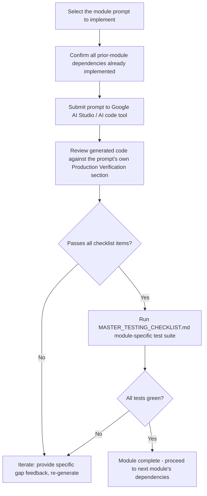

# MASTER_IMPLEMENTATION_PROMPTS.md
## Log Sheet Muster (LSM) — Google AI Studio Implementation Prompts

**Document Classification:** Official Implementation Prompt Reference
**Governed By:** All nine prior Master Documents — every prompt in this document is constructed by synthesizing the relevant sections of each
**Purpose:** This is the final, executable artifact in the LSM documentation set — a complete, ready-to-use Google AI Studio prompt for every one of `MASTER_BUSINESS_LOGIC.md`'s 22 modules, each self-contained enough to hand to an AI code-generation tool and receive a production-ready implementation conforming to every standard established across this documentation set.

---

# TABLE OF CONTENTS

0. How to Use These Prompts
1. Prompt: Company Module
2. Prompt: Authentication Module
3. Prompt: Employees Module *(upcoming)*
4. Prompt: Attendance Module *(upcoming)*
5. Prompt: Leave Module *(upcoming)*
6. Prompt: Shift Module *(upcoming)*
7. Prompt: Deployment Module *(upcoming)*
8. Prompt: Payroll Module *(upcoming)*
9. Prompt: Inventory Module *(upcoming)*
10. Prompt: Assets Module *(upcoming)*
11. Prompt: Billing Module *(upcoming)*
12. Prompt: Client Module *(upcoming)*
13. Prompt: Vendor Module *(upcoming)*
14. Prompt: ESS Module *(upcoming)*
15. Prompt: Notifications Module *(upcoming)*
16. Prompt: Analytics Module *(upcoming)*
17. Prompt: Reports Module *(upcoming)*
18. Prompt: Workflow Engine Module *(upcoming)*
19. Prompt: Approvals Module *(upcoming)*
20. Prompt: AI Module *(upcoming)*
21. Prompt: Compliance Module *(upcoming)*
22. Prompt: Offline Sync Module *(upcoming)*

---

# CHAPTER 0: HOW TO USE THESE PROMPTS

## 0.1 Purpose

Each prompt in this document is designed to be submitted to Google AI Studio (or an equivalent code-generation-capable AI tool) as a single, complete implementation request for one `MASTER_BUSINESS_LOGIC.md` module. This chapter explains the prompt structure and the correct workflow for using them.

## 0.2 Universal Prompt Structure

Every prompt in Chapters 1-22 follows this identical 12-part structure, directly mirroring the Project Overview's original requirement ("Each prompt must include Architecture, Business Logic, Firestore CRUD, Validation, UI, UX, Firebase, Notifications, Offline Sync, Security, Testing, Production Verification"):

1. **Context Header** — which module, which prior documents it's synthesized from
2. **Architecture** — the exact layer/file structure to generate, per `MASTER_PROJECT_RULES.md` Chapter 4 and §15.3
3. **Business Logic** — the specific `RULE-<MODULE>-*` requirements to implement, verbatim from `MASTER_BUSINESS_LOGIC.md`
4. **Firestore CRUD** — the exact collection structure, per `MASTER_FIRESTORE_ARCHITECTURE.md` and `MASTER_DATABASE_DICTIONARY.md`
5. **Validation** — field-level validation rules, per `MASTER_DATABASE_DICTIONARY.md`'s validation columns
6. **UI** — required screens and components, per `MASTER_UI_UX_DESIGN_SYSTEM.md`
7. **UX** — workflow/interaction requirements, per `MASTER_PROJECT_RULES.md` Chapter 8
8. **Firebase** — specific SDK usage, Cloud Functions required, per `MASTER_API_CONTRACT.md`
9. **Notifications** — trigger points, per the module's cross-reference to `MASTER_BUSINESS_LOGIC.md` Module 15
10. **Offline Sync** — specific offline behavior, per the module's own Offline Behavior subsection
11. **Security** — Security Rules and permission requirements, per `MASTER_SECURITY_FRAMEWORK.md`
12. **Testing** — required test coverage, per `MASTER_TESTING_CHECKLIST.md`'s module-specific checklist
13. **Production Verification** — the exact Module-Level Production Checklist items from `MASTER_PROJECT_RULES.md` §18.2 that must pass

## 0.3 Prompt Usage Workflow



## 0.4 Module Dependency Order

**Rule PROMPT-001:** Modules must be implemented in an order respecting their dependency graph — a module referencing another module's collections/Use Cases cannot be meaningfully implemented (or tested) before its dependencies exist. The recommended implementation order, derived from cross-referencing every module's "Cross-Module Consistency" and "Cross-Reference" notes throughout `MASTER_BUSINESS_LOGIC.md`:

**Tier 1 (Foundational, no dependencies):** Company, Authentication
**Tier 2 (Depends only on Tier 1):** Employees, Notifications, Workflow Engine
**Tier 3 (Depends on Tier 1-2):** Attendance, Leave, Shift, Client, Vendor
**Tier 4 (Depends on Tier 1-3):** Deployment, Inventory, Assets, Compliance
**Tier 5 (Depends on Tier 1-4):** Payroll, Billing, Approvals
**Tier 6 (Depends on Tier 1-5):** ESS, Analytics, Reports, AI, Offline Sync (though Offline Sync's *infrastructure* is actually built early and applied throughout — it is ordered last here only because its *full test verification* depends on every other module existing to test against)

## 0.5 Prompt Customization Note

**Rule PROMPT-002:** Each prompt below is complete and self-contained, but references "prior modules already implemented" — when submitting to an AI tool, the actual generated code from previously-completed modules should be included as context (e.g., via file upload or pasted reference) so the AI tool can correctly integrate with existing Repository interfaces, Domain models, and Firestore collections rather than regenerating conflicting duplicate implementations.

---

# CHAPTER 1: PROMPT — COMPANY MODULE

## 1.1 Complete Prompt Text

```
CONTEXT:
You are implementing the Company module for Log Sheet Muster (LSM), an enterprise
Android workforce management platform. This is a Tier 1 foundational module — the
tenancy root every other module depends on. Follow Clean Architecture + MVVM per
the standards below exactly; do not deviate, simplify, or generate placeholder code.

ARCHITECTURE:
Generate code across these Gradle modules:
- :domain/model/Company.kt — immutable data class, zero Android/Firebase imports
- :domain/repository/CompanyRepository.kt — interface only
- :domain/usecase/company/{OnboardCompanyUseCase, UpdateCompanyConfigUseCase,
  CheckSubscriptionStatusUseCase, SuperAdminCrossCompanyAccessUseCase}.kt
- :data/firestore/dto/CompanyDto.kt + mapper
- :data/repository/CompanyRepositoryImpl.kt
- :feature:superadmin/screen/company/{CompanyOnboardingScreen, CompanyListScreen}.kt
  (Note: Company Settings screens live in :feature:employees or a shared
  :feature:companysettings module accessible to Company Admin role)
- firebase/functions/src/company/onboardCompany.ts

BUSINESS LOGIC (implement every rule below exactly, with KDoc referencing the rule ID):
RULE-COMPANY-001: Company creation is Super-Admin-exclusive, all-or-nothing atomic
  creation (Company doc + initial Admin user + default config), duplicate GST
  triggers a warning requiring explicit acknowledgment, not a hard block.
RULE-COMPANY-002: companyId immutable post-creation.
RULE-COMPANY-003: Subscription enforcement — SUSPENDED/EXPIRED blocks writes but
  never reads; 7-day configurable grace period; persistent non-dismissible banner.
RULE-COMPANY-004: Employee limit enforcement against maxEmployeeLimit, both
  client-side and server-side (Cloud Function).
RULE-COMPANY-005: defaultLeavePolicy/defaultShiftTypes are editable pre-populated
  defaults, changes apply prospectively only.
RULE-COMPANY-006: Super Admin cross-company access is logged to that company's
  auditLog with a stated reason (dropdown: Support Request, Compliance
  Investigation, Billing Dispute, Other + free text).

FIRESTORE CRUD:
Collection: /companies/{companyId} — companyId is a human-readable slug, generated
  at creation, immutable thereafter. Full field schema:
  [paste MASTER_DATABASE_DICTIONARY.md §1.1's complete field table here]
Subcollections: /sites, /roles, /shiftTypes, /leavePolicyTypes, /auditLog
  [paste MASTER_DATABASE_DICTIONARY.md §1.2 Sites schema here]
Required composite indexes: none beyond single-field (see
  MASTER_FIRESTORE_ARCHITECTURE.md §3.2).

VALIDATION:
Implement every validation rule from MASTER_DATABASE_DICTIONARY.md §1.1's table
  exactly — GST regex ^[0-9]{2}[A-Z]{5}[0-9]{4}[A-Z]{1}[1-9A-Z]{1}Z[0-9A-Z]{1}$,
  PAN regex ^[A-Z]{5}[0-9]{4}[A-Z]{1}$, all required-field and range checks.
Validation must occur at Domain-layer (Use Case) AND server-side (Cloud Function)
  per the compliance/financial-risk classification — subscription and employee-
  limit checks are financial-risk category, MUST be server-enforced.

UI (per MASTER_UI_UX_DESIGN_SYSTEM.md):
- Company Onboarding Wizard: multi-step LsmStepper (Chapter 9.5), progressive
  disclosure per Chapter 8.7 of Project Rules — company profile, initial Admin,
  subscription tier, default config, each step optional-completable with
  sensible defaults.
- Company List (Super Admin): LsmCard list, search/filter by subscription
  status, deep-links to Company detail.
- Company Settings (Admin): sectioned form, Comfortable density mode per
  Chapter 1.4 of Design System (this is an infrequent, non-field, but
  still Admin-context screen — use Compact density per the Admin Graph default).
- Subscription banner: persistent, non-dismissible-except-by-admin-action,
  color.status.absent styling when SUSPENDED/EXPIRED.

UX:
- Onboarding wizard never requires exhaustive upfront config — every non-
  mandatory field has a sensible pre-filled default, editable later.
- Employee-limit-reached error message: exact wording "Employee limit reached
  for your current plan (X/Y). Upgrade your subscription or deactivate an
  existing employee." with an upgrade-request action routed to Super Admin/Sales.

FIREBASE:
- Cloud Function: onboardCompany (onCall) — atomic multi-step creation with
  compensating rollback on partial failure, per MASTER_API_CONTRACT.md's
  standard request/response envelope.
- Cloud Function: checkSubscriptionStatus — invoked by CompanySubscriptionGuard
  domain service before every write-path Use Case across ALL modules (this is
  a cross-cutting guard, not Company-module-exclusive).
- Firestore Security Rules: Pattern-A-adjacent root document rules — read allowed
  for isSameCompany() || isSuperAdmin(), write restricted per the specific
  operation's permission requirement.

NOTIFICATIONS:
- Welcome/credentials notification to initial Company Admin upon onboarding.
- Subscription expiry warning notifications (7/3/1 day before grace period ends).

OFFLINE SYNC:
- Company Settings changes require connectivity (NOT offline-first — this is a
  desk-based, infrequent, high-stakes admin operation per the risk-based
  approach in Project Rules §6.7).
- Company configuration READS (leave policy, shift types) ARE cached (Room) so
  dependent modules function offline using last-synced configuration.

SECURITY:
- Company creation restricted to superAdmin custom claim exclusively.
- companyId field on every Pattern A collection immutable via Security Rules.
- Cross-company Super Admin access requires audit log write in the SAME
  transaction as the access (not best-effort/eventual).

TESTING (generate test files for all of these):
- Unit: OnboardCompanyUseCase duplicate-GST warning path, all-or-nothing
  rollback simulation; CompanySubscriptionGuard grace-period boundary tests
  (exactly at expiry, 1 day into grace, last day, 1 day past); employee-limit
  exactly-at-limit and one-over tests.
- Integration (Firebase Emulator): onboardCompany partial-failure rollback
  confirms no orphaned Auth account; Security Rule tests for cross-company
  isolation on /companies/{companyId} itself.
- UI: Onboarding wizard full flow, Company List search/filter.

PRODUCTION VERIFICATION (this module is NOT complete until):
- Every screen defined has zero placeholder/dummy content.
- Full CRUD works against real Firestore (dev/staging project, never prod).
- Every role's access enforced in UI AND Security Rules.
- Subscription enforcement tested end-to-end including grace period boundary.
- Audit logging for cross-company access verified via actual Super Admin
  test account performing a cross-company read.
- Domain layer test coverage ≥ 90%.
```

---

---

# CHAPTER 2: PROMPT — AUTHENTICATION MODULE

## 2.1 Complete Prompt Text

```
CONTEXT:
You are implementing the Authentication module for LSM. This is a Tier 1
foundational module establishing identity and the custom-claims trust model
every other module's authorization depends on. This is the platform's single
most security-critical module — follow every rule below with zero deviation.

ARCHITECTURE:
- :domain/model/{UserProfile, Device, AuthSession}.kt
- :domain/repository/AuthRepository.kt — interface only
- :domain/usecase/auth/{SignInUseCase, SignOutUseCase, EnrollMfaUseCase,
  RegisterDeviceUseCase, RevokeSessionUseCase}.kt
- :domain/service/PermissionEvaluator.kt — resolves permissions from custom
  claims, zero Firebase dependency, pure Kotlin
- :data/firestore/dto/UserDto.kt + mapper (display-only fields explicitly
  documented as such in KDoc)
- :data/repository/AuthRepositoryImpl.kt — wraps FirebaseAuth SDK exclusively
  here, never elsewhere in the codebase
- :feature:auth/screen/{SignInScreen, PhoneOtpScreen, MfaSetupScreen,
  MfaRecoveryScreen}.kt
- firebase/functions/src/auth/{onUserProvision, onUserRoleChange, revokeSession,
  revokeMFAEnrollment}.ts

BUSINESS LOGIC:
RULE-AUTH-001: Email/Password for Admin/HR/Ops/Supervisor/Client; Phone OTP
  default for Employee, Email/Password optional alternative. Sign-in method
  migration supported via linkWithCredential(), never forced on role change.
RULE-AUTH-002: companyId/role on /users/{uid} are DISPLAY-ONLY. Custom claims
  (request.auth.token.companyId/role) are the SOLE authorization source. Never
  read the Firestore document's role/companyId field in ANY Security Rule or
  authorization check anywhere in the codebase.
RULE-AUTH-003: Role/company change requires force token refresh
  (getIdToken(true)), triggered by a listener on the user's own /users/{uid}
  document detecting roleChangeTimestamp update.
RULE-AUTH-004: Account lockout after 5 failed attempts in 15 minutes, 30-minute
  lock, Company Admin notified.
RULE-AUTH-005: Device registration on every successful login (deterministic
  deviceId from Android ID + install ID, per MASTER_SECURITY_FRAMEWORK.md §7.2
  — NOT IMEI or hardware serial).
RULE-AUTH-006: MFA mandatory for Super Admin/Company Admin within 7-day grace
  period, then hard-restricted to MFA setup screen only. TOTP via Firebase
  Auth MFA, never SMS-based second factor.
RULE-AUTH-007: Logout clears Room-cached sensitive tables (Employee PII,
  Payroll, Bank Details), preserves non-sensitive UI preferences.

FIRESTORE CRUD:
[paste MASTER_DATABASE_DICTIONARY.md §2.1-2.4 complete field tables:
 users/{uid}, users/{uid}/devices, users/{uid}/fcmTokens, authAuditLog]
CRITICAL: users/{uid} client-writable field whitelist is EXACTLY
  {displayName, profilePhotoUrl} — implement via Security Rule
  request.resource.data.diff(resource.data).affectedKeys().hasOnly([...]).

VALIDATION:
Phone regex ^\+91[6-9]\d{9}$, email standard format validation.
Custom claims validated server-side ONLY (Cloud Function), never client-settable.

UI:
- SignInScreen: adapts fields based on detected/selected role's expected method
  (Chapter 3.2-3.3 of MASTER_SECURITY_FRAMEWORK.md for exact password/OTP
  policy parameters to enforce client-side for immediate feedback).
- MfaSetupScreen: QR code display, TOTP verification input, per the enrollment
  flow sequence diagram in MASTER_SECURITY_FRAMEWORK.md §3.3.
- Account-locked state: clear countdown-to-unlock messaging, never a bare
  "try again later."

UX:
- MFA setup restriction: full app access blocked except MFA-setup screens,
  persistent non-dismissible reminder banner during the 7-day grace period.
- New-device-login notification includes a "This wasn't me" action triggering
  immediate session revocation + password reset flow.

FIREBASE:
- onUserProvision (onCall): the ONLY code path calling setCustomUserClaims()
  alongside onUserRoleChange — enforce via a CI static-analysis check scanning
  for any other invocation of this Admin SDK method.
- App Check (Play Integrity provider) enforced, debug provider for dev/staging
  only, registered in the internal testing Firebase project only.
- Firebase Auth password policy configured at project level per
  MASTER_SECURITY_FRAMEWORK.md §1.2's exact parameters.

NOTIFICATIONS:
- Failed-login-lockout notification to affected user AND their Company Admin.
- New-device-login security-awareness notification.

OFFLINE SYNC:
- Initial sign-in requires connectivity (cannot authenticate offline first-time).
- Post-authentication, Firebase Auth SDK's local token cache allows continued
  offline operation within the current token's 1-hour validity window.

SECURITY:
- Every Security Rule check MUST read request.auth.token.*, NEVER
  resource.data.role or resource.data.companyId on the users collection.
- MFA enrollment status (mfaEnrolled) mirrored to Firestore for UI convenience
  ONLY — the actual gating check reads Firebase Auth's multiFactor.enrolledFactors
  server-side/SDK-verified state, never trusting the mirrored Firestore field
  alone for the access-restriction decision.
- Implement the withAuthCheck() and requirePermission() shared Cloud Function
  wrapper utilities per MASTER_API_CONTRACT.md §4.3/4.5 — every other module's
  Cloud Functions will depend on these.

TESTING:
- Unit: PermissionEvaluator resolution across every role bundle from
  MASTER_SECURITY_FRAMEWORK.md §2.4's default role table; account lockout
  counter boundary (4 vs 5 failures).
- Integration (Emulator): Security Rule tests confirming a crafted write with
  mismatched Firestore role field vs Auth custom claim is rejected using the
  CLAIM, not the Firestore field, for the authorization decision — this is the
  single most important test in this module.
- Manual UAT: MFA setup and recovery flow end-to-end; account lockout and
  recovery end-to-end.

PRODUCTION VERIFICATION:
- Static analysis confirms setCustomUserClaims() has exactly one call site pair.
- Every Security Rule across the ENTIRE platform (not just this module) verified
  to never reference resource.data.role/companyId on the users collection.
- MFA enforcement tested with an actual lost-device recovery simulation.
- App Check enforcement confirmed blocking a non-attested test client in a
  staging-environment adversarial test.
```

---

---

# CHAPTER 3: PROMPT — EMPLOYEES MODULE

## 3.1 Complete Prompt Text

```
CONTEXT:
You are implementing the Employees module for LSM (Tier 2, depends on Company
and Authentication modules already implemented — use their existing
CompanyRepository, AuthRepository, and PermissionEvaluator). This is the
central entity nearly every other module references.

ARCHITECTURE:
- :domain/model/{Employee, EmployeeDocument}.kt
- :domain/repository/EmployeeRepository.kt
- :domain/usecase/employees/{CreateEmployeeUseCase, ActivateEmployeeUseCase,
  UpdateEmployeeUseCase, TransitionEmploymentStatusUseCase,
  OffboardEmployeeUseCase, UploadEmployeeDocumentUseCase}.kt
- :domain/service/ReportingChainValidator.kt — cycle detection
- :data/firestore/dto/EmployeeDto.kt + mapper WITH field-level masking logic
  for sensitive fields based on caller's employees.viewSensitive permission
- :data/repository/EmployeeRepositoryImpl.kt
- :feature:employees/screen/{list, detail, onboarding-stepper}/...
- firebase/functions/src/employees/activateEmployee.ts

BUSINESS LOGIC:
RULE-EMPLOYEE-001: employeeCode unique within company, race-condition-safe
  (server-side authoritative check).
RULE-EMPLOYEE-002: Cannot activate (employmentStatus=ACTIVE) without: fullName,
  contactNumber, joiningDate, AND at least one of {PAN, Aadhaar}.
RULE-EMPLOYEE-003: bankAccountNumber/aadhaarNumber/panNumber visible unmasked
  ONLY to employees.viewSensitive permission holders — masked as XXXX1234
  pattern for everyone else, enforced at mapper layer (unmasked value never
  even transmitted to unauthorized client).
RULE-EMPLOYEE-004: Employment status state machine EXACTLY as specified:
  DRAFT→ACTIVE→{ON_LEAVE↔ACTIVE, SUSPENDED↔ACTIVE, RESIGNED, TERMINATED}.
  Reject ALL undefined transitions (e.g., DRAFT→TERMINATED direct).
RULE-EMPLOYEE-005: Offboarding cascade on TERMINATED/RESIGNED: (a) end active
  Deployment, (b) disable (not delete) Firebase Auth account, (c) flag device
  registrations for review, (d) flag for Full & Final payroll settlement.
  Partial cascade failure surfaces explicitly, never silently succeeds.
RULE-EMPLOYEE-006: Document expiry (esp. POLICE_VERIFICATION) triggers
  reminder 30 days before + at expiry, scheduled Cloud Function scan.
RULE-EMPLOYEE-007: reportingManagerId cycle detection, bounded depth traversal
  (max 10 levels), self-reference rejected.

FIRESTORE CRUD:
[paste MASTER_DATABASE_DICTIONARY.md §3.1-3.4 complete field tables]
Document ID: auto-ID. Sensitive fields (bankAccountNumber, panNumber,
  aadhaarNumber) application-level encrypted per MASTER_SECURITY_FRAMEWORK.md
  §5.4 — encryption/decryption ONLY in Cloud Functions, never client-side.

VALIDATION:
[paste MASTER_DATABASE_DICTIONARY.md §3.1's full validation column]

UI (per MASTER_UI_UX_DESIGN_SYSTEM.md):
- Employee Directory: LsmCard list, search/filter/sort first-class (Chapter
  7.5 of Project Rules), Compact density (Admin/HR graph).
- Employee Onboarding: multi-step LsmStepper (4 steps: Personal Info,
  Documents, Bank Details, Role Assignment), autosave draft state surviving
  process death (Rule DS-025).
- Employee Detail: two-pane on Expanded width (Chapter 12.2 of Design System).
- Sensitive fields render masked by default with a reveal-if-permitted pattern,
  never a toggle that could be screen-recorded/shoulder-surfed without intent.

UX:
- Activation blocked with specific field-by-field messaging on what's missing.
- Offboarding: pending Deployment must be resolved first, exact message
  "This employee has an active deployment at [Site Name]. End the deployment
  before offboarding."
- Document expiry reminder actionable directly from the notification.

FIREBASE:
- activateEmployee (onCall): re-validates mandatory fields server-side,
  creates Auth account (Phone OTP or Email per Rule AUTH-001), sets custom
  claims via the shared onUserProvision pattern, links employeeId<->uid.
- Scheduled function: document expiry daily scan across all companies
  (company-isolated per-invocation, per MASTER_FIRESTORE_ARCHITECTURE.md
  Rule FSA pattern).

NOTIFICATIONS:
- Document expiry reminders (30-day and at-expiry).
- Activation success/credential delivery.
- Status change notifications to employee and reporting manager.

OFFLINE SYNC:
- Employee Directory fully browsable offline (Room cache) with "last synced
  at" indicator.
- New employee Activate action requires connectivity (Auth account creation);
  draft form data can be composed offline and queued.

SECURITY:
- employees.viewSensitive permission gates unmasked field access BOTH client-
  side (UI) and server-side (never transmitted if lacking permission).
- Security Rule template exactly per MASTER_FIRESTORE_ARCHITECTURE.md §16.3.

TESTING:
- Unit: every status transition (valid AND invalid attempts), offboarding
  cascade including simulated partial failure, circular reporting-chain
  detection (direct, indirect, self-reference).
- Integration: Security Rule test confirming employees.viewSensitive correctly
  gates unmasked fields at the SERVER level (craft a request as an
  unpermissioned user, confirm masked/absent field in response).

PRODUCTION VERIFICATION:
- Full onboarding flow tested end-to-end including document upload.
- Offboarding cascade tested with real Deployment/Asset/Inventory records
  present, confirming all four cascade actions.
- Sensitive-field masking verified via actual network traffic inspection,
  not just UI inspection.
```

---

---

# CHAPTER 4: PROMPT — ATTENDANCE MODULE

## 4.1 Complete Prompt Text

```
CONTEXT:
You are implementing the Attendance module for LSM (Tier 3, depends on Company,
Authentication, Employees). This is the platform's highest-frequency,
highest-scrutiny module — the digital replacement for the literal paper "log
sheet" this product is named after. Correctness here has direct wage and
billing consequences.

ARCHITECTURE:
- :domain/model/AttendanceRecord.kt
- :domain/repository/AttendanceRepository.kt
- :domain/usecase/attendance/{MarkAttendanceUseCase, CorrectAttendanceUseCase,
  ReviewGeofenceOverrideUseCase}.kt
- :domain/service/{GeofenceValidator, OvertimeCalculator}.kt
- :data/repository/AttendanceRepositoryImpl.kt — implements deterministic ID
  generation (see below)
- :feature:attendance/screen/{mark-attendance, register, history, geofence-review}
- firebase/functions/src/attendance/{markAttendanceServer, autoAbsentScheduled}.ts

BUSINESS LOGIC:
RULE-ATTENDANCE-001: Document ID = hash(employeeId + "_" + shiftDate + "_" +
  shiftId) — deterministic, NEVER auto-ID. This is the single most important
  implementation detail in this module; get this exactly right, as every
  offline-retry-safety guarantee depends on it.
RULE-ATTENDANCE-002: Geofence validation client-side (immediate UX) AND
  server-side (Cloud Function re-validation, since GPS is client-reported and
  must not be blindly trusted). Out-of-geofence without override ->
  PENDING_SUPERVISOR_REVIEW sub-state, never silent rejection.
RULE-ATTENDANCE-003: Late threshold = shift.gracePeriodMinutes after scheduled
  start; status becomes LATE not PRESENT.
RULE-ATTENDANCE-004: Auto-absent scheduled function, cutoff = shift start + 2hrs
  configurable, only for employees with active Deployment and no existing
  record. Late check-in after auto-absent = correction via the SAME
  deterministic ID (never a new record).
RULE-ATTENDANCE-005: Supervisor proxy marking restricted to their own assigned
  site(s), validated via active Deployment/assignment cross-check.
RULE-ATTENDANCE-006: isPayrollLocked=true blocks ALL edits including HR,
  enforced via Security Rule requiring resource.data.isPayrollLocked==false.
RULE-ATTENDANCE-007: Every correction logged to correctionHistory array with
  before/after/actor/reason; corrections beyond 3-day window require
  attendance.correctBeyondWindow permission (HR-tier), not standard Supervisor
  attendance.correct.

FIRESTORE CRUD:
[paste MASTER_DATABASE_DICTIONARY.md §4.1's complete field table]
Composite indexes required: [paste MASTER_FIRESTORE_ARCHITECTURE.md Chapter 12
  rows 13-16 — the 4 attendance-specific indexes]

VALIDATION:
Business-State Consistency: no mark without active Deployment for
  (employeeId, siteId, shiftDate).
Cross-Document: geofence validated against sites/{siteId}.geofenceCenter/Radius.

UI:
- Mark Attendance: SINGLE unambiguous primary LsmButton, Comfortable density,
  56dp minimum, per Chapter 8.3 UX flow of Project Rules exactly — this is the
  most scrutinized screen in the entire platform.
- Status rendering: icon+color+text triad for all 7 statuses (color.status.*
  tokens per MASTER_UI_UX_DESIGN_SYSTEM.md §4.3), NEVER color alone.
- Daily Attendance Register: LsmDataTable, site-wise, sticky first column,
  Compact density.
- Geofence Exception review: Supervisor-facing, full context inline
  (no cross-navigation needed to decide).

UX:
- Optimistic UI: tap-to-confirmation feedback within 300ms even though actual
  Firestore write completes asynchronously.
- Sync Status Indicator (Synced/Pending/Failed) mandatory on this screen above
  all others in the platform.
- Non-happy-path (offline, out-of-geofence, sync failure) ALWAYS has a defined,
  humane explanation + next step, per Chapter 8.3.2 UX Rule of Project Rules.

FIREBASE:
- markAttendanceServer (onCall, invoked specifically for the geofence-override-
  review sub-flow — simple in-geofence marks may use direct Firestore write
  per MASTER_API_CONTRACT.md §1.4's noted exception).
- autoAbsentScheduled: daily, per-company-isolated, cross-checks Leave module
  to avoid double-status-setting a record already ON_LEAVE.

NOTIFICATIONS:
- Supervisor: pending geofence-override review.
- Employee: auto-marked absence with dispute/correction option.
- HR: correction requests requiring attendance.correctBeyondWindow.

OFFLINE SYNC (this module is the flagship offline-first flow):
- Optimistic local write with deterministic ID ensures safe queue/retry.
- Geofence validation runs against LOCALLY CACHED site config for full offline
  function; server-side re-validation on sync can retroactively flag for
  review (transparent to user, never silent).
- This is THE reference implementation other modules' offline behavior should
  be modeled after.

SECURITY:
- Payroll-lock enforcement at Security Rule level, tested against EVERY role
  including HR to confirm zero bypass path.
- Server-side geofence re-validation cannot be skipped by a compromised client.

TESTING:
- Unit: deterministic ID idempotency proof (repeated calls, identical inputs
  -> identical ID); auto-absent logic against Leave-interaction edge cases;
  overnight shift midnight-boundary duration calculation.
- Integration: payroll-locked record rejects update from every role; offline
  simulation with geofence reconciliation edge case.

PRODUCTION VERIFICATION:
- Full attendance flow tested on an actual budget device outdoors in direct
  sunlight (per UAT persona requirements).
- Airplane-mode-mid-task test passed for the full mark-to-sync cycle.
- Payroll lock verified unbypassable by HR role specifically (highest-privilege
  role most likely to be granted an accidental bypass if misconfigured).
```

---

---

# CHAPTER 5: PROMPT — LEAVE MODULE

## 5.1 Complete Prompt Text

```
CONTEXT:
You are implementing the Leave module for LSM (Tier 3, depends on Company,
Authentication, Employees; interoperates tightly with Attendance).

ARCHITECTURE:
- :domain/model/{LeaveRequest, LeavePolicyType, LeaveBalance}.kt
- :domain/repository/LeaveRepository.kt
- :domain/usecase/leave/{ApplyLeaveUseCase, ApproveLeaveUseCase,
  CancelLeaveUseCase, ProcessAccrualUseCase}.kt
- :data/repository/LeaveRepositoryImpl.kt
- :feature:leave/screen/{apply, balance, history, approval}
- firebase/functions/src/leave/{processLeaveApproval, monthlyAccrualScheduled,
  yearEndCarryForwardScheduled}.ts

BUSINESS LOGIC:
RULE-LEAVE-001: endDate>=startDate, no overlap vs APPROVED/PENDING_APPROVAL,
  numberOfDays<=currentBalance unless negative-balance policy, advance-notice
  check (Sick Leave exempted).
RULE-LEAVE-002: 1-level or 2-level approval chain, company-configurable.
RULE-LEAVE-003: Balance deduction ONLY on final APPROVED, via Firestore
  transaction (read-check-deduct atomic).
RULE-LEAVE-004: Soft-hold during PENDING_APPROVAL — shown separately from
  spendable balance, NOT deducted yet.
RULE-LEAVE-005: Cancellation pre-startDate = full transactional credit-back;
  post-startDate-begun = partial adjustment requiring HR permission, logged
  like correctionHistory.
RULE-LEAVE-006: Monthly accrual = annualEntitlementDays/12, pro-rated for
  mid-month joiners based on joiningDate.
RULE-LEAVE-007: Year-end carry-forward = min(currentBalance, maxCarryForwardDays).
RULE-LEAVE-008: Approved leave creates/updates Attendance records with
  status=ON_LEAVE for every date in range (batched write, prevents
  auto-absent conflict).

FIRESTORE CRUD: [paste MASTER_DATABASE_DICTIONARY.md §5.1 full table]

UI: Leave application form (date range picker, balance shown inline, reason
  field), Balance dashboard card, Approval screen showing full context
  (balance + recent attendance pattern) inline per Chapter 8.4 UX Rule.

UX: Mandatory reason on rejection; pending-approvals badge always visible to
  approvers.

FIREBASE: processLeaveApproval (onCall, transactional balance deduction +
  batched Attendance record creation); monthlyAccrualScheduled and
  yearEndCarryForwardScheduled (scheduled, per-company-isolated).

NOTIFICATIONS: application-submitted confirmation, approval/rejection with
  comment, pending-approval to approver.

OFFLINE SYNC: application draftable/queueable offline (server validates
  overlap/balance on sync, tolerant of sync delay); balance viewing uses
  cached value with "as of" freshness indicator.

SECURITY: Balance mutation exclusively via the transactional Cloud Function
  path, never a direct client Firestore write to leaveBalances.

TESTING: overlap boundary dates, concurrent-application-race balance test,
  pro-rated accrual at every day-of-month boundary, carry-forward capping,
  Leave-approval-to-Attendance-cascade integration test including interaction
  with auto-absent scheduled function.

PRODUCTION VERIFICATION: full apply-to-approve-to-balance-update cycle tested;
  Attendance cascade verified with zero conflicting double-status records.
```

---

# CHAPTER 6: PROMPT — SHIFT MODULE

## 6.1 Complete Prompt Text

```
CONTEXT:
You are implementing the Shift module for LSM (Tier 3, depends on Company,
Authentication, Employees; referenced by Attendance, Deployment, Payroll for
time-boundary calculations).

ARCHITECTURE:
- :domain/model/{ShiftType, ShiftRosterEntry, ShiftSwapRequest}.kt
- :domain/repository/ShiftRepository.kt
- :domain/usecase/shift/{CreateRosterEntryUseCase, RequestShiftSwapUseCase,
  ApproveShiftSwapUseCase}.kt
- :feature:shift/screen/{roster-calendar, shift-type-config, swap-request}
- firebase/functions/src/shift/approveShiftSwap.ts

BUSINESS LOGIC:
RULE-SHIFT-001: endTime>startTime unless isOvernight=true (spans to next
  calendar day), all downstream duration math must correctly span this.
RULE-SHIFT-002: Roster assignment requires active Deployment at that site
  covering that date (cross-document check).
RULE-SHIFT-003: No double-booking unless company policy permits (then check
  combined duration against statutory max hours, cross-ref Compliance module).
RULE-SHIFT-004: Swap state machine: PendingTargetAcceptance -> PendingApproval
  -> Approved (atomic batched update of BOTH employees' roster entries) /
  Rejected / Withdrawn.
RULE-SHIFT-005: Deactivating a shiftType never retroactively affects historical
  roster/attendance references.

FIRESTORE CRUD: [paste MASTER_DATABASE_DICTIONARY.md §6.1-6.2 full tables]

UI: Roster calendar view (site-wise, date-range), shift-type config form,
  swap-request flow with target-employee picker.

UX: Coverage-gap visual alert on the roster calendar (cross-ref Deployment
  understaffing alerts).

FIREBASE: approveShiftSwap (onCall, batched write updating both roster entries
  atomically per Rule SHIFT-004).

NOTIFICATIONS: roster published/changed, swap request chain (target ->
  approver), coverage-gap alert to Operations Manager.

OFFLINE SYNC: employee's own upcoming schedule fully cached/offline-browsable;
  roster creation/editing requires connectivity (desk-based Ops activity).

SECURITY: roster-entry creation permission-gated (shift.manage), swap-approval
  gated (shift.approveSwap).

TESTING: overnight duration across midnight boundary, double-booking rejection
  + policy-permitted path with statutory-max check, swap atomicity (no
  partial-swap state achievable under simulated mid-batch failure).

PRODUCTION VERIFICATION: swap workflow tested end-to-end across all 3 parties
  (requester, target, approver); roster-to-Deployment cross-check verified
  blocking an invalid assignment.
```

---

---

# CHAPTER 7: PROMPT — DEPLOYMENT MODULE

## 7.1 Complete Prompt Text

```
CONTEXT:
You are implementing the Deployment module for LSM (Tier 4, depends on
Company, Authentication, Employees, Shift, Client). This is the operational/
commercial core connecting Employees, Sites, Clients, and Billing.

ARCHITECTURE:
- :domain/model/{Deployment, DeploymentHistory}.kt
- :domain/repository/DeploymentRepository.kt
- :domain/usecase/deployment/{CreateDeploymentUseCase, TransferSiteUseCase,
  UpdateBillingRateUseCase, EndDeploymentUseCase}.kt
- :feature:deployment/screen/{register, create, detail, client-staffing-summary}
- firebase/functions/src/deployment/createDeployment.ts

BUSINESS LOGIC:
RULE-DEPLOYMENT-001: Requires ACTIVE employee + isActive site.
RULE-DEPLOYMENT-002: No overlapping ACTIVE deployments per employee by default;
  allowMultiSiteDeployment company policy flag permits with Shift
  double-booking cross-check.
RULE-DEPLOYMENT-003: Status state machine Draft->Active->{OnHold<->Active,
  Completed, Cancelled}; Cancelled/Completed REQUIRE endReason from structured
  enum.
RULE-DEPLOYMENT-004: Site transfer = END current + CREATE new record, NEVER
  in-place siteId mutation (preserves historical billing/payroll attribution).
RULE-DEPLOYMENT-005: billingRate changes effective-dated in /history
  subcollection, never retroactive to already-generated invoices.
RULE-DEPLOYMENT-006: Cancellation cascades to cancel future-dated shiftRoster
  entries only, historical entries untouched.
RULE-DEPLOYMENT-007: Client-role read scope restricted to own clientId,
  whitelisted fields only (never sensitive employee data).

FIRESTORE CRUD: [paste MASTER_DATABASE_DICTIONARY.md §7.1-7.2 full tables]

UI: Deployment Register (site-wise/client-wise), Create form (employee+site+
  dates+billing terms), History timeline view, Client Staffing Summary
  (client-facing, filtered fields).

UX: Approval-pending Draft state for high-value/long-term deployments,
  surfaced to Company Admin.

FIREBASE: createDeployment (onCall, server-validates overlap + employee/site
  active status, financial-risk category per Project Rules §10.4.1).

NOTIFICATIONS: new assignment to employee, approval-pending to Admin,
  cancellation/hold to employee and Client (per policy), understaffing alert
  to Ops Manager.

OFFLINE SYNC: read-cached for "where am I deployed" lookups; creation/
  modification requires connectivity (desk-based Ops activity).

SECURITY: Client-role Security Rule EXPLICITLY excludes sensitive employee
  fields from the query path — implement as a distinct Client-facing
  query/rule, not a filtered version of the internal Ops view.

TESTING: overlap detection (both policy paths), site-transfer-creates-new-
  record verification, cancellation-cascade scope (future-only), Client-role
  query never returns sensitive fields.

PRODUCTION VERIFICATION: full create-to-cancel lifecycle tested; site transfer
  verified preserving historical attribution correctly for a subsequent
  Billing generation test.
```

---

---

# CHAPTER 8: PROMPT — PAYROLL MODULE

## 8.1 Complete Prompt Text

```
CONTEXT:
You are implementing the Payroll module for LSM (Tier 5, depends on Company,
Authentication, Employees, Attendance, Leave, Deployment, Compliance). This
is the platform's HIGHEST financial/legal-stakes module. Errors here directly
affect employee wages and expose companies to labor-law penalties. Treat every
rule below as non-negotiable.

ARCHITECTURE:
- :domain/model/{PayrollRun, Payslip, PayrollReversal}.kt
- :domain/repository/PayrollRepository.kt
- :domain/usecase/payroll/{GeneratePayrollUseCase(thin client trigger only),
  AdjustPayslipUseCase, ApprovePayrollUseCase, FinalizePayrollUseCase,
  RequestPayrollReversalUseCase}.kt
- :feature:payroll/screen/{run-list, generate, review, payslip-detail}
- firebase/functions/src/payroll/{generatePayroll, finalizePayroll,
  processPayrollReversal}.ts — THE CORE LOGIC LIVES HERE, SERVER-SIDE ONLY

BUSINESS LOGIC (server-enforced, financial-risk category, NO client-side-only
  path permitted for ANY of these):
RULE-PAYROLL-001: Payroll generation is server-side aggregation EXCLUSIVELY —
  the Android client NEVER computes gross/net pay; it only triggers generation
  and displays server-computed results.
RULE-PAYROLL-002: Computed basicWage validated against statutoryRateTables
  minimum for employee's state/category; auto-adjusts upward with a compliance
  flag if below floor, NEVER silently disburses non-compliant wage.
RULE-PAYROLL-003: overtimeHours read VERBATIM from attendanceRecords.
  overtimeHours — NEVER independently recalculated in Payroll module.
RULE-PAYROLL-004: PF/ESI deduction = basicWage * rate, gated by esiWageCeiling
  and company pfApplicable/esiApplicable config.
RULE-PAYROLL-005: State machine Draft->UnderReview->Approved->Finalized->
  {Disbursed, Reversed}. Finalization locks ALL constituent attendanceRecords
  (isPayrollLocked=true) in the SAME transaction as the status change.
RULE-PAYROLL-006: Payslip adjustments during Review logged with before/after/
  reason; adjustments beyond a % threshold require Company Admin co-sign
  before Approval proceeds.
RULE-PAYROLL-007: Reversal workflow — Company Admin approval required,
  creates COMPENSATING entry (never deletes/overwrites disbursed history),
  unlocks specific affected attendanceRecords for correction.
RULE-PAYROLL-008: Offboarded employees auto-flagged for Full & Final
  settlement (pro-rated wages + leave encashment + gratuity per applicability)
  in the next payroll run.

FIRESTORE CRUD: [paste MASTER_DATABASE_DICTIONARY.md §8.1-8.4 complete tables]
CRITICAL: payrollRuns/{id}/payslips/{employeeId} uses DETERMINISTIC ID =
  employeeId, enabling idempotent-safe regeneration.

VALIDATION: [paste MASTER_DATABASE_DICTIONARY.md §8.3's full validation column,
  especially the server-computed-field annotations]

UI: Payroll Run list (status-filtered), Generate trigger screen (period
  selection with overlap-prevention), Review screen (payslip list with
  adjustment capability), Payslip detail (employee-facing via ESS too).

UX: Generation shows clear "Processing..." state (this genuinely takes time
  for large employee counts — never fake instant completion); Review screen
  surfaces compliance-floor-adjustment flags prominently, not buried.

FIREBASE:
- generatePayroll (onCall): reads Attendance/Leave/Deployment for period,
  computes per-employee payslip server-side, writes UnderReview run.
- finalizePayroll (onCall): TRANSACTION setting Finalized status + locking
  all Attendance records atomically.
- Both functions are IDEMPOTENT-SAFE: re-running generatePayroll for the same
  period overwrites UnderReview-state draft payslips (keyed by employeeId),
  never creates duplicates.

NOTIFICATIONS: ready-for-review to HR, pending-approval to Admin, payslip-
  ready to every employee on finalization (deep-link to their payslip),
  reversal-request notifications through standard approval pattern.

OFFLINE SYNC: Generation/finalization requires connectivity (server-side
  aggregation); employee payslip viewing cached for offline access to
  historical payslips.

SECURITY: EVERY rule above is server-enforced regardless of client UI state.
  isPayrollLocked Security Rule tested against HR role specifically. Bank
  account number (for disbursement file generation) decrypted ONLY transiently
  in Cloud Function memory, never persisted plaintext, never sent to client
  except already-masked.

TESTING: gross/net computation across {full attendance, partial+leave,
  overtime, minimum-wage-floor-triggering} scenarios; PF/ESI ceiling boundary
  tests; Finalization-locks-all-records atomicity test with simulated
  mid-transaction failure; Reversal test confirming original disbursed data
  NEVER deleted, only compensated.

PRODUCTION VERIFICATION: Full payroll cycle tested end-to-end with a realistic
  247-employee dataset; minimum-wage floor trigger tested with an actual
  below-floor scenario; Reversal workflow tested end-to-end including the
  subsequent corrective payroll run; Full & Final settlement tested against
  an actual offboarded employee.
```

---

---

# CHAPTER 9: PROMPT — INVENTORY MODULE

## 9.1 Complete Prompt Text

```
CONTEXT:
You are implementing the Inventory module for LSM (Tier 4, depends on Company,
Authentication, Employees). Tracks FUNGIBLE, CONSUMABLE, quantity-based stock
(uniforms, batteries) — distinct from Assets (individually-serialized items).

ARCHITECTURE:
- :domain/model/{InventoryItem, InventoryTransaction}.kt
- :domain/repository/InventoryRepository.kt
- :domain/usecase/inventory/{IssueInventoryUseCase, ReturnInventoryUseCase,
  WriteOffInventoryUseCase, StockInUseCase}.kt
- :feature:inventory/screen/{catalog, issuance, ledger, reorder-alerts}
- firebase/functions/src/inventory/processInventoryTransaction.ts

BUSINESS LOGIC:
RULE-INVENTORY-001: EVERY stock change via Firestore TRANSACTION (read
  currentStock, validate sufficiency, update atomically + create ledger entry).
RULE-INVENTORY-002: Every transaction carries client-generated idempotencyKey;
  transaction checks for existing key before applying, preventing offline-
  retry double-decrement.
RULE-INVENTORY-003: Issuance ALSO creates denormalized employees/{id}/
  issuedItems record (batched alongside the ledger entry).
RULE-INVENTORY-004: currentStock < reorderThreshold triggers Store Manager
  notification (evaluated post-transaction, async).
RULE-INVENTORY-005: Write-off requires reason + distinct inventory.writeOff
  permission (separate from inventory.issue/return).
RULE-INVENTORY-006: Offboarding surfaces outstanding issuedItems as a SOFT
  checklist to HR (not a hard block on the termination itself).

FIRESTORE CRUD: [paste MASTER_DATABASE_DICTIONARY.md §9.1-9.3 full tables]

UI: Stock catalog (current levels, reorder-flagged items highlighted), Issue/
  Return flow (employee + item + quantity picker), Ledger view (audit trail).

UX: Insufficient-stock rejection message exact: "Insufficient stock: X
  available, Y requested."

FIREBASE: processInventoryTransaction (onCall or direct transactional
  Firestore write depending on complexity — issuance/return/write-off all
  share the same transactional core logic).

NOTIFICATIONS: reorder-threshold breach, item issued/returned confirmation to
  employee, offboarding outstanding-item reminder to HR.

OFFLINE SYNC: issuance/return offline-capable with idempotency-key safeguard;
  rare over-issuance-due-to-concurrent-offline-actions reconciled and
  surfaced to Store Manager, never silently corrected.

SECURITY: inventory.writeOff distinct permission from inventory.issue/return.

TESTING: concurrency test confirming multiple simultaneous issuance requests
  against limited stock NEVER oversell; idempotency test confirming retried
  transaction with same key doesn't double-decrement.

PRODUCTION VERIFICATION: full issue-return-writeoff cycle tested; concurrent-
  issuance stress test passed with zero oversell.
```

---

# CHAPTER 10: PROMPT — ASSETS MODULE

## 10.1 Complete Prompt Text

```
CONTEXT:
You are implementing the Assets module for LSM (Tier 4, depends on Company,
Authentication, Employees). Tracks INDIVIDUALLY-SERIALIZED, high-value,
long-lived items (vehicles, CCTV, radios) — distinct from Inventory.

ARCHITECTURE:
- :domain/model/{Asset, MaintenanceLogEntry, AssetAssignmentHistory}.kt
- :domain/repository/AssetRepository.kt
- :domain/usecase/assets/{RegisterAssetUseCase, AssignAssetUseCase,
  DecommissionAssetUseCase, RecordMaintenanceUseCase}.kt
- :domain/service/DepreciationCalculator.kt
- :feature:assets/screen/{register, assignment, maintenance-schedule}
- firebase/functions/src/assets/{assignAsset, depreciationScheduled}.ts

BUSINESS LOGIC:
RULE-ASSETS-001: serialNumber unique within company.
RULE-ASSETS-002: Assignment EXCLUSIVE per asset (transaction: read current
  assignment, verify, overwrite + write history entry atomically) — unlike
  Inventory's quantity-based model.
RULE-ASSETS-003: Assignment to employee requires ACTIVE employment status;
  offboarding flags assigned assets for recovery verification.
RULE-ASSETS-004: Depreciation (Straight-Line or Written-Down-Value) computed
  monthly via scheduled function, pro-rated for partial-first-year purchase.
RULE-ASSETS-005: maintenanceLog nextDueDate triggers 7-day-advance reminder +
  overdue escalation.
RULE-ASSETS-006: Decommissioning requires no active assignment first + reason
  + distinct assets.decommission permission.

FIRESTORE CRUD: [paste MASTER_DATABASE_DICTIONARY.md §10.1-10.3 full tables]
Note: currentAssignment is a MAP FIELD directly on the asset document (not a
  denormalized subcollection like Inventory) — this is a deliberate
  architectural asymmetry per MASTER_FIRESTORE_ARCHITECTURE.md Rule FSA-009,
  reflecting Assets' strictly-one-to-one-at-any-instant relationship.

UI: Asset Register (with condition/assignment filters), Assignment flow,
  Maintenance log + due-date calendar.

FIREBASE: assignAsset (onCall, transactional exclusive-assignment enforcement);
  depreciationScheduled (monthly, both calculation methods).

NOTIFICATIONS: maintenance due/overdue, warranty/insurance expiry, assignment
  change, offboarding asset-recovery reminder.

OFFLINE SYNC: register/holdings cached for offline browsing; assignment
  changes require connectivity (desk-based Ops activity).

TESTING: both depreciation methods across full-year and partial-first-year
  scenarios; exclusive-assignment transaction race test (no dual assignment
  achievable); offboarding-triggered recovery flag cascade.

PRODUCTION VERIFICATION: full register-assign-maintain-decommission lifecycle
  tested; depreciation schedule verified against a manually-calculated
  reference value for both methods.
```

---

---

# CHAPTER 11: PROMPT — BILLING MODULE

## 11.1 Complete Prompt Text

```
CONTEXT:
You are implementing the Billing module for LSM (Tier 5, depends on Company,
Authentication, Employees, Attendance, Deployment, Client). Converts verified
Deployment/Attendance data into client invoices — the revenue-generation core.

ARCHITECTURE:
- :domain/model/{Invoice, PaymentHistoryEntry}.kt
- :domain/repository/BillingRepository.kt
- :domain/usecase/billing/{GenerateInvoiceUseCase(thin trigger), ApproveInvoiceUseCase,
  RecordPaymentUseCase, RaiseDisputeUseCase}.kt
- :feature:billing/screen/{invoice-register, generate, detail, client-approval}
- firebase/functions/src/billing/{generateInvoice, overdueEscalationScheduled}.ts

BUSINESS LOGIC:
RULE-BILLING-001: Invoice lineItems computed STRICTLY from actual deployments+
  attendanceRecords for the period — never manually entered for standard
  billing (MANUAL_ADJUSTMENT line items are a distinct, explicitly-flagged
  exception type with mandatory justification).
RULE-BILLING-002: rate per lineItem sourced from Deployment's EFFECTIVE-DATED
  billingRate — a mid-period rate change splits into two line items.
RULE-BILLING-003: invoiceNumber via TRANSACTIONAL counter increment, never
  reused even on cancellation.
RULE-BILLING-004: State machine Draft->PendingClientApproval->{Approved,
  Disputed}->...->Paid/Overdue.
RULE-BILLING-005: Partial payments tracked incrementally; status=Paid only
  when cumulative paymentReceivedAmount >= totalAmount.
RULE-BILLING-006: Client-role sees ONLY own clientId invoices, full line-item
  detail (unlike Deployment's more restricted scope), Approve/Dispute actions
  only, never direct figure edits.
RULE-BILLING-007: Scheduled overdue escalation at due-date/+7days/+30days.

FIRESTORE CRUD: [paste MASTER_DATABASE_DICTIONARY.md §11.1-11.3 full tables]

UI: Invoice Register (aging/overdue-highlighted), Generate flow (client+period
  picker), Invoice detail with line-item breakdown, Client-facing
  approve/dispute screen.

FIREBASE: generateInvoice (onCall, server-side aggregation reading Deployment+
  Attendance, per MASTER_FIRESTORE_ARCHITECTURE.md §6.7's documented query
  chain — this chain executes EXCLUSIVELY server-side).

NOTIFICATIONS: pending-client-approval, dispute-raised, overdue escalation
  tiers, payment-received confirmation.

OFFLINE SYNC: generation requires connectivity; viewing cached for offline
  reference.

TESTING: line-item computation across effective-dated rate change (mid-period
  split); invoice-number concurrent-generation uniqueness test; overdue-
  escalation across all 3 tiers; Client-role query isolation (never another
  client's invoice, cross-tenant AND cross-client).

PRODUCTION VERIFICATION: full generate-approve-pay cycle tested against real
  Deployment/Attendance data; dispute-and-resolve cycle tested; Client-role
  isolation verified via adversarial cross-client query attempt.
```

---

# CHAPTER 12: PROMPT — CLIENT MODULE

## 12.1 Complete Prompt Text

```
CONTEXT:
You are implementing the Client module for LSM (Tier 3, depends on Company,
Authentication). Represents the organizations LSM's user company provides
services TO — distinct from the Client user ROLE (a person logging in on
behalf of a Client entity).

ARCHITECTURE:
- :domain/model/{Client, ClientContact}.kt
- :domain/repository/ClientRepository.kt
- :domain/usecase/client/{CreateClientUseCase, ActivateClientUseCase,
  ProvisionClientUserUseCase}.kt
- :feature:client/screen/{portfolio, onboarding, contract-detail}
- firebase/functions/src/client/{activateClient, contractExpiryScheduled}.ts

BUSINESS LOGIC:
RULE-CLIENT-001: Creation by Operations, requires Company Admin approval
  before usable for Deployment assignment.
RULE-CLIENT-002: Scheduled contract-expiry monitoring, 60/30/7-day escalating
  reminders.
RULE-CLIENT-003: Contract expiry does NOT auto-cancel active Deployments —
  requires explicit human review, prominent unmissable dashboard banner.
RULE-CLIENT-004: Client-Site linkage (one Client, multiple Sites).
RULE-CLIENT-005: defaultBillingRate pre-fills new Deployment forms, override-
  able per-deployment.
RULE-CLIENT-006: Client-role user account provisioned by company only, linked
  to exactly one clientId via custom claim extension.

FIRESTORE CRUD: [paste MASTER_DATABASE_DICTIONARY.md §12.1-12.3 full tables]

UI: Client Portfolio (contract status/expiry-timeline view), Onboarding form,
  Contract document management.

UX: Contract-expired banner exact wording: "Contract expired — X active
  deployments require review."

FIREBASE: activateClient (onCall, Company Admin approval gate).

NOTIFICATIONS: contract expiry escalation, new-client approval-pending,
  contract-expired banner/alert.

SECURITY: Client-role custom claim extension (clientId alongside companyId/
  role) — Security Rule pattern request.auth.token.clientId ==
  resource.data.clientId for ALL Client-scoped reads across Deployment/Billing.

TESTING: Deployment-creation-blocked-for-non-Active-client test; contract-
  expiry scheduled notification across all windows; Client-role clientId-
  claim isolation test (no cross-client leakage even within same company).

PRODUCTION VERIFICATION: full onboard-to-active-to-contract-expiry-alert cycle
  tested; Client-role account provisioning tested end-to-end including the
  claim-based isolation verification.
```

---

---

# CHAPTER 13: PROMPT — VENDOR MODULE

## 13.1 Complete Prompt Text

```
CONTEXT:
You are implementing the Vendor module for LSM (Tier 3, depends on Company,
Authentication; feeds Inventory and Assets modules via goods receipt).
Manages the supply side — suppliers/contractors LSM's user company procures
from, distinct from Client (who receives services).

ARCHITECTURE:
- :domain/model/{Vendor, PurchaseOrder, GoodsReceipt, VendorPayment}.kt
- :domain/repository/VendorRepository.kt
- :domain/usecase/vendor/{CreatePurchaseOrderUseCase, ApprovePOUseCase,
  RecordGoodsReceiptUseCase, RecordVendorPaymentUseCase,
  SubmitPerformanceReviewUseCase}.kt
- :feature:vendor/screen/{directory, po-register, po-create, goods-receipt}
- firebase/functions/src/vendor/recordGoodsReceipt.ts

BUSINESS LOGIC:
RULE-VENDOR-001: PO below threshold auto-approved; above threshold requires
  Company Admin approval (segregation-of-duties, mirrors Payroll Rule 006).
RULE-VENDOR-002: Goods receipt AUTOMATICALLY triggers Inventory STOCK_IN
  (consumables) or Asset registration (equipment) based on line-item category
  — the SINGLE trigger point connecting procurement to Inventory/Assets, no
  manual double-entry. Over-receipt requires explicit override acknowledgment.
RULE-VENDOR-003: Partial receipt supported, status PARTIALLY_RECEIVED until
  all line items fully received.
RULE-VENDOR-004: Performance rating = rolling average from performanceReviews.
RULE-VENDOR-005: poNumber via transactional sequential increment (mirrors
  Billing's invoiceNumber pattern exactly).
RULE-VENDOR-006: vendorPayments independent of PO receipt status (advance
  payments common in real procurement practice).

FIRESTORE CRUD: [paste MASTER_DATABASE_DICTIONARY.md §13.1-13.5 full tables]

UI: Vendor directory (rating-sortable), PO register, PO creation form,
  Goods receipt recording (warehouse-context, may need offline capability).

FIREBASE: recordGoodsReceipt (onCall, triggers the Inventory/Asset cascade
  per Rule VENDOR-002 — this cross-module trigger is the module's most
  complex integration point, implement carefully).

NOTIFICATIONS: PO pending-approval, goods receipt confirmation/over-receipt
  alert, payment-due reminder.

OFFLINE SYNC: goods receipt recording at warehouse locations is offline-
  capable with idempotency-key safeguard (mirrors Inventory Rule 002)
  preventing double-triggered STOCK_IN cascade on retry.

TESTING: goods-receipt-triggers-correct-downstream-module test (Inventory vs
  Asset based on category); over-receipt validation; PO-number concurrent-
  generation uniqueness; offline goods-receipt idempotent-cascade test.

PRODUCTION VERIFICATION: full PO-to-receipt-to-Inventory/Asset-creation cycle
  tested for both consumable and equipment line-item types.
```

---

# CHAPTER 14: PROMPT — ESS MODULE

## 14.1 Complete Prompt Text

```
CONTEXT:
You are implementing the ESS (Employee Self Service) module for LSM (Tier 6,
depends on nearly every prior module). This is NOT a new data domain — it's
the consolidated employee-facing surface aggregating Attendance/Leave/Payroll/
Inventory/Assets access, PLUS two genuinely new capabilities: Grievance and
Announcements. Given ESS runs on the LEAST-trusted device context in the
platform (field employee devices), apply maximum scrutiny to access scoping.

ARCHITECTURE:
- :domain/model/{Grievance, GrievanceTimelineEvent, Announcement}.kt
- :domain/repository/{GrievanceRepository, AnnouncementRepository}.kt
- :domain/usecase/ess/{SubmitGrievanceUseCase, AcknowledgeAnnouncementUseCase,
  UpdateOwnProfileUseCase}.kt
- :feature:ess/screen/{home-dashboard, grievance-submit, grievance-list,
  announcements, profile}
- firebase/functions/src/ess/submitGrievance.ts

BUSINESS LOGIC:
RULE-ESS-001: EVERY ESS query implicitly scoped to
  employeeId==currentUser'sLinkedEmployeeId — enforced via Security Rules
  checking request.auth.uid's linked employee, NEVER trusting a client
  parameter. THIS IS THE MODULE'S MOST CRITICAL RULE.
RULE-ESS-002: Editable profile field WHITELIST exactly: currentAddress,
  emergencyContactName, emergencyContactNumber, alternateContactNumber,
  profilePhotoUrl. ALL other fields read-only from ESS, enforced by Security
  Rule explicitly listing permitted field paths — a bundled write with ANY
  non-whitelisted field must be rejected entirely.
RULE-ESS-003: Anonymous grievance — employeeId still stored (follow-up
  capability) but access-restricted to ONLY the assignedToUserId handler;
  timeline actor attribution shows "Anonymous" to everyone else.
RULE-ESS-004: Grievance SLA escalation — 3 business days default, 24 hours for
  HARASSMENT category (bypasses standard queue, escalates directly to Company
  Admin).
RULE-ESS-005: Announcement targeting evaluated against employee's assignment
  AT PUBLISH TIME (not retroactively updated); acknowledgementRequired shows
  non-dismissible-until-acknowledged card.
RULE-ESS-006: Dashboard aggregates via the SAME Repository interfaces as the
  respective modules (Attendance/Leave/Payroll) — NEVER a separately-
  maintained duplicate data store.

FIRESTORE CRUD: [paste MASTER_DATABASE_DICTIONARY.md §14.1-14.4 full tables]

UI: Home dashboard (aggregated per Rule ESS-006), Grievance submit form
  (with anonymous toggle), Grievance status list, Announcements feed
  (acknowledgement-required cards non-dismissible), Profile (whitelist-only
  editable fields visually distinguished from read-only fields).

UX: Comfortable density mode throughout (field-usage context, Chapter 1.4 of
  Design System); attendance quick-action always accessible from home.

FIREBASE: submitGrievance (onCall specifically for anonymity-handling logic).

NOTIFICATIONS: grievance status changes (anonymity-respecting content),
  SLA escalation to Company Admin, new announcement push (acknowledgement-
  required uses distinct higher-priority channel).

OFFLINE SYNC: dashboard uses each underlying module's own offline caching;
  grievance submission offline-queueable; announcement acknowledgement
  offline-capable via deterministic employeeId-keyed write.

SECURITY: THIS MODULE REQUIRES THE MOST EXHAUSTIVE SECURITY RULE TESTING IN
  THE PLATFORM — an ESS user must be PROVEN unable to read/write ANY other
  employee's data across Attendance/Leave/Payroll/IssuedItems via adversarial
  testing, not just code review.

TESTING: exhaustive self-scope isolation tests across every referenced
  collection; profile-whitelist bundled-write-rejection test; anonymous-
  grievance employeeId-never-exposed-to-non-assigned-HR test; SLA auto-
  escalation including harassment-shortened-path test.

PRODUCTION VERIFICATION: adversarial cross-employee-data-access attempt
  tested and confirmed blocked for EVERY collection ESS touches; anonymous
  grievance tested end-to-end confirming true restricted-visibility (not
  merely UI-hidden).
```

---

---

# CHAPTER 15: PROMPT — NOTIFICATIONS MODULE

## 15.1 Complete Prompt Text

```
CONTEXT:
You are implementing the Notifications module for LSM (Tier 2, depends on
Company, Authentication). This is SHARED INFRASTRUCTURE every other module's
notification triggers funnel through — implement this before or alongside
any module that references "notify X."

ARCHITECTURE:
- :domain/model/{Notification, NotificationTemplate}.kt
- :domain/service/NotificationDispatcher.kt — THE single shared domain service
  every other module's Use Cases call; no module bypasses this to call FCM
  directly
- :data/repository/NotificationRepositoryImpl.kt — isolates FCM SDK calls
- :feature:notifications/screen/{notification-center, preferences}
- firebase/functions/src/notifications/dispatchNotification.ts (internal,
  invoked by other Cloud Functions, not directly client-callable)

BUSINESS LOGIC:
RULE-NOTIFICATIONS-001: Single producer-consumer pipeline — NotificationDispatcher
  resolves template, renders, writes /notifications doc, triggers FCM. No
  other code path in the ENTIRE codebase calls FCM directly.
RULE-NOTIFICATIONS-002: renderedTitle/renderedBody resolved and STORED
  IMMUTABLY at creation time — never re-rendered from a later-edited template.
RULE-NOTIFICATIONS-003: APPROVAL_REQUIRED and ALERT_ESCALATION categories
  CANNOT be muted regardless of client preference — dispatcher ignores mute
  config for these two categories unconditionally.
RULE-NOTIFICATIONS-004: Quiet hours apply ONLY to REMINDER/ANNOUNCEMENT;
  APPROVAL_REQUIRED/STATUS_UPDATE/ALERT_ESCALATION deliver immediately always.
RULE-NOTIFICATIONS-005: Badge/unread count via MAINTAINED COUNTER field,
  incremented/decremented in the SAME transaction as notification creation/
  read-state-update — never a live count() query.
RULE-NOTIFICATIONS-006: deepLinkRoute resolves to fully-formed destination or
  the graceful "no longer available" fallback — never blank/crash.

FIRESTORE CRUD: [paste MASTER_DATABASE_DICTIONARY.md §15.1-15.3 full tables]

UI: Notification Center (chronological/unread-filtered), Preferences screen
  (category mutes limited to REMINDER/ANNOUNCEMENT only — the UI must not even
  present a mute toggle for the two non-mutable categories).

FIREBASE: dispatchNotification (internal Cloud Function called by every other
  module's server-side functions — data-only FCM payload, never notification-
  only payload, per Project Rules §5.6).

NOTIFICATIONS (meta): N/A — this module IS the notification system.

OFFLINE SYNC: Notification Center fully cached (Room); read-state updates
  queued offline with last-write-wins conflict resolution (low-risk, self-
  only writes).

SECURITY: recipientUserId-scoped Security Rules (not companyId-first, per
  the documented indexing exception in MASTER_FIRESTORE_ARCHITECTURE.md
  Rule FSA-010).

TESTING: APPROVAL_REQUIRED/ALERT_ESCALATION never-suppressed test regardless
  of mute config; template-immutability test (edit template post-send,
  confirm sent notification unchanged); unread-counter accuracy under
  concurrent creation/read-state-update; "no longer available" fallback test.

PRODUCTION VERIFICATION: EVERY other module's notification triggers verified
  routing through THIS module's NotificationDispatcher exclusively (a
  cross-module code-review audit, not just this module's own tests).
```

---

# CHAPTER 16: PROMPT — ANALYTICS MODULE

## 16.1 Complete Prompt Text

```
CONTEXT:
You are implementing the Analytics module for LSM (Tier 6, depends on nearly
every module as a data source). Produces pre-computed dashboard rollups —
NEVER live client-side aggregation.

ARCHITECTURE:
- :domain/model/AnalyticsRollup.kt
- :domain/repository/AnalyticsRepository.kt
- :feature:analytics/screen/{attrition-dashboard, attendance-pattern,
  cost-margin, platform-health(super-admin)}
- firebase/functions/src/analytics/{dailyRollupScheduled,
  incrementalCounterTriggered}.ts

BUSINESS LOGIC:
RULE-ANALYTICS-001: Rollups PRE-COMPUTED via Cloud Function only — the Android
  client NEVER runs an aggregation query across raw transactional collections
  for a dashboard metric.
RULE-ANALYTICS-002: Rollup computation is PER-COMPANY-ISOLATED — one Cloud
  Function invocation processes exactly one company, never a cross-company
  batch (even for efficiency) — this is a company-isolation guarantee, not
  merely a performance detail.
RULE-ANALYTICS-003: Near-real-time metrics (Present Today) via write-triggered
  incremental counter; period-based metrics (Attrition) via nightly batch.
RULE-ANALYTICS-004: Every dashboard metric TAPPABLE, deep-links to underlying
  filtered detail view — never a dead-end number.
RULE-ANALYTICS-005: Historical rollups NEVER mutated in place — corrections
  append a new entry with correctionOf reference.
RULE-ANALYTICS-006: superAdminAnalytics is the SOLE sanctioned cross-company-
  read Cloud Function, server-side only, never client-exposed as a direct
  query path.

FIRESTORE CRUD: [paste MASTER_DATABASE_DICTIONARY.md §16.1-16.2 full tables]

UI: Dashboard cards (LsmDashboardCard per Design System §8.3) with freshness
  timestamp for non-live-listened rollups.

FIREBASE: dailyRollupScheduled (per-company-isolated loop),
  incrementalCounterTriggered (on-write for near-real-time metrics).

OFFLINE SYNC: rollup docs cached (small, infrequent-change) for full offline
  dashboard rendering with "as of" freshness indicator.

TESTING: rollup computation across representative grouping scenarios;
  cross-company isolation test (one company's computation never reads
  another's data); historical-rollup-never-mutated-in-place test.

PRODUCTION VERIFICATION: every dashboard card's drill-down verified navigating
  to correctly-filtered underlying data; cross-company isolation independently
  verified via adversarial test.
```

---

---

# CHAPTER 17: PROMPT — REPORTS MODULE

## 17.1 Complete Prompt Text

```
CONTEXT:
You are implementing the Reports module for LSM (Tier 6, depends on nearly
every module as a data source). Produces EXPORTABLE, formatted documents
(PDF/Excel/CSV) for external use — distinct from Analytics' interactive
dashboards.

ARCHITECTURE:
- :domain/model/{ReportDefinition, ReportGenerationJob}.kt
- :domain/repository/ReportRepository.kt
- :domain/usecase/reports/{RequestReportGenerationUseCase,
  PollReportStatusUseCase}.kt
- :feature:reports/screen/{report-catalog, job-history, download}
- firebase/functions/src/reports/generateReport.ts

BUSINESS LOGIC:
RULE-REPORTS-001: Large-data-volume reports generated ASYNCHRONOUSLY via
  reportGenerationJobs — never synchronous within the mobile request-response
  cycle.
RULE-REPORTS-002: Every report embeds generation timestamp + exact parameters
  used; underlying query deterministic (no random sampling).
RULE-REPORTS-003: Reports respect the SAME field-sensitivity rules as the live
  app (masked bank/ID numbers) based on requester's permissions — statutory
  reports requiring unmasked data gated by distinct reports.statutory.generate
  permission.
RULE-REPORTS-004: Failed job -> explicit FAILED status + specific errorMessage
  + Retry notification, NEVER a silently-stuck job.
RULE-REPORTS-005: Client-facing report requests independently server-validated
  against requester's clientId claim, never trusting a client-submitted filter.
RULE-REPORTS-006: Output files retained 1 year default, metadata record
  persists indefinitely with "Regenerate" action for expired references.

FIRESTORE CRUD: [paste MASTER_DATABASE_DICTIONARY.md §16.3-16.4 full tables]

UI: Report catalog (by module), parameter-selection form, Job history list
  with status/download-link, polling-driven progress indicator.

FIREBASE: generateReport (onCall triggers job creation; actual generation is
  a background-triggered function processing the Queued job).

OFFLINE SYNC: generation requires connectivity; job history list cached for
  offline reference to past requests/re-download links.

TESTING: report content exactness vs source data (no off-by-one date-range
  errors); Client-role parameter-manipulation attempt rejected (async-job-
  path-specific isolation test, distinct from live-query isolation tests);
  full async job lifecycle including simulated mid-generation failure.

PRODUCTION VERIFICATION: every report type in the catalog generated and
  spot-checked against manually-computed reference figures for a test dataset.
```

---

# CHAPTER 18: PROMPT — WORKFLOW ENGINE MODULE

## 18.1 Complete Prompt Text

```
CONTEXT:
You are implementing the Workflow Engine module for LSM (Tier 2, depends on
Company, Authentication). This is the GENERIC infrastructure underlying every
approval/status workflow across Leave, Deployment, Payroll, Shift Swap, PO,
Grievance, Client, Billing — implement this BEFORE any module needing an
approval workflow, or alongside Notifications as core Tier 2 infrastructure.

ARCHITECTURE:
- :domain/model/{WorkflowDefinition, WorkflowInstance, TransitionRecord}.kt
- :domain/service/WorkflowStateMachine.kt — the shared domain service EVERY
  workflow-having module's Use Cases call for transitions
- :feature: (no dedicated UI — consumed by other modules' screens)
- firebase/functions/src/workflow/transitionWorkflow.ts

BUSINESS LOGIC:
RULE-WORKFLOW-001: transition() validates against workflowDefinitions.
  transitions array — undefined transitions REJECTED both client and server.
RULE-WORKFLOW-002: EVERY transition writes transitionHistory entry (actor,
  timestamp, reason if required).
RULE-WORKFLOW-003: requiredPermission checked via shared PermissionEvaluator
  before allowing transition.
RULE-WORKFLOW-004: Generic SLA-scanning scheduled function for any workflow
  opting into slaHoursPerState.
RULE-WORKFLOW-005: workflowInstances.currentState kept in sync with source
  entity's own status field via DUAL WRITE in the SAME transaction — never
  allowed to diverge.
RULE-WORKFLOW-006: workflowDefinitions validated at DEFINITION TIME (not
  runtime) confirming every non-terminal state has >=1 outgoing transition.

FIRESTORE CRUD: [paste MASTER_DATABASE_DICTIONARY.md §17.1-17.3 full tables]

FIREBASE: transitionWorkflow (onCall, the SHARED transition endpoint every
  module's approval action calls, parameterized by workflowCode).

TESTING: generic transition() rejection test across MULTIPLE differently-
  shaped workflow definitions (Leave-shaped, Deployment-shaped, PO-shaped) to
  prove true genericity; dual-write consistency test (source status field
  never disagrees with workflowInstances.currentState); definition-time
  validation rejecting a malformed dead-end-containing definition.

PRODUCTION VERIFICATION: every module consuming this engine (Leave, Deployment,
  Payroll, Shift Swap, PO, Grievance, Client, Billing) verified to route their
  state transitions through THIS shared service exclusively, not independent
  reimplementations.
```

---

---

# CHAPTER 19: PROMPT — APPROVALS MODULE

## 19.1 Complete Prompt Text

```
CONTEXT:
You are implementing the Approvals module for LSM (Tier 5, depends on
Workflow Engine, Notifications, and every workflow-having module). This is
the UNIFIED INBOX aggregating every pending approval across all workflow
types into one screen — the approver-facing analog to ESS's employee-facing
aggregation.

ARCHITECTURE:
- :domain/model/ApprovalInboxItem.kt
- :domain/repository/ApprovalRepository.kt
- :domain/usecase/approvals/{FetchInboxUseCase, ActionApprovalUseCase}.kt
- :feature:approvals/screen/{inbox, item-detail, history}
- firebase/functions/src/approvals/ (inbox item creation is triggered WITHIN
  the Workflow Engine's transitionWorkflow function, not a separate endpoint)

BUSINESS LOGIC:
RULE-APPROVALS-001: Inbox item creation AUTOMATIC + DENORMALIZED — whenever a
  workflowInstance enters an approval-required state, create an
  approvalInboxItems entry for EVERY eligible approver, in the SAME
  transaction/batch as the workflow instance creation/transition.
RULE-APPROVALS-002: Multi-approver race handling — when any one approver
  actions an item, ALL corresponding inbox entries for that workflowInstanceId
  are atomically marked ACTIONED in the same transaction.
RULE-APPROVALS-003: Sort by priority (URGENT first) then slaDeadline (soonest
  first).
RULE-APPROVALS-004: Tapping an item fetches LIVE context from the source
  module's own Repository — summaryContext denormalized field is quick-glance
  ONLY, never authoritative for the actual decision.
RULE-APPROVALS-005: Actioned items retain status=ACTIONED (never deleted) for
  Approval History view.
RULE-APPROVALS-006: Badge count via maintained counter, same pattern as
  Notifications Rule 005.

FIRESTORE CRUD: [paste MASTER_DATABASE_DICTIONARY.md §17.4 full table]

UI: Inbox (priority/SLA-sorted list), item detail (live-fetched full context,
  Approve/Reject actions inline per Chapter 8.4 UX Rule — no cross-navigation
  needed), Approval History.

UX: Persistent always-visible badge count on every approval-capable role's
  dashboard/navigation (never something to remember to check).

OFFLINE SYNC: inbox list cached for offline review; approve/reject ACTION
  requires connectivity (invokes Workflow Engine's transactional transition).

TESTING: multi-approver race test (two approvers actioning simultaneously,
  exactly one succeeds, other gracefully informed); denormalized-inbox-never-
  drifts-from-workflowInstances test; badge counter accuracy under high-
  volume concurrent creation/actioning.

PRODUCTION VERIFICATION: every workflow-having module's approval action
  verified surfacing correctly in this unified inbox, with live-context
  fetch confirmed accurate (not stale denormalized data) for at least one
  representative case per source module (Leave, Deployment, PO, Grievance).
```

---

# CHAPTER 20: PROMPT — AI MODULE

## 20.1 Complete Prompt Text

```
CONTEXT:
You are implementing the AI module for LSM (Tier 6, depends on Employees,
Attendance, Grievance/ESS, Analytics). Integrates Google AI Studio as an
ASSISTIVE, ADVISORY layer — NEVER a replacement for deterministic business
logic. Apply maximum caution: AI output must never silently become
authoritative data.

ARCHITECTURE:
- :domain/model/AiSuggestion.kt
- :domain/repository/AiRepository.kt
- :domain/usecase/ai/{RequestDocumentExtractionUseCase,
  ReviewAiSuggestionUseCase, QueryAnalyticsNLUseCase}.kt
- :feature:ai/component/{extraction-review-widget, nl-query-bar,
  ess-assistant-chat}
- firebase/functions/src/ai/{extractDocumentData, analyzeAttendanceAnomaly,
  queryAnalyticsNL}.ts — secure backend-mediated calls to Google AI Studio,
  NEVER direct client-to-model-provider API key exposure

BUSINESS LOGIC:
RULE-AI-001: AI suggestedOutput is ALWAYS a suggestion — NEVER written to an
  authoritative collection without explicit human ACCEPTED/MODIFIED_AND_ACCEPTED
  status transition. THIS IS THE MODULE'S MOST CRITICAL RULE — audit every
  code path to confirm zero exceptions.
RULE-AI-002: Document extraction pre-fills onboarding form fields, remains
  fully editable; low-confidence extractions visually flagged distinctly
  ("AI extraction uncertain — please verify"), never equal visual weight to
  high-confidence.
RULE-AI-003: Attendance anomaly detection surfaces PENDING_REVIEW suggestions
  only — never automatic attendance-record rejection or employee flagging.
RULE-AI-004: Staffing-gap suggestions pre-fill standard Roster/Deployment
  forms — going through ALL normal validation of those modules, never
  bypassing them.
RULE-AI-005: Grievance triage suggests category/priority — actual stored
  values only set on HR confirmation/override.
RULE-AI-006: NL analytics queries translate ONLY against pre-computed Analytics
  rollups, never raw transactional collections; explicit "can't answer"
  fallback for out-of-scope questions, never a fabricated response.
RULE-AI-007: ESS conversational assistant is READ-AND-GUIDE ONLY — cannot
  itself submit a leave application, mark attendance, or perform ANY write
  action on the employee's behalf.
RULE-AI-008: Every AI invocation logged to aiUsageAuditLog (company, type,
  consumption, requester, timestamp).

FIRESTORE CRUD: [paste MASTER_DATABASE_DICTIONARY.md §18.1-18.2 full tables]

UI: Extraction review widget (side-by-side original document + extracted
  fields, confidence-flagged), NL query bar (Admin/Ops dashboards), ESS
  assistant chat interface (clearly scoped, guides to correct screen for
  actions rather than performing them).

FIREBASE: All AI Cloud Functions call Google AI Studio server-side ONLY —
  the API key/credentials NEVER reach the Android client in any form.

OFFLINE SYNC: ALL AI features require connectivity — UI clearly communicates
  "AI assistance requires an internet connection," never a non-functional
  button with no explanation when offline.

SECURITY: Data sent to Google AI Studio scoped to minimum necessary per
  request (data-minimization, cross-ref MASTER_PROJECT_RULES.md §11.8) —
  never a bulk-export-style standing integration.

TESTING: universal check confirming NO code path writes suggestedOutput
  directly to an authoritative collection without human-actioned status
  transition (Rule AI-001 — the single highest-priority test in this module);
  NL query module confirmed only queries rollups, never raw collections;
  ESS assistant confirmed cannot be prompted into any write action
  (adversarial prompt-injection-style testing recommended here specifically).

PRODUCTION VERIFICATION: Rule AI-001 verified via full codebase audit, not
  just unit tests — every aiSuggestions write path traced end-to-end
  confirming the human-confirmation gate is unbypassable.
```

---

---

# CHAPTER 21: PROMPT — COMPLIANCE MODULE

## 21.1 Complete Prompt Text

```
CONTEXT:
You are implementing the Compliance module for LSM (Tier 4, depends on
Company, Employees; consumed by Payroll and Deployment). Supplies the
statutory DATA those modules' business logic depends on, plus manages
compliance artifacts (licenses, statutory registers) that don't belong to
any single operational module.

ARCHITECTURE:
- :domain/model/{StatutoryRateTable, ComplianceLicense, StatutoryRegister}.kt
- :domain/repository/ComplianceRepository.kt
- :domain/usecase/compliance/{ValidatePayrollConfigUseCase,
  DetermineApplicabilityUseCase, RegisterLicenseUseCase}.kt
- :feature:compliance/screen/{license-dashboard, statutory-registers}
- firebase/functions/src/compliance/{licenseExpiryScheduled,
  validateMinimumWageFloor}.ts

BUSINESS LOGIC:
RULE-COMPLIANCE-001: statutoryRateTables PLATFORM-MAINTAINED (Super Admin
  only) — NO company can edit these, ever, under any circumstance.
RULE-COMPLIANCE-002: Company payrollConfig.minimumWageByCategory validated
  server-side at save-time to NEVER be below the applicable statutoryRateTables
  entry for the company's state — this is the platform's single most
  important compliance-integrity control.
RULE-COMPLIANCE-003: Scheduled license-expiry monitoring, 90/60/30/7-day
  escalating windows, PSARA license given elevated urgency framing.
RULE-COMPLIANCE-004: Expired license does NOT auto-block Deployment/Payroll,
  but shows unmissable, acknowledgment-required warning at every new
  Deployment creation screen specifically.
RULE-COMPLIANCE-005: Statutory register generation uses FIXED, government-
  mandated format (not company-customizable), via the standard Reports
  module async pattern.
RULE-COMPLIANCE-006: PF/ESI applicability determination is the SINGLE
  authoritative source Payroll consults — never independently recalculated
  in the Payroll module.

FIRESTORE CRUD: [paste MASTER_DATABASE_DICTIONARY.md §19.1-19.3 full tables]

UI: License Compliance Dashboard (expiry-timeline view), Statutory Register
  generation trigger (via Reports module integration).

FIREBASE: validateMinimumWageFloor (called BY Payroll's payrollConfig save
  path, server-side, financial/compliance-risk category).

NOTIFICATIONS: license expiry escalation (PSARA-specific urgency), statutory
  rate table update notification to HR/Payroll teams.

SECURITY: statutoryRateTables Security Rule allows write ONLY for
  isSuperAdmin() — no exceptions, no company-level override path exists
  anywhere in the codebase.

TESTING: server-side floor-enforcement rejection test (company attempts sub-
  statutory config, confirmed rejected); license-expiry scheduled function
  across all windows including PSARA-specific framing; PF/ESI applicability
  determination cross-validated against Payroll's actual consumption
  (confirm no divergent independent calculation exists anywhere).

PRODUCTION VERIFICATION: minimum-wage floor enforcement verified via an
  actual attempted-bypass test; PF/ESI determination confirmed as the sole
  source Payroll module reads (codebase audit, not just unit test).
```

---

# CHAPTER 22: PROMPT — OFFLINE SYNC MODULE

## 22.1 Complete Prompt Text

```
CONTEXT:
You are implementing the Offline Sync module for LSM — this is CROSS-CUTTING
INFRASTRUCTURE, not a standalone feature module. It should be built EARLY
(alongside Tier 1/2 modules) and applied throughout every subsequent module's
offline-capable flows, per the Offline-First foundational principle. This
final prompt consolidates the infrastructure specification; individual
modules' own prompts (Attendance especially) reference this infrastructure
rather than reimplementing it.

ARCHITECTURE:
- :data/local/room/{LsmDatabase, entities for each cached_* table,
  PendingWriteQueueDao}.kt
- :data/worker/{PendingWriteSyncWorker, ConnectivityAwareSyncTrigger}.kt
- :core:common/sync/{SyncStatus (sealed class: Synced/Pending/Failed),
  ConflictResolutionRegistry}.kt
- :core:designsystem/components/SyncStatusIndicator.kt — the SHARED composable
  every offline-capable screen renders

BUSINESS LOGIC:
RULE-OFFLINESYNC-001: Two-tier strategy — Tier 1 (Firestore native persistence,
  simple single-doc ops) + Tier 2 (Room-backed pending_write_queue via
  WorkManager, multi-step transactions).
RULE-OFFLINESYNC-002: Queue entries idempotent by construction (idempotencyKey
  or deterministic-ID pattern, consistent with each producing module's own
  ID strategy); FAILED_PERMANENT after max retries surfaces persistent,
  actionable, NON-SILENT alert.
RULE-OFFLINESYNC-003: Priority ordering: Attendance > Grievance/Approvals >
  Inventory/Asset transactions > Leave > Announcement-acknowledgement/low-
  urgency.
RULE-OFFLINESYNC-004: Conflict-resolution registry — transaction-with-server-
  recompute for concurrency-risk fields (Inventory stock, Leave balance,
  Payroll figures) vs. last-write-wins for low-risk fields (own profile
  contact details, notification read-state, announcement acknowledgement).
  EVERY new field added by ANY future module must be explicitly classified
  here, never left ambiguous.
RULE-OFFLINESYNC-005: SyncStatusIndicator mandatory on EVERY screen rendering
  offline-sync-dependent data — Synced/Pending/Failed states.
RULE-OFFLINESYNC-006: Read-cache screens show SEPARATE "last synced at"
  freshness indicator, distinct from the write-queue SyncStatusIndicator
  (different concerns: staleness-risk vs. pending-action-risk).
RULE-OFFLINESYNC-007: Non-urgent sync respects battery/metered-network
  preference; wage/time-critical operations (Attendance, Grievance) NEVER
  gated behind these preferences.

IMPLEMENTATION NOTE: This module has no independent Firestore collections of
  its own — pending_write_queue is Room-local-only, never synced to Firestore
  itself (it IS the mechanism for syncing other data TO Firestore).

UI: SyncStatusIndicator (shared component, consumed by every module), Sync
  Health diagnostic screen (Admin-facing, aggregate FAILED_PERMANENT view).

OFFLINE SYNC (self-referential, this module defines it): See Business Logic
  above — this module's entire purpose IS specifying offline sync behavior.

TESTING: extended-offline-period test (multi-hour, not seconds) confirming
  full queue drains correctly in priority order with zero data loss; app-
  process-death-during-offline-period test confirming Room-backed queue
  survives and resumes; conflict-resolution-strategy correctness test for
  EVERY registered field per its classification; cross-cutting audit test
  confirming EVERY module's offline-capable screen renders SyncStatusIndicator
  per its own specification (this test enumerates screens from every OTHER
  module's own §X.7/X.8 Offline Behavior documentation).

PRODUCTION VERIFICATION: this infrastructure is considered complete only once
  EVERY other module (1-21) has been verified to correctly integrate with it
  per their own individual Offline Behavior specifications — this is
  inherently a cross-module, whole-platform verification, not a standalone
  module check.
```

---

# END OF DOCUMENT — MASTER_IMPLEMENTATION_PROMPTS.md

This document is now **complete** — all 23 chapters (usage guide + 22 module prompts) finished:

0. How to Use These Prompts
1. Company | 2. Authentication | 3. Employees | 4. Attendance | 5. Leave
6. Shift | 7. Deployment | 8. Payroll | 9. Inventory | 10. Assets
11. Billing | 12. Client | 13. Vendor | 14. ESS | 15. Notifications
16. Analytics | 17. Reports | 18. Workflow Engine | 19. Approvals | 20. AI
21. Compliance | 22. Offline Sync

**Document Version:** 1.0 — Final
**Governed By:** All nine prior Master Documents in this series
**Status:** Ready to serve as the executable bridge from documentation to implementation.

═══════════════════════════════════════════════════════════
🎉 ALL 10 MASTER DOCUMENTS FOR LOG SHEET MUSTER (LSM) COMPLETE 🎉
═══════════════════════════════════════════════════════════

1. ✅ MASTER_PROJECT_RULES.md (19 chapters)
2. ✅ MASTER_BUSINESS_LOGIC.md (22 modules)
3. ✅ MASTER_FIRESTORE_ARCHITECTURE.md (16 chapters)
4. ✅ MASTER_SECURITY_FRAMEWORK.md (12 chapters)
5. ✅ MASTER_UI_UX_DESIGN_SYSTEM.md (16 chapters)
6. ✅ MASTER_DATABASE_DICTIONARY.md (19 chapters)
7. ✅ MASTER_API_CONTRACT.md (10 chapters)
8. ✅ MASTER_TESTING_CHECKLIST.md (9 chapters)
9. ✅ MASTER_PLAYSTORE_RELEASE.md (9 chapters)
10. ✅ MASTER_IMPLEMENTATION_PROMPTS.md (22 module prompts)

The complete enterprise documentation set for Log Sheet Muster is finished.

----------------------------------------
DOCUMENT:
MASTER_IMPLEMENTATION_PROMPTS.md

STATUS:
✅ DOCUMENT COMPLETE — ALL 22 MODULE PROMPTS FINISHED

STATUS:
✅✅✅ ENTIRE 10-DOCUMENT MASTER SET COMPLETE ✅✅✅
----------------------------------------
