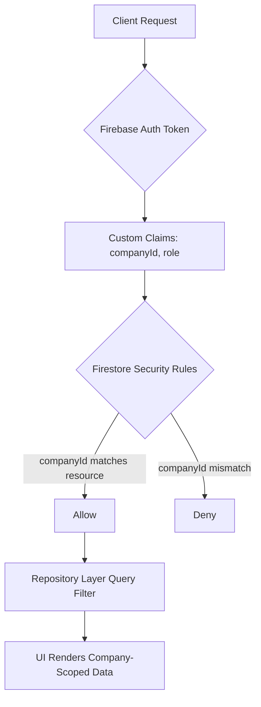
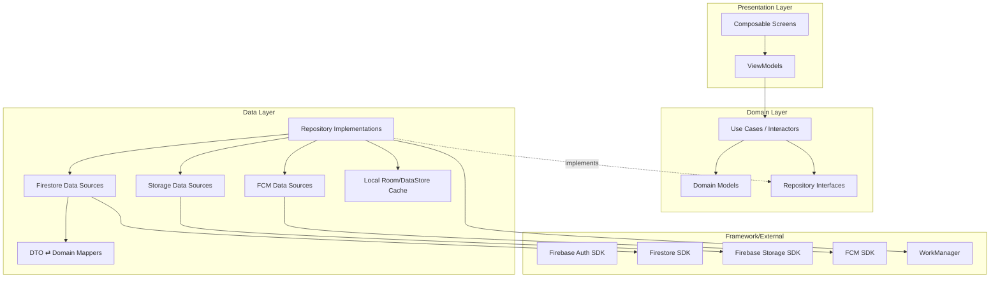
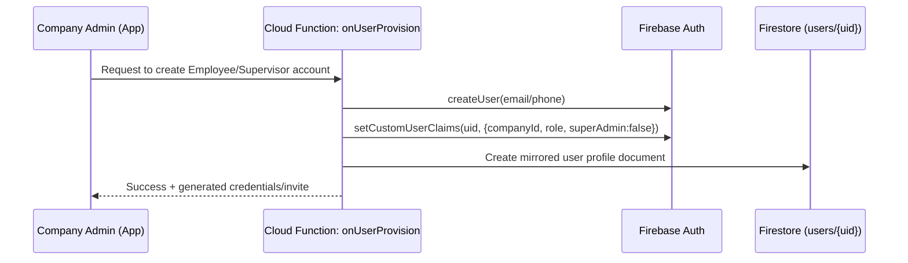
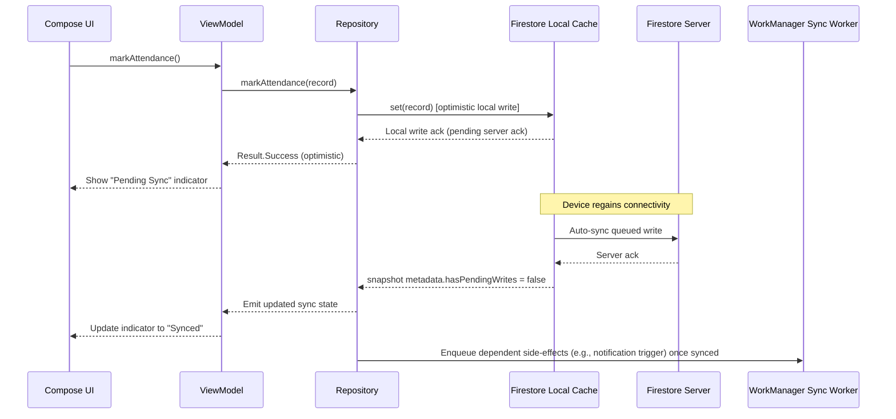
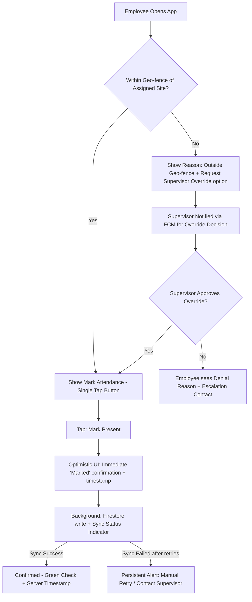
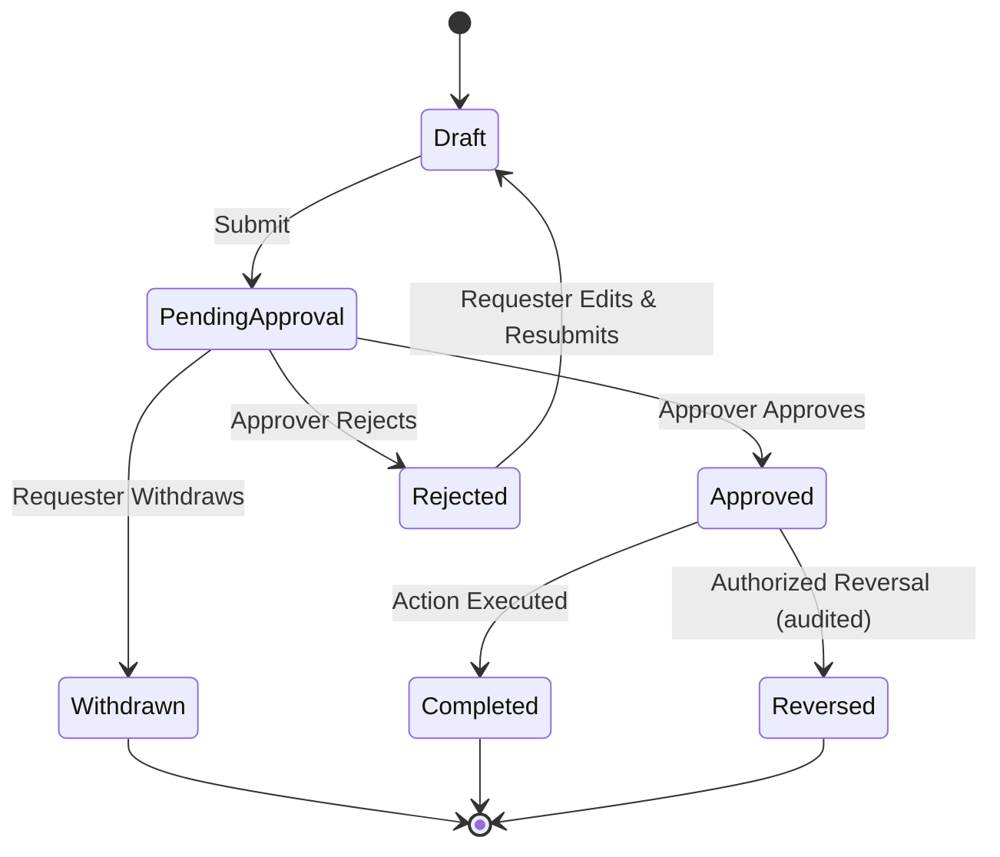
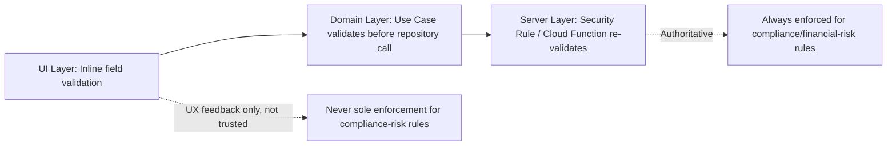
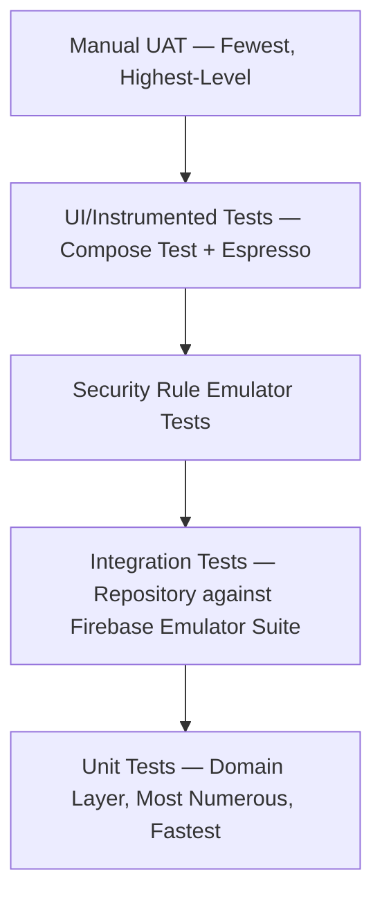

# MASTER_PROJECT_RULES.md
## Log Sheet Muster (LSM) — Enterprise Workforce Management Platform

**Document Classification:** Official Architecture & Governance Reference
**Applies To:** All engineering, QA, design, and AI-assisted development work on LSM
**Status:** Living Document — Version Controlled

---

# TABLE OF CONTENTS

1. Project Vision
2. Enterprise Rules
3. Coding Standards
4. Architecture Standards *(upcoming)*
5. Firebase Standards *(upcoming)*
6. Firestore Standards *(upcoming)*
7. UI Standards *(upcoming)*
8. UX Standards *(upcoming)*
9. Performance Standards *(upcoming)*
10. Business Logic Standards *(upcoming)*
11. Security Standards *(upcoming)*
12. Validation Standards *(upcoming)*
13. Testing Standards *(upcoming)*
14. Naming Conventions *(upcoming)*
15. Folder Structure *(upcoming)*
16. Do's *(upcoming)*
17. Don'ts *(upcoming)*
18. Production Checklist *(upcoming)*
19. AI Self Verification *(upcoming)*

---

# CHAPTER 1: PROJECT VISION

## 1.1 Purpose of This Chapter

Before any line of Kotlin is written, before any Firestore collection is designed, the engineering organization must have a single, unambiguous statement of *why LSM exists*. Every architectural decision documented in this master rule set — every validation rule, every security boundary, every UI convention — is a downstream consequence of the vision stated here. If a future decision cannot be traced back to this vision, it should be challenged.

## 1.2 What Problem Does LSM Solve?

Organizations that deploy a distributed, shift-based, multi-site workforce — security agencies, facility management companies, housekeeping contractors, industrial plants, construction sites, logistics operators, hospitals, and educational institutions — share a common operational pain:

| Problem | Business Impact |
|---|---|
| Manual/paper log sheets and muster rolls | Data loss, fraud (proxy attendance/"ghost employees"), delayed payroll, no audit trail |
| Disconnected attendance, shift, and payroll systems | Payroll errors, client billing disputes, compliance exposure (PF/ESI/Minimum Wages) |
| No real-time visibility for supervisors/clients | Delayed escalation of understaffed sites, SLA breaches |
| Paper-based leave and approval workflows | Slow turnaround, no accountability, disputes |
| No centralized deployment tracking across sites | Over/under deployment, revenue leakage on billing |
| No offline capability for guards/workers in low-connectivity sites | Attendance not captured, data entered late/inaccurately |
| No single source of truth across HR, Payroll, Billing, Inventory | Duplicate data entry, reconciliation overhead, errors |

**LSM's Vision:** Replace the paper "log sheet" and "muster roll" — the literal physical documents historically used at security agency sites — with a single, offline-first, multi-tenant, enterprise-grade digital platform that captures attendance, manages the full employee lifecycle, automates payroll-ready outputs, tracks deployment and billing, and gives every stakeholder (Super Admin, Company Admin, HR, Supervisor, Client, Employee) real-time, role-appropriate visibility — without ever compromising data isolation between companies.

## 1.3 Who Uses LSM?

| Persona | Primary Goals | Primary Surfaces |
|---|---|---|
| **Super Admin** (Platform Owner) | Onboard companies, monitor platform health, manage subscriptions, cross-company oversight | Super Admin Console |
| **Company Admin / Owner** | Configure company, manage employees, approve workflows, view company-wide dashboards | Admin Dashboard |
| **HR Manager** | Employee lifecycle, leave, payroll processing, compliance | HR Module |
| **Operations Manager** | Deployment, shift planning, site coverage, client SLAs | Deployment Module |
| **Supervisor / Site In-Charge** | Mark attendance, manage site-level logs, escalate issues | Supervisor App (mobile) |
| **Employee / Guard / Worker** | Mark self-attendance (where permitted), apply leave, view payslip, ESS | ESS Mobile App |
| **Client (external)** | View deployment status, approve log sheets/invoices, raise complaints | Client Portal (restricted) |
| **Accounts/Billing Team** | Generate invoices, reconcile billing against deployment/attendance | Billing Module |
| **Vendor/Store Manager** | Inventory issuance, asset tracking, stock reconciliation | Inventory Module |

## 1.4 Core Product Principles

1. **Offline-First, Always.** A guard standing at a remote industrial gate with no signal must still be able to mark attendance. Data syncs when connectivity returns. This is not a "nice to have feature" — it is a foundational architectural constraint that shapes the entire Firestore and WorkManager strategy.
2. **Multi-Tenant Isolation Is Absolute.** No company shall ever query, read, infer, or leak another company's data — not through a bug, not through a shared index, not through a misconfigured security rule, not through client-side filtering alone. Isolation is enforced at the Firestore Security Rules layer, never trusted to the client.
3. **Every Screen Is a Real, Working Screen.** LSM documentation and implementation reject "Coming Soon" placeholders, demo data, and partial CRUD. A module is either fully implemented and production-ready, or it is not shipped.
4. **Role-Based Everything.** Every screen, every button, every Firestore read/write is gated by role and permission — not just hidden in UI, but enforced server-side via Security Rules and Cloud Functions where applicable.
5. **Auditable by Design.** Every attendance mark, every approval, every payroll run, every inventory movement must be traceable to a user, a timestamp, and a device.
6. **Enterprise Scale from Day One.** LSM must support a single company with 5 employees and a single company with 50,000 employees across 500 sites without architectural rework.
7. **Compliance-Aware.** Indian labor law constructs (PF, ESI, Minimum Wages, Bonus Act, Gratuity, Shops & Establishment Act) are first-class citizens in payroll and compliance modules, not afterthoughts.

## 1.5 Non-Goals (Explicitly Out of Scope)

To prevent architecture drift, the following are explicitly **not** goals of LSM v1 unless separately commissioned:

- iOS or cross-platform (Android only, as stated in project overview).
- Public self-signup for companies (onboarding is Super Admin-mediated).
- Payment gateway integration for consumer billing (B2B invoicing only, not a payment processor).
- Biometric hardware integration beyond what Android device sensors natively expose (this may be revisited in later phases but is not assumed in this documentation).

## 1.6 Success Criteria for "Production Ready"

A module is considered production-ready only when **all** of the following are true:

- [ ] Every CRUD operation (Create, Read, Update, Delete) is fully implemented against real Firestore collections.
- [ ] Every screen renders real data — no mock/dummy/lorem-ipsum content paths exist in production code.
- [ ] Every role's access is enforced both in UI (Compose conditional rendering) and in Firestore Security Rules.
- [ ] Every validation rule specified in `MASTER_BUSINESS_LOGIC.md` is implemented and unit tested.
- [ ] Offline behavior is explicitly defined and tested (queued write, conflict resolution, sync status indicator).
- [ ] Every notification trigger fires correctly via FCM and is logged.
- [ ] Every approval workflow has a defined state machine with no dead-end states.
- [ ] Every report/export produces a correct, non-empty output against real data.
- [ ] Automated tests exist per `MASTER_TESTING_CHECKLIST.md` for the module.
- [ ] The module passes the AI Self Verification checklist (Chapter 19).

---

# CHAPTER 2: ENTERPRISE RULES

## 2.1 Purpose of This Chapter

This chapter defines the non-negotiable governance rules that apply to **every** contributor — human or AI-assisted — working on the LSM codebase. These rules exist because enterprise software that manages payroll, attendance, and legal compliance data cannot tolerate the "move fast and break things" philosophy common in early-stage consumer apps. A bug in a photo-sharing app loses a user's photo. A bug in LSM can cause a guard to be wrongly marked absent, lose a day's wage, or cause a company to fail a labor audit.

## 2.2 The Non-Negotiable Rules (Restated and Expanded)

| # | Rule | Rationale |
|---|---|---|
| 1 | Do NOT redesign architecture without explicit sign-off | Architecture changes ripple through security rules, indexes, and client code across every module. Silent redesign creates untested surface area. |
| 2 | Do NOT rename Firestore collections | Collection names are referenced in Security Rules, Cloud Functions, indexes, and client queries. A rename is a breaking migration, not a refactor. |
| 3 | Do NOT remove implemented modules | Removing a module without a deprecation plan breaks dependent modules (e.g., removing Deployment breaks Billing, which reads deployment records). |
| 4 | Do NOT remove implemented business logic | Business logic often encodes compliance requirements (e.g., overtime calculation) that were added in response to a real regulatory or client requirement. |
| 5 | Do NOT generate demo code | Demo code ships bugs to production when developers forget to replace it. LSM has zero tolerance for `TODO: replace with real implementation`. |
| 6 | Do NOT generate placeholder UI | A placeholder screen in an enterprise HRMS is a broken screen from the customer's perspective. |
| 7 | Do NOT generate dummy buttons | A button that does nothing erodes trust in the entire application and violates the "Every Button Must Work" doctrine. |
| 8 | Do NOT generate fake data | Fake/sample data in production code paths risks leaking into production Firestore, corrupting real company data. |
| 9 | Do NOT generate mock implementations | Mocks belong exclusively in test source sets (`src/test`, `src/androidTest`), never in `src/main`. |
| 10 | Do NOT generate incomplete CRUD | Partial CRUD (e.g., Create + Read but no Update/Delete) creates operational dead-ends for admins who need to correct data. |
| 11 | Do NOT use "Coming Soon" | Every navigable destination must be a real, functioning feature at time of release. |

## 2.3 Escalation Rule

If, during implementation, a contributor (human or AI) determines that fully satisfying a business requirement would require violating one of the Non-Negotiable Rules (for example, a genuine architectural flaw is discovered), the correct action is:

1. **Stop implementation** of the affected module.
2. **Document the conflict** in an ADR (Architecture Decision Record) stored under `/docs/adr/`.
3. **Escalate to the Enterprise Architect / Project Owner** for explicit sign-off before any structural change is made.
4. Never silently work around the rule by shipping a partial or placeholder implementation instead.

## 2.4 Multi-Tenant Enterprise Rule (Expanded)

Multi-tenancy in LSM is enforced through a layered model:



**Rule 2.4.1 — Defense in Depth:** Company isolation must be enforced at three independent layers, and no layer may rely on another to be the *sole* enforcement point:
- **Layer 1 — Authentication Claims:** Every authenticated user has a custom claim `companyId` (and `superAdmin: true/false`) set exclusively by a trusted Cloud Function during user provisioning — never settable by the client.
- **Layer 2 — Firestore Security Rules:** Every top-level collection and subcollection rule explicitly checks `request.auth.token.companyId == resource.data.companyId` (or the equivalent path-based check for company-scoped collection groups).
- **Layer 3 — Repository Query Constraints:** Even though rules are the source of truth, every Repository-layer Firestore query must explicitly `.whereEqualTo("companyId", currentCompanyId)` — both as defense-in-depth and to avoid unnecessary permission-denied round trips.

**Rule 2.4.2 — Super Admin Exception:** Only accounts with the custom claim `superAdmin == true` may bypass the `companyId` filter, and only within the Super Admin Console module, which itself is a distinct, heavily audited surface (see `MASTER_SECURITY_FRAMEWORK.md`, Chapter: Authorization).

**Rule 2.4.3 — No Cross-Company Collection Group Queries for Tenant Roles:** Collection group queries (which span all companies by design) must never be exposed to non-Super-Admin roles. Any collection group query in the codebase must have an accompanying comment justifying Super-Admin-only usage and a corresponding Security Rule restricting it.

## 2.5 Change Management Rules

| Rule | Detail |
|---|---|
| Semantic Versioning | App version follows `MAJOR.MINOR.PATCH` (e.g., `2.4.1`). MAJOR = breaking data model changes, MINOR = new modules/features, PATCH = bug fixes. |
| Firestore Schema Migration | Any field addition must be backward compatible (nullable/defaulted). Any field removal requires a deprecation window of at least one MINOR version where the field is ignored, not removed, from writes. |
| Security Rule Changes | Must be reviewed against the full rule test suite (see `MASTER_SECURITY_FRAMEWORK.md`) before deployment; deployed via Firebase CLI with `firestore:rules` staged rollout where available. |
| Feature Flags | New modules may be gated behind a Remote Config flag during phased rollout, but the flag must default to **fully enabled** at GA (General Availability) — flags are for rollout control, not for shipping incomplete features. |

## 2.6 Documentation Governance

- Every module's business logic must be documented in `MASTER_BUSINESS_LOGIC.md` **before** implementation begins, or concurrently — never retroactively as an afterthought.
- Every Firestore collection must appear in `MASTER_FIRESTORE_ARCHITECTURE.md` and `MASTER_DATABASE_DICTIONARY.md` with matching field definitions. A mismatch between code and documentation is treated as a documentation bug requiring immediate correction.
- This document (`MASTER_PROJECT_RULES.md`) is the constitution; module-specific master documents are statutes. In case of conflict, this document prevails and the conflicting document must be corrected.

---

# CHAPTER 3: CODING STANDARDS

## 3.1 Purpose

Consistent code style across a multi-year, multi-contributor enterprise codebase is what makes the difference between a maintainable platform and an unmaintainable one. These standards apply to all Kotlin/Compose source in the LSM repository.

## 3.2 Kotlin Language Standards

- **Null Safety:** Avoid `!!` (non-null assertion) in production code except where preceded by an explicit, commented invariant check. Prefer `?.let {}`, `requireNotNull()`, or sealed-class result modeling.
- **Immutability First:** Prefer `val` over `var`. Data classes representing domain models must be immutable; state changes flow through ViewModel state emission, not in-place mutation.
- **Sealed Classes for State:** All UI state and repository results must be modeled with sealed classes/interfaces (e.g., `sealed interface AttendanceResult { data class Success(...) ; data class Error(...) ; object Loading }`), never raw booleans or nullable ad-hoc flags.
- **Coroutines & Flow:** All asynchronous Firestore/Storage operations use Kotlin Coroutines. Reactive data (e.g., live attendance feed) is exposed via `Flow` / `StateFlow`, collected lifecycle-aware in Compose via `collectAsStateWithLifecycle()`.
- **No Global Mutable State:** Singletons hold only stateless services (e.g., Firestore instance, Dispatchers); mutable application state lives in ViewModels or a scoped DataStore/Repository cache.
- **Explicit Error Types:** Repository functions return `Result<T>` or a domain-specific sealed `Either`-style type — never silently swallow exceptions.
- **Extension Functions:** Used for mapping DTOs (Firestore documents) to Domain models (`fun DocumentSnapshot.toEmployee(): Employee`), keeping mapping logic out of ViewModels.

## 3.3 Jetpack Compose Standards

- **Stateless Composables by Default:** Composables receive state and event lambdas as parameters (`onMarkAttendance: () -> Unit`); they do not read ViewModels directly except at the screen "root" composable.
- **State Hoisting:** All UI state that needs to survive recomposition or be shared across composables is hoisted to the nearest common ancestor or ViewModel.
- **Single Source of Truth per Screen:** Each screen has exactly one ViewModel exposing one `StateFlow<ScreenUiState>`; no scattered independent state flows for a single screen.
- **Recomposition Discipline:** Avoid unstable lambda/list parameters causing unnecessary recomposition; use `remember`, `derivedStateOf`, and stable data classes (`@Immutable`/`@Stable` annotations where applicable).
- **Material 3 Expressive (Enterprise Adaptation):** All components are built from the Material 3 component library, themed via the LSM design tokens (see `MASTER_UI_UX_DESIGN_SYSTEM.md`) — no raw hard-coded colors, dimens, or typography in composables.
- **Navigation:** Single `NavHost` per app graph (Admin graph, ESS graph, Supervisor graph) using type-safe Navigation-Compose routes; no manual `FragmentTransaction` or Activity-based navigation.

## 3.4 Architecture Layering Rules (Preview — Full Detail in Chapter 4)

- **Presentation Layer:** Compose UI + ViewModel. No direct Firestore/Firebase SDK references permitted here.
- **Domain Layer:** Use cases / interactors encapsulate business rules (e.g., `MarkAttendanceUseCase`). Pure Kotlin, no Android framework dependency.
- **Data Layer:** Repository implementations, Firestore/Storage/FCM data sources, DTO mappers. All Firebase SDK calls are isolated here.
- **Dependency Rule:** Dependencies point inward — Presentation depends on Domain, Data depends on Domain (implements Domain repository interfaces) — Domain depends on nothing Android-specific.

## 3.5 Code Style & Tooling

| Tool | Enforcement |
|---|---|
| `ktlint` | Enforced in CI; build fails on style violations. |
| `detekt` | Static analysis for complexity, unused code, and potential bugs; custom rule set includes a ban on `TODO`/`FIXME` comments in `main` branch merges. |
| Git Commit Convention | Conventional Commits (`feat:`, `fix:`, `refactor:`, `docs:`, `test:`) tied to module names (e.g., `feat(attendance): add geo-fenced check-in validation`). |
| Code Review | Minimum one approving review; PRs touching Firestore Security Rules require a second reviewer with security sign-off. |

## 3.6 Comments & Documentation in Code

- Public repository interfaces and use cases carry KDoc explaining business intent, not just parameter types (e.g., *why* a leave request beyond 3 days requires HR approval, not just *that* it does).
- No commented-out code blocks are merged to `main`; version control is the history, not code comments.

## 3.7 Prohibited Patterns

- No `Thread.sleep()` or blocking calls on the main thread.
- No hardcoded Firestore document IDs or collection path strings scattered across files — centralized in a `FirestorePaths` constants object.
- No hardcoded role checks like `if (role == "Admin")` scattered in UI — centralized permission resolution via a `PermissionEvaluator` domain service consuming the RBAC model (see `MASTER_SECURITY_FRAMEWORK.md`).
- No direct Firebase SDK calls from Composables or ViewModels — always through Repository interfaces.

---

---

# CHAPTER 4: ARCHITECTURE STANDARDS

## 4.1 Purpose

LSM is not a small app that happens to grow — it is designed from day one as an enterprise platform expected to run for years, onboard dozens of companies, support tens of thousands of employees, and be extended by multiple engineering teams over time. This chapter defines the architectural skeleton that every module must conform to, so that the platform remains testable, swappable at the infrastructure level, and comprehensible to a new engineer joining the team.

## 4.2 Why Clean Architecture + MVVM + Repository Pattern

| Concern | Why It Matters for LSM | How the Architecture Addresses It |
|---|---|---|
| Testability | Payroll and attendance logic must be unit-testable without a live Firestore connection (cost, speed, determinism) | Domain layer is pure Kotlin, Firebase-free, fully unit-testable with fakes |
| Swappable infrastructure | Firebase is the current backend, but Storage or FCM specifics could change (e.g., adding a secondary export target) | Data layer implements Domain-defined repository interfaces; infrastructure detail never leaks upward |
| Multiple UI surfaces | Admin app, Supervisor app, ESS app share business rules but have different UI | Shared Domain/Data layers, surface-specific Presentation modules |
| Long-term maintainability | Enterprise clients require years of support; code must survive team turnover | Clear separation of concerns reduces onboarding time and regression risk |

## 4.3 The Four-Layer Model



### 4.3.1 Presentation Layer

- Contains Compose screens, reusable components, navigation graphs, and ViewModels.
- ViewModels depend only on Domain-layer Use Cases — never directly on Repository implementations or Firebase SDKs.
- Each ViewModel exposes a single immutable `StateFlow<ScreenUiState>` and a set of event-handling functions (`onEvent(event: ScreenEvent)` pattern or discrete public functions — standardized per-module but consistent within a module).

### 4.3.2 Domain Layer

- Contains Use Cases (one class per discrete business operation, e.g., `ApplyLeaveUseCase`, `CalculateOvertimeUseCase`, `ApproveDeploymentUseCase`).
- Contains Domain Models (`Employee`, `AttendanceRecord`, `ShiftAssignment`, etc.) — plain Kotlin data classes with no Firestore annotations.
- Contains Repository *interfaces* only (e.g., `interface AttendanceRepository { suspend fun markAttendance(record: AttendanceRecord): Result<Unit> }`).
- Contains cross-cutting domain services such as `PermissionEvaluator`, `PayrollCalculator`, `ShiftConflictValidator`.
- Zero Android SDK or Firebase SDK imports permitted in this layer — enforced via a Gradle module boundary (`:domain` module has no Firebase dependency in its `build.gradle`).

### 4.3.3 Data Layer

- Contains concrete Repository implementations (`AttendanceRepositoryImpl`) that implement Domain interfaces.
- Contains Firestore/Storage/FCM data source classes that isolate raw SDK calls.
- Contains Room (for structured offline cache/query needs) and/or DataStore (for lightweight offline queueing/preferences) as the local persistence mechanism supporting offline-first behavior.
- Contains DTO classes (Firestore-serializable) and bidirectional mappers to/from Domain models — DTOs never leak into Domain or Presentation layers.
- Owns WorkManager Worker classes responsible for background sync of queued offline writes.

### 4.3.4 Framework/External Layer

- Firebase SDKs, Android system services, WorkManager scheduling APIs — the outermost, most volatile layer, fully wrapped by Data-layer abstractions.

## 4.4 Module (Gradle) Boundaries

LSM is structured as a multi-module Gradle project to physically enforce the dependency rule, not just rely on convention:

```
:app                      (Android application module - DI wiring, navigation host)
:core:designsystem        (Material 3 tokens, themes, shared components)
:core:common              (Result types, dispatchers, base utilities)
:domain                   (Pure Kotlin — use cases, domain models, repo interfaces)
:data                     (Firebase/Room implementations of domain repo interfaces)
:feature:auth
:feature:employees
:feature:attendance
:feature:leave
:feature:shift
:feature:deployment
:feature:payroll
:feature:inventory
:feature:assets
:feature:billing
:feature:clients
:feature:vendors
:feature:ess
:feature:notifications
:feature:analytics
:feature:reports
:feature:workflow
:feature:approvals
:feature:ai
:feature:compliance
:feature:superadmin
```

**Rule 4.4.1:** `:domain` must never declare a dependency on `:data`, `com.google.firebase:*`, or any `android.*` framework package (verified by a `detekt`/Gradle dependency-analysis CI check).

**Rule 4.4.2:** Feature modules depend on `:domain` and `:core:*` — they never depend on each other directly. Cross-feature navigation is handled through the `:app` module's navigation graph and shared route contracts defined in `:core:common`, preventing circular feature dependencies.

**Rule 4.4.3:** Only `:data` may declare Firebase SDK dependencies (Firestore, Storage, FCM, Auth, App Check). This physically guarantees the "no direct Firebase SDK calls from Composables/ViewModels" rule from Chapter 3.

## 4.5 Dependency Injection Standard

- **Hilt** is the standard DI framework across the application.
- Each feature module provides its own Hilt module for ViewModel and Use Case bindings; `:data` provides bindings from Domain repository interfaces to Data implementations (`@Binds`).
- Firebase singleton instances (`FirebaseFirestore`, `FirebaseAuth`, `FirebaseStorage`, `FirebaseMessaging`) are provided once in a `:data`-scoped `@Module @InstallIn(SingletonComponent::class)` provider — never instantiated ad hoc elsewhere.

## 4.6 Offline-First Architectural Strategy (Overview)

Full detail is provided in `MASTER_FIRESTORE_ARCHITECTURE.md`; the architectural commitment stated here is:

1. **Firestore's native offline persistence** is enabled (`FirebaseFirestoreSettings.isPersistenceEnabled = true`) as the first line of offline support, providing automatic local cache and write queueing for straightforward document operations.
2. **WorkManager-backed sync workers** handle operations that require guaranteed eventual execution beyond Firestore's SDK-level queueing — e.g., multi-step business transactions (attendance mark + notification trigger + audit log write) — using `Constraints` requiring network connectivity, with exponential backoff retry policy.
3. **Local Room cache** is used specifically for read-heavy, list-based screens (e.g., Employee directory, Attendance history) so that UI remains fully navigable with zero network connectivity, independent of Firestore SDK cache internals.
4. Every offline-capable screen displays an explicit **Sync Status Indicator** (Synced / Pending / Failed) — silent failure is prohibited (see Chapter 2, Non-Negotiable Rules).

## 4.7 Error Handling Architecture

- All Use Cases return `Result<T>` (Kotlin stdlib) or a project-standard sealed `LsmResult<T>` type distinguishing `Success`, `NetworkError`, `ValidationError(errors: List<FieldError>)`, `PermissionError`, and `UnknownError`.
- ViewModels translate `LsmResult` into `ScreenUiState` variants consumed directly by Compose — UI layer never inspects raw exceptions.
- A centralized `CrashReportingTree` (Timber + Firebase Crashlytics) logs all `UnknownError` occurrences with breadcrumb context (screen, use case, companyId-hash — never raw PII) for production diagnostics.

## 4.8 Architecture Decision Records (ADR)

Any deviation from, or extension to, this architecture must be documented as an ADR under `/docs/adr/NNNN-title.md` using the standard format: Context, Decision, Consequences, Alternatives Considered. ADRs are append-only history; superseding an ADR requires a new ADR referencing the old one, not editing it in place.

---

---

# CHAPTER 5: FIREBASE STANDARDS

## 5.1 Purpose

LSM's entire backend runs on Firebase — there is no custom server tier. This means Firebase configuration discipline *is* backend architecture discipline. A misconfigured Security Rule or an unindexed query is not a "server bug to fix later" — it is a production data-integrity or availability incident. This chapter defines mandatory standards across every Firebase product used by LSM.

## 5.2 Firebase Products in Use and Their Role

| Product | Role in LSM |
|---|---|
| Firebase Authentication | Identity provider for all human users (Admin, HR, Supervisor, Employee, Client); custom claims carry `companyId`, `role`, `superAdmin` |
| Cloud Firestore | Primary system-of-record database for all business entities |
| Firebase Storage | Binary asset storage — employee photos, ID proof documents, signed log sheets, invoice PDFs, asset images |
| Firebase Cloud Messaging (FCM) | Push notifications for approvals, attendance alerts, shift reminders, leave status |
| Firebase App Check | Attestation that requests originate from the genuine, unmodified LSM Android app — blocks abuse from scripted/rooted clients |
| Cloud Functions (supporting role) | Trusted server-side logic that must never run on-device: custom claim assignment, payroll finalization locks, cross-document transactional integrity, scheduled jobs (daily attendance rollups, leave balance accrual) |
| Firebase Crashlytics | Production crash and non-fatal error monitoring |
| Firebase Remote Config | Feature flag and phased rollout control (per Chapter 2.5) |
| Firebase Performance Monitoring | Screen render and network trace monitoring |

## 5.3 Firebase Authentication Standards

### 5.3.1 Sign-In Methods
- **Primary:** Email/Password for Admin, HR, Supervisor, Client roles (enterprise users expect credential-based login with company-issued email).
- **Phone OTP:** Supported for Employee/ESS role, since a large proportion of guards/workers may not have a monitored personal email but do have a mobile number.
- **No anonymous auth** is permitted for any authenticated business operation — anonymous auth, if used at all, is restricted to pre-login public informational screens only (none currently exist; reserved for future use).

### 5.3.2 Custom Claims (Authoritative Identity)



- Custom claims (`companyId`, `role`, `superAdmin`) are **exclusively** set via a trusted Cloud Function (`onUserProvision`), never via client SDK. The client has zero ability to self-assign or elevate its own role or companyId.
- Claims are refreshed on the client via `getIdToken(true)` (force refresh) immediately after any role/company change event is observed (e.g., via a Firestore listener on the user's own profile document triggering a token refresh prompt).
- Firestore Security Rules read `request.auth.token.companyId` and `request.auth.token.role` — never a client-writable Firestore field — as the authorization source of truth.

### 5.3.3 Session Management
- Firebase ID tokens are short-lived (1 hour) and silently refreshed by the SDK; no custom long-lived session tokens are implemented client-side.
- Sign-out clears local Room cache of sensitive tables (Employee PII, Payroll) but retains non-sensitive reference data (e.g., cached UI preferences) to speed up next login.
- Device binding: each successful login registers a device record (see `MASTER_SECURITY_FRAMEWORK.md`, Device Registration) enabling remote session revocation by Company Admin/Super Admin.

## 5.4 Cloud Firestore Standards (Overview — Full Detail in `MASTER_FIRESTORE_ARCHITECTURE.md`)

- **Persistence:** `isPersistenceEnabled = true` on every client, with cache size set explicitly (not `UNLIMITED` by default) and tuned per device class where feasible.
- **Query Discipline:** Every list-rendering query must be paginated (`limit()` + cursor-based `startAfter()`), never unbounded `.get()` on a potentially large collection.
- **Transactions vs Batched Writes:** Use Firestore **transactions** whenever a write depends on reading current state first (e.g., leave balance deduction, inventory stock decrement). Use **batched writes** when multiple independent documents must succeed or fail atomically without a read-then-write dependency (e.g., creating a Deployment plus its audit log entry).
- **Denormalization Policy:** Controlled denormalization (e.g., storing `employeeName` alongside `employeeId` on an AttendanceRecord) is permitted specifically to avoid N+1 reads on list screens, but every denormalized field must have a defined, implemented update-propagation path (Cloud Function trigger on the source-of-truth document) documented in `MASTER_DATABASE_DICTIONARY.md`.
- **No Client-Side "Trust Me" Roles:** A `role` field may exist on a Firestore user document for UI convenience/display, but it is never trusted for authorization decisions — only the Auth custom claim is authoritative (Rule 5.3.2).

## 5.5 Firebase Storage Standards

- **Folder Structure Convention:** `/{companyId}/{module}/{entityId}/{fileName}` — e.g., `/companyABC/employees/emp_00123/profile_photo.jpg`, `/companyABC/deployments/dep_00045/logsheet_signed.pdf`. This mirrors Firestore's company-scoping discipline into Storage, enabling identical Security Rule patterns.
- **Security Rules mirror Firestore claims:** Storage rules check `request.auth.token.companyId == companyIdFromPath(request.resource.name)`, never allowing cross-company path traversal.
- **File Size & Type Limits:** Enforced both client-side (pre-upload validation, e.g., max 5MB for photos, max 10MB for signed PDFs) and via Storage Security Rules (`request.resource.size < N && request.resource.contentType.matches('image/.*')`) as defense-in-depth.
- **Upload Resilience:** Uploads use resumable upload sessions; a WorkManager-scheduled retry handles connectivity loss mid-upload, with a persisted upload-progress record so a killed app process can resume rather than restart from zero.

## 5.6 Firebase Cloud Messaging Standards

- **Topic vs Token Strategy:** Company-wide broadcast notifications (e.g., policy announcement) use FCM **topics** scoped as `company_{companyId}_announcements`. Role-targeted or individual notifications (e.g., "Your leave was approved") use direct **device token** targeting, with tokens stored in a `fcmTokens` subcollection under the user's profile, supporting multiple devices per user.
- **Notification Payload Discipline:** Data-only payloads (not notification-only payloads) are used for all business notifications so the app can control display, deep-link routing, and local Room persistence of the notification history even when the app is in the background — ensuring the in-app Notification Center is always complete, not dependent on system tray history.
- **Token Lifecycle:** `onNewToken()` updates the Firestore `fcmTokens` subcollection immediately; a token is removed from that subcollection when a device is explicitly signed out or remotely revoked (see Security Framework — Device Registration).

## 5.7 Firebase App Check Standards

- App Check is enforced (not just monitored) in production, using the **Play Integrity API** provider for Android.
- Firestore, Storage, and any callable Cloud Functions all require a valid App Check token — enforced at the Firebase project level ("Enforce" mode, not "Monitor" mode) prior to production release.
- Debug builds use the App Check debug provider with a token registered only in the internal testing Firebase project — never in the production project.

## 5.8 Cloud Functions Standards

- Cloud Functions are used **only** where client-side execution would be untrustworthy or where true atomic cross-user consistency is required. Examples: custom claims assignment, payroll run finalization (locking a payroll period against further edits), scheduled daily jobs (attendance auto-absent marking after cutoff, leave balance monthly accrual), and cross-company Super Admin aggregate reporting.
- Every Cloud Function has a corresponding unit test using the Firebase Emulator Suite; no Cloud Function is deployed to production without emulator-verified test coverage.
- Cloud Functions never bypass company isolation — every function that touches company-scoped data receives and validates `companyId` from the authenticated caller's custom claim, never from an unauthenticated request parameter.

## 5.9 Firebase Environment Strategy

| Environment | Firebase Project | Purpose |
|---|---|---|
| Development | `lsm-dev` | Local/CI development, Firebase Emulator Suite preferred for automated tests |
| Staging/QA | `lsm-staging` | Pre-release QA, UAT, performance testing under production-like data volume |
| Production | `lsm-prod` | Live customer data — access restricted, all changes via CI/CD pipeline, no manual console edits to Security Rules or Functions permitted outside emergencies (which require a documented post-incident review) |

---

---

# CHAPTER 6: FIRESTORE STANDARDS

## 6.1 Purpose

Firestore is the single system of record for LSM. Unlike a traditional relational backend, Firestore's cost, performance, and consistency characteristics are directly shaped by document/collection design decisions made early. This chapter sets the mandatory modeling, querying, indexing, and transaction standards that every module must follow. Full collection-by-collection detail lives in `MASTER_FIRESTORE_ARCHITECTURE.md` and `MASTER_DATABASE_DICTIONARY.md`; this chapter defines the *rules those documents must obey*.

## 6.2 Collection Design Principles

### 6.2.1 Company-Scoping Pattern

Every business collection is scoped to a company using **one** of two consistent patterns — never a mix within the same collection:

**Pattern A — Top-level collection with `companyId` field** (used for collections queried across a company but never needing deep nesting, e.g., `employees`, `attendanceRecords`):
```
/employees/{employeeId}
  companyId: "companyABC"
  ...
```

**Pattern B — Nested under `/companies/{companyId}/...`** (used for company-owned configuration and hierarchical entities, e.g., `/companies/{companyId}/sites/{siteId}`, `/companies/{companyId}/shifts/{shiftId}`):
```
/companies/{companyId}/sites/{siteId}
  ...
```

**Rule 6.2.1.1:** A collection's pattern choice is documented in `MASTER_FIRESTORE_ARCHITECTURE.md` and must never change after data exists in production (schema migration required otherwise).

**Rule 6.2.1.2:** Pattern A collections **must** carry an explicit `companyId` field on every document, indexed, to support Security Rule checks and Repository-layer query filters (Rule 2.4.1, Layer 2/3).

### 6.2.2 Document ID Strategy

| Entity Type | ID Strategy | Reason |
|---|---|---|
| Employees, Attendance, Leave, Deployment, Payroll runs | Firestore auto-ID (`.document()`) | High write concurrency, no natural business key collision risk |
| Company | Human-readable slug-based ID (e.g., `companyABC`) generated at onboarding, immutable thereafter | Used extensively in Storage paths and cross-references; readability aids debugging |
| Site/Location | Auto-ID with a separate indexed `siteCode` field for human-facing display | Avoids ID collisions across companies while preserving a client-facing readable code |
| FCM Token records | Device-derived deterministic ID (hash of token) | Enables idempotent upsert without duplicate token documents |

### 6.2.3 Subcollection Depth Limit

**Rule 6.2.3.1:** Subcollection nesting is limited to a maximum depth of 3 levels (e.g., `/companies/{companyId}/sites/{siteId}/shifts/{shiftId}`) to keep security rules and query paths comprehensible and to avoid the operational complexity of deep collection-group queries.

## 6.3 Query Standards

- **Pagination Mandatory:** Every UI list backed by a potentially unbounded collection uses `Query.limit(pageSize)` with `startAfter(lastVisibleDocument)` cursor pagination. Default `pageSize` is 25 for mobile list screens, configurable per screen via Remote Config for performance tuning.
- **No Unbounded `.get()`:** A `.get()` call without a `.limit()` is prohibited in production code on any collection expected to exceed 100 documents; a `detekt` custom rule flags unbounded queries on flagged collections for manual review.
- **Composite Query Rule:** Any query combining a `.whereEqualTo()` with a `.whereGreaterThan()`/`.orderBy()` on a different field requires a matching entry in `firestore.indexes.json`, added in the same PR that introduces the query — never deployed separately/after the fact.
- **Real-Time Listeners:** `addSnapshotListener` is used only for screens requiring live updates (e.g., live attendance dashboard, pending approvals badge count) — not for static reference/history screens, to control read costs and battery usage. Listeners are always detached in `onCleared()`/`DisposableEffect` cleanup.

## 6.4 Transactions vs Batched Writes — Decision Table

| Scenario | Mechanism | Reason |
|---|---|---|
| Deduct leave balance then create leave request | Transaction | Balance read must reflect latest state before decrementing to prevent race-condition over-approval |
| Decrement inventory stock on issuance | Transaction | Concurrent issuance requests must not oversell stock |
| Create Deployment record + initial audit log entry | Batched Write | Both writes are independent creates with no read-then-write dependency; atomicity without a read |
| Approve leave (update status) + create notification document | Batched Write | Independent document creations, atomic all-or-nothing |
| Payroll run finalization (lock period, compute totals across many attendance records) | Cloud Function using Transaction(s) with server-side aggregation | Client should never perform multi-hundred-document read-aggregate-write payroll math; server-side ensures consistency and reduces client data egress |

## 6.5 Firestore Security Rules Standards

- Security Rules are organized in **modular rule files** compiled into a single `firestore.rules` via a build step, mirroring the feature-module structure of the app (`rules/employees.rules`, `rules/attendance.rules`, etc.) for maintainability, even though Firestore itself requires a single compiled file.
- **Every** rule block for a company-scoped collection follows the canonical template:

```
match /employees/{employeeId} {
  allow read: if isSignedIn() &&
    (isSuperAdmin() || resource.data.companyId == userCompanyId());
  allow create: if isSignedIn() &&
    hasPermission('employees.create') &&
    request.resource.data.companyId == userCompanyId();
  allow update: if isSignedIn() &&
    hasPermission('employees.update') &&
    resource.data.companyId == userCompanyId() &&
    request.resource.data.companyId == resource.data.companyId; // companyId immutable
  allow delete: if isSignedIn() &&
    hasPermission('employees.delete') &&
    resource.data.companyId == userCompanyId();
}
```

- **Rule 6.5.1 — Immutable `companyId`:** No update rule may permit a change to a document's `companyId` field — this is the primary technical guard against accidental or malicious cross-tenant document migration.
- **Rule 6.5.2 — Rule Testing:** Every rule file has a corresponding test suite using `@firebase/rules-unit-testing` against the Firebase Emulator, covering positive (allowed) and negative (denied) cases for every role. CI blocks merges if rule test coverage drops below the defined threshold (see `MASTER_TESTING_CHECKLIST.md`).

## 6.6 Offline Sync Strategy (Firestore-Specific Detail)



- **Rule 6.6.1:** Every write-path ViewModel observes `SnapshotMetadata.hasPendingWrites` on the relevant document/query and surfaces it as an explicit `SyncState` (Synced / Pending / Failed) in `ScreenUiState` — never hidden from the user (Chapter 2, Non-Negotiable Rules: "no silent failure").
- **Rule 6.6.2 — Conflict Resolution:** For fields subject to concurrent edit risk (e.g., inventory stock count), the architecture prefers **transactions with server-side recompute** over "last write wins" client merges. For fields with low concurrent-edit risk (e.g., an employee's own profile phone number), last-write-wins via Firestore's default merge behavior is acceptable and documented as such per-field in `MASTER_DATABASE_DICTIONARY.md`.
- **Rule 6.6.3 — Failed Sync Escalation:** If a queued write fails permanently (e.g., Security Rule denial post-reconnection due to a stale custom claim), the WorkManager worker surfaces a persistent, dismissible-only-after-acknowledgment in-app alert directing the user to re-authenticate — this is never allowed to fail silently in the background indefinitely.

## 6.7 Cache Strategy

- Firestore SDK cache: unbounded is avoided; a defined cache size (e.g., 100MB) is set via `FirebaseFirestoreSettings.Builder.setCacheSizeBytes()`, tuned based on target device storage profile for the field workforce (many devices are budget Android phones with limited storage).
- Room-based application cache (Section 4.6) is used for screens that must remain browsable fully offline beyond Firestore SDK's own cache guarantees, particularly the Employee Directory, Attendance History, and Payslip archive — each with an explicit "last synced at" timestamp shown to the user.

## 6.8 Storage Folder Structure Mapping (Cross-Reference)

Storage paths (Section 5.5) are designed to be derivable from Firestore document IDs, enabling a consistent security rule pattern between the two products and simplifying orphan-file cleanup jobs (a scheduled Cloud Function reconciles Storage objects against their referencing Firestore documents and flags orphans for review rather than silent deletion).

---

---

# CHAPTER 7: UI STANDARDS

## 7.1 Purpose

LSM is used by field supervisors on cracked budget phones in direct sunlight, HR managers on tablets in air-conditioned offices, and Super Admins on large desktops-via-emulation. A single UI standard must serve all of these contexts without fragmenting into inconsistent, one-off screens. This chapter defines the mandatory UI construction rules; the full visual design language (tokens, color, typography) is detailed in `MASTER_UI_UX_DESIGN_SYSTEM.md` — this chapter governs *how UI is built*, not *what it looks like*.

## 7.2 Component Sourcing Rule

**Rule 7.2.1:** All UI is composed from a single shared `:core:designsystem` module. Feature modules **never** define their own raw `Button`, `Card`, `TextField`, etc. — they consume `LsmButton`, `LsmCard`, `LsmTextField`, etc., themed centrally. This guarantees that a design token change (e.g., updating the primary color) propagates app-wide with zero feature-module edits.

**Rule 7.2.2:** Any new visual pattern needed by a feature (e.g., a specialized attendance calendar heatmap) is built once in `:core:designsystem` as a reusable component if there is any plausible reuse across modules (e.g., a heatmap pattern is also useful for Leave calendars) — not duplicated per-feature.

## 7.3 Screen Structure Standard

Every screen in LSM follows a consistent structural contract:

```
Screen
 ├─ TopAppBar (title, contextual actions, back navigation)
 ├─ Content Area
 │    ├─ Loading State  → LsmLoadingIndicator (skeleton loaders for list screens, not spinners, to reduce perceived latency)
 │    ├─ Empty State    → LsmEmptyState (icon + message + primary action, e.g., "No employees yet — Add Employee")
 │    ├─ Error State    → LsmErrorState (message + Retry action — never a raw stack trace or generic "Something went wrong" with no recovery path)
 │    └─ Success State  → Actual content (list/detail/form)
 └─ Bottom Bar / FAB (primary action, where applicable)
```

**Rule 7.3.1:** No screen is permitted to ship without an explicit Empty State and Error State design — "it'll just be blank" is not acceptable per the Non-Negotiable Rules (no placeholder UI).

## 7.4 Form Standards

- All forms use **inline, real-time validation** (on field blur and on submit attempt) — never validation that only surfaces after a failed server round-trip for client-checkable rules (e.g., required fields, format checks).
- Every form field displaying a validation error uses the shared `LsmTextField(errorMessage: String?)` component, which renders the Material 3 error state (red underline/border + helper text) consistently.
- Multi-step forms (e.g., Employee Onboarding with Personal Info → Documents → Bank Details → Role Assignment) use a persistent stepper indicator and preserve entered data across steps via ViewModel state — never lost on back-navigation.
- Destructive actions (Delete Employee, Cancel Deployment, Reverse Payroll Entry) always require a confirmation dialog (`LsmConfirmDialog`) stating the specific consequence in plain language (e.g., "This will permanently remove [Employee Name] and their attendance history cannot be recovered") — never a generic "Are you sure?".

## 7.5 List & Data Table Standards

- Lists use `LazyColumn`/`LazyVerticalGrid` with stable keys (`key = { it.id }`) to preserve scroll position and avoid unnecessary recomposition on data updates.
- Every list screen provides: Search, Filter, and Sort as first-class, always-visible or one-tap-accessible controls — not buried in overflow menus for high-frequency lists (Employees, Attendance, Deployment).
- Large tabular data (e.g., Payroll register, Attendance register) on tablet-class devices uses a horizontally scrollable data table component (`LsmDataTable`) with sticky first column (typically Employee Name) for context retention while scrolling.

## 7.6 Dashboard Standards

- Every role-specific dashboard (Admin, HR, Supervisor, Client) is composed of `LsmDashboardCard` widgets in a responsive grid (`LazyVerticalStaggeredGrid` on tablet, single column on phone).
- Dashboard cards displaying counts/metrics (e.g., "Present Today: 342/360") are backed by real-time or near-real-time Firestore aggregation — never a static/cached number without a visible "as of [time]" freshness indicator if the underlying data isn't live.
- Every dashboard metric card is tappable and deep-links to the corresponding filtered list screen (e.g., tapping "Absent Today: 12" navigates to Attendance list pre-filtered to Absent + Today) — dashboards are navigation entry points, not dead-end displays.

## 7.7 Tablet & Foldable Adaptations

- LSM uses `WindowSizeClass` (Compact / Medium / Expanded) to drive layout decisions — not raw pixel/dp breakpoints hardcoded per screen.
- List-Detail screens (Employee list → Employee detail, Deployment list → Deployment detail) use a two-pane layout on `Expanded` width (tablets, unfolded foldables) and single-pane navigation-based layout on `Compact` width (phones), sharing the same ViewModel and state — the pane layout is a Presentation-layer concern only, per Chapter 4's layering rule.
- Foldable hinge awareness (`FoldingFeature`) is respected for two-pane layouts so content is never split directly across a physical hinge/fold line.

## 7.8 Navigation Standards

- Each major role has a dedicated navigation graph (Admin Graph, Supervisor Graph, ESS Graph) with its own bottom navigation bar / navigation rail (adaptive to `WindowSizeClass`) reflecting only the destinations relevant and permitted for that role.
- Deep links (from FCM notification taps) resolve to a fully-formed, data-populated destination — never a blank shell screen waiting for a subsequent manual navigation.
- Back-stack behavior follows the single-Activity, `NavHost`-per-graph pattern (Chapter 3.3); no manual back-stack manipulation outside the Navigation-Compose APIs.

## 7.9 Accessibility Standards

- Every interactive component has a non-empty `contentDescription` or is explicitly marked `clearAndSetSemantics` where decorative.
- Minimum touch target size of 48dp is enforced via the shared design system components by default — feature code cannot shrink it.
- Color is never the sole indicator of state (e.g., Attendance status uses icon + color + text label — "Present" / "Absent" / "Late" — not color alone) to support color-vision-deficient users and low-quality outdoor screen visibility.
- Text scales correctly with system font size settings up to at least 200% without clipping, verified as part of the UI test suite (`MASTER_TESTING_CHECKLIST.md`).

## 7.10 Loading & Perceived Performance Standards

- Skeleton loaders (shimmering placeholder shapes matching final content layout) are used for initial list/detail loads instead of full-screen spinners, to reduce perceived latency — this is a UX-performance standard, cross-referenced in Chapter 9 (Performance Standards).
- Optimistic UI updates are used for high-frequency, low-risk actions (e.g., marking attendance, toggling a filter) — the UI reflects the action immediately while the Firestore write completes/syncs in the background, with the Sync Status Indicator (Chapter 6.6) providing the ground-truth confirmation.

---

---

# CHAPTER 8: UX STANDARDS

## 8.1 Purpose

UI Standards (Chapter 7) govern *how screens are built*. UX Standards govern *how the product behaves and feels* across those screens — the workflows, feedback loops, and cognitive load placed on users who range from a semi-literate security guard tapping through a check-in flow to an HR manager running a payroll cycle under deadline pressure. Poor UX in this context has direct financial and legal consequences (a confusing leave-approval flow delays payroll; an ambiguous attendance flow causes wage disputes).

## 8.2 Core UX Principles

1. **Minimum Cognitive Load for Field Roles.** Supervisor and Employee/ESS flows (used in the field, often one-handed, sometimes in bright sunlight or under time pressure) prioritize large touch targets, minimal steps-to-complete, and unambiguous single-action screens over information density.
2. **Maximum Information Density for Office Roles.** Admin, HR, and Operations dashboards (used at a desk/tablet, with time to review) may present denser tables and multi-metric dashboards, since these users value comprehensive visibility over simplicity.
3. **Every Action Has Visible Feedback.** No tap goes unacknowledged — a button press always results in a loading state, a success confirmation (snackbar/toast), or an explicit error message within a bounded time (target: feedback within 300ms even if the underlying operation takes longer, via optimistic UI or a loading state transition).
4. **Reversibility Where Possible.** Non-destructive actions (marking attendance for the wrong date on the same day, before a cutoff) support a defined correction window and workflow rather than requiring an escalation to Admin for simple errors. Destructive/compliance-sensitive actions (finalized payroll, approved leave beyond a grace period) are intentionally *not* reversible by the acting user alone — they require an explicit reversal workflow with approval and audit trail (see `MASTER_BUSINESS_LOGIC.md`).
5. **Progressive Disclosure.** Complex configuration (e.g., Company Settings, Shift Rule configuration, Payroll compliance settings) is organized into logical sections revealed progressively, not a single overwhelming form.

## 8.3 Attendance Marking UX (Representative Critical Flow)

Given attendance is the single most frequent action in the entire platform (potentially performed twice daily by every field employee), its UX is treated as the platform's most scrutinized flow:



**UX Rule 8.3.1:** The attendance action itself is always a single, unambiguous primary button — never buried behind a menu, never requiring more than one confirmation tap under normal (in-geofence) conditions.

**UX Rule 8.3.2:** Every non-happy-path (outside geofence, offline, sync failure) has a defined, humane on-screen explanation and next step — never a dead end or a generic error.

## 8.4 Approval Workflow UX Standards

- Every approval-capable role (Supervisor, HR, Admin) sees a persistent, always-visible **Pending Approvals** badge count on their dashboard/navigation — approvals are never something a user must remember to go looking for.
- Approval screens present the full context needed to decide **without leaving the screen** (e.g., a Leave Approval screen shows the employee's current leave balance, recent attendance pattern, and site staffing impact inline) — approvers must never need to cross-reference another screen manually to make an informed decision.
- Every approval/rejection requires the approver to optionally (rejections: mandatorily) provide a reason, which is stored and surfaced to the requester — silent rejection is not permitted.

## 8.5 Notification UX Standards

- Notifications are categorized (Approval Required, Status Update, Reminder, Alert/Escalation, Announcement) with distinct iconography and, where the OS supports it, distinct notification channels — allowing users to manage noise without missing critical approval-required items.
- Every notification deep-links to the exact relevant record, pre-scrolled/highlighted — never to a generic list the user must re-search.
- A persistent in-app **Notification Center** retains history (Section 5.6, data-only FCM payload rule) so a notification dismissed from the system tray is never permanently lost.

## 8.6 Error Message UX Standards

- Error messages are written in plain business language, not technical jargon (e.g., "This employee already has an approved leave request overlapping these dates" — not "Firestore transaction aborted: constraint violation").
- Every error message that results from a validation rule links directly to the specific field/step at fault (scroll-to-field + inline highlight) rather than a generic top-of-screen banner alone.
- Network/offline errors are visually distinct from validation/business-rule errors (different color/icon treatment) so users can distinguish "fix your input" from "check your connection" at a glance.

## 8.7 Onboarding & First-Run UX

- First-run experience for each role is a guided, skippable walkthrough highlighting the 2–3 most frequent actions for that specific role (e.g., Employee: "Here's how you mark attendance", "Here's how you apply for leave") — not a generic multi-screen feature tour unrelated to the user's actual daily tasks.
- Company onboarding (Super Admin creating a new tenant) follows a guided multi-step wizard capturing company profile, initial Admin account, subscription plan, and default configuration (shift types, leave policy defaults) — with sensible, editable defaults rather than requiring exhaustive upfront configuration before the company can be used.

## 8.8 UX Consistency Verification

Every new screen or flow is checked against this chapter's principles as part of design review, with an explicit UX checklist item in the PR template: *"Does this flow provide feedback within 300ms, handle all non-happy-path states, and match the density expectations of its target role?"* A "no" answer blocks merge, consistent with the Chapter 2 Enterprise Rules escalation process.

---

---

# CHAPTER 9: PERFORMANCE STANDARDS

## 9.1 Purpose

LSM's target device fleet skews toward budget and mid-range Android phones used by field employees, often on constrained mobile data plans and in areas with poor network coverage. A performance standard tuned for flagship devices on Wi-Fi would fail the platform's actual users. This chapter defines measurable performance targets and the engineering practices required to meet them.

## 9.2 Measurable Performance Targets

| Metric | Target | Measurement Method |
|---|---|---|
| Cold app start (time to first meaningful content) | < 2.5s on a mid-range device (e.g., Android Go-class, 3GB RAM) | Firebase Performance Monitoring custom trace |
| Attendance mark round-trip (tap to optimistic confirmation) | < 300ms | In-app trace, optimistic UI timing |
| List screen initial render (Employee/Attendance/Deployment lists) | < 1.5s for first page (25 items) on 3G-equivalent throttled network | Firebase Performance network trace + Compose frame timing |
| Frame rendering | No dropped frames beyond Compose's own recomposition budget on scroll of list screens (target 60fps on supported devices, graceful degradation on lower-end hardware without jank spikes) | Macrobenchmark / Jank stats (`JankStats` library) |
| Firestore read cost per screen | List screens: 1 query with `limit()`, no N+1 per-item reads | Manual query audit checklist per PR |
| APK/AAB size | Base module kept under a defined budget (tracked per release, monitored for regression) via Android App Bundle dynamic delivery where feasible for large, role-specific feature sets (e.g., Super Admin console not shipped to field-only installs where technically separable) | Play Console size reports |
| Offline screen availability | 100% of previously-synced list/detail screens navigable with zero network, per Chapter 6.7 caching strategy | Manual + automated offline-mode UI tests |

## 9.3 Firestore Read/Write Cost Discipline

- **No N+1 Query Pattern:** Denormalization (Rule 6.4/6.5 discussion in Chapter 6) exists specifically to prevent list screens from issuing one query per row (e.g., fetching 25 attendance records must not trigger 25 additional employee-name lookup queries — the employee name is denormalized onto the attendance record at write time).
- **Snapshot Listener Budgeting:** A given screen attaches a bounded, documented number of live listeners (target: 1–2 per screen) — dashboards aggregating many metrics use Cloud Function-computed rollup documents (a single `dashboardStats` document updated by a scheduled/triggered function) rather than the client running many simultaneous listeners/aggregation queries client-side.
- **Read Cost Review:** Any PR introducing a new Firestore query is reviewed against an explicit "reads per screen load" estimate recorded in the PR description — a mandatory field in the PR template.

## 9.4 Compose Performance Discipline

- `@Immutable`/`@Stable` annotations are applied to all Domain/UI-state data classes referenced inside frequently-recomposing composables (list item rows) to allow Compose's skip-if-unchanged optimization to function correctly.
- Heavy computation (e.g., payroll total aggregation for display, complex date-range filtering) is performed in the ViewModel/Domain layer on a background dispatcher (`Dispatchers.Default`), never inline inside composable function bodies during recomposition.
- Image loading (employee photos, ID documents) uses Coil with defined memory/disk cache limits and downsampled thumbnail requests for list rows — full-resolution images are only loaded on explicit detail-view zoom, never in list rows.

## 9.5 Network Efficiency

- All network-bound operations respect Android's Data Saver mode and metered-network signals (`ConnectivityManager.isActiveNetworkMetered`) — large media uploads (signed log sheets, document scans) are deferred to WorkManager with a `NetworkType.UNMETERED` constraint configurable by the user in Settings ("Sync large files on Wi-Fi only" toggle), while small business-critical writes (attendance, approvals) are never gated behind this preference.
- Pagination page size and image thumbnail resolution are tunable via Firebase Remote Config, allowing performance tuning in production without an app release for underperforming device/network segments identified via Performance Monitoring data.

## 9.6 Battery Efficiency

- Location access for geofenced attendance uses the minimum accuracy/frequency mode sufficient for the geofence radius in use (typically `PRIORITY_BALANCED_POWER_ACCURACY`), not continuous high-accuracy GPS polling.
- Background WorkManager sync workers are batched and constrained (`setRequiresBatteryNotLow(true)` for non-urgent syncs) to avoid draining field employees' phones, which they often depend on for personal use throughout a long shift.

## 9.7 Performance Testing & Regression Prevention

- Macrobenchmark tests (Jetpack Macrobenchmark library) cover cold start and critical scroll-performance scenarios (Employee list, Attendance history) and run in CI on a representative low-end device profile (via Firebase Test Lab physical device matrix), with regression thresholds that fail the build if a PR degrades a benchmark beyond an agreed tolerance.
- Firebase Performance Monitoring production dashboards are reviewed on a defined cadence (weekly) by the engineering lead to catch real-world regressions not caught by synthetic benchmarks, particularly across the diverse real device/network matrix actual customers use.

---

---

# CHAPTER 10: BUSINESS LOGIC STANDARDS

## 10.1 Purpose

Business logic is the layer where LSM either correctly reflects real-world workforce management rules — or silently generates payroll errors, compliance violations, and client billing disputes. This chapter defines *how* business logic must be authored, validated, and governed; the *specific* logic for every module (Attendance, Leave, Payroll, etc.) is the subject of the dedicated `MASTER_BUSINESS_LOGIC.md` document.

## 10.2 Where Business Logic Lives

Per the Architecture Standards (Chapter 4), all business logic resides in the **Domain layer** as Use Cases and domain services — never in ViewModels (which orchestrate, not decide) and never in Composables (which only render). A ViewModel calling `ApproveLeaveUseCase.execute(...)` should never itself contain the conditional logic determining *whether* a leave request is approvable.

**Rule 10.2.1:** Any conditional business rule found inside a ViewModel or Composable during code review is treated as an architecture violation requiring immediate refactor into the Domain layer, regardless of how small the rule appears.

## 10.3 Business Rule Authoring Standard

Every business rule implemented in code must be traceable to an explicit, numbered rule statement in `MASTER_BUSINESS_LOGIC.md` using the format:

```
RULE-<MODULE>-<NUMBER>: <Statement>
Rationale: <Why this rule exists>
Trigger: <What user/system action evaluates this rule>
Validation: <What is checked>
Failure Behavior: <What happens if the rule is violated>
Edge Cases: <Known edge cases and their resolution>
```

**Rule 10.3.1:** A Use Case implementation must include a KDoc reference to its corresponding `RULE-*` identifier(s), enabling bidirectional traceability between documentation and code — auditors and new engineers can find the "why" behind any conditional in the codebase.

## 10.4 Server-Side Enforcement of Critical Business Rules

**Rule 10.4.1:** Any business rule whose violation would cause financial or compliance harm (payroll calculation, leave balance integrity, overtime computation, minimum wage compliance) must be enforced **both** client-side (for immediate UX feedback) **and** server-side (Cloud Function or Firestore Security Rule) — client-side-only enforcement is never sufficient for these categories, since a compromised or modified client could otherwise bypass the rule entirely.

**Rule 10.4.2:** Business rules affecting only UX convenience (e.g., suggesting a default shift time) may be client-side only, since their violation carries no compliance/financial risk.

## 10.5 Validation Standards Cross-Reference

Every business rule's "Validation" section (Rule 10.3) must specify field-level validation using the standard validation categories defined fully in Chapter 12 (Validation Standards): Required, Format, Range, Cross-Field Consistency, Cross-Document Consistency (e.g., no overlapping leave dates against existing approved leave), and Business-State Consistency (e.g., cannot mark attendance against a Deployment that has ended).

## 10.6 Approval Workflow Modeling Standard

Every workflow with an approval step (Leave, Deployment Change, Payroll Finalization, Inventory Write-off) is modeled as an explicit finite state machine, never as an implicit combination of boolean flags:



**Rule 10.6.1:** Every state transition is a single, atomic Firestore write (transaction where a read-check is required, e.g., re-validating leave balance at approval time, not just at submission time) and is always accompanied by an audit log entry recording who transitioned the record, from what state, to what state, when, and why (for rejections/reversals).

**Rule 10.6.2:** No workflow may have a state with no defined outgoing transition ("dead-end state") except explicitly terminal states (`Completed`, `Withdrawn`, `Reversed` above) — this directly implements the Chapter 1.6 production-readiness criterion "no dead-end states."

## 10.7 Idempotency Standard

Any business operation that may be retried due to offline-sync/WorkManager retry behavior (Chapter 6.6, 9.x) must be designed to be **idempotent** — re-executing it must not double-apply its effect. Concretely:

- Attendance marking uses a deterministic document ID derived from `(employeeId, date, shiftId)` so a retried write overwrites rather than duplicates.
- Payroll finalization Cloud Functions check for an existing "finalized" marker on the payroll period before recomputing, preventing double-processing on function retry.
- Inventory issuance transactions include a client-generated idempotency key stored on the transaction document, checked before applying a stock decrement, to prevent a retried offline-queued write from decrementing stock twice.

## 10.8 Cross-Module Consistency Standard

Because LSM's modules (Attendance ↔ Payroll ↔ Billing ↔ Deployment) are interdependent, every business rule that reads data owned by another module must:

1. Read from that module's **source-of-truth collection** — never a stale denormalized copy for a compliance-critical calculation (denormalized copies are for display only, per Rule 6.4's denormalization policy).
2. Explicitly handle the case where the referenced record is missing, deleted, or in an unexpected state (e.g., calculating payroll for an employee whose Deployment was cancelled mid-period) — with a defined fallback/error behavior documented in `MASTER_BUSINESS_LOGIC.md`, never an unhandled null-pointer-style failure.

## 10.9 What Happens If Business Logic Fails — Standard Failure Taxonomy

| Failure Type | Standard Handling |
|---|---|
| Client-side validation failure | Inline field error, no network call made |
| Server-side (Cloud Function) business rule rejection | Function returns a structured error code + message; client surfaces the plain-language reason (Chapter 8.6) |
| Concurrent modification conflict (transaction abort) | Firestore SDK auto-retries the transaction a bounded number of times; on final failure, user sees "This record was changed by someone else — please review and retry" with the updated data reloaded, not a raw exception |
| Dependent record missing/inconsistent (Rule 10.8) | Operation blocked with a specific, actionable message (e.g., "Cannot finalize payroll: Employee X has no active Deployment for 3 days in this period — resolve before finalizing") rather than proceeding with incorrect data |

## 10.10 Business Logic Testing Standard

Every Use Case has unit tests covering: the happy path, every documented edge case from its `RULE-*` specification, and at least one negative/failure path per the taxonomy in 10.9. Business logic unit tests are required to pass with **zero** live Firebase dependency (Domain layer purity, Chapter 4.3.2), using fakes/mocks of the Repository interfaces only — ensuring these tests run fast and deterministically in CI on every commit.

---

---

# CHAPTER 11: SECURITY STANDARDS

## 11.1 Purpose

LSM holds employee PII (identity documents, bank details), attendance/location data, and payroll figures across potentially hundreds of independent companies on shared infrastructure. This chapter defines the mandatory security posture at the project-rules level; the exhaustive detail (RBAC matrix, MFA, threat detection, disaster recovery) is covered in `MASTER_SECURITY_FRAMEWORK.md`. This chapter establishes the principles that document must implement.

## 11.2 Security Principles

1. **Never Trust the Client.** Every authorization decision is re-verified server-side (Security Rules / Cloud Functions), regardless of what the client UI already hid or disabled (Chapter 2.4's defense-in-depth model).
2. **Least Privilege by Default.** Every role's default permission set grants the minimum access required for its function; elevated access is explicit and auditable, never a broad "admin can do everything, including things it shouldn't need to."
3. **Immutable Audit Trail.** Security-relevant events (login, role change, permission grant, data export, payroll finalization, record deletion) are written to an append-only audit log collection that no role — including Company Admin — has delete permission on, only Super Admin read access for compliance investigation purposes.
4. **Encryption in Transit and at Rest.** All Firebase products used enforce TLS in transit by default; sensitive fields (bank account numbers, government ID numbers) are additionally application-level encrypted before being written to Firestore, with decryption occurring only in authorized, audited contexts (e.g., payroll processing), detailed further in `MASTER_SECURITY_FRAMEWORK.md`.
5. **Fail Closed, Not Open.** Any ambiguous or error-state authorization check (e.g., a custom claim missing or malformed) results in access denial, never a permissive fallback.

## 11.3 Role-Based Access Control (RBAC) — Structural Standard

- Permissions are modeled as discrete, granular strings (`employees.create`, `payroll.finalize`, `deployment.approve`) rather than coarse role checks — a role is simply a named bundle of permissions, stored server-side and resolvable by the `PermissionEvaluator` domain service (Chapter 3.7).
- Custom, company-specific roles (beyond the platform default roles) are supported — a Company Admin may define a role like "Regional Supervisor" with a curated permission bundle — but the underlying permission strings themselves are fixed, platform-defined, and version-controlled; companies compose permissions, they do not invent new permission checks.
- The full permission matrix (role × permission × module) is maintained in `MASTER_SECURITY_FRAMEWORK.md` and treated as a governed artifact — any addition of a new permission string requires updating both the matrix and the corresponding Firestore Security Rule `hasPermission()` check in the same PR.

## 11.4 Authentication Security Baseline

- Password policy (minimum length, complexity) enforced via Firebase Auth password policy configuration at the project level.
- Account lockout after repeated failed login attempts, implemented via a Cloud Function monitoring Firebase Auth sign-in failure events, temporarily disabling the account and notifying the Company Admin.
- Multi-Factor Authentication (MFA) is mandatory for Super Admin and Company Admin roles (highest-privilege accounts), optional-but-encouraged for HR/Operations roles, and not required for field Employee/ESS accounts (balancing security against the practical reality of low-literacy field users), per the detailed MFA policy in `MASTER_SECURITY_FRAMEWORK.md`.

## 11.5 Data Isolation Verification

Per Chapter 2.4, multi-tenant isolation is the platform's single most critical security property. This chapter mandates:

- **Rule 11.5.1:** Every new Firestore collection introduced by any feature must have an accompanying Security Rule test asserting that a user from Company A cannot read, write, or enumerate (via query) a document belonging to Company B — this test is a required, non-optional part of the PR checklist for any new collection.
- **Rule 11.5.2:** Periodic (at minimum, pre-release) automated security rule audits run the full cross-tenant isolation test suite against the Firebase Emulator as a release gate — a release cannot proceed to production if any isolation test fails.

## 11.6 Device & Session Security

- Every login registers a device fingerprint (model, OS version, install ID) in a `devices` subcollection under the user's profile; Company Admin/Super Admin can view active devices and remotely revoke a session (forcing re-authentication), critical for offboarding an employee who leaves with a company-configured device.
- App Check (Chapter 5.7) blocks API access from any client that isn't a genuine, unmodified, Play Integrity-attested LSM installation — mitigating scripted abuse and reverse-engineered clients from ever reaching Firestore/Storage/Functions.

## 11.7 Security Monitoring & Threat Detection (Overview)

- Anomalous access patterns (e.g., a field Employee account suddenly querying data volumes consistent with data exfiltration, or repeated permission-denied errors suggesting probing) are flagged via scheduled Cloud Functions analyzing audit log patterns, surfaced to Super Admin as security alerts.
- Full threat-detection rule catalog, incident response runbook, and disaster recovery/backup procedures are detailed in `MASTER_SECURITY_FRAMEWORK.md`.

## 11.8 Compliance Posture

- LSM's data handling is designed to support Indian data protection expectations (DPDP Act considerations) — data minimization (collect only fields with a defined business use), purpose limitation (bank details accessible only to payroll-permission roles), and a defined data retention/deletion policy per entity type, detailed fully in `MASTER_SECURITY_FRAMEWORK.md` and `MASTER_PLAYSTORE_RELEASE.md` (Data Safety section).

---

---

# CHAPTER 12: VALIDATION STANDARDS

## 12.1 Purpose

Validation is the first line of defense against bad data entering a system that drives real wages and legal compliance. This chapter defines the taxonomy and enforcement layering for all validation across LSM, referenced by Chapter 10.5 and by every module's rules in `MASTER_BUSINESS_LOGIC.md`.

## 12.2 Validation Category Taxonomy

| Category | Definition | Example |
|---|---|---|
| **Required** | Field must be present/non-empty | Employee full name, joining date |
| **Format** | Field must match an expected pattern/type | Phone number 10-digit pattern, PAN card format, email format |
| **Range** | Numeric/date field must fall within an acceptable bound | Overtime hours per day ≤ statutory max; leave request date must not be in the past (except backdated-with-approval flows) |
| **Cross-Field Consistency** | Two or more fields on the same document must be mutually consistent | Leave `endDate` must not precede `startDate`; shift `endTime` must be after `startTime` (accounting for overnight shifts) |
| **Cross-Document Consistency** | A field's validity depends on other documents/collections | Leave dates must not overlap an already-approved leave for the same employee; Deployment site must belong to the same company as the employee |
| **Business-State Consistency** | An action's validity depends on the current state of a related workflow | Cannot mark attendance against a Deployment marked `Completed`/`Cancelled`; cannot edit a Payroll record once `Finalized` |

## 12.3 Validation Enforcement Layering

Every validation rule is implemented at up to three layers, chosen per Rule 10.4's risk classification:



- **UI Layer:** Immediate feedback (Chapter 7.4) — required for every validation category to preserve good UX, but never solely relied upon for anything with compliance/financial risk.
- **Domain Layer:** The Use Case re-validates all rules before invoking the Repository — this is where Cross-Document and Business-State checks typically execute, since the Domain layer orchestrates the necessary reads.
- **Server Layer:** Firestore Security Rules enforce what they structurally can (e.g., field format via `request.resource.data.field.matches()`, required fields via `request.resource.data.keys().hasAll([...])`); Cloud Functions enforce what requires cross-document reads or external logic beyond Security Rules' capability (e.g., "no overlapping approved leave" requires querying other documents, which Security Rules can do via `get()`/`exists()` but which is often better centralized in a Cloud Function for complex multi-document rules per Rule 10.4.1).

## 12.4 Standard Field-Level Validation Reference (Representative Examples)

| Field | Validation Rules |
|---|---|
| Employee Mobile Number | Required, exactly 10 digits, Indian mobile prefix pattern, unique within company |
| Employee PAN Number | Format: `AAAAA9999A` pattern, optional at creation but required before payroll processing if PF/tax applicability triggers it |
| Aadhaar Number (if collected) | Format: 12 digits, stored application-level encrypted (Chapter 11.2), masked in all UI display (`XXXX-XXXX-1234`) |
| Leave Start/End Date | Required, `endDate >= startDate`, cross-document check against existing approved leave, business-state check that employee is `Active` |
| Shift Start/End Time | Required, `endTime > startTime` unless `isOvernight = true` flag explicitly set, cross-field consistency with site operating hours if defined |
| Attendance Geo-location | Required if site has geofencing enabled, range check against site's registered geofence radius, business-state check that a Deployment is currently `Active` for that employee/site/date |
| Payroll Basic Wage | Required, range check against configured Minimum Wage for the employee's state/category (compliance-critical — server-enforced, Rule 10.4.1) |
| Inventory Issued Quantity | Required, range check ≤ available stock (cross-document, transaction-enforced per Chapter 6.4) |

*(Full field-by-field validation specification for every collection is maintained in `MASTER_DATABASE_DICTIONARY.md`; this table is illustrative of the standard, not exhaustive.)*

## 12.5 Validation Error Reporting Standard

- Domain-layer validation failures return a structured `ValidationError(errors: List<FieldError>)` where each `FieldError` carries a machine-readable code (`FIELD_REQUIRED`, `DATE_RANGE_INVALID`, `OVERLAPPING_LEAVE`) and a human-readable message — the machine-readable code enables consistent, localizable UI presentation (Chapter 8.6) rather than parsing free-text error strings.
- Server-side (Cloud Function) validation failures return the same structured error code taxonomy via a documented Cloud Function error-response contract (detailed in `MASTER_API_CONTRACT.md`), ensuring the client's error-handling/display logic is identical regardless of which layer caught the violation.

## 12.6 Validation Testing Standard

Every validation rule has a corresponding unit test at the Domain layer (valid input passes, each documented invalid input is rejected with the correct `FieldError` code) and, for server-enforced rules, a Security Rule/Cloud Function emulator test confirming the same rejection occurs even if a malicious client bypasses the app's own UI/Domain checks entirely (simulating a direct, hand-crafted Firestore write).

---

---

# CHAPTER 13: TESTING STANDARDS

## 13.1 Purpose

This chapter defines the testing discipline required at the project-rules level. The exhaustive per-module test checklists live in `MASTER_TESTING_CHECKLIST.md`; this chapter establishes the standard every one of those checklists must conform to, and the CI gating philosophy for the whole platform.

## 13.2 Testing Pyramid for LSM



- **Unit Tests (Domain layer):** Fastest, most numerous, zero external dependency (per Chapter 10.10) — cover every Use Case's happy path, documented edge case, and failure path.
- **Integration Tests (Data layer):** Run against the Firebase Emulator Suite (Firestore, Auth, Functions, Storage emulators) in CI — verify Repository implementations correctly translate Domain calls into Firestore operations and correctly map results back, including offline-cache behavior simulation.
- **Security Rule Tests:** Using `@firebase/rules-unit-testing` against the emulator, covering every Security Rule's allow/deny matrix per role, per Chapter 6.5.2 and 11.5.1.
- **UI/Instrumented Tests:** Jetpack Compose Testing APIs (`createComposeRule`) for component and screen-level behavior; a smaller set of end-to-end Espresso/UI Automator flows for critical cross-screen journeys (login → mark attendance → view confirmation).
- **Manual UAT:** Structured user acceptance testing with representative real-world personas (a supervisor testing on an actual budget device at an actual site with intermittent connectivity) before each release — automated tests cannot fully substitute for this given the field-conditions nature of LSM's primary users.

## 13.3 Coverage Standards

| Layer | Minimum Coverage Target | Enforcement |
|---|---|---|
| Domain (Use Cases, business services) | 90% line coverage | CI-enforced via Jacoco/Kover; PR fails build if module coverage regresses |
| Data (Repositories) | 80% line coverage (focused on mapping logic and error handling paths, not exhaustive Firebase SDK re-testing) | CI-enforced |
| Security Rules | 100% of allow/deny branches per collection exercised by at least one positive and one negative test | Manual audit checklist + CI emulator test suite required to pass |
| Presentation (Composables/ViewModels) | Critical-path coverage (state transitions: Loading/Success/Empty/Error) rather than blanket percentage target, given UI code's lower logic density | Reviewed per PR, not a hard percentage gate |

## 13.4 Offline Testing Standard

Given Offline-First is a foundational principle (Chapter 1.4), offline behavior is tested as a first-class category, not an afterthought:

- Automated tests simulate network-loss mid-operation (toggling emulator/network state within instrumented tests) verifying: optimistic UI update occurs, Sync Status Indicator transitions correctly (Chapter 6.6), and eventual consistency is achieved once connectivity is restored (verified by re-enabling network and asserting final Firestore state).
- Manual UAT explicitly includes a "airplane mode for N minutes mid-task" scenario for each of the platform's top five most-used flows (attendance marking, leave application, deployment check, approval action, payslip view).

## 13.5 Performance Testing Standard

Per Chapter 9.7, Macrobenchmark tests run in CI against a defined low-end device profile via Firebase Test Lab, gating merges that regress cold-start or critical-scroll benchmarks beyond the agreed tolerance.

## 13.6 Security Testing Standard

- Static analysis (Chapter 3.5's `detekt`) includes custom rules flagging hardcoded secrets, disabled SSL/TLS verification, or direct Firebase SDK calls outside the `:data` module (Chapter 4.4.3 boundary).
- Periodic (pre-release, minimum) manual penetration-style review of Security Rules by re-attempting Chapter 11.5.1's cross-tenant isolation tests plus additional adversarial scenarios (e.g., attempting to forge a `companyId` in a request payload, attempting privilege escalation via a crafted custom-claim-adjacent field).
- Dependency vulnerability scanning (e.g., via Gradle dependency-check plugin) runs in CI, flagging known-vulnerable library versions before release.

## 13.7 Regression Testing Standard

- A defined **smoke test suite** (critical-path instrumented tests covering login, attendance, leave, approval, payroll view across all major roles) runs on every merge to `main` and blocks release if failing.
- A broader **full regression suite** runs nightly and before every release candidate build, covering every module's positive and negative test scenarios documented in `MASTER_TESTING_CHECKLIST.md`.

## 13.8 User Acceptance Testing (UAT) Standard

- UAT is conducted with real or realistic representative data volumes (not a handful of dummy records) — a company-scale UAT environment is seeded with realistic volumes (e.g., 500 employees, 90 days of attendance history) to surface performance and pagination issues invisible at toy-data scale.
- UAT sign-off requires explicit checklist completion per role persona (Chapter 1.3) — a release is not considered UAT-complete until each persona's top workflows have been manually exercised and signed off by a designated reviewer.

## 13.9 Test Data Governance

**Rule 13.9.1:** Test/seed data used for UAT and staging environments is clearly namespaced (e.g., a company record explicitly named `"[TEST] Demo Security Agency"`) and lives exclusively in the `lsm-staging`/`lsm-dev` Firebase projects (Chapter 5.9) — it must never be seeded into or migrate into `lsm-prod`, and this is enforced procedurally (no seed scripts are ever pointed at the production project) as well as by the Chapter 2 Non-Negotiable Rule against fake/demo data in production.

---

---

# CHAPTER 14: NAMING CONVENTIONS

## 14.1 Purpose

Consistent naming across Kotlin code, Firestore collections/fields, and documentation is what allows any engineer to navigate the codebase by pattern-matching intuition rather than needing tribal knowledge. This chapter is the single authoritative naming reference — `MASTER_DATABASE_DICTIONARY.md` and `MASTER_FIRESTORE_ARCHITECTURE.md` must conform to it.

## 14.2 Kotlin Naming Standards

| Element | Convention | Example |
|---|---|---|
| Package names | lowercase, feature-scoped | `com.lsm.feature.attendance` |
| Classes/Interfaces | PascalCase | `AttendanceRepository`, `MarkAttendanceUseCase` |
| Repository interface vs implementation | Interface in `:domain`, suffixed `Impl` in `:data` | `AttendanceRepository` / `AttendanceRepositoryImpl` |
| Use Case classes | Verb-Noun + `UseCase` suffix | `ApproveLeaveUseCase`, `CalculateOvertimeUseCase` |
| Composable functions | PascalCase, noun describing what it renders | `EmployeeListScreen`, `AttendanceStatusChip` |
| ViewModel classes | Screen name + `ViewModel` suffix | `EmployeeListViewModel` |
| UI State classes | Screen name + `UiState` suffix, sealed where representing distinct states | `EmployeeListUiState` |
| Functions/variables | camelCase | `markAttendance()`, `pendingApprovalsCount` |
| Constants | UPPER_SNAKE_CASE in a companion object or dedicated `object` | `const val MAX_LEAVE_DAYS_WITHOUT_APPROVAL = 3` |
| Test functions | Backtick descriptive sentences | `` fun `approve leave fails when balance is insufficient`() `` |

## 14.3 Firestore Naming Standards

| Element | Convention | Example |
|---|---|---|
| Collection names | camelCase, plural noun | `employees`, `attendanceRecords`, `leaveRequests` |
| Document field names | camelCase | `employeeId`, `companyId`, `checkInTimestamp` |
| Boolean fields | `is`/`has` prefix | `isActive`, `hasPendingWrites`, `isOvernight` |
| Timestamp fields | Suffixed `At` or `Timestamp` consistently per field semantics: `At` for event-occurrence timestamps, `Timestamp` reserved for raw Firestore `Timestamp`-typed audit metadata | `createdAt`, `approvedAt`, `checkInTimestamp` |
| Foreign-key-style reference fields | `<entity>Id` | `employeeId`, `siteId`, `shiftId`, `deploymentId` |
| Enum-like status fields | `status` field name, values as UPPER_SNAKE_CASE strings for cross-platform/query clarity | `status: "PENDING_APPROVAL"`, `"APPROVED"`, `"REJECTED"` |
| Subcollection names | Same camelCase plural convention as top-level collections | `/companies/{companyId}/sites/{siteId}/shifts/{shiftId}` |

**Rule 14.3.1:** Status/enum string values are always UPPER_SNAKE_CASE and centrally defined as Kotlin `enum class` with a `toFirestoreValue()`/`fromFirestoreValue()` mapping — raw string literals for status comparisons are prohibited in feature code (must use the enum).

## 14.4 Storage Path Naming Standard

Per Chapter 5.5: `/{companyId}/{module}/{entityId}/{descriptiveFileName}` — `descriptiveFileName` uses lowercase-with-underscores and a purpose-indicating name (`profile_photo.jpg`, `logsheet_signed.pdf`, `id_proof_aadhaar.pdf`), never generic names like `file1.jpg` or client-original filenames (which may contain PII or unsafe characters and are never trusted directly).

## 14.5 Git & CI Naming Standards

| Element | Convention | Example |
|---|---|---|
| Branch names | `<type>/<module>-<short-description>` | `feat/payroll-overtime-calculation`, `fix/attendance-geofence-bug` |
| Commit messages | Conventional Commits (Chapter 3.5) | `fix(attendance): correct geofence radius unit conversion` |
| CI job names | `<layer>-<check>` | `domain-unit-tests`, `security-rules-emulator-tests` |

## 14.6 Documentation Naming Standard

All Master Documents follow `MASTER_<TOPIC_IN_UPPER_SNAKE_CASE>.md` (as already established by this document set) — no ad hoc documentation file naming is permitted outside `/docs/adr/NNNN-title.md` (Chapter 4.8) for Architecture Decision Records.

---

---

# CHAPTER 15: FOLDER STRUCTURE

## 15.1 Purpose

The physical folder structure of the repository is the concrete enforcement mechanism for the layered architecture (Chapter 4) and module boundaries (Chapter 4.4). This chapter defines the canonical directory layout so that any engineer or AI-assisted tool generating code places it in the architecturally correct location without ambiguity.

## 15.2 Top-Level Repository Structure

```
lsm-android/
├── app/                                # Application module: DI graph assembly, MainActivity, nav host wiring
│   ├── src/main/kotlin/com/lsm/app/
│   │   ├── LsmApplication.kt
│   │   ├── MainActivity.kt
│   │   ├── navigation/                 # Top-level graph composition (Admin/Supervisor/ESS graphs)
│   │   └── di/                         # App-level Hilt modules
│   └── build.gradle.kts
│
├── core/
│   ├── designsystem/                   # Chapter 7.2 — shared components, theme, tokens
│   │   └── src/main/kotlin/com/lsm/core/designsystem/
│   │       ├── theme/                  # Color.kt, Typography.kt, Shape.kt, Elevation.kt
│   │       └── components/             # LsmButton.kt, LsmCard.kt, LsmTextField.kt, etc.
│   ├── common/                         # Result types, dispatchers, base UiState contracts
│   └── testing/                        # Shared test fakes/fixtures usable across modules
│
├── domain/                             # Chapter 4.3.2 — pure Kotlin, zero Android/Firebase deps
│   └── src/main/kotlin/com/lsm/domain/
│       ├── model/                      # Employee.kt, AttendanceRecord.kt, LeaveRequest.kt, etc.
│       ├── repository/                 # Interfaces only: AttendanceRepository.kt, etc.
│       ├── usecase/
│       │   ├── attendance/
│       │   ├── leave/
│       │   ├── payroll/
│       │   └── ...                     # one subpackage per module
│       └── service/                    # PermissionEvaluator.kt, PayrollCalculator.kt, ShiftConflictValidator.kt
│
├── data/                               # Chapter 4.3.3 — Firebase/Room implementations
│   └── src/main/kotlin/com/lsm/data/
│       ├── firestore/
│       │   ├── dto/                    # Firestore-serializable DTOs
│       │   ├── mapper/                 # DTO ⇄ Domain mappers
│       │   └── datasource/             # AttendanceFirestoreDataSource.kt, etc.
│       ├── storage/                    # Storage upload/download data sources
│       ├── messaging/                  # FCM token management, notification handling
│       ├── local/                      # Room database, DAOs, entities (offline cache)
│       ├── repository/                 # Repository implementations (impl of domain interfaces)
│       ├── worker/                     # WorkManager Workers for sync/upload retry
│       └── di/                         # Hilt bindings: domain interface → data impl
│
├── feature/
│   ├── auth/
│   ├── employees/
│   ├── attendance/
│   ├── leave/
│   ├── shift/
│   ├── deployment/
│   ├── payroll/
│   ├── inventory/
│   ├── assets/
│   ├── billing/
│   ├── clients/
│   ├── vendors/
│   ├── ess/
│   ├── notifications/
│   ├── analytics/
│   ├── reports/
│   ├── workflow/
│   ├── approvals/
│   ├── ai/
│   ├── compliance/
│   └── superadmin/
│       └── (each feature module) src/main/kotlin/com/lsm/feature/<name>/
│           ├── screen/                 # Composable screens
│           ├── component/              # Feature-specific composables not shared platform-wide
│           ├── viewmodel/
│           └── di/
│
├── docs/
│   ├── MASTER_PROJECT_RULES.md
│   ├── MASTER_BUSINESS_LOGIC.md
│   ├── MASTER_FIRESTORE_ARCHITECTURE.md
│   ├── MASTER_SECURITY_FRAMEWORK.md
│   ├── MASTER_UI_UX_DESIGN_SYSTEM.md
│   ├── MASTER_DATABASE_DICTIONARY.md
│   ├── MASTER_API_CONTRACT.md
│   ├── MASTER_TESTING_CHECKLIST.md
│   ├── MASTER_PLAYSTORE_RELEASE.md
│   ├── MASTER_IMPLEMENTATION_PROMPTS.md
│   └── adr/                            # Architecture Decision Records (Chapter 4.8)
│
├── firebase/
│   ├── firestore.rules                 # Compiled output (Chapter 6.5)
│   ├── rules/                          # Modular rule source files per feature (Chapter 6.5)
│   ├── firestore.indexes.json
│   ├── storage.rules
│   └── functions/                      # Cloud Functions source (Node.js/TypeScript or Kotlin/Java per team decision, documented in MASTER_API_CONTRACT.md)
│       └── src/
│           ├── auth/                   # onUserProvision, custom claims logic
│           ├── payroll/                # Payroll finalization, scheduled accrual jobs
│           ├── attendance/             # Scheduled auto-absent marking
│           └── shared/
│
└── gradle/, settings.gradle.kts, build.gradle.kts (root)
```

## 15.3 Per-Feature Module Internal Structure Standard

Every entry under `feature/` follows an identical internal shape so that navigating any feature module is predictable:

```
feature/<name>/
├── src/main/kotlin/com/lsm/feature/<name>/
│   ├── screen/
│   │   ├── list/            # e.g., EmployeeListScreen.kt, EmployeeListViewModel.kt, EmployeeListUiState.kt
│   │   ├── detail/
│   │   └── form/
│   ├── component/
│   ├── navigation/           # Route definitions + nav graph builder extension for this feature
│   └── di/
├── src/test/kotlin/...       # ViewModel and mapper unit tests (Domain-layer tests live in :domain module instead)
└── src/androidTest/kotlin/... # Compose UI tests for this feature's screens
```

## 15.4 Test Source Set Placement Standard

**Rule 15.4.1:** Domain-layer unit tests live in `:domain`'s own `src/test/`, never duplicated inside feature modules — since Use Case logic is owned exclusively by `:domain` per Chapter 4.3.2.

**Rule 15.4.2:** Data-layer integration tests (against Firebase Emulator) live in `:data`'s `src/test/` (or a dedicated `src/integrationTest/` source set if the team configures one), clearly separated from pure-unit tests via naming/tagging so CI can run fast unit tests on every commit and slower emulator-backed tests on a a pre-merge/nightly cadence per Chapter 13.7.

**Rule 15.4.3:** Security Rule tests live in `firebase/rules/__tests__/` (JavaScript/TypeScript, using the official `@firebase/rules-unit-testing` package), co-located with the rule source files they test, not inside the Android module tree.

## 15.5 Folder Structure Governance

**Rule 15.5.1:** No new top-level directory may be introduced without an accompanying ADR (Chapter 4.8) explaining why the existing structure doesn't accommodate the new concern — this prevents structural drift and ad hoc "just put it here for now" directories that become permanent technical debt.

---

---

# CHAPTER 16: DO'S

## 16.1 Purpose

This chapter consolidates the affirmative practices that every contributor — human engineer, designer, QA, or AI-assisted tool — must actively follow across all prior chapters. It is a quick-reference checklist, not a replacement for the detailed rules in Chapters 1–15; every item here traces back to a chapter above.

## 16.2 Architecture & Code

- **DO** keep the Domain layer (`:domain`) free of any Android/Firebase dependency (Chapter 4.3.2, 4.4.1).
- **DO** route every Firebase SDK call exclusively through the `:data` module (Chapter 4.4.3).
- **DO** model all workflow states as explicit finite state machines with no dead-end states (Chapter 10.6).
- **DO** return structured `Result`/`LsmResult` types from every Use Case and Repository function (Chapter 4.7, 12.5).
- **DO** write KDoc referencing the corresponding `RULE-<MODULE>-<NUMBER>` for every business-logic Use Case (Chapter 10.3.1).
- **DO** use sealed classes for all UI state and repository results (Chapter 3.2).
- **DO** hoist state to the correct layer and keep Composables stateless by default (Chapter 3.3, 7.x).

## 16.3 Firestore & Data

- **DO** filter every company-scoped query explicitly by `companyId` at the Repository layer, even though Security Rules are the authoritative enforcement (Chapter 2.4.1, defense-in-depth).
- **DO** paginate every list-backed query with `.limit()` and cursor-based `startAfter()` (Chapter 6.3).
- **DO** add the corresponding composite index in the same PR that introduces a new compound query (Chapter 6.3).
- **DO** use transactions for any read-then-write operation with concurrency risk (leave balance, inventory stock) (Chapter 6.4).
- **DO** denormalize display-only fields deliberately and document the update-propagation path (Chapter 5.4, 6.4).
- **DO** design every retryable operation to be idempotent (Chapter 10.7).

## 16.4 Security

- **DO** enforce every compliance/financial-risk business rule server-side, not just client-side (Chapter 10.4.1, 11.2).
- **DO** write a cross-tenant isolation test for every new Firestore collection (Chapter 11.5.1).
- **DO** require MFA for Super Admin and Company Admin accounts (Chapter 11.4).
- **DO** log every security-relevant event to the immutable audit log (Chapter 11.2).
- **DO** treat any ambiguous authorization check as a denial (fail closed) (Chapter 11.2).

## 16.5 UI/UX

- **DO** build every screen with explicit Loading, Empty, Error, and Success states (Chapter 7.3.1).
- **DO** provide feedback for every user action within 300ms, even if via a loading transition (Chapter 8.2).
- **DO** write error messages in plain business language tied to the specific field/cause (Chapter 8.6).
- **DO** make destructive actions require an explicit, specific confirmation dialog (Chapter 7.4).
- **DO** ensure every dashboard metric is tappable and deep-links to its filtered detail view (Chapter 7.6).

## 16.6 Offline

- **DO** show an explicit Sync Status Indicator (Synced/Pending/Failed) on every offline-capable write path (Chapter 6.6.1).
- **DO** test every top-used flow under a simulated mid-task connectivity loss (Chapter 13.4).

## 16.7 Testing & Process

- **DO** write a unit test for every documented edge case in a Use Case's rule specification (Chapter 10.10, 13.2).
- **DO** run the full cross-tenant isolation suite as a release gate (Chapter 11.5.2).
- **DO** document any architectural deviation as an ADR before implementing it (Chapter 4.8, 15.5.1).
- **DO** keep this Master Rules document and the module-specific Master Documents in sync — treat a mismatch as a documentation bug (Chapter 2.6).

---

---

# CHAPTER 17: DON'TS

## 17.1 Purpose

Where Chapter 16 lists affirmative practices, this chapter lists explicit prohibitions — patterns that must never appear in the LSM codebase or documentation, regardless of how convenient they seem in the moment. Every item traces back to a rule established in Chapters 1–15.

## 17.2 Architecture & Code

- **DON'T** call Firebase SDK methods directly from a Composable or ViewModel (Chapter 3.7, 4.4.3).
- **DON'T** put conditional business logic inside a ViewModel or Composable (Chapter 10.2.1).
- **DON'T** use `!!` (non-null assertion) without a preceding, commented invariant check (Chapter 3.2).
- **DON'T** leave commented-out code blocks in a merged PR (Chapter 3.6).
- **DON'T** hardcode Firestore collection/document path strings scattered across files instead of a centralized `FirestorePaths` object (Chapter 3.7).
- **DON'T** introduce a circular dependency between feature modules (Chapter 4.4.2).

## 17.3 Firestore & Data

- **DON'T** rename an existing Firestore collection (Chapter 2.2, Rule 2).
- **DON'T** run an unbounded `.get()` query against a collection expected to exceed 100 documents (Chapter 6.3).
- **DON'T** introduce a new compound query without adding its composite index in the same PR (Chapter 6.3).
- **DON'T** allow a Security Rule `update` to permit a change to a document's `companyId` field (Chapter 6.5.1).
- **DON'T** trust a client-writable `role` field on a Firestore document for authorization decisions — only the Auth custom claim is authoritative (Chapter 5.4).
- **DON'T** expose collection-group queries to non-Super-Admin roles (Chapter 2.4.3).

## 17.4 Security

- **DON'T** set or modify a user's `companyId`/`role`/`superAdmin` custom claim from client code (Chapter 5.3.2).
- **DON'T** enforce a compliance- or financial-risk business rule only on the client (Chapter 10.4.1).
- **DON'T** grant delete permission on the audit log collection to any role, including Company Admin (Chapter 11.2).
- **DON'T** fall back to a permissive default when an authorization check is ambiguous or errors (Chapter 11.2).
- **DON'T** seed test/demo data into the `lsm-prod` Firebase project under any circumstance (Chapter 13.9.1).

## 17.5 UI/UX

- **DON'T** ship a screen with a "Coming Soon" placeholder, dummy button, or no-op action (Chapter 2.2, Rules 6–11).
- **DON'T** rely on color alone to convey status (e.g., attendance state) (Chapter 7.9).
- **DON'T** show a generic "Something went wrong" error with no recovery action (Chapter 7.3).
- **DON'T** use a full-screen spinner where a skeleton loader better preserves perceived performance (Chapter 7.10).
- **DON'T** require more than one confirmation tap for the primary attendance-marking action under normal (in-geofence) conditions (Chapter 8.3.1).

## 17.6 Offline & Sync

- **DON'T** let a queued offline write fail permanently without surfacing it to the user (Chapter 6.6.3).
- **DON'T** implement "last write wins" merge behavior for fields with meaningful concurrent-edit risk (e.g., inventory stock counts) — use transactions instead (Chapter 6.6.2).

## 17.7 Process & Documentation

- **DON'T** implement a business rule in code without a corresponding numbered `RULE-<MODULE>-<NUMBER>` entry in `MASTER_BUSINESS_LOGIC.md` (Chapter 10.3).
- **DON'T** make a structural change to the architecture without an ADR and explicit sign-off (Chapter 2.3, 4.8).
- **DON'T** remove an implemented module or business rule without a documented deprecation plan (Chapter 2.2, Rules 3–4).
- **DON'T** introduce a new top-level repository directory without an accompanying ADR (Chapter 15.5.1).
- **DON'T** let this document and the module-specific Master Documents drift out of sync (Chapter 2.6).

---

---

# CHAPTER 18: PRODUCTION CHECKLIST

## 18.1 Purpose

This chapter is the final gate a module or release must pass before being declared "Production Ready" per the criteria first introduced in Chapter 1.6. It consolidates verification items from every prior chapter into a single actionable checklist, organized by concern area, to be run against every module before GA release and against the platform as a whole before any major version release.

## 18.2 Module-Level Production Checklist

For **every module** (Attendance, Leave, Payroll, Deployment, Inventory, Billing, etc.), verify:

### Functional Completeness
- [ ] Every screen defined for the module is implemented — no "Coming Soon" states (Chapter 2.2).
- [ ] Every CRUD operation (Create, Read, Update, Delete) works against real Firestore collections (Chapter 1.6).
- [ ] Every button/menu action performs its real intended function (Chapter 2.2).
- [ ] Every documented business rule (`RULE-<MODULE>-*`) is implemented and traceable via KDoc (Chapter 10.3).

### Data & Firestore
- [ ] All collections/fields used match `MASTER_DATABASE_DICTIONARY.md` exactly — no undocumented fields (Chapter 2.6).
- [ ] All required composite indexes are deployed (Chapter 6.3).
- [ ] Every company-scoped query is filtered by `companyId` at the Repository layer (Chapter 2.4.1).
- [ ] Every write path uses a transaction or batched write per the decision table in Chapter 6.4.
- [ ] Every retryable operation is verified idempotent (Chapter 10.7).

### Security
- [ ] Security Rules for every collection touched by the module pass their full allow/deny test matrix (Chapter 6.5.2, 13.6).
- [ ] Cross-tenant isolation tests pass for every collection introduced or modified (Chapter 11.5.1).
- [ ] Every permission string used by the module is present in the RBAC matrix in `MASTER_SECURITY_FRAMEWORK.md` (Chapter 11.3).
- [ ] No compliance/financial-risk rule is client-side-only enforced (Chapter 10.4.1).

### UI/UX
- [ ] Every screen has explicit Loading, Empty, Error, and Success states (Chapter 7.3.1).
- [ ] Every destructive action has a specific confirmation dialog (Chapter 7.4).
- [ ] Accessibility checks pass: content descriptions, 48dp touch targets, non-color-only status indicators, 200% font scaling (Chapter 7.9).
- [ ] Tablet/foldable adaptive layouts verified for list-detail screens (Chapter 7.7).

### Offline
- [ ] Sync Status Indicator present and correctly reflects Synced/Pending/Failed on every offline-capable write (Chapter 6.6.1).
- [ ] Module's top flows tested under simulated mid-task connectivity loss (Chapter 13.4).
- [ ] Failed permanent sync surfaces a persistent, actionable alert — never silent (Chapter 6.6.3).

### Notifications & Workflow
- [ ] Every notification trigger fires correctly and deep-links to the correct record (Chapter 8.5).
- [ ] Every approval workflow's state machine has no dead-end states (Chapter 10.6.2).
- [ ] Every workflow transition writes an audit log entry (Chapter 10.6.1).

### Performance
- [ ] List screens meet the < 1.5s first-page render target on throttled network (Chapter 9.2).
- [ ] No N+1 query pattern present (Chapter 9.3).
- [ ] Macrobenchmark tests pass without regression beyond tolerance (Chapter 9.7).

### Testing
- [ ] Domain layer coverage ≥ 90%, Data layer ≥ 80% (Chapter 13.3).
- [ ] Every documented edge case has a corresponding unit test (Chapter 10.10, 13.2).
- [ ] Smoke test suite passes for the module's critical paths (Chapter 13.7).
- [ ] Manual UAT sign-off obtained from the designated reviewer for the relevant persona(s) (Chapter 13.8).

### Reports & Exports
- [ ] Every report/export defined for the module produces correct, non-empty output against realistic data volumes (Chapter 1.6).
- [ ] Export formats (PDF/Excel/CSV as applicable) validated for correctness and completeness.

## 18.3 Platform-Level (Pre-GA / Major Release) Checklist

- [ ] Full regression suite passes across all modules (Chapter 13.7).
- [ ] Full cross-tenant isolation suite passes as a release gate (Chapter 11.5.2).
- [ ] Dependency vulnerability scan shows no unresolved critical/high findings (Chapter 13.6).
- [ ] Firebase Performance Monitoring dashboards reviewed for regressions against the prior release (Chapter 9.7).
- [ ] All Master Documents (`MASTER_BUSINESS_LOGIC.md`, `MASTER_FIRESTORE_ARCHITECTURE.md`, etc.) are in sync with the shipped code — no documentation drift (Chapter 2.6).
- [ ] Release versioning follows Semantic Versioning and the changelog correctly categorizes MAJOR/MINOR/PATCH changes (Chapter 2.5).
- [ ] `MASTER_PLAYSTORE_RELEASE.md` checklist (APK/AAB signing, Data Safety form, Privacy Policy) is independently completed (see that document).
- [ ] Disaster recovery/backup restoration has been test-verified within the current release cycle (per `MASTER_SECURITY_FRAMEWORK.md`).
- [ ] AI Self Verification (Chapter 19) has been run against every module touched in this release.

## 18.4 Sign-Off Authority

**Rule 18.4.1:** No module is marked Production Ready in project tracking without sign-off from: (1) the engineering lead confirming the Module-Level Checklist (18.2), (2) a security reviewer confirming the Security subsection independently, and (3) a UAT reviewer confirming persona-based manual testing (Chapter 13.8) — a single individual self-certifying all three categories is not sufficient for release-blocking modules (Payroll, Billing, Security/Auth).

---

---

# CHAPTER 19: AI SELF VERIFICATION

## 19.1 Purpose

Given that Google AI Studio and other AI-assisted tools are an explicit part of the LSM technology stack (per the Project Overview), this chapter defines the self-verification protocol that any AI system generating code, UI, business logic, or documentation for LSM must run against its own output before presenting it as complete. This is the AI-specific analog to the human Production Checklist in Chapter 18, and it directly operationalizes the "Before writing every section, ask yourself..." discipline established at the very start of this documentation effort.

## 19.2 The Self-Verification Question Set

Before finalizing any generated artifact (a screen, a Use Case, a Firestore rule, a report), the AI must explicitly answer each of the following — not merely imply an answer, but verify it against the actual generated output:

1. **Why is this required?** — Can the artifact be traced to a stated business need in `MASTER_BUSINESS_LOGIC.md` or a persona need in Chapter 1.3? If not, flag it rather than inventing scope.
2. **Who will use this?** — Is the UI density, terminology, and interaction pattern appropriate for the actual persona (field Employee vs. desk-bound HR), per Chapter 8.2?
3. **What business problem does it solve?** — Does the artifact solve the real workflow, or a simplified/demo version of it?
4. **What validations are required?** — Does the artifact implement every applicable category from Chapter 12.2 (Required, Format, Range, Cross-Field, Cross-Document, Business-State)?
5. **What Firestore collections are required?** — Are all referenced collections already documented in `MASTER_FIRESTORE_ARCHITECTURE.md`/`MASTER_DATABASE_DICTIONARY.md`? If a new collection is implied, has it been added to those documents first?
6. **What security is required?** — Does every new read/write path have a corresponding Security Rule, and does it enforce company isolation per Chapter 2.4?
7. **What UI is required?** — Does the screen include Loading/Empty/Error/Success states (Chapter 7.3.1)? Is there any placeholder, dummy button, or "Coming Soon" text anywhere in the output? (If yes — **stop and regenerate**; this is an automatic failure per Chapter 2.2.)
8. **What workflows are required?** — If this artifact is part of an approval/status workflow, is the full state machine represented with no dead-end states (Chapter 10.6.2)?
9. **What reports are required?** — Does this module have an associated report/export requirement, and if so, is it addressed or explicitly deferred with a stated reason?
10. **What notifications are required?** — Does this action need to trigger an FCM notification, and if so, is the trigger implemented (Chapter 8.5)?
11. **What approvals are required?** — Does this action bypass an approval step that should exist per the module's business logic?
12. **What APIs are required?** — Are Cloud Function contracts consistent with `MASTER_API_CONTRACT.md`'s request/response/error-code standards?
13. **What happens if this fails?** — Does the artifact implement the failure taxonomy from Chapter 10.9 (validation failure, server rejection, concurrent modification, missing dependent record) rather than an unhandled exception path?
14. **What edge cases exist?** — Have the documented edge cases from the relevant `RULE-<MODULE>-*` specification been addressed, not just the happy path?
15. **What happens offline?** — Does the artifact show a Sync Status Indicator and handle queued-write failure per Chapter 6.6?
16. **What testing is required?** — Has a corresponding unit test (and, where applicable, Security Rule test) been generated alongside the implementation, per Chapter 13.2–13.3?
17. **Is this Production Ready?** — Does the artifact pass the applicable subsection of the Chapter 18.2 Module-Level Production Checklist?
18. **Is anything missing?** — Explicitly re-read the original requirement and confirm no requested element was silently dropped, simplified, or deferred without flagging it to the requester.

## 19.3 Mandatory Halt Conditions

The AI must **stop and explicitly flag to the requester** — rather than silently proceeding with a workaround — whenever any of the following is true during generation:

- Fully satisfying the request would require violating a Non-Negotiable Rule from Chapter 2.2 (e.g., the request implies renaming a collection or shipping incomplete CRUD).
- The request references a Firestore collection, field, or business rule not yet documented in the corresponding Master Document.
- The request would require client-side-only enforcement of a compliance/financial-risk rule (Chapter 10.4.1).
- The requested scope cannot be verified against real, already-established architecture (e.g., it would require inventing a new top-level module without an ADR per Chapter 15.5.1).

In every halt condition, the correct AI behavior is to state the conflict plainly and request explicit direction — mirroring the human escalation process defined in Chapter 2.3 — never to quietly ship a diminished or placeholder version of the request.

## 19.4 Self-Verification Output Format

When operating in an implementation context (e.g., responding to prompts from `MASTER_IMPLEMENTATION_PROMPTS.md`), the AI should conclude generated work with a compact self-verification confirmation covering: business traceability confirmed, validations implemented, security rules aligned, UI states complete, offline behavior handled, tests included, and no placeholder/dummy content present. This is the AI-authored equivalent of the sign-off in Chapter 18.4, and it does not replace human review — it precedes it.

## 19.5 Relationship to Human Review

AI Self Verification is a **first-pass discipline**, not a substitute for the human sign-off authority defined in Chapter 18.4. Every AI-generated artifact still passes through the full human Module-Level and Platform-Level Production Checklists before release; this chapter exists to reduce the volume of avoidable defects reaching human review, not to bypass it.

---

# END OF DOCUMENT — MASTER_PROJECT_RULES.md

This document is now **complete** across all 19 chapters:

1. Project Vision
2. Enterprise Rules
3. Coding Standards
4. Architecture Standards
5. Firebase Standards
6. Firestore Standards
7. UI Standards
8. UX Standards
9. Performance Standards
10. Business Logic Standards
11. Security Standards
12. Validation Standards
13. Testing Standards
14. Naming Conventions
15. Folder Structure
16. Do's
17. Don'ts
18. Production Checklist
19. AI Self Verification

**Document Version:** 1.0 — Final
**Status:** Ready to serve as the governing constitution for all subsequent LSM Master Documents.

----------------------------------------
DOCUMENT:
MASTER_PROJECT_RULES.md

STATUS:
✅ DOCUMENT COMPLETE — ALL 19 CHAPTERS FINISHED

NEXT STEP:
Type "NEXT DOCUMENT" to begin MASTER_BUSINESS_LOGIC.md
----------------------------------------
