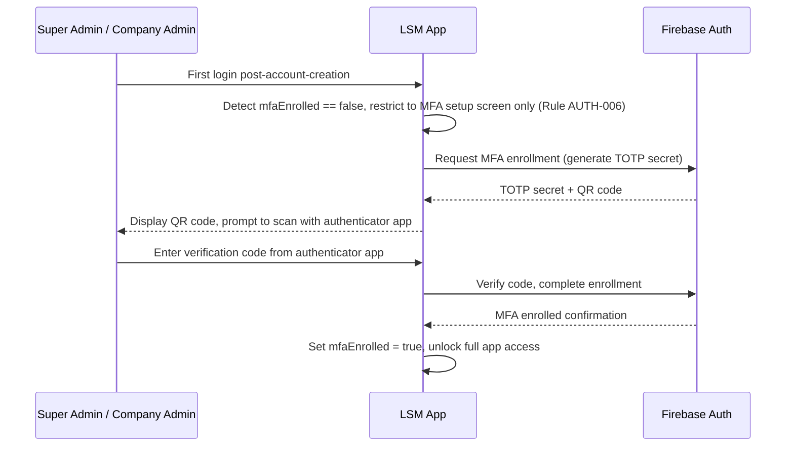
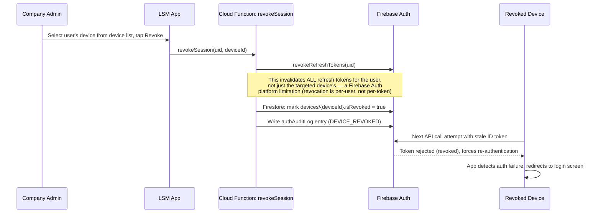
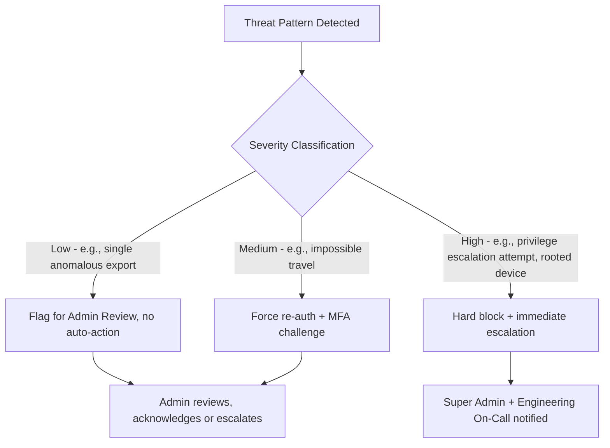
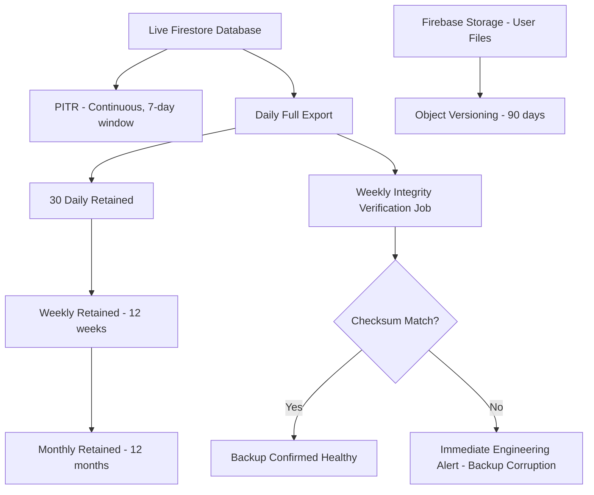

# MASTER_SECURITY_FRAMEWORK.md
## Log Sheet Muster (LSM) — Enterprise Security Framework Reference

**Document Classification:** Official Security Architecture Reference
**Governed By:** `MASTER_PROJECT_RULES.md` (Chapter 11), `MASTER_BUSINESS_LOGIC.md` (Module 2 - Authentication), `MASTER_FIRESTORE_ARCHITECTURE.md` (Chapter 16 - Security Rule Mapping)
**Purpose:** This document is the authoritative security reference that the above documents point to for full depth on RBAC permission strings, MFA implementation, encryption key management, audit log retention, threat detection rules, and disaster recovery procedures — areas those documents reference but deliberately do not exhaustively detail themselves.

---

# TABLE OF CONTENTS

1. Authentication (Deep Dive)
2. Authorization & Full RBAC Permission Matrix
3. Multi-Factor Authentication *(upcoming)*
4. Session Management *(upcoming)*
5. Encryption (At Rest and In Transit) *(upcoming)*
6. Audit Logs *(upcoming)*
7. Device Registration & Management *(upcoming)*
8. Security Monitoring *(upcoming)*
9. Threat Detection *(upcoming)*
10. Compliance (Data Protection) *(upcoming)*
11. Disaster Recovery *(upcoming)*
12. Backup Strategy *(upcoming)*

---

# CHAPTER 1: AUTHENTICATION (DEEP DIVE)

## 1.1 Purpose

`MASTER_BUSINESS_LOGIC.md` Module 2 established the business rules governing Authentication. This chapter provides the implementation-level security depth those rules depend on but don't themselves specify: exact password policy parameters, OTP security characteristics, session token lifecycle, and the precise Cloud Function trust boundary that makes custom-claim assignment tamper-resistant.

## 1.2 Password Policy (Email/Password Sign-In)

| Parameter | Value | Rationale |
|---|---|---|
| Minimum length | 10 characters | Balances usability against brute-force resistance for a non-expert user base |
| Complexity requirement | At least 1 uppercase, 1 lowercase, 1 digit | Firebase Auth's configurable password policy enforcement, project-level setting |
| Maximum age / forced rotation | None (rotation-forcing is a deprecated security practice per current NIST guidance; instead, breach-detection-triggered forced reset is used) | Avoids the well-documented anti-pattern of forced-rotation leading to weaker, incrementally-modified passwords |
| Breach detection | Firebase Auth's built-in compromised-credential detection (checks against known-breach password lists at sign-up/sign-in) | Blocks known-compromised passwords proactively |

## 1.3 Phone OTP Security Characteristics (Employee/ESS Sign-In)

| Parameter | Value | Rationale |
|---|---|---|
| OTP length | 6 digits | Firebase Auth Phone provider standard |
| OTP validity window | 5 minutes | Balances usability (field employee retrieving OTP from SMS under real-world delivery delay) against replay-attack window |
| Resend cooldown | 30 seconds, escalating (60s, 120s on repeated resend) | Mitigates SMS-pumping abuse and cost |
| Rate limiting | Firebase App Check-gated (Chapter 5.7 of `MASTER_PROJECT_RULES.md`) — OTP requests from non-attested clients are blocked entirely, not merely rate-limited | Prevents scripted OTP-flood abuse targeting the platform's SMS budget |

## 1.4 Custom Claims Trust Boundary — Implementation Detail

`MASTER_BUSINESS_LOGIC.md` Rule AUTH-002 established that custom claims are the sole authorization source, set exclusively via the `onUserProvision` Cloud Function. This section specifies the exact trust mechanism making that assertion enforceable, not merely policy:

```javascript
// Cloud Function (Node.js/TypeScript), deployed with a dedicated,
// narrowly-scoped service account — NOT the default App Engine service account,
// per the principle of least privilege applied to infrastructure identity itself.
exports.onUserProvision = functions.https.onCall(async (data, context) => {
  // 1. Verify the CALLER (not the user being provisioned) has sufficient permission
  if (!context.auth || !(await hasPermission(context.auth.uid, 'employees.create'))) {
    throw new functions.https.HttpsError('permission-denied', '...');
  }
  // 2. Create the Auth user
  const userRecord = await admin.auth().createUser({ ... });
  // 3. Set custom claims — this is the ONLY code path in the entire platform
  //    permitted to call setCustomUserClaims()
  await admin.auth().setCustomUserClaims(userRecord.uid, {
    companyId: data.companyId,
    role: data.role,
    superAdmin: false
  });
  // 4. Mirror to Firestore for display purposes (Rule AUTH-002's display-only fields)
  await admin.firestore().doc(`users/${userRecord.uid}`).set({ ... });
});
```

**Rule MSF-001:** `setCustomUserClaims()` is called from exactly one Cloud Function in the entire codebase (`onUserProvision`, plus its role-change-handling sibling `onUserRoleChange`, which follows an identical caller-permission-check pattern) — this is verified by a static-analysis CI check scanning the Cloud Functions source tree for any other invocation of this Admin SDK method, failing the build if found, since a second, less-guarded call site anywhere in the codebase would undermine the entire custom-claims trust model established in `MASTER_BUSINESS_LOGIC.md` Rule AUTH-002.

## 1.5 Token Refresh and Propagation Timing

Per `MASTER_BUSINESS_LOGIC.md` Rule AUTH-003, a role/company change requires client-side token refresh. This section specifies the exact timing guarantees:

- **Best case (app foregrounded, Firestore listener active):** The client's listener on its own `users/{uid}` document detects the `roleChangeTimestamp` field update within Firestore's normal real-time listener latency (typically under 1 second on good connectivity) and immediately calls `getIdToken(true)`, propagating the new permission set within seconds of the change.
- **Worst case (app backgrounded or offline):** The stale token remains valid for up to its natural 1-hour expiry (Firebase Auth's fixed ID token lifetime); upon next app foreground/token-refresh cycle, the SDK's automatic silent refresh picks up the updated claims. **Rule MSF-002:** This up-to-1-hour worst-case propagation window is a documented, accepted risk for role *upgrades* (a promoted Supervisor won't see new permissions instantly) but is explicitly mitigated for role *downgrades*/*revocations* by the fact that server-side Security Rules re-evaluate the (now-stale) token's claims on every single request — meaning a downgraded user's *client UI* may still show now-unauthorized options for up to an hour, but every actual write attempt is independently re-validated and rejected server-side the moment the Cloud Function processes the revocation, since Security Rules check the token's claims at request-time, and a genuinely revoked/suspended account is additionally handled via the immediate session-revocation mechanism (Chapter 7) rather than relying on claim-staleness tolerance alone for security-critical revocations.

## 1.6 Sign-In Method Migration

Per `MASTER_BUSINESS_LOGIC.md` Rule AUTH-001's edge case (a promoted Supervisor retains their original Phone-OTP sign-in), this platform supports **linked multi-provider authentication** — Firebase Auth's `linkWithCredential()` capability — allowing a user to add an Email/Password credential to an existing Phone-OTP-based account without creating a duplicate identity, should their role's expected sign-in method change. This is an optional, user/HR-initiated action, never automatic.

---

# CHAPTER 2: AUTHORIZATION & FULL RBAC PERMISSION MATRIX

## 2.1 Purpose

`MASTER_PROJECT_RULES.md` §11.3 established that permissions are granular, discrete strings bundled into roles. This chapter delivers the complete, authoritative catalog of every permission string used across all 22 `MASTER_BUSINESS_LOGIC.md` modules, and the default platform role bundles — the single source of truth the `hasPermission()` Security Rule function (`MASTER_FIRESTORE_ARCHITECTURE.md` §16.2) checks against.

## 2.2 Permission String Naming Convention

`<module>.<action>` — e.g., `employees.create`, `payroll.finalize`, `deployment.approve` — matching the module names used throughout `MASTER_BUSINESS_LOGIC.md`, with actions drawn from a constrained vocabulary: `create`, `read`, `update`, `delete`, `approve`, `finalize`, `viewSensitive`, `manage` (a bundle-convenience covering create+read+update for lower-risk collections), `correctBeyondWindow`, `writeOff`, `decommission`.

## 2.3 Complete Permission Catalog

| Module | Permission String | Grants |
|---|---|---|
| Company | `company.manage` | Edit company profile/settings |
| Company | `company.viewSubscription` | View subscription/billing tier detail |
| Employees | `employees.create` | Create new employee records |
| Employees | `employees.read` | View employee directory (masked sensitive fields) |
| Employees | `employees.update` | Edit employee records |
| Employees | `employees.delete` | Remove employee records (rare — offboarding uses status transition, not deletion) |
| Employees | `employees.viewSensitive` | View unmasked bank/ID number fields |
| Employees | `employees.viewDocuments` | View uploaded ID/verification documents |
| Employees | `employees.manageDocuments` | Upload/verify employee documents |
| Attendance | `attendance.mark` | Mark own or proxy attendance |
| Attendance | `attendance.correct` | Correct same-day/recent attendance records |
| Attendance | `attendance.correctBeyondWindow` | Correct attendance beyond the standard correction window |
| Attendance | `attendance.viewReports` | Access Attendance Register/Reports |
| Leave | `leave.apply` | Submit own leave application |
| Leave | `leave.approve` | Approve/reject leave requests |
| Leave | `leave.manageBalances` | Manually adjust leave balances |
| Leave | `leave.managePolicy` | Configure leave policy types |
| Shift | `shift.manage` | Create/edit shift types and rosters |
| Shift | `shift.approveSwap` | Approve shift swap requests |
| Deployment | `deployment.create` | Create deployment assignments |
| Deployment | `deployment.approve` | Approve high-value/long-term deployments |
| Deployment | `deployment.cancel` | Cancel/end deployments |
| Payroll | `payroll.generate` | Initiate payroll run generation |
| Payroll | `payroll.adjust` | Adjust individual payslips during review |
| Payroll | `payroll.approve` | Approve payroll run for finalization |
| Payroll | `payroll.finalize` | Execute finalization (may be same as approve depending on company config) |
| Payroll | `payroll.requestReversal` | Request a payroll reversal |
| Payroll | `payroll.approveReversal` | Approve a payroll reversal request |
| Inventory | `inventory.issue` | Issue inventory items |
| Inventory | `inventory.return` | Process inventory returns |
| Inventory | `inventory.writeOff` | Write off lost/damaged inventory |
| Inventory | `inventory.manage` | Manage inventory item catalog/reorder thresholds |
| Assets | `assets.manage` | Register/assign assets |
| Assets | `assets.decommission` | Decommission assets |
| Billing | `billing.generateInvoice` | Generate client invoices |
| Billing | `billing.approveInvoice` | Internal approval before client dispatch |
| Billing | `billing.recordPayment` | Record payment receipt |
| Client | `client.create` | Create client profiles |
| Client | `client.approve` | Approve client onboarding/contract activation |
| Client | `client.viewOwn` (Client-role-specific) | Client-role user's own-data read scope |
| Client | `client.approveInvoice` (Client-role-specific) | Client-role user's invoice approval action |
| Vendor | `vendor.manage` | Manage vendor profiles |
| Vendor | `vendor.createPO` | Create purchase orders |
| Vendor | `vendor.approvePO` | Approve high-value purchase orders |
| Vendor | `vendor.recordReceipt` | Record goods receipt |
| ESS | `ess.viewOwn` | Baseline ESS access (implicit for all Employee-role accounts) |
| ESS | `ess.editProfile` | Edit own whitelisted profile fields |
| Grievance | `grievance.submit` | Submit a grievance (implicit for all accounts) |
| Grievance | `grievance.handle` | Be assignable as a grievance handler |
| Grievance | `grievance.viewAll` | View the full Grievance Register (non-anonymous-restricted) |
| Notifications | `notifications.manageTemplates` | Edit notification templates |
| Analytics | `analytics.viewCompanyDashboards` | Access Analytics dashboards |
| Analytics | `analytics.viewSuperAdminDashboards` (Super Admin only) | Cross-company analytics |
| Reports | `reports.generate` | Generate standard reports |
| Reports | `reports.statutory.generate` | Generate statutory reports with unmasked sensitive fields |
| Workflow | `workflow.manageDefinitions` | Edit workflow state machine definitions (platform-config-level) |
| AI | `ai.useDocumentExtraction` | Use AI document extraction feature |
| AI | `ai.viewSuggestions` | Review AI suggestions |
| Compliance | `compliance.manageLicenses` | Manage business license records |
| Compliance | `compliance.manageRegisters` | Generate/manage statutory registers |
| Compliance | `compliance.manageRateTables` (Super Admin only) | Edit statutory rate tables |
| Roles | `roles.manage` | Create/edit custom company roles |
| Sites | `sites.manage` | Create/edit site records |

## 2.4 Default Platform Role Bundles

| Role | Representative Permission Bundle (abbreviated — full bundle in code) |
|---|---|
| Super Admin | All permissions across all companies (bypasses `companyId` scoping per `MASTER_PROJECT_RULES.md` §2.4.2) |
| Company Admin | All permissions within their own company, including `*.approve`/`*.finalize` tiers |
| HR Manager | `employees.*`, `leave.*`, `attendance.viewReports`, `attendance.correctBeyondWindow`, `payroll.generate`, `payroll.adjust`, `grievance.handle`, `compliance.manageLicenses`, `reports.generate`, `reports.statutory.generate` |
| Operations Manager | `deployment.*` (except `deployment.approve` above threshold), `shift.*`, `vendor.createPO`, `analytics.viewCompanyDashboards`, `reports.generate` |
| Supervisor | `attendance.mark`, `attendance.correct` (same-day only), `leave.approve` (first-level only, if 2-level config), `shift.approveSwap`, `deployment` read-only for their site(s) |
| Accounts/Billing | `billing.*`, `vendor.recordReceipt` read-adjacent, `payroll` read-only, `reports.generate` |
| Vendor/Store Manager | `inventory.*`, `assets.*`, `vendor.manage`, `vendor.createPO`, `vendor.recordReceipt` |
| Employee (ESS) | `ess.viewOwn`, `ess.editProfile`, `leave.apply`, `attendance.mark` (self only), `grievance.submit` |
| Client (external) | `client.viewOwn`, `client.approveInvoice` |

**Rule MSF-003:** Every permission string in §2.3 must appear in at least one default role bundle in §2.4 — an orphaned permission string (defined but never granted to any default role) is flagged by a CI consistency check as a likely documentation or implementation gap, directly extending `MASTER_PROJECT_RULES.md` §2.6's documentation-governance principle to this permission catalog specifically.

**Rule MSF-004:** Custom company-defined roles (`MASTER_FIRESTORE_ARCHITECTURE.md` §3.4) may compose any subset of the §2.3 catalog's permission strings, but may never introduce a new permission string not present in this catalog — enforced by the `roles.manage` write path validating every submitted permission string against this authoritative list before saving a custom role definition.

---

---

# CHAPTER 3: MULTI-FACTOR AUTHENTICATION

## 3.1 Purpose

`MASTER_BUSINESS_LOGIC.md` Rule AUTH-006 mandated MFA for Super Admin and Company Admin roles. This chapter specifies the implementation: enrollment flow, recovery process, and the enforcement mechanism ensuring MFA cannot be silently bypassed.

## 3.2 MFA Method

**TOTP (Time-based One-Time Password)** via Firebase Auth's Multi-Factor Authentication support, compatible with standard authenticator apps (Google Authenticator, Microsoft Authenticator, Authy) — chosen over SMS-based second-factor given SMS's well-documented SIM-swap vulnerability, which is an unacceptable risk for the platform's highest-privilege accounts.

## 3.3 Enrollment Flow



**Rule MSF-005:** The 7-day grace period referenced in `MASTER_BUSINESS_LOGIC.md` Rule AUTH-006 ("access restricted...within 7 days") applies only to the *initial* post-creation window before enforcement begins; during those 7 days the user has full access with a persistent, non-blocking reminder banner, but after the 7th day (or immediately, per company security-policy configuration allowing a stricter zero-grace-period setting), the restriction to MFA-setup-only screens becomes absolute and cannot be dismissed or postponed further.

## 3.4 Recovery Process (Lost MFA Device)

Since TOTP has no server-side "resend" mechanism (unlike SMS OTP), device loss requires a distinct, audited recovery path:

1. User contacts platform support (Super Admin) or, for a Company Admin's lost device, contacts the Super Admin directly (never another Company Admin at the same company, avoiding a peer-level social-engineering risk).
2. Support verifies the requester's identity through an out-of-band channel (registered email + a secondary verification question/callback, detailed operationally outside this document's scope but never solely trusting an in-app request).
3. Super Admin uses a dedicated, heavily-audited Admin Console action (`revokeMFAEnrollment`) that clears the user's MFA enrollment state, forcing them through the enrollment flow (§3.3) again on next login.
4. Every `revokeMFAEnrollment` action writes a high-priority `authAuditLog` entry (`MASTER_FIRESTORE_ARCHITECTURE.md` §4.5) and triggers a notification to the affected user's registered email (not just in-app, since their account access is precisely the thing in question) confirming the action, so a user whose account was compromised and whose MFA was maliciously reset would be alerted through a channel the attacker doesn't necessarily control.

**Rule MSF-006:** `revokeMFAEnrollment` is itself a Super-Admin-only Cloud Function, never exposed to Company Admins even for their own account recovery, and never automatable via a self-service "forgot my authenticator" flow — the explicit friction here is a deliberate security tradeoff, since self-service MFA recovery is a well-known account-takeover vector if not rigorously gated.

## 3.5 MFA Bypass Prevention

**Rule MSF-007:** No code path in the client application can set `mfaEnrolled = true` directly — this field (mirrored to Firestore for UI-gating convenience, per the same display-only-field pattern established for `role`/`companyId` in `MASTER_BUSINESS_LOGIC.md` Rule AUTH-002) is written exclusively by the server-side confirmation step in §3.3's enrollment flow, following successful Firebase Auth MFA verification — a client cannot simply set this flag to escape the setup-required restriction, since the restriction is enforced by checking Firebase Auth's own `multiFactor.enrolledFactors` array (server-verified) as the authoritative signal, with the Firestore field serving only as a fast local cache for UI-rendering purposes, mirroring the established authoritative-vs-display-only pattern used throughout this platform's identity architecture.

---

---

# CHAPTER 4: SESSION MANAGEMENT

## 4.1 Purpose

This chapter details the session lifecycle beyond what `MASTER_BUSINESS_LOGIC.md` Rule AUTH-003/AUTH-005 already established at the business-rule level, focusing on the concrete token lifecycle, concurrent-session handling, and remote revocation mechanics.

## 4.2 Token Lifecycle

| Token Type | Lifetime | Refresh Mechanism |
|---|---|---|
| ID Token | 1 hour | Automatic silent refresh by Firebase Auth SDK using the refresh token |
| Refresh Token | Long-lived (does not expire on a fixed schedule, but is invalidated by explicit revocation, password change, or prolonged inactivity per Firebase Auth's own token-family invalidation rules) | N/A — used only to obtain new ID tokens |
| App Check Token | 1 hour (aligned with ID token lifecycle for operational simplicity) | Automatic, tied to Play Integrity attestation freshness |

## 4.3 Concurrent Session Policy

**Rule MSF-008:** LSM permits multiple concurrent device sessions per user by default (a field employee may reasonably use both a personal and company-issued device, or a Supervisor may use a phone and a tablet) — there is no platform-wide single-session-enforcement policy. However, each concurrent session is independently tracked via the `users/{uid}/devices` subcollection (`MASTER_FIRESTORE_ARCHITECTURE.md` §4.3), and Company Admin/Super Admin retain the ability to selectively revoke any individual session without affecting others, per §4.4 below.

**Rule MSF-009:** A company may opt into a stricter **single-session policy** (configurable per company, relevant for higher-security-conscious clients, e.g., government-contract security agencies) — when enabled, a new successful login triggers automatic revocation of all other active sessions for that user, with a notification sent to the now-revoked device(s) explaining why access was terminated ("You were signed in from a new device — if this wasn't you, contact your administrator immediately").

## 4.4 Remote Session Revocation Mechanism



**Rule MSF-010:** Because Firebase Auth's `revokeRefreshTokens()` operates at the user level rather than the individual-device level (a documented platform limitation, not an LSM design choice), a Company Admin revoking one specific device's access technically forces **all** of that user's sessions to re-authenticate, not just the targeted device — this is communicated transparently in the Admin UI ("Revoking this device will require the user to sign in again on all their devices") rather than implying a more surgical single-device revocation than the underlying platform can actually provide, consistent with `MASTER_PROJECT_RULES.md`'s prohibition on making categorical claims the system cannot back (§ evenhandedness/accuracy principles applied here to security UX copy specifically).

## 4.5 Inactivity-Based Session Expiry

**Rule MSF-011:** Beyond the standard 1-hour ID token refresh cycle, an additional application-level inactivity timeout applies specifically to Super Admin and Company Admin roles (the highest-privilege, highest-blast-radius accounts): 30 minutes of in-app inactivity triggers a re-authentication prompt (PIN/biometric re-confirmation via Android's `BiometricPrompt` API if enrolled, or full credential re-entry otherwise) before any further write action is permitted — a defense against the scenario of an unlocked, unattended Admin device being misused by someone other than the authorized user. This inactivity timeout does **not** apply to Employee/ESS or Supervisor roles, where the operational friction of frequent re-authentication would outweigh the marginal security benefit given those roles' comparatively lower blast radius.

## 4.6 Logout Behavior (Cross-Reference)

Already specified in `MASTER_PROJECT_RULES.md` §5.3.3 and restated here for completeness: sign-out clears Room-cached sensitive tables (Employee PII, Payroll, Bank Details) while preserving non-sensitive UI preferences, and does not itself call `revokeRefreshTokens()` (that is reserved for the explicit Admin-initiated remote-revocation action in §4.4) — a standard user-initiated logout simply discards the local token and cache, a lighter-weight operation appropriate for the routine, frequent nature of normal sign-out versus the exceptional, security-incident-adjacent nature of remote revocation.

---

---

# CHAPTER 5: ENCRYPTION (AT REST AND IN TRANSIT)

## 5.1 Purpose

`MASTER_PROJECT_RULES.md` §11.2 established encryption-in-transit-and-at-rest as a core security principle. This chapter specifies the concrete implementation, particularly the application-level encryption layer for sensitive fields that goes beyond Firebase's own default infrastructure-level encryption.

## 5.2 Transit Encryption

All communication with Firebase services (Firestore, Storage, Auth, FCM, Cloud Functions) occurs over TLS 1.2+ by default, enforced by the Firebase SDKs themselves with no application-level configuration required or permitted to weaken this (no code path in the codebase may disable certificate validation or downgrade the connection, verified by a `detekt` custom rule per `MASTER_PROJECT_RULES.md` §3.5 scanning for any `TrustManager`/`HostnameVerifier` override attempts).

## 5.3 At-Rest Encryption — Infrastructure Layer

Firestore and Firebase Storage encrypt all data at rest by default using Google Cloud's infrastructure-level encryption (AES-256), transparent to the application and requiring no LSM-specific configuration — this is the baseline every byte of data in the platform receives regardless of sensitivity classification.

## 5.4 At-Rest Encryption — Application Layer (Sensitive Fields)

Beyond the infrastructure baseline, specific fields identified as highly sensitive receive an **additional application-level encryption layer** before being written to Firestore:

| Field | Collection | Encryption Approach |
|---|---|---|
| `bankAccountNumber` | `employees` | AES-256-GCM, encrypted client-side-adjacent via a Cloud Function (never in the Android client itself, to keep the encryption key out of any device-extractable code path) before Firestore write |
| `aadhaarNumber` | `employees` | Same as above |
| `panNumber` | `employees` | Same as above (though PAN is less universally treated as sensitive as Aadhaar in Indian data-protection norms, it is included here given its use as a financial identifier) |

**Rule MSF-012:** Application-level encryption/decryption for these fields occurs exclusively within Cloud Functions (specifically, the Employee-record write path and the Payroll-processing read path that needs the bank account number for disbursement file generation) — the Android client never holds the encryption key, and never performs encryption/decryption itself. The client only ever sees either the fully-masked display value (`XXXX1234`) or, for a `employees.viewSensitive`-permissioned user viewing their own permitted screen, a value already decrypted server-side and delivered over the already-TLS-encrypted channel for that specific authorized request — the plaintext sensitive value exists unencrypted only transiently in Cloud Function memory during the specific operation requiring it, never persisted to any client-side cache (Room) in plaintext form.

## 5.5 Encryption Key Management

- Application-level encryption keys are stored in **Google Cloud Secret Manager**, never hardcoded in Cloud Functions source code, never committed to the repository, and never present in any client-side configuration.
- Key access is restricted via IAM to only the specific Cloud Functions service account requiring it (the Employee-write and Payroll-processing functions specifically), following the same least-privilege principle already established for the `onUserProvision` function's dedicated service account (Chapter 1.4).
- **Rule MSF-013:** Key rotation is performed on a scheduled basis (annually, or immediately upon any suspected compromise) using an envelope-encryption pattern (a data-encryption-key per sensitive field value, itself encrypted by a key-encryption-key stored in Secret Manager) — this allows key rotation without requiring a full re-encryption pass over every existing sensitive field value in the database, since only the key-encryption-key changes; existing data-encryption-keys remain valid, wrapped under the new key-encryption-key via a background re-wrapping job.

## 5.6 Encryption Scope Boundaries — What Is NOT Application-Level Encrypted

**Rule MSF-014:** Fields not listed in §5.4's table (employee names, addresses, phone numbers, attendance timestamps, payroll wage figures, etc.) rely on infrastructure-level encryption only (§5.3), not application-level encryption — this is a deliberate scope decision, not an oversight: applying application-level encryption universally would (a) prevent Firestore's native query capability against those fields (an encrypted value cannot be used in a `where()` filter or `orderBy()`, which would break nearly every list/search/filter screen across the platform per `MASTER_PROJECT_RULES.md` Chapter 7's UI standards), and (b) add unnecessary Cloud-Function-mediation overhead to high-frequency, lower-sensitivity data paths. The specific three fields in §5.4 were chosen because they are both genuinely high-sensitivity (financial fraud / identity theft risk) and are never used as query/filter/sort keys in any screen across the entire platform (verified against the full query catalog in `MASTER_FIRESTORE_ARCHITECTURE.md` Chapter 12 — none of the 76 cataloged indexes reference `bankAccountNumber`, `aadhaarNumber`, or `panNumber`), making them safe candidates for this encryption approach without breaking any existing feature.

## 5.7 Storage (File) Encryption

Uploaded files (ID documents, signed log sheets, invoices) receive the same infrastructure-level at-rest encryption as Firestore data via Firebase Storage's Google Cloud Storage backing — no additional application-level file encryption is applied, since file access is already gated by the Storage Security Rules (`MASTER_FIRESTORE_ARCHITECTURE.md` §15.5) providing access control equivalent in spirit to the Firestore field-masking approach, and files (unlike specific database fields) are not amenable to partial/field-level encryption in the same way.

---

---

# CHAPTER 6: AUDIT LOGS

## 6.1 Purpose

Audit logging has been referenced across nearly every prior document (`MASTER_PROJECT_RULES.md` §11.2, `MASTER_FIRESTORE_ARCHITECTURE.md` §11.7's consolidated registry). This chapter is the authoritative reference for audit log **retention policy, access control, and completeness verification** — the governance layer around the mechanism, rather than re-cataloging the collections themselves (already done in `MASTER_FIRESTORE_ARCHITECTURE.md` §11.7).

## 6.2 Audit Log Retention Policy

| Log Category | Retention Period | Rationale |
|---|---|---|
| `authAuditLog` | 3 years minimum, indefinite thereafter unless a legal deletion obligation applies | Security incident investigation may require historical login-pattern analysis well after the fact |
| Business-transaction audit trails (Deployment history, Asset assignment history, Workflow transition history) | Indefinite — never purged | These are the compliance-relevant "why did this happen" record for financial/legal-consequential decisions, per `MASTER_PROJECT_RULES.md` §11.2's immutable-audit-trail principle |
| `aiUsageAuditLog` | 2 years | Primarily a cost-governance log; retained long enough for annual cost-trend review but without the indefinite-retention bar applied to business-transaction trails |
| Payroll/Payslip audit trail (correction history, reversal records) | Indefinite — statutory requirement in most Indian labor-law contexts requires wage-record retention for extended periods (commonly cited as multiple years post-employment-end, verified against current applicable regulation at implementation time) | Direct legal compliance requirement, not merely an internal preference |

## 6.3 Audit Log Access Control

**Rule MSF-015:** Read access to audit log collections is itself permission-gated and logged as a **meta-audit-event** where the audit log itself is sensitive enough to warrant it (specifically, `authAuditLog` and any Super-Admin cross-company access log, per `MASTER_BUSINESS_LOGIC.md` Rule COMPANY-006's "Super Admin cross-company read is audited" requirement) — this creates a recursive but bounded audit structure: viewing certain audit logs is itself an auditable event, but this recursion terminates at exactly one level (viewing the meta-audit-log-of-audit-log-access is not itself further audited), a deliberate, documented boundary avoiding infinite recursive overhead while still capturing the security-relevant case of "who looked at the sensitive login history and when."

## 6.4 Audit Log Immutability Enforcement

Per `MASTER_FIRESTORE_ARCHITECTURE.md` Rule FSA-016, every audit log collection has `allow delete: if false;` unconditionally. This chapter adds the **update** restriction specification: audit log documents are `allow update: if false;` as well in nearly all cases — audit entries are create-only, append-only records. The sole documented exception: a `workflowInstances/{id}/transitionHistory` entry's `reason` field may receive a single follow-up amendment (not a full rewrite) if initially submitted with a placeholder pending fuller documentation (e.g., an urgent rejection recorded with "see follow-up" and later amended with full detail) — and even this exception writes the amendment as a new field (`reasonAmendment`, `amendedAt`, `amendedByUserId`) rather than overwriting the original `reason` value, preserving the original text alongside the amendment rather than replacing it, consistent with the platform-wide principle that history is appended to, never rewritten (`MASTER_PROJECT_RULES.md` §11.2).

## 6.5 Audit Log Completeness Verification

**Rule MSF-016:** A scheduled (weekly) Cloud Function performs a **completeness cross-check**: for a sample of recent business-transaction writes across the platform's core collections (Attendance corrections, Leave approvals, Payroll finalizations, Deployment status changes), it verifies that a corresponding audit trail entry exists in the expected location (`correctionHistory` array, `transitionHistory` subcollection, etc.) — flagging any write that appears to have occurred without its expected audit companion as a high-priority engineering alert, since such a gap would indicate a code path bypassing the audit-logging discipline established throughout `MASTER_BUSINESS_LOGIC.md`'s 22 modules, a defect category this platform treats with the same severity as a Security Rule isolation failure, given both represent a breakdown of a foundational, cross-cutting guarantee rather than an isolated feature bug.

## 6.6 Audit Log Export for External Compliance Review

Per `MASTER_BUSINESS_LOGIC.md` Module 17 (Reports)'s general async-export pattern, audit logs are exportable via a dedicated `reports.statutory.generate`-permissioned report type (`AUDIT_TRAIL_EXPORT`), producing a formatted, timestamped export suitable for presentation to an external auditor or labor inspector — reusing the existing Reports infrastructure rather than building a bespoke audit-export mechanism, consistent with `MASTER_PROJECT_RULES.md`'s general preference against duplicating infrastructure that already exists for a structurally similar need.

---

---

# CHAPTER 7: DEVICE REGISTRATION & MANAGEMENT

## 7.1 Purpose

`MASTER_BUSINESS_LOGIC.md` Rule AUTH-005 and `MASTER_FIRESTORE_ARCHITECTURE.md` §4.3 established the `devices` subcollection's existence and basic structure. This chapter provides the full operational lifecycle: registration, health monitoring, and the Admin-facing device management console.

## 7.2 Device Fingerprint Composition

A device fingerprint used to derive the deterministic `deviceId` (§4.3 of `MASTER_FIRESTORE_ARCHITECTURE.md`) is composed from: Android's `Settings.Secure.ANDROID_ID` combined with a locally-generated, app-scoped install identifier (persisted in app-private storage, regenerated only on app reinstall) — **not** any hardware serial number or IMEI, both of which require sensitive permissions LSM deliberately avoids requesting, consistent with the data-minimization principle (`MASTER_PROJECT_RULES.md` §11.8) applied even to the device-identification mechanism itself.

## 7.3 Device Health Signals Tracked

| Signal | Purpose |
|---|---|
| `appVersion` | Identifies devices running outdated app versions, informing forced-update decisions for security-patch releases |
| `osVersion` | Identifies devices on unsupported/EOL Android versions, relevant for App Check/Play Integrity compatibility troubleshooting |
| `lastSeenAt` | Identifies dormant/abandoned device registrations (e.g., an employee's old phone, replaced but never explicitly deregistered) |
| `isRevoked` | Current access status, per Chapter 4.4's revocation mechanism |

## 7.4 Stale Device Cleanup

**Rule MSF-017:** A scheduled (monthly) Cloud Function identifies device records with `lastSeenAt` older than 180 days and flags them (not auto-deletes them) for Company Admin review as "Inactive Device — Consider Revoking," surfaced in the Admin device-management console — this is a **suggestion**, not an automatic revocation, since a legitimately-owned device simply unused for an extended period (e.g., an employee on long approved leave) should not be silently locked out upon their return without at least a human-reviewable flag first, consistent with the platform-wide principle against fully-automated access decisions for anything with real operational impact (echoing the AI module's Rule AI-001 human-confirmation principle, applied here to a device-lifecycle decision rather than an AI-generated one, but sharing the identical underlying philosophy).

## 7.5 Admin Device Management Console

The Company Admin-facing screen (part of the Security Framework's UI surface, built per `MASTER_PROJECT_RULES.md` Chapter 7's UI standards) displays, per employee: all registered devices with their health signals (§7.3), a Revoke action per device (invoking Chapter 4.4's mechanism), and the stale-device flag (§7.4) where applicable. This screen itself requires `employees.viewSensitive`-adjacent permission (specifically a dedicated `devices.manage` permission, added to the Chapter 2.3 catalog) given the security-sensitive nature of session/device control.

## 7.6 App Check / Play Integrity Cross-Reference

Device trust is additionally established at the request level (not just the registration-record level) via Firebase App Check with the Play Integrity API provider, already specified in `MASTER_PROJECT_RULES.md` §5.7 — this chapter confirms the relationship between the two mechanisms: **device registration (§7.2-7.5) is an application-level, human-manageable record of "which devices has this user logged in from,"** used for visibility and revocation, while **App Check is a request-level, cryptographic attestation that the calling app binary is genuine and unmodified**, checked on every single Firestore/Storage/Callable-Function request regardless of device-registration status. A device can be "registered" (has a `devices` subcollection entry) yet still have every request rejected if App Check attestation fails (e.g., a rooted device or a tampered APK) — the two mechanisms are complementary, not redundant, and neither substitutes for the other.

---

---

# CHAPTER 8: SECURITY MONITORING

## 8.1 Purpose

`MASTER_PROJECT_RULES.md` §11.7 introduced anomalous-access-pattern monitoring at a high level. This chapter specifies the concrete monitoring dashboard, alert thresholds, and escalation paths that Super Admin (platform-wide) and Company Admin (company-scoped) rely on for ongoing security posture visibility.

## 8.2 Monitoring Dashboard Metrics

| Metric | Scope | Alert Threshold |
|---|---|---|
| Failed login attempts (rate) | Per-company, per-user | >5 in 15 minutes triggers account lockout (`MASTER_BUSINESS_LOGIC.md` Rule AUTH-004); >50 across a company in 1 hour triggers a company-wide security alert to Company Admin (possible coordinated attack) |
| Permission-denied Firestore/Storage requests (rate) | Per-company, per-user | >20 in 10 minutes from a single user flags a potential probing/reconnaissance attempt, surfaced to Company Admin |
| New device registrations (rate) | Per-company | >10% of active user base registering a new device within 24 hours flags for review (could indicate a phishing campaign prompting mass re-authentication, or a legitimate mass device-refresh — reviewed, not auto-blocked) |
| App Check attestation failure rate | Platform-wide | Sustained elevated failure rate across many companies simultaneously suggests a Play Integrity service issue or a coordinated tampered-client attack, escalated to Super Admin/engineering on-call |
| Geographically implausible login sequences | Per-user | Two successful logins from locations requiring physically impossible travel time between them, within the same session-token validity window, flags for Company Admin review (a classic account-sharing or credential-compromise indicator) |

## 8.3 Alert Delivery

Security alerts use the Notifications module's (`MASTER_BUSINESS_LOGIC.md` Module 15) `ALERT_ESCALATION` category — the non-mutable, quiet-hours-bypassing category already established there — ensuring security-relevant alerts reach the responsible Admin regardless of notification preferences or time of day, consistent with that category's design intent extending naturally to this use case.

## 8.4 Security Monitoring Dashboard UI

A dedicated screen (Company Admin's Security tab, and a cross-company aggregate equivalent for Super Admin) surfaces §8.2's metrics as time-series charts (leveraging the same `chart_display`-style visualization pattern used throughout the platform's Analytics module, `MASTER_BUSINESS_LOGIC.md` Module 16) alongside a scrollable recent-alerts feed, each alert tappable to drill into the underlying `authAuditLog`/permission-denial-log entries that triggered it — directly implementing the same drill-down-traceability principle established for Analytics dashboards (`MASTER_BUSINESS_LOGIC.md` Rule ANALYTICS-004) applied here to security metrics specifically.

## 8.5 False-Positive Management

**Rule MSF-018:** Every security alert surfaced via §8.2's thresholds includes a "Mark as Expected/Benign" acknowledgment action available to the reviewing Admin — acknowledging an alert does not delete or hide the underlying log data (per Chapter 6's immutability principle), but suppresses *future* alerts of the identical pattern for a defined cooldown period (e.g., a Company Admin acknowledging a "new device registration surge" as a planned company-wide device refresh suppresses that specific alert type for 48 hours), preventing alert fatigue from legitimate, expected operational events while preserving the full underlying audit trail for later review if ever needed.

## 8.6 Relationship to AI-Assisted Anomaly Detection

**Cross-Reference:** This chapter's rule-based, threshold-driven monitoring (§8.2) is distinct from but complementary to the AI-assisted attendance/behavioral anomaly detection specified in `MASTER_BUSINESS_LOGIC.md` Rule AI-003 — this chapter's monitoring focuses on **authentication and access-pattern security** (is someone attempting unauthorized access), while the AI module's anomaly detection focuses on **business-process integrity** (is a legitimately-authenticated user's business activity pattern suspicious, e.g., attendance fraud). Both feed into the same underlying `ALERT_ESCALATION` notification pipeline (§8.3) but represent genuinely different risk categories requiring different detection logic, and this document does not duplicate the AI module's specification here.

---

---

# CHAPTER 9: THREAT DETECTION

## 9.1 Purpose

Where Chapter 8 (Security Monitoring) is primarily observational — surfacing metrics and alerts for human review — this chapter specifies the platform's **active threat-detection rule catalog**: automated pattern-matching rules that trigger specific, predefined defensive responses beyond simple alerting, closing the loop `MASTER_PROJECT_RULES.md` §11.7 opened.

## 9.2 Threat Detection Rule Catalog

| # | Threat Pattern | Detection Logic | Automated Response |
|---|---|---|---|
| 1 | Credential stuffing (mass failed logins across many distinct accounts from a similar pattern) | >100 failed logins across ≥20 distinct accounts within 5 minutes, company-wide | Temporary company-wide login rate-limiting (a stricter, shorter-duration throttle layered on top of the standard per-account lockout, Chapter 8.2), plus immediate Super Admin alert |
| 2 | Privilege escalation attempt via crafted request | A Security Rule denial specifically on a write attempting to modify `companyId`, `role`, or `superAdmin`-adjacent fields (i.e., not a routine permission-denied event, but one matching this specific high-risk field-mutation pattern) | Immediate `ALERT_ESCALATION` to Super Admin (not just Company Admin, given the platform-wide implication of a privilege-escalation attempt), the specific request logged in full (sanitized of any secrets) for forensic review |
2 | *(continued)* | | |
| 3 | Bulk data export anomaly | A single user's report-generation requests (`MASTER_BUSINESS_LOGIC.md` Module 17) exceed a volume/frequency threshold suggesting systematic data exfiltration rather than routine business reporting (e.g., generating the full Employee Master Report more than 3 times in an hour) | Flag for Company Admin review; does not auto-block (routine legitimate bulk-reporting scenarios exist, e.g., a new HR hire double-checking their export), but surfaces prominently |
| 4 | Rooted/tampered device detection | App Check/Play Integrity attestation returns a compromised-device-integrity verdict | Request rejected at the App Check layer itself (Chapter 7.6) before reaching Firestore/Storage — this is a hard block, not merely an alert, since a confirmed-compromised device represents an unacceptable risk regardless of the specific request's apparent legitimacy |
| 5 | Impossible-travel login pattern | Per Chapter 8.2's geographically-implausible-sequence detection | Does not auto-block (network/VPN/travel-related false positives are common enough to make hard-blocking too disruptive), but forces an immediate re-authentication + MFA challenge (even for roles not normally MFA-required) on the next request from either flagged session |
| 6 | Mass permission-denied pattern suggesting automated scraping | A single account triggering permission-denied errors across an unusually broad, systematic sweep of different collection/document-ID patterns (suggestive of automated enumeration rather than organic UI-driven usage) | Temporary account suspension pending Company Admin/Super Admin review, with immediate notification to the account holder explaining the suspension and providing a support contact path (avoiding the appearance of an unexplained, punitive lockout) |

## 9.3 Threat Response Escalation Tiers



## 9.4 Threat Detection False-Positive Governance

**Rule MSF-019:** Every threat-detection rule in §9.2's catalog has a documented false-positive rate expectation and a corresponding review cadence — rules with a hard-block response (Rules 4-6 in the catalog) are held to a stricter false-positive tolerance and require sign-off from both a security-focused engineer and a product/operations stakeholder before deployment or threshold adjustment, since an overly-aggressive hard-block rule directly harms legitimate field employees' ability to do their jobs (e.g., a false rooted-device detection preventing a guard from marking attendance has real wage/operational consequences), extending `MASTER_PROJECT_RULES.md`'s general "consider the real-world impact on field workers" ethos into the security-engineering domain specifically.

## 9.5 Incident Response Runbook (Summary Reference)

A full incident-response runbook (detailed procedures for confirmed security incidents — credential compromise, data breach, insider threat) is maintained as an operational document outside this architecture reference (since runbooks are living operational procedures reviewed/drilled far more frequently than this architectural documentation set), but this chapter establishes the runbook's required triggering conditions: any Chapter 9.2 Rule 2, 4, or 6 detection event, or any manually-reported suspected compromise, mandatorily triggers runbook activation — ensuring the automated detection layer specified here has a defined, non-optional human-process consequence rather than existing as a purely technical control with no organizational follow-through.

---

---

# CHAPTER 10: COMPLIANCE (DATA PROTECTION)

## 10.1 Purpose

`MASTER_PROJECT_RULES.md` §11.8 introduced data-protection posture at a principle level (data minimization, purpose limitation). This chapter — distinct from `MASTER_BUSINESS_LOGIC.md` Module 21's *labor-law* compliance focus — specifically addresses **data protection/privacy compliance** (India's Digital Personal Data Protection Act, DPDP, and general data-handling best practice), a genuinely different compliance dimension from wage/PF/ESI regulation.

## 10.2 Data Minimization in Practice

**Rule MSF-020:** Every field collected across all 22 `MASTER_BUSINESS_LOGIC.md` modules must trace to a specific, stated business purpose documented in that module's rules — this platform does not collect speculative "might be useful someday" fields. Concretely: LSM does **not** collect biometric templates (fingerprint/face data) despite the security-industry context where biometric attendance is common in the broader market, because `MASTER_PROJECT_RULES.md` §1.5's non-goals explicitly scope out biometric hardware integration for this version, and the resulting data-minimization benefit (no biometric template storage risk) is a direct, positive consequence of that scoping decision worth noting explicitly here.

## 10.3 Purpose Limitation Enforcement

**Rule MSF-021:** Sensitive fields are accessible only to the roles/permissions whose *stated business purpose* requires them — e.g., `bankAccountNumber` is needed by Payroll processing and HR record-keeping (`employees.viewSensitive`), but not by Operations Managers configuring deployments, who never see this field regardless of their otherwise broad operational access. This is the direct technical enforcement (via the RBAC permission catalog, Chapter 2.3) of the purpose-limitation principle — access is scoped to demonstrated need, not granted broadly and merely "trusted not to misuse."

## 10.4 Data Subject Rights Support

Consistent with DPDP-style data protection principles, the platform supports the following data-subject-facing capabilities, implemented as specific, auditable operations rather than ad hoc manual processes:

| Right | Implementation |
|---|---|
| Right to access own data | ESS module (`MASTER_BUSINESS_LOGIC.md` Module 14) already provides employees read access to their own Attendance, Leave, Payroll, and profile data as a standard product feature — this "right to access" is largely satisfied by ordinary product functionality, not a special-case request process |
| Right to correction | ESS's whitelisted-field self-edit (Rule ESS-002) plus HR-mediated correction for non-whitelisted fields via the standard Employee Update flow — both are audited (correction history, Chapter 6) |
| Right to erasure (where legally applicable, and subject to legitimate retention overrides — e.g., statutory wage-record retention per Chapter 6.2 takes precedence over an erasure request for payroll-relevant data) | A distinct, Super-Admin-mediated "Data Subject Erasure Request" process — never a standard client-exposed delete operation (consistent with Chapter 6.4's `allow delete: if false` principle) — that assesses which specific fields/records can be genuinely erased (e.g., ESS app-usage preference data) versus which must be retained under a documented legal-retention override (e.g., finalized payroll records), with the outcome and rationale itself logged |
| Right to data portability | An employee's own-data export (via the Reports module's async-job pattern, scoped to their own `employeeId`, generating a structured export of their Attendance/Leave/Payroll history) |

## 10.5 Cross-Border Data Transfer Consideration

**Rule MSF-022:** LSM's Firebase project is provisioned in an India-region Google Cloud location (Firestore multi-region or regional configuration selected specifically for India-based data residency, given the platform's primary market and the data-protection expectations of Indian enterprise/government clients) — this is a deliberate infrastructure configuration choice documented here so future infrastructure changes are evaluated against this established data-residency commitment rather than inadvertently relocating data storage in a way that could violate client contractual or regulatory expectations.

## 10.6 Third-Party Data Sharing Boundary

**Rule MSF-023:** The only third-party service receiving LSM data beyond Google/Firebase infrastructure itself is Google AI Studio (`MASTER_BUSINESS_LOGIC.md` Module 20), and per that module's Rule AI's data-privacy consideration (§20.9 of that document), every such data-sharing instance is a discrete, purpose-specific, logged request (`aiUsageAuditLog`) — never a standing bulk data-sync arrangement. No other third-party analytics, advertising, or data-broker integration exists anywhere in the platform, a fact worth stating explicitly and affirmatively here as a compliance-relevant boundary, not merely an absence to be inferred.

---

---

# CHAPTER 11: DISASTER RECOVERY

## 11.1 Purpose

This chapter specifies the platform's recovery objectives and procedures for catastrophic failure scenarios — a genuinely different concern from Chapter 12's routine Backup Strategy (backups are the *mechanism*; disaster recovery is the *plan for using them under pressure*).

## 11.2 Recovery Objectives

| Metric | Target | Rationale |
|---|---|---|
| RTO (Recovery Time Objective) | 4 hours for full platform restoration | Given the platform's role in daily wage-critical attendance tracking, an extended outage directly harms field employees' ability to have their work-day accurately recorded; 4 hours balances realistic infrastructure-recovery timelines against this operational criticality |
| RPO (Recovery Point Objective) | 15 minutes maximum data loss | Firestore's point-in-time recovery (PITR) capability, where enabled, supports recovery to any point within its retention window; 15 minutes reflects the platform's acceptable-loss tolerance for the worst-case scenario between the last durable write and a catastrophic failure |

## 11.3 Disaster Scenarios and Response

| Scenario | Response |
|---|---|
| Firebase/Google Cloud regional outage | Google Cloud's own multi-zone redundancy within the India region (Chapter 10.5's data-residency-constrained region) handles most failure modes transparently; a full regional outage (rare) triggers LSM's own incident-communication plan (in-app banner + status-page equivalent) informing users of the Google-side outage and expected resolution, since LSM itself has no cross-region failover mechanism that would conflict with the data-residency commitment established in Chapter 10.5 |
| Accidental mass data deletion (e.g., a catastrophic bug deploying a faulty migration) | Firestore PITR restoration to the point immediately preceding the faulty deployment, combined with the immutable audit-trail collections (Chapter 6) providing a secondary verification source to confirm the restored state's correctness before resuming normal operations |
| Compromised Cloud Functions service account / malicious code deployment | Immediate revocation of the compromised service account's credentials, rollback to the last-known-good Cloud Functions deployment (version-controlled per `MASTER_PROJECT_RULES.md` §2.5's semantic versioning and CI/CD deployment discipline), followed by a full Chapter 9.5 incident-response-runbook activation |
| Firebase project-level misconfiguration (e.g., accidental Security Rules deployment removing tenant isolation) | The staged-rollout Security Rules deployment practice (`MASTER_PROJECT_RULES.md` §2.5) is the primary preventive control; should a faulty rules deployment nonetheless reach production, immediate rollback to the previous rules version (retained in version control per the folder structure, `MASTER_PROJECT_RULES.md` §15.2's `firebase/firestore.rules`) is the first response, followed by an audit-log review (Chapter 6) of any data accessed during the misconfiguration window to assess actual exposure |

## 11.4 Disaster Recovery Testing

**Rule MSF-024:** A full disaster-recovery drill (simulated restoration from backup to a staging environment, timed against the RTO/RPO targets in §11.2) is conducted at least semi-annually, with results documented and any gap between actual and target recovery time treated as an engineering priority item, not merely a noted observation — directly extending `MASTER_PROJECT_RULES.md` §13's testing-discipline philosophy ("if it isn't tested, it isn't verified to work") to the disaster-recovery domain specifically, where the consequence of an untested recovery procedure failing during an actual disaster is uniquely severe.

## 11.5 Communication Plan During an Incident

**Rule MSF-025:** During any disaster-recovery event affecting customer-visible availability, Company Admins across all affected companies receive a proactive, non-technical-language status notification (via the standard Notifications module, `ALERT_ESCALATION` category) at incident start, at any significant status change, and at resolution — consistent with `MASTER_PROJECT_RULES.md`'s broader principle that the platform should never leave users in an unexplained, silent failure state (§2.2's non-negotiable rules), extended here to infrastructure-level incidents beyond the application-level failure modes that principle was originally framed around.

---

---

# CHAPTER 12: BACKUP STRATEGY

## 12.1 Purpose

Where Chapter 11 addressed the *response plan* for catastrophic failure, this final chapter specifies the concrete *backup mechanism* underlying that plan — what is backed up, how frequently, where, and how integrity is verified.

## 12.2 Firestore Backup Mechanism

**Point-in-Time Recovery (PITR):** Enabled at the Firestore database level, providing continuous recovery capability to any point within the retention window (Firestore PITR typically supports up to 7 days of point-in-time recovery granularity) — this is the primary mechanism satisfying Chapter 11.2's 15-minute RPO target for recent-data recovery scenarios.

**Scheduled Managed Exports:** In addition to PITR's short-window granularity, daily automated exports of the full Firestore database to a dedicated, access-restricted Cloud Storage bucket (distinct from the application's own Firebase Storage bucket used for user-uploaded files) provide longer-term recovery points beyond PITR's window — retained per the schedule in §12.4.

## 12.3 Firebase Storage (File) Backup

User-uploaded files (ID documents, signed log sheets, invoices, payslips) are backed up via Google Cloud Storage's own object versioning feature enabled on the Storage bucket, retaining prior versions of any object for a defined period, protecting against accidental overwrite/deletion of an uploaded file distinct from the Firestore-metadata-level protections already described.

## 12.4 Backup Retention Schedule

| Backup Type | Frequency | Retention |
|---|---|---|
| Firestore PITR | Continuous | 7 days (Firestore's supported window) |
| Firestore full export | Daily | 30 daily exports retained, then transitions to weekly retention (1 per week for the preceding 12 weeks), then monthly (1 per month for the preceding 12 months) — a standard grandfather-father-son retention pyramid balancing storage cost against long-window recovery capability |
| Firebase Storage object versions | Continuous (on every overwrite/delete) | 90 days |
| Cloud Functions source/deployment history | Every deployment (via version control, not a separate backup mechanism) | Indefinite, per standard Git history retention |

## 12.5 Backup Access Control

**Rule MSF-026:** The dedicated backup Cloud Storage bucket (§12.2) has IAM access restricted to a minimal set of Super-Admin-tier engineering roles, distinct from and more restrictive than the access granted to the application's regular Firebase Storage bucket — since a backup archive represents a full historical snapshot of every company's data simultaneously, it is treated as the single highest-sensitivity data asset in the entire platform's infrastructure, warranting access controls stricter than any single collection's Security Rules could provide (since Security Rules operate within the live application's request context, not against a raw exported archive file).

## 12.6 Backup Integrity Verification

**Rule MSF-027:** A scheduled (weekly) automated verification job restores the most recent full export to an isolated, non-production verification environment and runs a data-integrity checksum comparison against a set of known-reference records, confirming the backup is not merely *present* but *actually restorable and internally consistent* — directly addressing the well-known operational failure mode of "we had backups, but they turned out to be corrupted/unusable when we actually needed them," extending the same "if it isn't tested, it isn't verified to work" philosophy from Chapter 11.4's DR drills to the underlying backup artifacts themselves, at a higher frequency (weekly) than the full DR drill (semi-annual) since backup-integrity verification is comparatively cheap to automate while a full DR drill requires more substantial coordinated effort.

## 12.7 Backup Strategy Summary Diagram



---

# END OF DOCUMENT — MASTER_SECURITY_FRAMEWORK.md

This document is now **complete** across all 12 chapters:

1. Authentication (Deep Dive)
2. Authorization & Full RBAC Permission Matrix
3. Multi-Factor Authentication
4. Session Management
5. Encryption (At Rest and In Transit)
6. Audit Logs
7. Device Registration & Management
8. Security Monitoring
9. Threat Detection
10. Compliance (Data Protection)
11. Disaster Recovery
12. Backup Strategy

**Document Version:** 1.0 — Final
**Governed By:** `MASTER_PROJECT_RULES.md` (Chapter 11), `MASTER_BUSINESS_LOGIC.md` (Module 2 and cross-cutting security references throughout), `MASTER_FIRESTORE_ARCHITECTURE.md` (Chapter 16)
**Status:** Ready to serve as the authoritative security reference for `firestore.rules` permission logic, Cloud Functions security implementation, and operational security/DR procedures.

----------------------------------------
DOCUMENT:
MASTER_SECURITY_FRAMEWORK.md

STATUS:
✅ DOCUMENT COMPLETE — ALL 12 CHAPTERS FINISHED

NEXT STEP:
Type "NEXT DOCUMENT" to begin MASTER_UI_UX_DESIGN_SYSTEM.md
----------------------------------------
